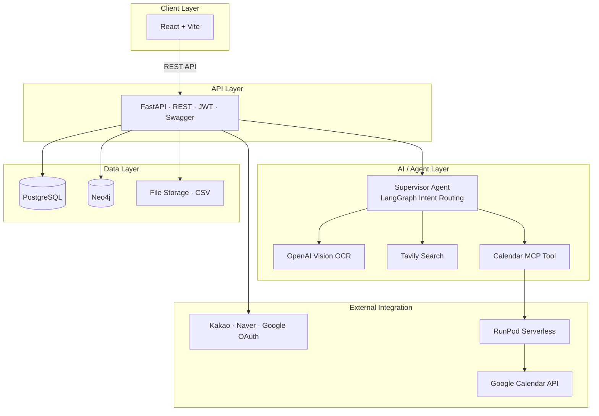
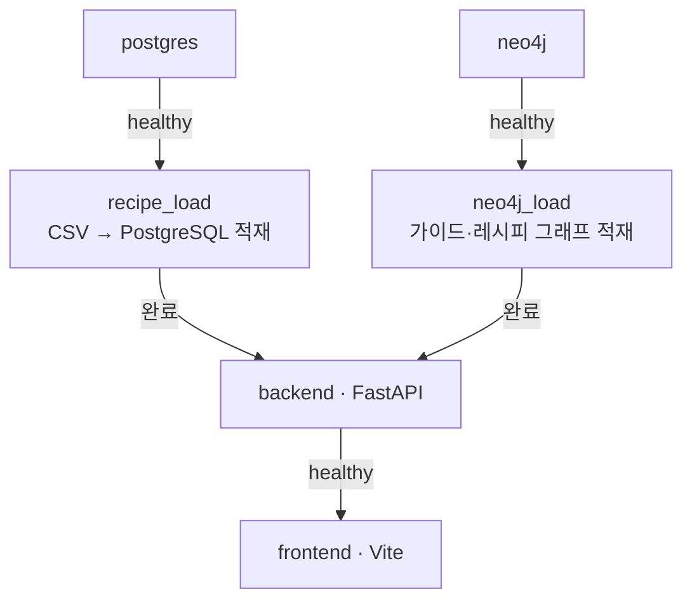
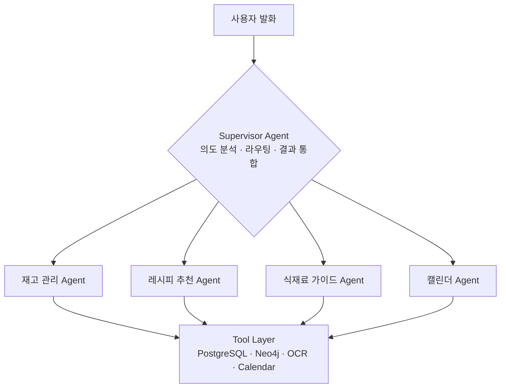
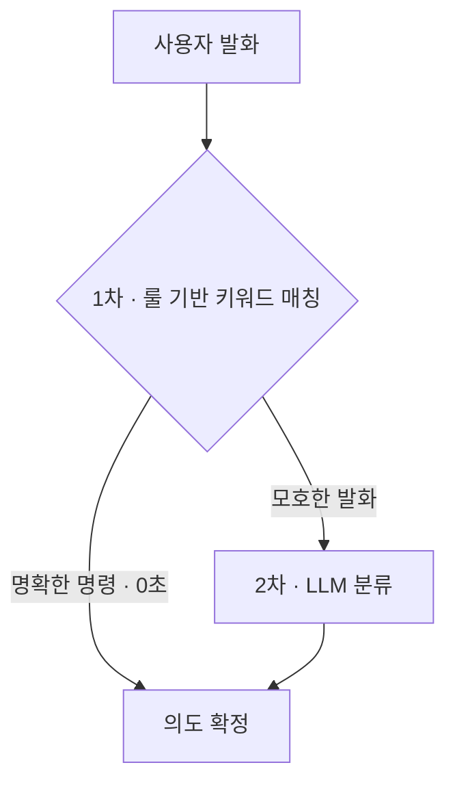

<!-- 상단 로고/배너 이미지 삽입 위치 (예: app/frontend/assets/extracted/images/image_hero_large.png) -->
<div align="center">

# 🍳 밥벌이 (bobbeori)

### 버려지는 식재료부터 장보기까지, 한 번에 관리하는 AI 냉장고 관리 서비스

**영수증만 찍으면 냉장고가 자동으로 채워지고, 있는 재료로 만들 수 있는 레시피를 추천받고, AI가 재고를 관리·알림해주는 AI 식자재 관리 서비스**

<br/>


</div>

<!-- 상단 요약 GIF 삽입 위치 : "영수증 촬영 → 재고 자동 등록 → 레시피 추천 → 챗봇 대화" 3~4장면 -->
<div align="center">

> 📽️ **핵심 흐름 시연 GIF 삽입 예정**
> `영수증 촬영 → 냉장고 자동 등록 → 냉장고 파먹기 추천 → AI 챗봇 · 캘린더 알림`

</div>

---

## 📑 목차

1. [팀 소개](#-팀-소개)
2. [프로젝트 개요](#-프로젝트-개요)
3. [개발 배경 & 시장 분석](#-개발-배경--시장-분석)
4. [핵심 기능](#-핵심-기능)
5. [기술 스택](#-기술-스택)
6. [시스템 아키텍처](#-시스템-아키텍처)
7. [핵심 기술 상세](#-핵심-기술-상세)
8. [데이터 설계](#-데이터-설계)
9. [성과 및 검증](#-성과-및-검증)
10. [화면 구성](#-화면-구성)
11. [프로젝트 구조](#-프로젝트-구조)
12. [실행 방법](#-실행-방법)
13. [향후 계획 & 회고](#-향후-계획--회고)

---

## 👥 팀 소개

**SKN27기 Final Project 1팀**

| 프로필 | 이름 | 역할 | 담당 | GitHub |
|:---:|:---:|:---:|:---|:---:|
| <!-- 사진 --> | **이재희** | PM · MCP · Calendar | 프로젝트 총괄, Google Calendar 연동·알림, MCP 구조 설계 & RunPod Serverless 연동, 캘린더/알림 Agent | [](https://github.com/EJ-pro) |
| <!-- 사진 --> | **박준희** | OCR · Agent | 영수증 OCR 모델 벤치마크·연동, OCR 결과 저장·검증, 이미지 검증 파이프라인 보안, 장보기 Agent | [](https://github.com/enblav262) |
| <!-- 사진 --> | **김재묵** | Backend · Agent | FastAPI REST API, OAuth 2.0 + JWT 인증, 챗봇, 냉장고 재고 관리 Agent | [](https://github.com/jaemukkim) |
| <!-- 사진 --> | **김주영** | GraphDB · Agent | Neo4j 그래프 설계, 식재료 가이드 데이터 확보·정제, 가이드 Agent | [](https://github.com/enooola0204-spec) |
| <!-- 사진 --> | **김경수** | ML · Data Pipeline | 추천 데이터 확보·정제, ML 기반 추천 고도화(감성분석), 추천 API·추천 Agent | [](https://github.com/wynn3312) |

---

## 📌 프로젝트 개요

**밥벌이**는 냉장고 속 식재료를 방치해 버리는 문제를 해결하는 AI 식자재 관리 서비스입니다.
장을 본 영수증 한 장이면 재고가 자동으로 등록되고, 가지고 있는 재료를 중심으로 "지금 만들 수 있는 요리"를 추천하며, 자연어 챗봇과 캘린더 알림으로 재고 관리를 대화처럼 쉽게 만듭니다.

- **프로젝트명** : 밥벌이 (bobbeori)
- **개발 기간** : 2026.06.11 ~ 2026.08.04
- **한 줄 소개** : 버려지는 식재료부터 장보기까지, 한 번에 관리하는 AI 냉장고 관리 서비스

```
[영수증 촬영·업로드] → [냉장고 재고 자동 등록] → [냉장고 파먹기 레시피 추천] → [부족 재료 장보기]

  └ 위 전체 과정을 💬 AI 챗봇으로 조회·관리하고, 🔔 캘린더로 유통기한·추천을 알림
```

---

## 🧭 개발 배경 & 시장 분석

### 왜 밥벌이인가

- **방치되는 식재료** — 사서 넣어두고 잊어버린 재료가 유통기한을 넘겨 그대로 음식물 쓰레기가 됩니다.
- **"뭐 해먹지?"의 피로** — 냉장고에 뭐가 있는지 파악이 안 돼 매번 배달앱을 켜게 됩니다.
- **수기 관리의 한계** — 재고를 일일이 손으로 입력하는 앱은 번거로워서 며칠 만에 쓰지 않게 됩니다.

### 시장 규모

1인 가구의 지속 증가로 소량·단기 식재료 관리 수요가 커지고 있습니다.

- **1인 가구 비중** : 27.2%(2015) → 29.3%(2018) → 33.4%(2021) → **36.1%(2024)**
- **TAM** — 전체 가구 약 2,229만 (100%)
- **SAM** — 1인 가구 약 804.5만 (36.1%)
- **SOM** — 밀키트·간편식 이용 1인 가구 약 420만 (18.8%)

> _출처: 통계청·KOSIS 인구주택총조사 2024_

> 밥벌이는 **OCR로 식재료 입력 부담을 없애고**, **그래프 기반 추천으로 있는 재료를 소진하게 만들며**, **AI 챗봇·캘린더 알림으로 관리를 대화처럼 쉽게** 만들어 이 문제들을 해결합니다.

---

## 🎯 핵심 기능

| 기능 | 설명 | 핵심 기술 |
|:---|:---|:---|
| 🧾 **영수증 OCR 재고 등록** | 영수증을 촬영하면 품목을 인식·정규화해 냉장고 재고로 자동 등록 | OpenAI Vision OCR, 파일 검증 파이프라인 |
| 🧊 **냉장고 재고 관리** | 재료별 유통기한을 직접 입력하거나 미입력 시 AI가 자동 생성, 실온·냉장·냉동 보관방법으로 등록·관리 | PostgreSQL, AI 유통기한 추정, 재고 관리 Agent |
| 🥗 **냉장고 파먹기 추천** | 보유 재료로 만들 수 있는 레시피를 우선 추천, 부족·대체 재료 안내 | Neo4j 그래프, BERT 감성분석, 하이브리드 추천 |
| 📖 **식재료 가이드** | 재료별 보관법·손질법·궁합 정보 제공 | Neo4j 그래프 지식베이스 |
| 🛒 **장보기 · 가격 비교** | 레시피에 부족한 재료를 추려 구매 목록·가격 비교 | Tavily Search, 커머스 API |
| 💬 **AI 챗봇** | "계란 언제까지야?"처럼 대화로 재고 조회·추천·관리 | LangGraph Supervisor 멀티 에이전트 |
| 🔔 **캘린더 알림** | 유통기한 임박·저녁 추천 메뉴를 매일 정해진 시간에 Google Calendar로 알림 | MCP + RunPod Serverless |
| 🔐 **소셜 로그인** | 카카오·네이버·구글 OAuth 2.0 간편 로그인 | OAuth 2.0 + JWT |

<!-- 각 기능별 스크린샷/GIF 삽입 위치 -->

---

## 🛠 기술 스택

| 구분 | 기술 |
|:---|:---|
| **Frontend** |    |
| **Backend** |     |
| **Database** |   |
| **AI / ML** |       |
| **Infra / 연동** |       |

---

## 🏗 시스템 아키텍처

밥벌이는 **역할이 다른 두 개의 데이터베이스**를 함께 사용합니다.
정형적인 사용자·재고·거래 데이터는 **PostgreSQL**이, "재료 ↔ 레시피 ↔ 가이드"의 복잡한 관계 추천은 **Neo4j 그래프**가 담당합니다.



### 컨테이너 구성 (docker-compose)

6개 서비스가 의존 순서에 따라 자동 기동되며, 데이터 적재까지 한 번에 수행됩니다.



---

## 🧠 핵심 기술 상세

### 1. AI 챗봇 — LangGraph Supervisor 멀티 에이전트

사용자의 자연어 발화를 **슈퍼바이저 에이전트**가 해석해 알맞은 하위 에이전트로 라우팅하고, 각 에이전트가 Tool Layer(PostgreSQL·Neo4j·OCR·Calendar)를 호출해 작업을 처리합니다.



#### 하이브리드 인텐트 라우팅

의도 분류는 **1차 룰 기반 → 2차 LLM**의 하이브리드 방식을 채택했습니다.



**왜 순수 LLM이 아니라 하이브리드인가?**
LLM 단독은 정확도가 높지만, *"이 레시피 어려운데 그냥 다 버릴까봐"* 같은 발화에서 '버릴까'라는 단어에 꽂혀 **실제 냉장고 데이터를 삭제하는 의도로 오판(환각)** 하는 현상이 관찰됐습니다. DB에 직접 쓰기/삭제하는 작업은 통제된 룰 방어막 안에서만 동작하도록 제한해 **데이터 무결성을 지키면서 응답 속도까지 확보**했습니다. (👉 [성과 및 검증](#-성과-및-검증))

### 2. 영수증 OCR — OpenAI Vision + 파일 검증 파이프라인

영수증 이미지에서 **상품명·수량·금액**을 추출하고, 식재료명 정규화를 거쳐 냉장고 재고로 자동 등록합니다. OCR 엔진은 EasyOCR로 실험을 시작해, 정확도·비용·속도를 종합 비교한 끝에 **OpenAI Vision(GPT-5.4 mini) 기반**으로 확정했습니다. (👉 [OCR 모델 벤치마크](#ocr-모델-벤치마크))

```
파일 검증(확장자·MIME·크기·다중 이미지) → 안전 저장(UUID 파일명) → 이미지 전처리 → OCR 파싱 → 재료명 정규화 → 재고 등록
```

- **보안** : 확장자·MIME 타입·용량을 1차 검증하고 UUID 파일명으로 안전 저장해 악성 파일 업로드를 차단
- **정규화** : OCR로 읽은 원시 상품명을 대표 재료명으로 매핑해 재고·추천과 연결

### 3. 그래프 기반 레시피 추천 — Neo4j + BERT 감성분석

"재료 → 레시피" 관계를 Neo4j 그래프로 모델링해 **보유 재료로 만들 수 있는 요리**를 우선 추천하고, 부족한 재료와 대체 재료를 함께 제시합니다.

- **하이브리드 추천 (Cold Start 대응)** : 서비스 초기에는 콘텐츠 기반 **기본 추천**, 사용자 데이터가 쌓이면 **개인화 추천**으로 전환
- **감성분석 가중치** : 한국어 BERT(`WhitePeak/bert-base-cased-Korean-sentiment`)로 레시피 리뷰의 긍·부정(-1~+1)을 분석해 "만들 수 있으면서 평이 좋은" 레시피를 상위로

### 4. 캘린더 알림 — MCP + RunPod Serverless

매일 정해진 시간(KST)에 Daily Loop가 돌며 사용자별 알림을 Google Calendar에 등록합니다. Backend의 **MCP Client**가 **RunPod Serverless Endpoint**의 MCP Tool을 `X-Internal-Token`으로 안전하게 호출해 Calendar API를 실행하는 구조입니다.

| 시간 | 알림 내용 |
|:---|:---|
| 오전 8:30 | 유통기한 임박 재료 |
| 오후 5:30 | 저녁 추천 메뉴 |
| 오전 9:00 | 주간 추천 |

> 중복 등록 방지를 위해 이벤트 키(`bobbeoriKey`) 기반으로 존재 여부를 확인 후 생성/갱신합니다.

---

## 🗄 데이터 설계

### 이중 데이터베이스 (RDB + Graph)

| 데이터베이스 | 역할 |
|:---|:---|
| **PostgreSQL (RDB)** | 구조화 데이터(사용자·재고·거래)의 안전한 저장과 조회 |
| **Neo4j (Graph)** | 식재료 – 레시피 – 가이드 간 관계 기반 추천 |

**Neo4j 그래프 스키마 (주요 노드·관계)**

```
(사용자)-[:USES]->(식재료)-[:CONTAINS]->(레시피)
(식재료)-[:HAS]->(가이드)      // 보관·손질·궁합
(레시피)-[:REFERENCES]->(가이드)
(사용자)-[:HAS]->(캘린더)
```

### 식재료 정규화 — 추천을 위한 데이터 엔지니어링

원재료명은 별칭으로 보존하고, 정규화 결과는 별도 정제 테이블로 관리합니다.

- **유사 재료명 병합** : 흰대파, 파 한 단 → `대파`
- **동의어 통합** : 달걀 / 계란 → `계란`
- **조미료/양념류 분리** : 간장, 고추장, 소금
- **도구/용기성 데이터 제거** : 냄비, 팬, 종이컵
- **브랜드명/상품명 정리** : 리챔, 스팸 → `햄`
- **문장형 이상치는 검토 대상으로 분리**


---

## 📊 성과 및 검증

### Intent Router 아키텍처 벤치마크

챗봇 의도 분류 방식을 결정하기 위해 동일한 **44개 발화 데이터셋**으로 3가지 방식을 정량 비교했습니다.

| 라우팅 기법 | 정확도 | 평균 처리 속도 | 비고 |
|:---|:---:|:---:|:---|
| Rule-based Only | 65.6% | **0.000s** | 빠르지만 일상어 처리 불가 |
| LLM-only | **86.4%** | 0.749s | 정확하지만 느리고 환각 위험 |
| **Hybrid (채택)** | 80.5% | 0.263s | **속도·안정성의 최적 타협점** |

- **데이터 무결성 방어** : DB 쓰기/삭제는 룰 방어막 안에서만 동작 → LLM 환각으로 인한 데이터 오염 예방
- **응답 속도 3배 향상** : 명확한 명령은 0초 처리로, LLM 단독 대비 평균 속도 약 3배 개선(0.75s → 0.26s)

> 📄 상세 보고서: [`docs/intent_router_benchmark.md`](docs/intent_router_benchmark.md)

### OCR 모델 벤치마크

영수증 인식 모델을 정확도·비용·속도 기준으로 비교해 **GPT-5.4 mini**를 최종 채택했습니다.

| 모델 | 처리 속도 | 비용/건 | 정확도 | 비고 |
|:---|:---:|:---:|:---:|:---|
| GPT-5.5 | 15.53s | $0.0549 | 100% | 최고 정확도, 과도한 비용·지연 |
| **GPT-5.4 mini** | **3.17s** | **$0.0033** | **88.9%** | **최종 선정 (균형 최적)** |
| GPT-5.4 nano | 4.03s | $0.0010 | 71.2% | 최저 비용, 정확도 부족 |

> 로컬 모델(Gemma 4 E4B, Qwen 3.5 2B / Ollama)도 함께 검토했으나 정확도 미달로 제외했습니다.

### 테스트 & CI/CD

- **총 388건**의 테스트 (기능 209 · unit/fixture 97 · API 55 · A/B 27 · 경계 15)
- **GitHub Actions** 기반 통합 CI/CD, **Pull Request 통과율 100%**

---

## 🖥 화면 구성

| 화면 | 설명 |
|:---|:---|
| 홈 대시보드 | 냉장고 요약, 임박 재고, 추천 진입점 |
| 냉장고 관리 | 재고 목록·수정·유통기한 관리 |
| 영수증 등록 | 영수증 업로드 → OCR 결과 확인·등록 |
| 냉장고 파먹기 / 레시피 추천 / 메뉴 추천 | 보유 재료 기반 레시피 추천·상세 |
| 식재료 가이드 | 보관·손질·세척·신선도 정보 |
| 장보기 | 부족 재료 목록·구매 링크 |
| AI 챗봇 | 자연어로 재고 조회·추천·관리 |
| 마이페이지 · 로그인 | 소셜 로그인, 사용자 설정 |

<!-- 시연 영상 링크 또는 화면 GIF 삽입 위치 -->

---

## 🗂 프로젝트 구조

### 폴더별 담당 및 내용

```
ai       : AI/OCR/추천 실험 공간
app      : 실제 서비스 프론트·백엔드 코드 공간
docs     : 기획서, WBS, API, ERD, 그래프 설계 문서 공간
etl      : 데이터 수집, 전처리, Neo4j 적재 스크립트 공간
storage  : 원본/가공 데이터, mock 데이터, Neo4j import 파일 보관 공간
test     : 단위/통합/E2E 테스트와 테스트 샘플 데이터 공간
```

### 폴더 구조

```
root/
├─ ai/                              (AI, OCR, 추천 모델/Agent 실험 코드 공간)
│  ├─ agents/                       (서비스 내부 Agent 로직을 분리해 관리)
│  │  ├─ normalize_agent/           (식재료명 정규화 Agent 작업 공간)
│  │  ├─ inventory_agent/           (냉장고 재고 분석 Agent 작업 공간)
│  │  └─ recipe_agent/              (레시피 추천 Agent 작업 공간)
│  ├─ tools/                        (Tool Calling용 도구 정의)
│  ├─ ocr/                          (박준희 담당 / 영수증 OCR 모델·파싱 실험 공간)
│  ├─ recommendation/               (김경수 담당 / 레시피 추천 로직·ML 실험 공간)
│  ├─ experiments/                  (공용 / 임시 실험, PoC 코드 보관 공간)
│  └─ requirements.txt              (AI/OCR용 의존성)
│
├─ app/                             (실제 서비스 애플리케이션 코드 공간)
│  ├─ backend/                      (백엔드 API, DB, 서비스 로직 작업 공간)
│  │  ├─ api/                       (기능별 API 라우터 관리)
│  │  │  ├─ auth/                   (김재묵 담당 / 로그인·인증 API)
│  │  │  ├─ inventory/              (김재묵 담당 / 냉장고 재고 관리 API)
│  │  │  ├─ receipts/               (박준희 담당 / 영수증 OCR 업로드·결과 API)
│  │  │  ├─ guide/                  (김주영 담당 / 보관·손질·신선도 API)
│  │  │  └─ recipes/                (김경수 담당 / 레시피 조회·추천 API)
│  │  ├─ core/                      (공용 / 환경설정, 보안, 공통 설정)
│  │  ├─ db/                        (공용 / RDB 연결, 세션, 마이그레이션)
│  │  ├─ schemas/                   (공용 / 요청·응답 DTO, 데이터 스키마)
│  │  ├─ services/                  (기능별 비즈니스 로직)
│  │  │  ├─ auth_service/           (김재묵 담당 / 인증 처리 로직)
│  │  │  ├─ inventory_service/      (김재묵 담당 / 냉장고 재고 처리 로직)
│  │  │  ├─ receipt_ocr_service/    (박준희 담당 / OCR 결과 처리 로직)
│  │  │  ├─ guide_service/          (김주영 담당 / 가이드 조회 로직)
│  │  │  ├─ recommendation_service/ (김경수 담당 / 추천 계산 로직)
│  │  │  └─ shopping_service/       (박준희 담당 / 부족 재료 가격 비교·구매 처리 로직)
│  │  ├─ requirements.txt           (백엔드 Web용 의존성)
│  │  └─ Dockerfile                 (백엔드 전용 빌드 명세서)
│  │
│  └─ frontend/                     (프론트엔드 화면과 UI 작업 공간)
│     ├─ pages/                     (페이지 단위 화면 관리)
│     │  ├─ home/                   (이재희 담당 / 홈 대시보드 화면)
│     │  ├─ fridge/                 (김재묵 담당 / 냉장고 관리 화면)
│     │  ├─ fridge_recipe/          (김재묵 담당 / 냉장고파먹기 추천 화면)
│     │  ├─ receipt_ocr/            (박준희 담당 / 영수증 업로드·결과 확인 화면)
│     │  ├─ guide/                  (김주영 담당 / 식재료 가이드 화면)
│     │  ├─ info/                   (공용 / 서비스 안내 화면)
│     │  ├─ login/                  (공용 / 로그인 화면)
│     │  ├─ menu_recommend/         (김경수 담당 / 메뉴 추천 화면)
│     │  ├─ mypage/                 (공용 / 마이페이지 화면)
│     │  ├─ recipe_recommend/       (김경수 담당 / 레시피 추천 화면)
│     │  ├─ recipe_list/            (김경수 담당 / 레시피 목록 조회 화면)
│     │  ├─ recipe_detail/          (김경수 담당 / 레시피 상세 화면)
│     │  └─ shopping_list/          (공용 / 장보기 목록 화면)
│     ├─ components/                (공용 / Header, Breadcrumbs, Dialog 등 재사용 UI 컴포넌트)
│     │  └─ modals/                 (공용 / 확인, 재료 수정, 통계 모달)
│     ├─ mock/                      (공용 / 프론트 화면용 mock 데이터)
│     ├─ data/                      (공용 / 화면에서 사용하는 정적 데이터)
│     ├─ services/                  (공용 / 프론트 API 호출 함수)
│     ├─ stores/                    (공용 / 상태관리)
│     ├─ assets/                    (공용 / 로고, 마스코트, 추출 이미지 등 정적 리소스)
│     │  ├─ extracted/              (공용 / 추출 이미지 리소스)
│     │  └─ fonts/                  (공용 / 웹폰트)
│     ├─ public/                    (공용 / 빌드 시 그대로 제공되는 정적 파일)
│     └─ .env.sample                (공용 / 환경 변수 파일)
│
├─ docs/                            (기획, 설계, 회의 문서 관리 공간)
│  ├─ planning/                     (공용 / 프로젝트 주제, 기능 정의, 기획서)
│  ├─ wbs/                          (공용 / WBS, 일정표, 역할 분담표)
│  ├─ api/                          (공용 / API 명세서)
│  ├─ erd/                          (공용 / RDB 테이블 설계)
│  ├─ graph_schema/                 (김경수·김주영 담당 / Neo4j 그래프 구조 설계)
│  ├─ data_dictionary/              (공용 / 컬럼 정의, 데이터 사전)
│  └─ meeting_notes/                (공용 / 회의록, 피드백 기록)
│
├─ etl/                             (데이터 수집·전처리·적재 스크립트 공간)
│  ├─ recipe/                       (김경수 담당 / 레시피 데이터 처리)
│  │  ├─ profiling/                 (김경수 담당 / 원본 컬럼 분석)
│  │  ├─ preprocessing/             (김경수 담당 / 레시피 데이터 전처리)
│  │  └─ load_to_neo4j/             (김경수 담당 / 레시피 데이터 Neo4j 적재)
│  │  └─ load_to_postgres/          (김경수 담당 / 레시피 데이터 postgres 적재)
│  ├─ food_guide/                   (김주영 담당 / 가이드 데이터 수집·검수)
│  │  ├─ collection/                (김주영 담당 / 보관·손질·세척 정보 수집)
│  │  ├─ validation/                (김주영 담당 / 수집 데이터 검수)
│  │  └─ load_to_neo4j/             (김주영 담당 / 가이드 데이터 Neo4j 적재)
│  ├─ receipt_samples/              (박준희 담당 / OCR 테스트용 영수증 샘플 관리)
│  └─ requirements.txt              (데이터 수집/적재용 의존성)
│
├─ storage/                         (원본·가공 데이터와 Neo4j 파일 보관 공간)
│  ├─ raw/                          (원본 데이터 보관)
│  │  ├─ recipe/                    (김경수 담당 / 원본 레시피 데이터)
│  │  ├─ food_guide/                (김주영 담당 / 원본 가이드 수집 데이터)
│  │  └─ receipts/                  (박준희 담당 / 원본 영수증 이미지·텍스트)
│  ├─ processed/                    (전처리 완료 데이터 보관)
│  │  ├─ recipe/                    (김경수 담당 / 전처리된 레시피 데이터)
│  │  ├─ food_guide/                (김주영 담당 / 검수된 가이드 데이터)
│  │  └─ receipts/                  (박준희 담당 / 구조화된 OCR 결과)
│  ├─ neo4j/                        (Neo4j 적재/백업 관련 파일)
│  │  ├─ import/                    (김경수·김주영 담당 / Neo4j import CSV)
│  │  ├─ cypher/                    (김경수·김주영 담당 / Cypher 쿼리)
│  │  └─ backups/                   (공용 / Neo4j 백업 파일)
│  └─ mock/                         (공용 / API 개발용 mock 데이터)
│
├─ test/                            (테스트 코드와 테스트 데이터 공간)
│  ├─ unit/                         (각 담당자 / 함수 단위 테스트)
│  ├─ integration/                  (공용 / API·DB 연동 테스트)
│  ├─ e2e/                          (공용 / 사용자 흐름 기반 통합 테스트)
│  ├─ fixtures/                     (테스트용 샘플 데이터)
│  │  ├─ receipts/                  (박준희 담당 / OCR 테스트 샘플)
│  │  ├─ recipe/                    (김경수 담당 / 추천 테스트 샘플)
│  │  └─ food_guide/                (김주영 담당 / 가이드 테스트 샘플)
│  └─ api/                          (공용 / API 요청·응답 테스트)
│
├─ .env.sample
├─ .gitignore
├─ docker-compose.yml
└─ README.md                        (공용 / 프로젝트 소개, 실행 방법, 폴더 설명)
```

---

## 🚀 실행 방법

### Docker로 한 번에 기동 (권장)

```bash
# 1. 환경 변수 준비 (.env.sample 복사 후 DB_PASSWORD, NEO4J_PASSWORD 등 설정)
cp .env.sample .env

# 2. 전체 서비스 기동 (backend · frontend · postgres · neo4j · 데이터 적재)
docker compose up -d --build
```

| 서비스 | URL |
|:---|:---|
| 프론트 (Vite) | http://localhost:5173 |
| 백엔드 API | http://localhost:8000 |
| API 문서 (Swagger) | http://localhost:8000/docs |
| Neo4j Browser | http://localhost:7474 |

> 기동 시 `postgres → recipe_load → neo4j → neo4j_load → backend → frontend` 순서로 데이터 적재까지 자동 수행됩니다.
> 상세 가이드 및 트러블슈팅: [`docs/kickstarter.md`](docs/kickstarter.md)

### Docker 없이 실행

```bash
# 백엔드 (프로젝트 루트)
uvicorn app.backend.main:app --reload --host 0.0.0.0 --port 8000

# 프론트 (app/frontend)
npm install && npm run dev
```

---

## 🌱 향후 계획 & 회고

### 로드맵

| 기간 | 주요 작업 |
|:---|:---|
| **1주차** (7.13~7.19) | 슈퍼바이저 의도분석 라우팅 안정화, 에이전트별 보강, 네이버 API → 쿠팡 파트너스 API 신청, 자동 테스트 코드 추가, Google OAuth·RunPod endpoint 설정 |
| **2주차** (7.20~7.26) | AWS 배포, `.env` 운영/개발 분리, Docker compose 정리, RunPod MCP endpoint 연결 체크, 핵심 API 통합 테스트 |
| **3주차** (7.27~8.2) | 팀 외부 사용자 시범 사용, 재료 등록 편의성·추천 만족도·챗봇 정확도 피드백 수집, 오류/UX 개선 |
| **4주차** (8.3~8.4) | 최종 시연 시나리오 확정, 배포 환경 리허설, 데모 백업(영상/스크린샷), 발표자료 최종 검수 |

### 향후 고도화 계획

- **인텐트 라우터 고도화** : 1차 방어막을 단순 키워드에서 정규표현식·형태소 분석 기반으로 개선해, LLM 단독 수준 정확도(90%+)와 하이브리드의 속도(0.2s)를 동시에 달성
- OCR 실패 케이스 보완 및 재료명 정규화 사전 확장
- ML 기반 개인화 추천 고도화(선호·알레르기 반영)

### 팀 회고

<!-- 팀원별 개인 회고 작성 위치 -->
> _이재희_ :
> _박준희_ :
> _김재묵_ :
> _김주영_ :
> _김경수_ :

---

<div align="center">

**밥벌이** — SKN27기 Final Project 1팀
_"식재료 관리의 복잡함을 AI 챗봇 하나로 줄인 프로젝트"_

</div>
