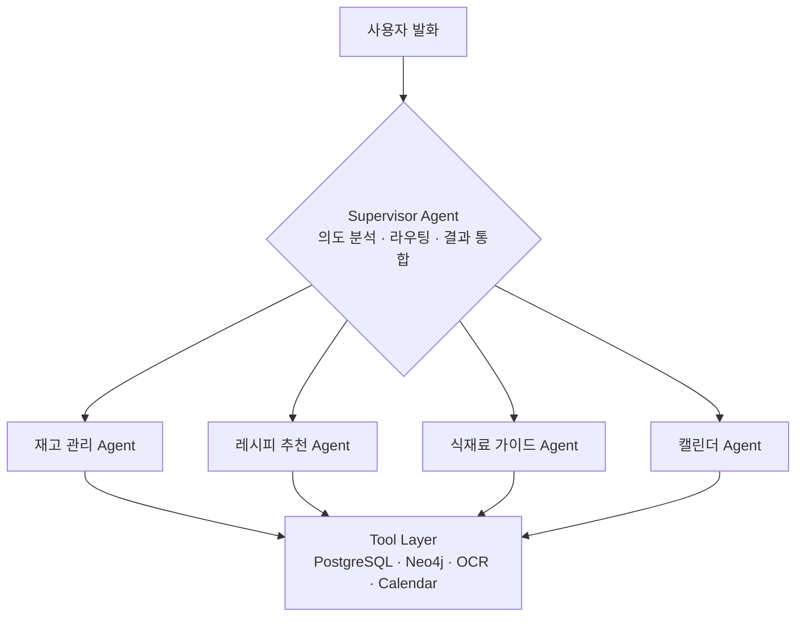
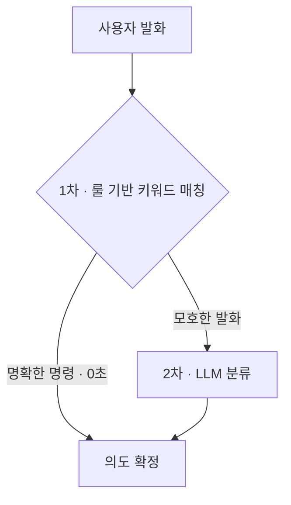

<div align="center">


# 밥벌이 (bobbeori)
# www.bobbeori.com
### 버려지는 식재료부터 장보기까지, 한 번에 관리하는 AI 기반 식재료 관리 서비스

**영수증만 찍으면 냉장고가 자동으로 채워지고, 있는 재료로 만들 수 있는 레시피를 추천받고, AI가 재고를 관리·알림해주는 AI 식자재 관리 서비스**

<br/>


</div>

<!-- 상단 요약 GIF 삽입 위치 : "영수증 촬영 → 재고 자동 등록 → 레시피 추천 → 챗봇 대화" 3~4장면 -->
<div align="center">

> **핵심 흐름 시연 GIF 삽입 예정**
> `영수증 촬영 → 냉장고 자동 등록 → 냉장고 파먹기 추천 → AI 챗봇 · 캘린더 알림`

</div>

---

## 목차

1. [팀 소개](#팀-소개)
2. [프로젝트 개요](#프로젝트-개요)
3. [개발 배경](#개발-배경)
4. [핵심 기능](#핵심-기능)
5. [기술 스택](#기술-스택)
6. [시스템 아키텍처](#시스템-아키텍처)
7. [핵심 기술 상세](#핵심-기술-상세)
8. [데이터 설계](#데이터-설계)
9. [성과 및 검증](#성과-및-검증)
10. [화면 구성](#화면-구성)
11. [프로젝트 구조](#프로젝트-구조)
12. [실행 방법](#실행-방법)
13. [회고](#팀-회고)

---

## 팀 소개

**SKN27기 Final Project 1팀**

| 이름 | 역할 | 담당 | GitHub |
|:---:|:---:|:---|:---:|
| **이재희** | PM · MCP · Calendar | 프로젝트 총괄, Google Calendar 연동·알림, MCP 구조 설계 & RunPod Serverless 연동, 캘린더/알림 Agent | [](https://github.com/EJ-pro) |
| **박준희** | APM · OCR · Agent | 영수증 OCR 모델 벤치마크·연동, OCR 결과 저장·검증, 이미지 검증 파이프라인 보안, 장보기 Agent | [](https://github.com/enblav262) |
| **김재묵** | Backend · Agent | FastAPI REST API, OAuth 2.0 + JWT 인증, 챗봇, 냉장고 재고 관리 Agent | [](https://github.com/jaemukkim) |
| **김주영** | GraphDB · Agent | Neo4j 그래프 설계, 식재료 가이드 데이터 확보·정제, 가이드 Agent | [](https://github.com/enooola0204-spec) |
| **김경수** | Data Pipeline · Recommendation | 레시피 데이터 확보·정제, 식재료 매칭 및 추천 로직, 추천 API·추천 Agent | [](https://github.com/wynn3312) |

---

## 프로젝트 개요

**밥벌이**는 냉장고 속 식재료를 방치해 버리는 문제를 해결하는 AI 식자재 관리 서비스입니다.
영수증 한 장이면 재고가 자동으로 등록되고, 가지고 있는 재료를 중심으로 "지금 만들 수 있는 요리"를 추천하며, 자연어 챗봇과 캘린더 알림으로 재고 관리를 대화처럼 쉽게 만듭니다.

- **프로젝트명** : 밥벌이 (bobbeori)
- **개발 기간** : 2026.06.11 ~ 2026.08.04
- **한 줄 소개** : 냉장고 재료 관리, 영수증 OCR, 레시피 추천, 장보기 목록, Google Calendar 알림 연동을 제공하는 AI 기반 식재료 관리 서비스

```
[영수증 촬영·업로드] → [냉장고 재고 자동 등록] → [냉장고 파먹기 레시피 추천] → [부족 재료 장보기]
                                  └→ [식재료 가이드 조회]

  └ 위 전체 과정을 AI 챗봇으로 조회·관리하고, 캘린더로 유통기한·추천을 알림
```

---

## 개발 배경

- 냉장고 속 식재료를 잊어 유통기한이 지나 폐기되는 문제
- 보유 식재료를 파악하기 어려워 반복되는 불필요한 구매
- 수기 재고 관리 방식의 번거로움과 낮은 지속성

밥벌이는 영수증 OCR, 식재료 기반 레시피 추천, AI 챗봇과 캘린더 알림을 통해 식재료 등록부터 소비까지의 과정을 자동화합니다.

---

## 핵심 기능

| 기능 | 설명 | 핵심 기술 |
|:---|:---|:---|
| **영수증 OCR 재고 등록** | 영수증을 촬영하면 품목을 인식·정규화해 냉장고 재고로 자동 등록 | OpenAI Vision OCR, 파일 검증 파이프라인 |
| **냉장고 재고 관리** | 재료별 유통기한을 직접 입력하거나 미입력 시 AI가 자동 생성, 실온·냉장·냉동 보관방법으로 등록·관리 | PostgreSQL, AI 유통기한 추정, 재고 관리 Agent |
| **냉장고 파먹기 추천** | 보유 식재료와 레시피의 재료 구성을 비교해 만들기 좋은 레시피를 우선 추천하고 부족 재료 안내 | Neo4j 그래프, 식재료 매칭, 보유 재료 비율 기반 추천 |
| **식재료 가이드** | 재료별 보관법·손질법·궁합 정보 제공 | Neo4j 그래프 지식베이스 |
| **장보기 · 가격 비교** | 레시피에 부족한 재료를 추려 구매 목록·가격 비교 | Tavily Search, 커머스 API |
| **AI 챗봇** | "계란 언제까지야?"처럼 대화로 재고 조회·추천·관리 | LangGraph Supervisor 멀티 에이전트 |
| **캘린더 알림** | 유통기한 임박·저녁 추천 메뉴를 매일 정해진 시간에 Google Calendar로 알림 | MCP + RunPod Serverless |
| **MCP 공개 연동** | ChatGPT·Codex 등 MCP 클라이언트에서 냉장고, 레시피, 가이드, 영수증, 장보기, 캘린더 기능 사용 | FastMCP, Streamable HTTP, OAuth 2.1 + PKCE |
| **소셜 로그인** | 카카오·네이버·구글 OAuth 2.0 간편 로그인 | OAuth 2.0 + JWT |

<!-- 각 기능별 스크린샷/GIF 삽입 위치 -->

---

## 기술 스택

| 구분 | 기술 |
|:---|:---|
| **Frontend** |    |
| **Backend** |     |
| **Database** |   |
| **AI / Agent** |     |
| **Infra / 연동** |       |

---

## 시스템 아키텍처

밥벌이는 웹·모바일 사용자와 AI 클라이언트 요청을 분리해 전달하고, 애플리케이션·에이전트·데이터 계층을 독립적으로 운영합니다.
정형적인 사용자·재고·거래 데이터는 **PostgreSQL**이, "재료 ↔ 레시피 ↔ 가이드"의 복잡한 관계 추천은 **Neo4j 그래프**가 담당합니다.

### 인프라 및 배포 아키텍처


### 서비스 및 에이전트 아키텍처


---

## 핵심 기술 상세

### 1. AI 챗봇 — LangGraph Supervisor 멀티 에이전트

사용자의 자연어 발화를 **슈퍼바이저 에이전트**가 해석해 알맞은 하위 에이전트로 라우팅하고, 각 에이전트가 Tool Layer(PostgreSQL·Neo4j·OCR·Calendar)를 호출해 작업을 처리합니다.


```mermaid
flowchart TD
    U[사용자 발화] --> SUP{Supervisor Agent<br/>의도 분석 · 라우팅 · 결과 통합}
    SUP --> A1[재고 관리 Agent]
    SUP --> A2[레시피 추천 Agent]
    SUP --> A3[식재료 가이드 Agent]
    SUP --> A4[캘린더 Agent]
    A1 --> TOOL[Tool Layer<br/>PostgreSQL · Neo4j · OCR · Calendar]
    A2 --> TOOL
    A3 --> TOOL
    A4 --> TOOL
```

#### 하이브리드 인텐트 라우팅

의도 분류는 **1차 룰 기반 → 2차 LLM**의 하이브리드 방식을 채택했습니다.


```mermaid
flowchart TD
    Q[사용자 발화] --> RULE{1차 · 룰 기반 키워드 매칭}
    RULE -->|명확한 명령 · 0초| INTENT[의도 확정]
    RULE -->|모호한 발화| LLM[2차 · LLM 분류]
    LLM --> INTENT
```

**왜 순수 LLM이 아니라 하이브리드인가?**
LLM 단독은 정확도가 높지만, *"이 레시피 어려운데 그냥 다 버릴까봐"* 같은 발화에서 '버릴까'라는 단어에 꽂혀 **실제 냉장고 데이터를 삭제하는 의도로 오판(환각)** 하는 현상이 관찰됐습니다. DB에 직접 쓰기/삭제하는 작업은 통제된 룰 방어막 안에서만 동작하도록 제한해 **데이터 무결성을 지키면서 응답 속도까지 확보**했습니다. ([성과 및 검증](#성과-및-검증))

### 2. 영수증 OCR — OpenAI Vision + 파일 검증 파이프라인

영수증 이미지에서 **상품명·수량·금액**을 추출하고, 식재료명 정규화를 거쳐 냉장고 재고로 자동 등록합니다. OCR 엔진은 EasyOCR로 실험을 시작해, 정확도·비용·속도를 종합 비교한 끝에 **OpenAI Vision(GPT-5.4 mini) 기반**으로 확정했습니다. ([OCR 모델 벤치마크](#ocr-모델-벤치마크))

```
파일 검증(확장자·MIME·크기·다중 이미지) → 안전 저장(UUID 파일명) → 이미지 전처리 → OCR 파싱 → 재료명 정규화 → 재고 등록
```

- **보안** : 확장자·MIME 타입·용량을 1차 검증하고 UUID 파일명으로 안전 저장해 악성 파일 업로드를 차단
- **정규화** : OCR로 읽은 원시 상품명을 대표 재료명으로 매핑해 재고·추천과 연결

### 3. 그래프 기반 레시피 추천 — Neo4j

"재료 → 레시피" 관계를 Neo4j 그래프로 모델링하고, 사용자의 보유 식재료와 각 레시피의 재료 구성을 비교해 **현재 만들기 좋은 요리**를 우선 추천합니다.

- **식재료 매칭** : 냉장고의 보유 식재료와 레시피별 필요 재료를 연결해 보유·부족 재료를 구분
- **보유 재료 비율 기반 추천** : 필요한 재료 중 보유한 재료의 비율이 높은 레시피를 우선 정렬
- **부족 재료 안내** : 추천 결과와 레시피 상세 화면에서 추가로 필요한 재료를 제공해 장보기 기능과 연결

### 4. 캘린더 알림 — MCP + RunPod Serverless

매일 정해진 시간(KST)에 Daily Loop가 돌며 사용자별 알림을 Google Calendar에 등록합니다. Backend의 **MCP Client**가 **RunPod Serverless Endpoint**의 MCP Tool을 `X-Internal-Token`으로 안전하게 호출해 Calendar API를 실행하는 구조입니다.

| 시간 | 알림 내용 |
|:---|:---|
| 오전 8:30 | 유통기한 임박 재료 |
| 오후 5:30 | 저녁 추천 메뉴 |
| 오전 9:00 | 주간 추천 |

> 중복 등록 방지를 위해 이벤트 키(`bobbeoriKey`) 기반으로 존재 여부를 확인 후 생성/갱신합니다.

### 5. 공개 MCP 연동 — FastMCP + OAuth 2.1

기존 FastAPI 도메인 서비스를 **FastMCP 어댑터**로 연결해 ChatGPT·Codex 등 외부 MCP 클라이언트에서도 밥벌이 기능을 사용할 수 있습니다. 클라이언트는 Streamable HTTP 방식의 `/mcp` 엔드포인트에 연결하며, OAuth 2.1 Authorization Code + PKCE와 기능별 Scope로 접근 권한을 제어합니다.

| 구분 | 제공 도구 |
|:---|:---|
| **재고 조회** | `inventory.list`, `inventory.expiring` |
| **레시피·가이드 조회** | `recipe.recommend`, `recipe.get`, `ingredient.guide` |
| **영수증·장보기** | `receipt.preview`, `receipt.commit`, `shopping.preview`, `shopping.save` |
| **캘린더·리마인더** | `calendar.preview`, `calendar.create`, `reminder.preview`, `reminder.create` |

- **13개 MCP Tool** : 재고, 레시피, 식재료 가이드, 영수증, 장보기, 캘린더 기능을 공통 인터페이스로 제공
- **사용자·권한 분리** : 입력값으로 `user_id`를 받지 않고 검증된 액세스 토큰의 사용자와 Scope를 기준으로 접근 제어
- **안전한 변경 작업** : 쓰기 작업은 `preview → 사용자 확인 → commit` 순서로 실행하며, 단기 서명 토큰과 멱등성 기록으로 중복 실행 방지
- **일관된 응답 규격** : 모든 Tool이 성공 여부, 데이터, 경고, 확인 필요 여부, 다음 작업, 추적 ID를 동일한 구조로 반환

상세 연결 및 운영 설정은 [`docs/public-mcp.md`](docs/public-mcp.md)에서 확인할 수 있습니다.

---

## 데이터 설계

### 이중 데이터베이스 (RDB + Graph)

| 데이터베이스 | 역할 |
|:---|:---|
| **PostgreSQL (RDB)** | 구조화 데이터(사용자·재고·거래)의 안전한 저장과 조회 |
| **Neo4j (Graph)** | 식재료 – 레시피 – 가이드 간 관계 기반 추천 |

**Neo4j 그래프 스키마 (주요 노드·관계)**

```
(사용자)-[:USES]->(식재료)-[:CONTAINS]->(레시피)
(식재료)-[:HAS]->(가이드)      // 보관·손질·궁합
(레시피)-[:REFERENCES]->(가이드)
(사용자)-[:HAS]->(캘린더)
```

### 식재료 정규화 — 추천을 위한 데이터 엔지니어링

원재료명은 별칭으로 보존하고, 정규화 결과는 별도 정제 테이블로 관리합니다.

- **유사 재료명 병합** : 흰대파, 파 한 단 → `대파`
- **동의어 통합** : 달걀 / 계란 → `계란`
- **조미료/양념류 분리** : 간장, 고추장, 소금
- **도구/용기성 데이터 제거** : 냄비, 팬, 종이컵
- **브랜드명/상품명 정리** : 리챔, 스팸 → `햄`
- **문장형 이상치는 검토 대상으로 분리**


---

## 성과 및 검증

### Intent Router 아키텍처 벤치마크

챗봇 의도 분류 방식을 검증하기 위해 17개 intent를 포함한 동일한 **200개 발화 데이터셋**으로 3가지 방식을 정량 비교했습니다.

| 라우팅 기법 | 정확도 | 평균 처리 속도 | 비고 |
|:---|:---:|:---:|:---|
| Rule-based Only | 66.5% | **0.0001s** | 빠르지만 표현 변형과 문맥 처리에 한계 |
| LLM-only | 75.0% | 1.4833s | 자연어 이해에 강하지만 후검증 탈락 사례 존재 |
| **Hybrid (채택)** | **88.5%** | 1.5380s | **LLM 분류와 규칙 보정으로 최고 정확도** |

- **데이터 무결성 방어** : DB 쓰기/삭제는 규칙 기반 경로에서만 동작해 LLM 오분류가 데이터 변경으로 이어지는 것을 방지
- **정확도 향상** : Rule-based 대비 **+22.0%p**, LLM-only 대비 **+13.5%p** 향상

> 상세 보고서: [`docs/intent_router_benchmark.md`](docs/intent_router_benchmark.md)

### OCR 모델 벤치마크

영수증 인식 모델을 정확도·비용·속도 기준으로 비교해 **GPT-5.4 mini**를 최종 채택했습니다.

| 모델 | 처리 속도 | 비용/건 | 정확도 | 비고 |
|:---|:---:|:---:|:---:|:---|
| GPT-5.5 | 15.53s | $0.0549 | 100% | 최고 정확도, 과도한 비용·지연 |
| **GPT-5.4 mini** | **3.17s** | **$0.0033** | **88.9%** | **최종 선정** |
| GPT-5.4 nano | 4.03s | $0.0010 | 71.2% | 최저 비용, 정확도 부족 |

> 로컬 모델(Gemma 4 E4B, Qwen 3.5 2B / Ollama)도 함께 검토했으나 정확도 미달로 제외했습니다.

### 테스트 & CI/CD

- **총 388건**의 테스트 (기능 209 · unit/fixture 97 · API 55 · A/B 27 · 경계 15)
- **GitHub Actions** 기반 통합 CI/CD, **Pull Request 통과율 100%**

---

## 화면 구성

| 화면 | 설명 |
|:---|:---|
| 홈 대시보드 | 냉장고 요약, 임박 재고, 추천 진입점 |
| 냉장고 관리 | 재고 목록·수정·유통기한 관리 |
| 영수증 등록 | 영수증 업로드 → OCR 결과 확인·등록 |
| 냉장고 파먹기 / 레시피 추천 / 메뉴 추천 | 보유 재료 기반 레시피 추천·상세 |
| 식재료 가이드 | 보관·손질·세척·신선도 정보 |
| 장보기 | 부족 재료 목록·구매 링크 |
| AI 챗봇 | 자연어로 재고 조회·추천·관리 |
| 마이페이지 · 로그인 | 소셜 로그인, 사용자 설정 |

<!-- 시연 영상 링크 또는 화면 GIF 삽입 위치 -->

---

## 프로젝트 구조

### 주요 폴더 및 역할

```
ai         : 멀티 에이전트, Agent Tool, 캘린더 MCP 코드
app        : FastAPI 백엔드, 공개 MCP 서버, React 프론트엔드
docs       : MCP·CI/CD·평가 문서와 아키텍처 이미지
etl        : 식재료 가이드 전처리와 Neo4j 적재
infra      : AWS CDK 기반 배포 인프라
scripts    : 시드 생성, 에이전트 평가, MCP 인증 점검 스크립트
seed-prod  : 운영 환경 초기 적재 데이터
storage    : PostgreSQL·Neo4j·영수증 원본 데이터
test       : API·기능·단위 테스트와 테스트 fixture
```

### 폴더 구조

```
root/
├─ .agents/
│  └─ skills/bobbeori-workflows/    (ChatGPT·Codex용 MCP 워크플로 스킬)
├─ .github/
│  └─ workflows/                    (CI/CD 워크플로)
├─ ai/
│  ├─ agents/                       (Supervisor와 도메인 Agent)
│  ├─ calendar/                     (캘린더 MCP·RunPod 연동)
│  └─ tools/                        (Agent Tool 정의)
├─ app/
│  ├─ backend/
│  │  ├─ api/                       (기능별 REST API)
│  │  ├─ mcp/                       (FastMCP 공개 서버와 인증·Tool)
│  │  ├─ services/                  (도메인 비즈니스 로직)
│  │  ├─ db/                        (ORM 모델과 DB 연결)
│  │  ├─ core/                      (환경 설정과 공통 구성)
│  │  ├─ schemas/                   (요청·응답 스키마와 마이그레이션)
│  │  └─ jobs/                      (시드 적재 작업)
│  └─ frontend/
│     ├─ pages/                     (기능별 화면)
│     ├─ components/                (재사용 UI 컴포넌트)
│     ├─ services/                  (API 클라이언트)
│     └─ assets/ · public/          (서비스 이미지와 정적 리소스)
├─ docs/
│  └─ images/                       (README 아키텍처 이미지)
├─ etl/
│  ├─ food_guide/                   (식재료 가이드 적재)
│  └─ load_to_neo4j/                (Neo4j 적재 스크립트)
├─ infra/                           (AWS CDK 인프라)
├─ scripts/
│  └─ agent_evaluation/             (Agent 평가 데이터와 실행 도구)
├─ seed-prod/                       (운영 초기 데이터 번들)
├─ storage/                         (DB 적재 파일과 원본 영수증)
├─ outputs/                         (OCR·평가 생성 결과)
├─ test/
│  ├─ api/ · features/ · unit/      (API·기능·단위 테스트)
│  └─ fixtures/                     (테스트 데이터)
├─ .env.sample
├─ .gitignore
├─ docker-compose.yml
└─ README.md
```

---

## 실행 방법

### Docker로 한 번에 기동 (권장)

```bash
# 1. 환경 변수 준비 (.env.sample 복사 후 DB_PASSWORD, NEO4J_PASSWORD 등 설정)
cp .env.sample .env

# 2. 전체 서비스 기동 (backend · frontend · postgres · neo4j · 데이터 적재)
docker compose up -d --build
```

| 서비스 | URL |
|:---|:---|
| 프론트 (Vite) | http://localhost:5173 |
| 백엔드 API | http://localhost:8000 |
| API 문서 (Swagger) | http://localhost:8000/docs |
| Neo4j Browser | http://localhost:7474 |

> 기동 시 `postgres → recipe_load → neo4j → neo4j_load → backend → frontend` 순서로 데이터 적재까지 자동 수행됩니다.
> 상세 가이드 및 트러블슈팅: [`docs/kickstarter.md`](docs/kickstarter.md)

### Docker 없이 실행

```bash
# 백엔드 (프로젝트 루트)
uvicorn app.backend.main:app --reload --host 0.0.0.0 --port 8000

# 프론트 (app/frontend)
npm install && npm run dev
```

---

## 향후 계획 & 회고

### 로드맵

| 기간 | 주요 작업 |
|:---|:---|
| **1주차** (7.13~7.19) | 슈퍼바이저 의도분석 라우팅 안정화, 에이전트별 보강, 네이버 API → 쿠팡 파트너스 API 신청, 자동 테스트 코드 추가, Google OAuth·RunPod endpoint 설정 |
| **2주차** (7.20~7.26) | AWS 배포, `.env` 운영/개발 분리, Docker compose 정리, RunPod MCP endpoint 연결 체크, 핵심 API 통합 테스트 |
| **3주차** (7.27~8.2) | 팀 외부 사용자 시범 사용, 재료 등록 편의성·추천 만족도·챗봇 정확도 피드백 수집, 오류/UX 개선 |
| **4주차** (8.3~8.4) | 최종 시연 시나리오 확정, 배포 환경 리허설, 데모 백업(영상/스크린샷), 발표자료 최종 검수 |


### 팀 회고

<!-- 팀원별 개인 회고 작성 위치 -->
> _이재희_ :
> _박준희_ :
> _김재묵_ :
> _김주영_ :
> _김경수_ :

---

<div align="center">

**밥벌이** — SKN27기 Final Project 1팀
_"식재료 관리의 복잡함을 AI 챗봇 하나로 줄인 프로젝트"_

</div>
