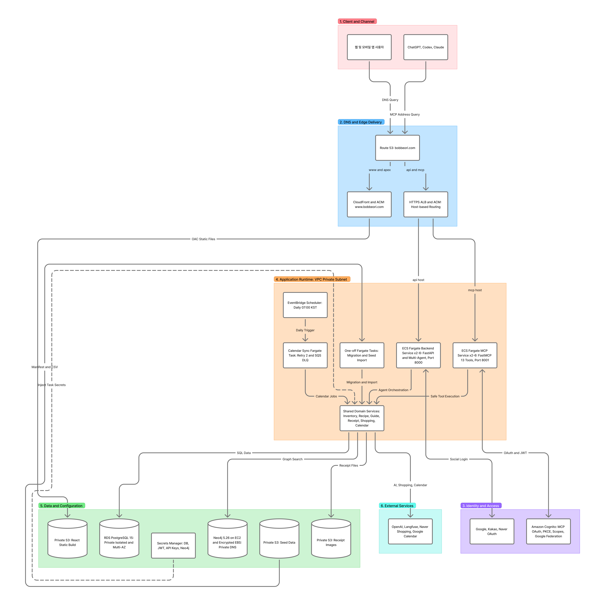
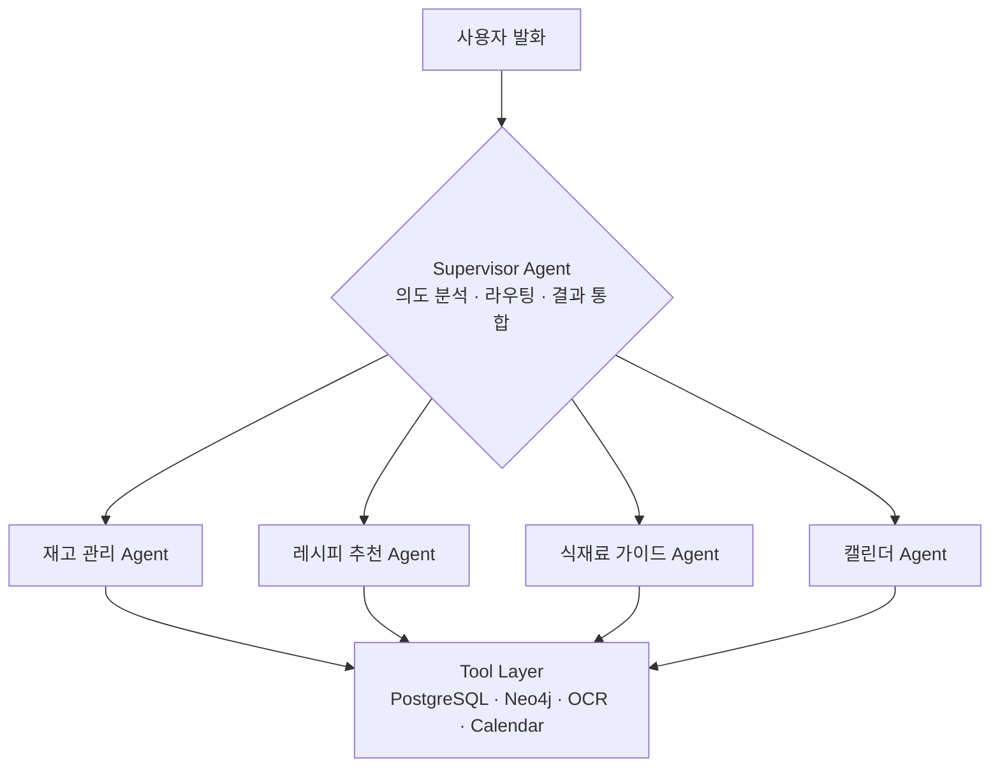
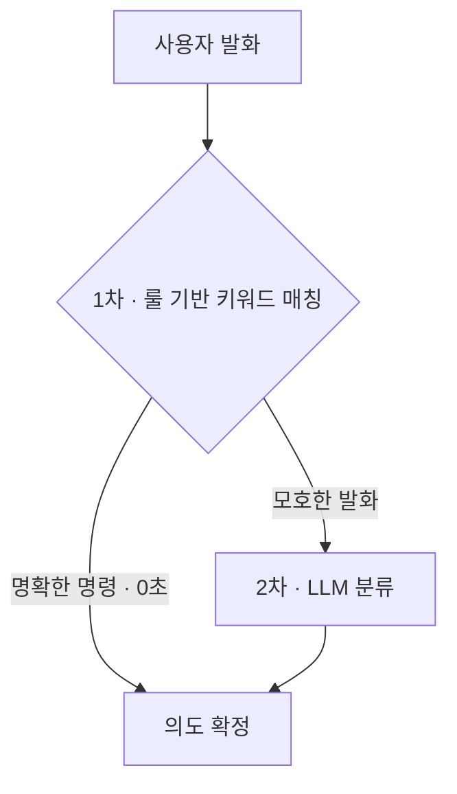
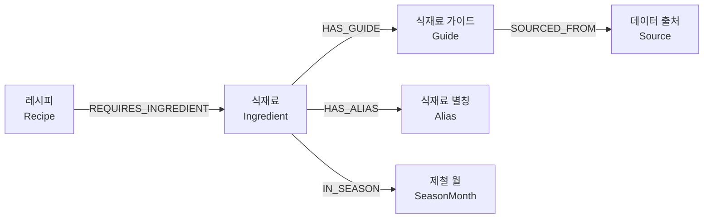

<div align="center">


# 밥벌이 (bobbeori)
## www.bobbeori.com
### 버려지는 식재료부터 장보기까지, 한 번에 관리하는 AI 기반 식재료 관리 서비스

**영수증만 찍으면 냉장고가 자동으로 채워지고, 있는 재료로 만들 수 있는 레시피를 추천받고, AI가 재고를 관리·알림해주는 AI 식자재 관리 서비스**

<br/>


</div>

<!-- 상단 요약 GIF 삽입 위치 : "영수증 촬영 → 재고 자동 등록 → 레시피 추천 → 챗봇 대화" 3~4장면 -->
<div align="center">

> **핵심 흐름 시연 GIF 삽입 예정**
> `영수증 촬영 → 냉장고 자동 등록 → 냉장고 파먹기 추천 → AI 챗봇 · 캘린더 알림`

</div>

---

## 목차

1. [팀 소개](#팀-소개)
2. [프로젝트 개요](#프로젝트-개요)
3. [개발 배경](#개발-배경)
4. [핵심 기능](#핵심-기능)
5. [기술 스택](#기술-스택)
6. [시스템 아키텍처](#시스템-아키텍처)
7. [핵심 기술 상세](#핵심-기술-상세)
8. [데이터 설계](#데이터-설계)
9. [성과 및 검증](#성과-및-검증)
10. [화면 구성](#화면-구성)
11. [프로젝트 구조](#프로젝트-구조)
12. [실행 방법](#실행-방법)
13. [향후 발전 방향 & 회고](#팀-회고)

---

## 팀 소개

**SKN27기 Final Project 1팀**

| 이름  | 역할 | 담당 | GitHub |
|:---:|:---:|:---|:---:|
| **이&#8288;재&#8288;희** | PM · MCP · Calendar | AWS ECS 기반 운영 인프라 설계·배포<br>GitHub Actions CI/CD 및 Smoke Test 구현<br>Android 앱·음성 조리 기능 구현<br>Google Calendar 연동 및 알림 Agent 설계 | [](https://github.com/EJ-pro) |
| **박&#8288;준&#8288;희** | APM · OCR · SEO · Agent | 영수증 OCR 모델 선정·연동 및 품질 검증<br>이미지 업로드 검증·보안 처리 강화<br>장보기 Agent 기능 설계<br>SEO · Prerender · 검색 노출 구조 구축 | [](https://github.com/enblav262) |
| **김&#8288;재&#8288;묵** | Backend · Agent · Langfuse | Supervisor Agent 및 멀티에이전트 라우팅 구현<br>FastAPI 기반 백엔드 API 개발<br>OAuth 2.0 소셜 로그인·JWT 인증 처리<br>Langfuse Trace · 평가 · 디버깅 체계 구축 | [](https://github.com/jaemukkim) |
| **김&#8288;주&#8288;영** | Neo4j · GA4 · Agent | Neo4j GraphDB 스키마·관계 구조 설계<br>식재료 가이드 데이터 수집·정제<br>GraphDB 적재 파이프라인 및 Guide Agent 구현<br>GA4 이벤트·전환 퍼널 측정 체계 구축 | [](https://github.com/enooola0204-spec) |
| **김&#8288;경&#8288;수** | ML · MCP · Data | 레시피 데이터 수집·정제 및 특징 데이터 구축<br> LightFM 기반 추천 모델 설계 · 평가<br>추천 추론 파이프라인 및 API 연동<br> MCP Tool · OAuth 구조 구현 | [](https://github.com/wynn3312) |

---

## 프로젝트 개요

**밥벌이**는 냉장고 속 식재료를 방치해 버리는 문제를 해결하는 AI 식자재 관리 서비스입니다.
영수증 한 장이면 재고가 자동으로 등록되고, 가지고 있는 재료를 중심으로 "지금 만들 수 있는 요리"를 추천하며, 자연어 챗봇과 캘린더 알림으로 재고 관리를 대화처럼 쉽게 만듭니다.

- **프로젝트명** : 밥벌이 (bobbeori)
- **개발 기간** : 2026.06.11 ~ 2026.08.04
- **한 줄 소개** : 냉장고 재료 관리, 영수증 OCR, 레시피 추천, 장보기 목록, Google Calendar 알림 연동을 제공하는 AI 기반 식재료 관리 서비스

```
[영수증 촬영·업로드] → [냉장고 재고 자동 등록] → [냉장고 파먹기 레시피 추천] → [부족 재료 장보기]
                                  └→ [식재료 가이드 조회]

  └ 위 전체 과정을 AI 챗봇으로 조회·관리하고, 캘린더로 유통기한·추천을 알림
```

---

## 개발 배경

식재료 관리 서비스 관련 사용자 리뷰를 통해 구매한 식재료를 올바르게 보관하고, 소비까지 연결하는 과정에서 다음과 같은 어려움이 반복되는 것을 확인하였습니다. 

- **보관 방법을 알기 어려움** : 식재료별 적절한 보관 방법을 몰라 신선도가 빠르게 떨어지거나 폐기되는 문제
- **소비기한 확인 누락** : 구매한 식재료를 잊어 소비기한이 지난 후 발견하는 문제
- **보유 재료 활용의 어려움** : 냉장고에 있는 재료로 어떤 요리를 만들 수 있는지 판단하기 어려운 문제
- **직접 입력의 번거로움** : 식재료명, 수량, 소비기한을 일일이 입력해야 하는 관리 부담이 사용자 이탈로 이어지는 문제

밥벌이는 영수증 OCR을 통한 재고 자동 등록, 식재료별 보관 가이드, 소비기한 알림, 보유 재료 기반 레시피 추천을 제공해 식재료의 등록부터 보관과 소비까지 하나의 흐름으로 연결합니다.

---

## 핵심 기능

| 기능 | 설명 | 핵심 기술 |
|:---|:---|:---|
| **영수증 OCR 재고 등록** | 영수증을 촬영하면 품목을 인식·정규화해 냉장고 재고로 자동 등록 | OpenAI Vision OCR, 파일 검증 파이프라인 |
| **냉장고 재고 관리** | 재료별 유통기한을 직접 입력하거나 미입력 시 AI가 자동 생성, 실온·냉장·냉동 보관방법으로 등록·관리 | PostgreSQL, AI 유통기한 추정, 재고 관리 Agent |
| **냉장고 파먹기 추천** | 보유 식재료와 레시피의 재료 구성을 비교해 만들기 좋은 레시피를 우선 추천하고 부족 재료 안내 | Neo4j 그래프, 식재료 매칭, 보유 재료 비율 기반 추천 |
| **식재료 가이드** | 재료별 보관법·손질법·세척법·신선도·제철·영양 정보 제공 | Neo4j 그래프 지식베이스 |
| **장보기 · 가격 비교** | 레시피에 부족한 재료를 추려 구매 목록·가격 비교 | Tavily Search, 커머스 API |
| **AI 챗봇** | "계란 언제까지야?"처럼 대화로 재고 조회·추천·관리 | LangGraph Supervisor 멀티 에이전트 |
| **캘린더 알림** | 유통기한 임박·저녁 추천 메뉴를 매일 정해진 시간에 Google Calendar로 알림 | MCP + RunPod Serverless |
| **MCP 공개 연동** | ChatGPT·Codex 등 MCP 클라이언트에서 냉장고, 레시피, 가이드, 영수증, 장보기, 캘린더 기능 사용 | FastMCP, Streamable HTTP, OAuth 2.1 + PKCE |
| **소셜 로그인** | 카카오·네이버·구글 OAuth 2.0 간편 로그인 | OAuth 2.0 + JWT |

<!-- 각 기능별 스크린샷/GIF 삽입 위치 -->

---

## 기술 스택

| 구분 | 기술 |
|:---|:---|
| **Frontend** |    |
| **Backend** |     |
| **Database** |   |
| **AI / Agent** |     |
| **Infra / 연동** |       |
| **SEO / Web** |         |
| **Observability / Analytics** |   |
| **Storage** |   |
---

## 시스템 아키텍처

밥벌이는 웹·모바일 사용자와 AI 클라이언트 요청을 분리해 전달하고, 애플리케이션·에이전트·데이터 계층을 독립적으로 운영합니다.
정형적인 사용자·재고·거래 데이터는 **PostgreSQL**이, "재료 ↔ 레시피 ↔ 가이드"의 복잡한 관계 추천은 **Neo4j 그래프**가 담당합니다.

### 인프라 및 배포 아키텍처



### 서비스 및 에이전트 아키텍처


---

## 핵심 기술 상세

### 1. AI 챗봇 — LangGraph Supervisor 멀티 에이전트

사용자의 자연어 발화를 **슈퍼바이저 에이전트**가 해석해 알맞은 하위 에이전트로 라우팅하고, 각 에이전트가 Tool Layer(PostgreSQL·Neo4j·OCR·Calendar)를 호출해 작업을 처리합니다.


```mermaid
flowchart TD
    U[사용자 발화] --> SUP{Supervisor Agent<br/>의도 분석 · 라우팅 · 결과 통합}
    SUP --> A1[재고 관리 Agent]
    SUP --> A2[레시피 추천 Agent]
    SUP --> A3[식재료 가이드 Agent]
    SUP --> A4[캘린더 Agent]
    A1 --> TOOL[Tool Layer<br/>PostgreSQL · Neo4j · OCR · Calendar]
    A2 --> TOOL
    A3 --> TOOL
    A4 --> TOOL
```

#### 하이브리드 인텐트 라우팅

의도 분류는 **1차 룰 기반 → 2차 LLM**의 하이브리드 방식을 채택했습니다.


```mermaid
flowchart TD
    Q[사용자 발화] --> RULE{1차 · 룰 기반 키워드 매칭}
    RULE -->|명확한 명령 · 0초| INTENT[의도 확정]
    RULE -->|모호한 발화| LLM[2차 · LLM 분류]
    LLM --> INTENT
```

**왜 순수 LLM이 아니라 하이브리드인가?**
LLM 단독은 정확도가 높지만, *"이 레시피 어려운데 그냥 다 버릴까봐"* 같은 발화에서 '버릴까'라는 단어에 꽂혀 **실제 냉장고 데이터의 삭제 요청으로 잘못 해석하는 현상**이 관찰됐습니다. DB에 직접 쓰기/삭제하는 작업은 통제된 룰 방어막 안에서만 동작하도록 제한해 **데이터 무결성을 지키면서 응답 속도까지 확보**했습니다.

### 2. 영수증 OCR — OpenAI Vision + 파일 검증 파이프라인

영수증 이미지에서 **상품명·수량·금액**을 추출하고, 식재료명 정규화를 거쳐 냉장고 재고로 자동 등록합니다. OCR 엔진은 EasyOCR로 실험을 시작해, 정확도·비용·속도를 종합 비교한 끝에 **OpenAI Vision(GPT-5.4 mini) 기반**으로 확정했습니다.

```
파일 검증(확장자·MIME·크기·다중 이미지) → 안전 저장(UUID 파일명) → 이미지 전처리 → OCR 파싱 → 재료명 정규화 → 재고 등록
```

- **보안** : 확장자·MIME 타입·용량을 1차 검증하고 UUID 파일명으로 안전 저장해 악성 파일 업로드를 차단
- **정규화** : OCR로 읽은 원시 상품명을 대표 재료명으로 매핑해 재고·추천과 연결

#### Private S3 영수증 저장소

영수증 원본 이미지는 공개 경로에 직접 노출하지 않고 Private S3 Bucket에 저장합니다.

- **사용자별 저장 경로 분리** : 환경과 사용자 ID를 기준으로 S3 Object Key 구성
- **안전한 파일명** : 원본 파일명 대신 UUID 기반 파일명 사용
- **비공개 저장** : S3 Object에 대한 직접 공개 접근 차단
- **DB 참조 관리** : 데이터베이스에는 실제 이미지가 아닌 `s3://` 형식의 Object URI 저장
- **제한된 이미지 접근** : 백엔드 인증 후 짧은 유효시간의 Presigned URL로 이미지 제공
- **환경별 저장소 지원** : 운영 환경은 S3, 로컬 개발 환경은 로컬 업로드 디렉터리 사용

```text
영수증 업로드
    → 파일 형식·MIME·용량 검증
    → UUID 파일명 생성
    → Private S3 저장
    → S3 Object URI를 DB에 저장
    → 인증된 요청에만 Presigned URL 발급
```

### 3. 그래프 기반 레시피 추천 — Neo4j

"레시피 → 식재료" 관계를 Neo4j 그래프로 모델링하고, 사용자의 보유 식재료와 각 레시피의 재료 구성을 비교해 **현재 만들기 좋은 요리**를 우선 추천합니다.

- **식재료 매칭** : 냉장고의 보유 식재료와 레시피별 필요 재료를 연결해 보유·부족 재료를 구분
- **보유 재료 비율 기반 추천** : 필요한 재료 중 보유한 재료의 비율이 높은 레시피를 우선 정렬
- **부족 재료 안내** : 추천 결과와 레시피 상세 화면에서 추가로 필요한 재료를 제공해 장보기 기능과 연결

### 4. 캘린더 알림 — MCP + RunPod Serverless

매일 정해진 시간(KST)에 Daily Loop가 돌며 사용자별 알림을 Google Calendar에 등록합니다. Backend의 **MCP Client**가 **RunPod Serverless Endpoint**의 MCP Tool을 `X-Internal-Token`으로 안전하게 호출해 Calendar API를 실행하는 구조입니다.

| 시간 | 알림 내용 |
|:---|:---|
| 오전 8:30 | 유통기한 임박 재료 |
| 오후 5:30 | 저녁 추천 메뉴 |
| 오전 9:00 | 주간 추천 |

> 중복 등록 방지를 위해 이벤트 키(`bobbeoriKey`) 기반으로 존재 여부를 확인 후 생성/갱신합니다.

### 5. 공개 MCP 연동 — FastMCP + OAuth 2.1

기존 FastAPI 도메인 서비스를 **FastMCP 어댑터**로 연결해 ChatGPT·Codex 등 외부 MCP 클라이언트에서도 밥벌이 기능을 사용할 수 있습니다. 클라이언트는 Streamable HTTP 방식의 `/mcp` 엔드포인트에 연결하며, OAuth 2.1 Authorization Code + PKCE와 기능별 Scope로 접근 권한을 제어합니다.

| 구분 | 제공 도구 |
|:---|:---|
| **재고 조회** | `inventory.list`, `inventory.expiring` |
| **레시피·가이드 조회** | `recipe.recommend`, `recipe.get`, `ingredient.guide` |
| **영수증·장보기** | `receipt.preview`, `receipt.commit`, `shopping.preview`, `shopping.save` |
| **캘린더·리마인더** | `calendar.preview`, `calendar.create`, `reminder.preview`, `reminder.create` |

- **13개 MCP Tool** : 재고, 레시피, 식재료 가이드, 영수증, 장보기, 캘린더 기능을 공통 인터페이스로 제공
- **사용자·권한 분리** : 입력값으로 `user_id`를 받지 않고 검증된 액세스 토큰의 사용자와 Scope를 기준으로 접근 제어
- **안전한 변경 작업** : 쓰기 작업은 `preview → 사용자 확인 → commit` 순서로 실행하며, 단기 서명 토큰과 멱등성 기록으로 중복 실행 방지
- **일관된 응답 규격** : 모든 Tool이 성공 여부, 데이터, 경고, 확인 필요 여부, 다음 작업, 추적 ID를 동일한 구조로 반환

### 6. 검색 노출 최적화 — SEO + Prerender

React SPA는 초기 HTML에 페이지 내용과 메타데이터가 충분히 포함되지 않아 검색 엔진이 페이지 정보를 수집하기 어렵다는 한계가 있습니다. 이를 보완하기 위해 공개 페이지별 SEO 메타데이터를 관리하고, 빌드 과정에서 검색 엔진이 바로 읽을 수 있는 정적 HTML을 생성합니다.

| 구성 | 적용 내용 |
|:---|:---|
| **페이지별 메타데이터** | 공개 페이지별 `title`, `description`, `canonical` URL 설정 |
| **Prerender** | Vite 빌드 시 공개 경로의 SEO 메타데이터가 포함된 정적 HTML 생성 |
| **검색 엔진 제어** | `robots.txt`와 `sitemap.xml`을 통해 크롤링 허용 범위와 공개 URL 제공 |
| **검색 중복 방지** | 페이지별 Canonical URL을 지정해 중복 URL 색인 방지 |
| **소셜 공유 최적화** | Open Graph와 Twitter Card 메타데이터 및 대표 이미지 제공 |
| **구조화 데이터** | Schema.org의 `WebSite` JSON-LD를 적용해 서비스명과 사이트 정보 제공 |
| **개인화 페이지 보호** | 냉장고, 영수증, 마이페이지, 인증 콜백 등 사용자별 페이지에 `noindex` 적용 |

검색 노출이 필요한 `/`, `/faq`, `/terms`, `/privacy` 경로만 색인을 허용하고, 로그인 이후 사용하는 개인화 페이지와 인증 처리 경로는 검색 결과에서 제외합니다.

프론트엔드 빌드 시 `prerender-seo.mjs`가 경로별 정적 HTML을 생성하고, CloudFront가 요청 경로에 맞는 Prerender 결과를 제공하도록 구성했습니다. 메타데이터, Sitemap, Robots 설정은 자동 테스트를 통해 검증합니다.

### 7. AI Agent 관측성 — Langfuse

멀티 에이전트의 복잡한 실행 과정을 추적하고 오류 원인을 분석하기 위해 Langfuse를 연동했습니다. 사용자의 채팅 요청마다 고유한 세션을 생성하고, Supervisor Agent부터 하위 Agent와 Tool 실행까지 하나의 Trace로 연결합니다.

| 추적 항목 | 적용 내용 |
|:---|:---|
| **사용자·세션 추적** | 사용자와 채팅 세션별로 Agent 실행 기록을 분리 |
| **Agent 실행 흐름** | Supervisor의 의도 분석과 하위 Agent 라우팅 과정 추적 |
| **라우팅 결과** | 선택된 Intent, 라우팅 신뢰도, 실행 Task 수 기록 |
| **Tool 실행 결과** | 완료·실패한 Intent와 Action·Source 수 기록 |
| **오류 추적** | Agent 실행 예외와 실패 지점을 Error Trace로 저장 |
| **성공 여부 평가** | 각 Supervisor 요청의 성공 여부를 Boolean Score로 기록 |

Langfuse Trace에는 사용자 입력, 대화 이력 수, 선택된 Intent, 라우팅 신뢰도, 완료·실패 작업과 오류 정보가 기록됩니다. 이를 통해 잘못된 Agent 라우팅, Tool 호출 실패, 응답 지연과 반복되는 오류를 세션 단위로 분석할 수 있습니다.

Langfuse 설정값이 없는 환경에서는 추적 기능만 비활성화되며, 챗봇 기능은 정상적으로 동작하도록 구성했습니다.

### 8. 사용자 행동 및 전환 분석 — Google Analytics 4

서비스 사용 흐름과 핵심 기능의 전환율을 확인하기 위해 Google Analytics 4를 연동했습니다. React SPA의 라우트 변경을 직접 감지해 페이지 조회를 기록하고, 주요 기능의 완료 시점을 사용자 행동 이벤트로 수집합니다.

| 이벤트 | 측정 내용 |
|:---|:---|
| `page_view` | React Router를 통한 페이지 이동 |
| `sign_up` | 소셜 로그인 기반 신규 가입 |
| `login` | Google·Kakao·Naver 로그인 |
| `receipt_ocr_complete` | 영수증 OCR 처리 완료 |
| `fridge_ingredient_add` | 냉장고 식재료 등록 |
| `ingredient_consume` | 냉장고 식재료 소비 처리 |
| `recipe_recommend` | 보유 재료 기반 레시피 추천 실행 |
| `select_content` | 추천·검색 결과에서 레시피 상세 선택 |
| `shopping_list_create` | 레시피 부족 재료 기반 장보기 목록 생성 |

수집한 이벤트를 기반으로 다음과 같은 핵심 사용자 흐름을 분석할 수 있습니다.

```text
회원가입·로그인
    → 영수증 OCR 완료
    → 냉장고 식재료 등록
    → 레시피 추천
    → 레시피 상세 조회
    → 장보기 목록 생성
```

---

## 데이터 설계

### 이중 데이터베이스 — RDB + Graph

| 데이터베이스 | 역할 |
|:---|:---|
| **PostgreSQL (RDB)** | 사용자, 냉장고 재고, 영수증, 장보기 목록 등 구조화 데이터 저장·조회 |
| **Neo4j (Graph)** | 식재료, 레시피, 가이드 간 관계 탐색 및 보유 재료 기반 추천 |

### Neo4j 그래프 스키마


```mermaid
flowchart LR
    R["레시피<br/>Recipe"] -->|"REQUIRES_INGREDIENT"| I["식재료<br/>Ingredient"]
    I -->|"HAS_GUIDE"| G["식재료 가이드<br/>Guide"]
    I -->|"HAS_ALIAS"| A["식재료 별칭<br/>Alias"]
    I -->|"IN_SEASON"| S["제철 월<br/>SeasonMonth"]
    G -->|"SOURCED_FROM"| SRC["데이터 출처<br/>Source"]
```

### 식재료 정규화 — 추천을 위한 데이터 엔지니어링

원재료명은 별칭으로 보존하고, 정규화 결과는 별도의 정제 데이터로 관리합니다.

- **유사 재료명 병합** : 흰대파, 파 한 단 → `파`
- **동의어 통합** : 달걀, 계란 → `달걀`
- **조미료·양념류 분리** : 간장, 고추장, 소금
- **도구·용기성 데이터 제거** : 냄비, 팬, 종이컵
- **문장형 이상치 분리** : 재료명으로 판단하기 어려운 문장은 검토 대상으로 분리

---

## 성과 및 검증

### Intent Router 아키텍처 벤치마크

챗봇 의도 분류 방식을 검증하기 위해 17개 intent를 포함한 동일한 **200개 발화 데이터셋**으로 3가지 방식을 정량 비교했습니다.

| 라우팅 기법 | 정확도 | 평균 처리 속도 | 비고 |
|:---|:---:|:---:|:---|
| Rule-based Only | 66.5% | **0.0001s** | 빠르지만 표현 변형과 문맥 처리에 한계 |
| LLM-only | 75.0% | 1.4833s | 자연어 이해에 강하지만 후검증 탈락 사례 존재 |
| **Hybrid (채택)** | **88.5%** | 1.5380s | **LLM 분류와 규칙 보정으로 최고 정확도** |

- **데이터 무결성 방어** : DB 쓰기/삭제는 규칙 기반 경로에서만 동작해 LLM 오분류가 데이터 변경으로 이어지는 것을 방지
- **정확도 향상** : Rule-based 대비 **+22.0%p**, LLM-only 대비 **+13.5%p** 향상

### OCR 모델 벤치마크

영수증 인식 모델을 정확도·비용·속도 기준으로 비교해 **GPT-5.4 mini**를 최종 채택했습니다.

| 모델 | 처리 속도 | 비용/건 | 정확도 | 비고 |
|:---|:---:|:---:|:---:|:---|
| GPT-5.5 | 15.53s | $0.0549 | 100% (기준모델) | 최고 정확도, 과도한 비용·지연 |
| **GPT-5.4 mini** | **3.17s** | **$0.0033** | **88.9%** | **최종 선정** |
| GPT-5.4 nano | 4.03s | $0.0010 | 71.2% | 최저 비용, 정확도 부족 |

> 로컬 모델(Gemma 4 E4B, Qwen 3.5 2B / Ollama)도 함께 검토했으나 정확도 미달로 제외했습니다.

### 테스트 & CI/CD

- **총 388건**의 테스트 (기능 209 · unit/fixture 97 · API 55 · A/B 27 · 경계 15)
- **GitHub Actions** 기반 통합 CI/CD, **Pull Request 통과율 100%**

### 운영 관측 및 분석 체계

- **Langfuse** : Agent 라우팅, Tool 실행, 오류, 응답 시간과 세션별 성공 여부 추적
- **GA4** : 로그인, OCR, 재고 등록, 레시피 추천, 장보기 목록 생성까지의 전환 퍼널 분석

---

## 화면 구성

| 화면 | 설명 |
|:---|:---|
| 홈 대시보드 | 냉장고 요약, 임박 재고, 추천 진입점 |
| 냉장고 관리 | 재고 목록·수정·유통기한 관리 |
| 영수증 등록 | 영수증 업로드 → OCR 결과 확인·등록 |
| 냉장고 파먹기 / 레시피 추천 / 메뉴 추천 | 보유 재료 기반 레시피 추천·상세 |
| 식재료 가이드 | 보관·손질·세척·신선도·제철·영양 정보 |
| 장보기 | 부족 재료 목록·구매 링크 |
| AI 챗봇 | 자연어로 재고 조회·추천·관리 |
| 마이페이지 · 로그인 | 소셜 로그인, 사용자 설정 |

<!-- 시연 영상 링크 또는 화면 GIF 삽입 위치 -->

---

## 프로젝트 구조

### 주요 폴더 및 역할

```
ai         : 멀티 에이전트, Agent Tool, 캘린더 MCP 코드
app        : FastAPI 백엔드, 공개 MCP 서버, React 프론트엔드
docs       : MCP·CI/CD·평가 문서와 아키텍처 이미지
etl        : 식재료 가이드 전처리와 Neo4j 적재
infra      : AWS CDK 기반 배포 인프라
scripts    : 시드 생성, 에이전트 평가, MCP 인증 점검 스크립트
seed-prod  : 운영 환경 초기 적재 데이터
storage    : PostgreSQL·Neo4j·영수증 원본 데이터
test       : API·기능·단위 테스트와 테스트 fixture
```

### 폴더 구조

```
root/
├─ .agents/
│  └─ skills/bobbeori-workflows/    (ChatGPT·Codex용 MCP 워크플로 스킬)
├─ .github/
│  └─ workflows/                    (CI/CD 워크플로)
├─ ai/
│  ├─ agents/                       (Supervisor와 도메인 Agent)
│  ├─ calendar/                     (캘린더 MCP·RunPod 연동)
│  └─ tools/                        (Agent Tool 정의)
├─ app/
│  ├─ backend/
│  │  ├─ api/                       (기능별 REST API)
│  │  ├─ mcp/                       (FastMCP 공개 서버와 인증·Tool)
│  │  ├─ services/                  (도메인 비즈니스 로직)
│  │  ├─ db/                        (ORM 모델과 DB 연결)
│  │  ├─ core/                      (환경 설정과 공통 구성)
│  │  ├─ schemas/                   (요청·응답 스키마와 마이그레이션)
│  │  └─ jobs/                      (시드 적재 작업)
│  └─ frontend/
│     ├─ pages/                     (기능별 화면)
│     ├─ components/                (재사용 UI 컴포넌트)
│     ├─ services/                  (API 클라이언트)
│     └─ assets/ · public/          (서비스 이미지와 정적 리소스)
├─ docs/
│  └─ images/                       (README 아키텍처 이미지)
├─ etl/
│  ├─ food_guide/                   (식재료 가이드 적재)
│  └─ load_to_neo4j/                (Neo4j 적재 스크립트)
├─ infra/                           (AWS CDK 인프라)
├─ scripts/
│  └─ agent_evaluation/             (Agent 평가 데이터와 실행 도구)
├─ seed-prod/                       (운영 초기 데이터 번들)
├─ storage/                         (DB 적재 파일과 원본 영수증)
├─ outputs/                         (OCR·평가 생성 결과)
├─ test/
│  ├─ api/ · features/ · unit/      (API·기능·단위 테스트)
│  └─ fixtures/                     (테스트 데이터)
├─ .env.sample
├─ .gitignore
├─ docker-compose.yml
└─ README.md
```

---

## 실행 방법

### Docker로 한 번에 기동 (권장)

```bash
# 1. 환경 변수 준비 (.env.sample 복사 후 DB_PASSWORD, NEO4J_PASSWORD 등 설정)
cp .env.sample .env

# 2. 전체 서비스 기동 (backend · frontend · postgres · neo4j · 데이터 적재)
docker compose up -d --build
```

| 서비스 | URL |
|:---|:---|
| 프론트 (Vite) | http://localhost:5173 |
| 백엔드 API | http://localhost:8000 |
| API 문서 (Swagger) | http://localhost:8000/docs |
| Neo4j Browser | http://localhost:7474 |

> 기동 시 `postgres → recipe_load → neo4j → neo4j_load → backend → frontend` 순서로 데이터 적재까지 자동 수행됩니다.

### Docker 없이 실행

```bash
# 백엔드 (프로젝트 루트)
uvicorn app.backend.main:app --reload --host 0.0.0.0 --port 8000

# 프론트 (app/frontend)
npm install && npm run dev
```

---

## 향후 발전 방향 & 회고

### 향후 발전 방향 

### 팀 회고

<!-- 팀원별 개인 회고 작성 위치 -->

<details>
<summary><h4>이재희</h4></summary>
회고 내용
</details>
<details>
<summary><h4>박준희</h4></summary>

<br>

이번 프로젝트를 통해 배운 기술을 실제 서비스로 구현하고, 팀원들이 개발한 기능을 하나의 서비스로 통합하는 전반적인 과정을 경험할 수 있었습니다. 이론으로 이해했던 내용을 직접 적용하고 문제를 해결하면서 기술에 대한 이해를 높일 수 있었습니다. 특히 실제 사용자가 이용하는 서비스에서는 기능 구현뿐만 아니라 개인정보 보호, 파일 업로드 보안, 데이터 저장 방식과 같은 운영 측면도 중요하다는 점을 배웠습니다. 처음 접하는 작업이 많았지만 필요한 내용을 하나씩 학습하고 적용한 뒤 반복적으로 점검하면서 문제를 해결해 나가는 과정에서 개발의 재미를 느낄 수 있었습니다.
 
프로젝트 초반에는 주제가 여러 차례 변경되면서 데이터 확보 가능성, 구현 방향, 프로젝트 목적과의 적합성을 조율하는 데 어려움이 있었지만, 방향이 확정된 이후에는 역할과 책임을 명확히 나누고, 정기적인 온·오프라인 회의와 주간 점검을 통해 원활하게 협업할 수 있었습니다. 또한 GitHub를 활용하여 각자 구현한 기능과 Agent를 큰 문제 없이 통합할 수 있었습니다.
 
아쉬운 점은 초기 빠르게 OCR 모델을 선정하고 구현하고자 충분히 많은 영수증으로 테스트를 진행하지 못하였다는 점입니다. 또한 중간 발표 이후 2차 구현 시점부터 장보기 기능 구현을 시작하다보니 Agent를 원하는 수준까지 고도화하지 못했습니다. SEO 역시 검색 결과에 반영되기까지 시간이 필요하다는 점을 고려해 프로젝트 초기부터 진행했다면 더욱 완성도 높은 결과를 만들 수 있었을 것 같습니다. 

이번 프로젝트를 통해 기능 구현뿐만 아니라 검증과 피드백을 통한 지속적인 개선이 중요하다는 점을 배웠습니다. 앞으로의 프로젝트에서는 초기 단계부터 사용자, 보안, 운영 환경을 함께 고려하여 더욱 완성도 높은 서비스를 구현하고자 합니다.

</details>

<details>
<summary><strong>김재묵</strong></summary>

<br>  
**여기에 내용 작성**

</details>


<details>
<summary><strong>김주영</strong></summary>

<br>  
공공기관의 식재료 가이드 데이터를 수집·전처리하고, 기관마다 다른 식재료명을 표준명과 별칭으로 정리해 PostgreSQL과 Neo4j에 적재했습니다. 구축한 데이터는 식재료 가이드 에이전트와 연결해 보관법, 손질법, 세척법, 신선도, 제철, 영양정보를 제공하도록 구현했으며, GA4를 연동해 사용자 이용 흐름을 분석할 수 있는 기반도 마련했습니다.

또한 동일한 데이터를 기준으로 PostgreSQL과 Neo4j의 조회 성능을 비교했습니다. 0~1-Hop 단순 조회는 PostgreSQL이 우세했지만, `레시피 → 식재료 → 가이드 → 출처`와 같은 3-Hop 관계 조회에서는 Neo4j의 응답 시간이 약 40.2% 낮았습니다. 이를 통해 단순 조회와 CRUD는 PostgreSQL, 다단계 관계 탐색은 Neo4j가 적합하다는 결론을 도출했습니다.

이번 프로젝트를 통해 데이터 수집·전처리·적재뿐 아니라, 실제 성능 비교를 바탕으로 데이터베이스의 역할을 결정하고 서비스 구조에 반영하는 경험을 했습니다. 다만 별칭을 정리하는 과정에서 범용어와 브랜드명 제거 기준을 충분히 세분화하지 못해 일부 상품명이 정확한 표준 식재료로 연결되지 않을 가능성이 남았습니다.

향후에는 브랜드명·등급·용량·포장 정보 제거 규칙과 범용어 처리 기준을 보완하고, 두 저장소의 동기화 기준과 검수 이력, Neo4j 백업·복구 체계를 강화할 계획입니다. 또한 GA4 데이터를 활용해 식재료 가이드 에이전트의 이용 흐름과 응답 품질을 지속적으로 개선하고자 합니다.

</details>

<details>
<summary><strong>김경수</strong></summary>

<br>  
**여기에 내용 작성**

</details>

---

<div align="center">

**밥벌이** — SKN27기 Final Project 1팀
_"식재료 관리의 복잡함을 AI 챗봇 하나로 줄인 프로젝트"_

</div>
