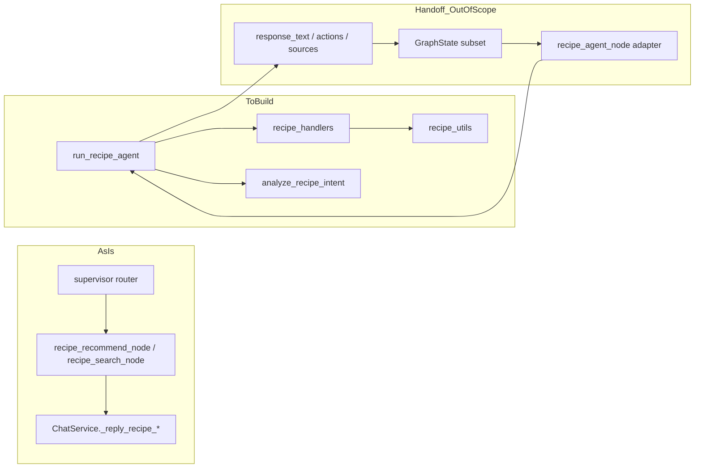

# Recipe Agent WORKPLAN (임시)

> LLM 협업용 작업 계획서. 전체 맥락·진행 상태·다음 Todo를 이 문서에서 추적합니다.  
> **완료 후 삭제 예정.**

**범위 밖:** [`supervisor_agent.py`](../supervisor_agent/supervisor_agent.py), [`supervisor_service.py`](../supervisor_agent/supervisor_service.py) 수정 — Supervisor 담당자 Handoff.

---

## 1. 개요 / 배경

### 현재 (As-Is)

- 레시피 로직이 **Supervisor Service**에 직접 있음 (`ChatService._reply_recipe_*`)
- LangGraph 노드 `recipe_recommend_node` / `recipe_search_node`가 Service 메서드를 호출
- 전용 `recipe_agent` 모듈 없음

### 목표 (To-Be)

- [`inventory_agent`](../inventory_agent/inventory_agent.py) / [`alarm_agent`](../alarm_agent/alarm_agent.py) / [`guide_agent`](../guide_agent/guide_agent.py)와 동일하게 **단일 진입점** `run_recipe_agent()` 구축
- Supervisor에서 이관할 레시피 기능을 **동등하게** 수행
- **1차 완성 기준:** 기존 `recipe.search` / `recipe.recommend` 동등 동작 (4-way 분류는 2차)

### GraphState boundary 호환

[`GraphState`](../../../app/backend/schemas/chat_state.py) **전체 타입**을 agent 내부에 쓰지 않고, Supervisor와 주고받는 **필드 subset의 이름·타입·의미**와 **출력 partial update**만 맞춥니다 (inventory/alarm/guide 패턴).



---

## 2. As-Is 이관 대상

| 출처 | 이관 대상 |
|------|-----------|
| [`supervisor_agent.py`](../supervisor_agent/supervisor_agent.py) L113-124 | `recipe_recommend_node`, `recipe_search_node` 동작 |
| [`supervisor_service.py`](../supervisor_agent/supervisor_service.py) | `_reply_recipe_search`, `_reply_recipe_recommend`, `_reply_external_recipe` |
| [`supervisor_utils.py`](../supervisor_agent/supervisor_utils.py) | `_extract_recipe_ingredient`, `_normalize_recipe_keyword`, `_recipe_actions`, `_rank_recipe_items`, `_requires_login`(recipe), `_is_cooking_time_question`, `_extract_keyword`, `_apply_josa`, `_is_relevant_search_result` |
| Backend (그대로 사용) | `recipe_search_service`, `recommendation_service`, `RecipeRecommendConfig` |
| Cross-agent | `inventory_agent.is_inventory_empty` (또는 `inventory_service` 직접 호출) |

**주의:** `supervisor_*` import **금지** — `recipe_utils`로 **복사 이관**.

---

## 3. To-Be 파일 구조

```
ai/agents/recipe_agent/
  WORKPLAN.md          ← 이 문서 (임시)
  __init__.py
  recipe_agent.py      # run_recipe_agent, build_recipe_response, to_supervisor_state, __main__
  recipe_intents.py    # analyze_recipe_intent
  recipe_handlers.py   # handle_recipe_search, handle_recipe_recommend, external fallback
  recipe_utils.py      # extract, rank, actions, login guard, josa
```

---

## 4. GraphState boundary 호환 (핵심 설계)

**정의 위치:** [`app/backend/schemas/chat_state.py`](../../../app/backend/schemas/chat_state.py)의 `GraphState` — [`supervisor_agent.py`](../supervisor_agent/supervisor_agent.py)는 import만 함.

### 원칙

- recipe_agent **내부 API**는 `GraphState` TypedDict를 import/상속하지 **않음**
- **입력·출력 필드의 이름·타입·의미**만 GraphState와 동일하게 맞춤 (boundary compatibility)
- LangGraph merge·`service`·`messages`·`keyword`는 Supervisor adapter 책임

### 입력 subset (Supervisor `state` → `run_recipe_agent` 인자)

| 필드 | 타입 | 비고 |
|------|------|------|
| `text` | `str` | positional 1번 인자 |
| `db` | `Session` | keyword |
| `user_id` | `int \| None` | keyword |
| `history` | `list` | `{role, text}` — keyword, default `[]` |
| `settings_obj` | optional | keyword |
| `intent` | `str \| None` | keyword — Supervisor router가 넘기면 그대로 사용 |

**recipe_agent에 넘기지 않는 GraphState 필드:** `service`, `messages`, `keyword`

### 출력 partial update (LangGraph 노드 merge 규격)

inventory `run_inventory_agent` 반환과 동일:

```python
{"response_text": str, "actions": list[dict], "sources": list[dict]}
```

- `actions` 항목: `{label, url?, data?}` — [`ChatAction`](../../../app/backend/schemas/chat.py)
- `sources` 항목: `{title, url}`

### 내부 agent 계약 (guide/alarm 패턴, 선택)

```python
{
    "ok": bool,
    "agent": "recipe",
    "intent": str,
    "message": str,
    "ui": {"actions": [], "sources": []},
    ...
}
```

### 변환 함수

- `to_supervisor_state(agent_result) -> dict` — 내부 계약 → GraphState partial update
- `run_recipe_agent(...)` 최종 반환은 **Supervisor merge용 dict**를 기본으로

### Handoff adapter 예시 (Supervisor 담당자, 범위 밖)

```python
def recipe_agent_node(state: GraphState) -> dict:
    return run_recipe_agent(
        state["text"],
        db=state["db"],
        user_id=state.get("user_id"),
        history=state.get("history", []),
        settings_obj=state.get("settings_obj"),
        intent=state.get("intent"),
    )
```

### Actions 규격 (프론트)

[`FloatingChatbot.jsx`](../../../app/frontend/components/FloatingChatbot.jsx): `url` → 페이지 이동, `data.message` → 챗봇 재전송.

### 금지 사항

- `run_recipe_agent(state: GraphState)` 시그니처
- `service` 필드를 recipe_agent에 전달
- `supervisor_utils` / `supervisor_service` 직접 import

---

## 5. 구현 순서 (5 Phase)

각 Todo는 작업 후 `- [x]`로 갱신하고, **상태** (`pending` / `in_progress` / `done`)를 옆에 표기합니다.

### P1 — 빈 에이전트 shell

- [x] **P1-1** `ai/agents/recipe_agent/` 디렉터리 및 `__init__.py` 생성 — `done`
- [x] **P1-2** `run_recipe_agent(text, *, db, user_id, history, settings_obj, intent)` 시그니처 고정 (GraphState subset 인자명) — `done`
- [x] **P1-3** placeholder `{response_text, actions, sources}` 반환 — `done`
- [x] **P1-4** `python -m ai.agents.recipe_agent.recipe_agent` 실행 확인 — `done`

### P2 — GraphState boundary + 응답 계약

- [x] **P2-1** `build_recipe_response()` 구현 — `done`
- [x] **P2-2** `to_supervisor_state()` 구현 — `done`
- [x] **P2-3** `__main__` assert: 출력 키 `response_text` / `actions` / `sources` — `done`
- [x] **P2-4** recipe_agent 모듈에 `GraphState` import 없음 확인 — `done`

### P3 — intent 라우터 (분기 없음)

- [ ] **P3-1** `recipe_intents.py` — `analyze_recipe_intent(text, history?)` — `pending`
- [ ] **P3-2** golden cases `__main__` (DB 불필요) — `pending`
- [ ] **P3-3** `run_recipe_agent`는 아직 stub 응답 (handler 미연결) — `pending`

### P4 — 개별 기능 구현

- [ ] **P4-a** `recipe_utils.py` — extract, rank, actions, josa, login guard + `__main__` — `pending`
- [ ] **P4-b** `handle_recipe_search` (= `_reply_recipe_search` + external) + `__main__` — `pending`
- [ ] **P4-c** `handle_recipe_recommend` (= 재료 분기 / history LLM / fridge recommend / empty inventory) + `__main__` — `pending`

### P5 — 라우터 연결 + 통합

- [ ] **P5-1** `run_recipe_agent` dispatch (intent → handler) — `pending`
- [ ] **P5-2** P3 stub 제거 — `pending`
- [ ] **P5-3** end-to-end `__main__` — `pending`
- [ ] **P5-4** Handoff parity: 기존 `_reply_recipe_*`와 동일 `{response_text, actions, sources}` — `pending`

---

## 6. Intent 매핑 (1차)

| Intent | Handler | 예시 utterance |
|--------|---------|----------------|
| `recipe.search` | `handle_recipe_search` | "김치볶음밥 레시피", "에어프라이어 몇 분?" |
| `recipe.recommend` | `handle_recipe_recommend` | "두부로 뭐해먹지", "오늘 뭐해먹지", "그거 말고 다른 거" |

### recommend 내부 분기 (handler 내부, intent 변경 없음)

1. 재료 키워드 있음 → ingredient search (초급/30분) + history 중복 제외
2. 키워드 없음 + history → LLM 키워드 유추
3. 키워드 없음 + 냉장고 비음 → `EMPTY_INVENTORY_REPLY`
4. 키워드 없음 + 냉장고 있음 → `fridge_consume_preset` + user settings

### 2차 (범위 밖, 참고만)

4-way 분류: 레시피검색 / 냉장고파먹기 / 레시피추천 / 관련없음 — 1차 완료 후 검토.

---

## 7. 검증 방법

- 각 파일 `if __name__ == "__main__":` — [`guide_agent.py`](../guide_agent/guide_agent.py) L784 패턴
- **P3:** 분류 golden cases (DB 불필요)
- **P4:** utils assert + handler mock/integration
- **P5:** `run_recipe_agent` end-to-end
- pytest 추가는 선택 (본 WORKPLAN 범위 아님)

### P3 golden cases (초안)

| 입력 | 기대 intent |
|------|-------------|
| "김치볶음밥 레시피" | `recipe.search` |
| "에어프라이어 치킨 몇 분?" | `recipe.search` |
| "두부로 뭐 해먹지?" | `recipe.recommend` |
| "오늘 뭐 해먹지?" | `recipe.recommend` |
| "냉장고 재료로 뭐 해먹지?" | `recipe.recommend` |

---

## 8. Handoff 메모 (Supervisor 담당자용)

1. `recipe_recommend_node` / `recipe_search_node` → 단일 `recipe_agent_node`
2. adapter: GraphState subset 추출 → `run_recipe_agent(...)` → 반환 dict를 LangGraph merge (**추가 변환 없이**)
3. `ChatService._reply_recipe_*` deprecated
4. recipe_agent는 `GraphState` / `ChatService` import하지 않음

### 완성 기준 (Handoff)

> 동일 GraphState subset 입력에 대해 기존 `ChatService._reply_recipe_search` / `_reply_recipe_recommend`와 `{response_text, actions, sources}` parity.

---

## 9. 진행 상태 / 작업 로그

| 항목 | 값 |
|------|-----|
| **현재 Phase** | P3 |
| **마지막 완료 Todo** | P2-4 |
| **다음 Todo** | P3-1 |
| **블로커** | 없음 |

### 변경 이력

| 날짜 | 내용 |
|------|------|
| 2026-07-13 | WORKPLAN.md 초안 작성 (GraphState boundary 호환, 5 Phase Todo) |
| 2026-07-13 | P1 shell 완료 (`__init__.py`, `recipe_agent.py`, smoke test) |
| 2026-07-13 | P2 boundary contract 완료 (`build_recipe_response`, `to_supervisor_state`) |

---

## LLM 작업 시 참고

1. **한 번에 하나의 Todo**만 처리 (예: P1-2 완료 후 문서 체크 + 로그 갱신)
2. Supervisor 코드 **수정하지 않음**
3. `supervisor_*`에서 **복사 이관**만 (import 금지)
4. 반환 dict는 항상 `response_text`, `actions`, `sources` 키 유지
5. 세션 종료 시 **섹션 9** (현재 Phase, 다음 Todo, 변경 이력) 갱신
