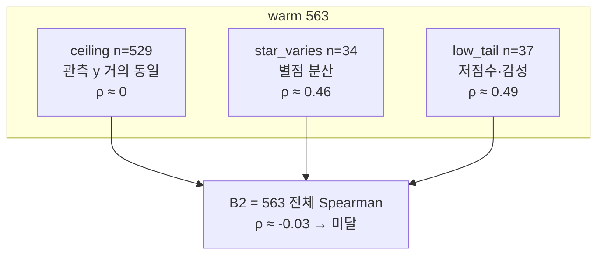

# LightFM 실험 기록

## 실험 1 — `star_sentiment_sum` + WARP (100 epoch)

**일자:** 2026-07-09  
**노트북:** `LightFM_Model.ipynb` (Docker JupyterLab)  
**목적:** 기본 파이프라인 동작 확인 + `star_sentiment_sum` interaction target의 오프라인 성능 1차 측정

### 설정

| 항목 | 값 |
|------|-----|
| interaction target | `star_sentiment_sum` (`star` + `sentiment`, 연속값) |
| loss | `warp` |
| seed | 42 |
| train/test split | 0.8 / 0.2 (`random_train_test_split`) |
| epochs | 100 |
| num_threads | 2 |
| Go/No-Go 기준 | test `precision@5 >= 0.05` |

**데이터**

| 항목 | 값 |
|------|-----|
| users | 821 |
| items | 563 |
| interactions (nnz) | 990 |
| train nnz | 792 |
| test nnz | 198 |
| density | 0.21% |

### 결과

#### Test set (Unit 8 — 최종 평가)

| 지표 | 값 |
|------|-----|
| precision@5 | 0.0079 |
| precision@10 | 0.0056 |
| recall@5 | 0.0365 |
| recall@10 | 0.0506 |

**판정:** No-Go (`precision@5` 0.0079 < 0.05)

#### Train set (Unit 7 — epoch별 모니터링)

Unit 7은 **train** matrix 기준 `precision@5`를 출력한다.

| 구간 | train precision@5 |
|------|-------------------|
| epoch 1 | ~0.01 |
| epoch 50 전후 | 상승 추세 |
| epoch 89~99 | **0.2227** (수렴·정체) |
| epoch 100 | 0.2224 |

→ train 지표는 0.22까지 올라가지만, **test 지표는 0.008 수준**으로 큰 격차가 있음.

### 해석

1. **과적합 의심:** 100 epoch에서 train precision@5는 0.22대에 수렴했으나 test precision@5는 0.008 미만. epoch를 늘린 효과는 train memorization에 가깝다.
2. **loss/target 불일치:** `warp`는 암묵적 피드백(이진 positive)용인데, interaction은 연속값(`star + sentiment`). 설계 문서 §4.1 기준으로 Binary target + warp 조합이 더 정합적이다.
3. **데이터 희소성:** 821 users × 563 items, density 0.21% — CF 신호가 약해 일반화가 어렵다.
4. **모니터링 지표 한계:** Unit 7의 epoch 로그는 train 기준이라, 수렴처럼 보여도 test 성능과 무관할 수 있다.

### 원본 리포트 (Unit 9)

```json
{
  "target_mode": "star_sentiment_sum",
  "seed": 42,
  "test_ratio": 0.2,
  "epochs": 100,
  "loss": "warp",
  "matrix": {
    "num_users": 821,
    "num_items": 563,
    "nnz": 990,
    "train_nnz": 792,
    "test_nnz": 198
  },
  "metrics": {
    "precision@5": 0.00786516908556223,
    "precision@10": 0.00561797758564353,
    "recall@5": 0.03651685393258427,
    "recall@10": 0.05056179775280899
  },
  "decision": {
    "go": false,
    "criterion": "precision@5 >= 0.05"
  }
}
```

### 다음 실험 (실험 1 후속)

설계 문서의 interaction target 비교를 이어서 진행한다.

| 우선순위 | 내용 |
|----------|------|
| 1 | **Binary(1)** + `warp` — loss/target 정합성 확인 |
| 2 | epoch 수 축소(30~50) + **test** precision 모니터링 |
| 3 | `sentiment` only / `star` only / `star_norm` 비교 |
| 4 | Unit 10 baseline(인기 기반) 대비 비교 |


---

## 실험 2 — interaction 가중치·epoch 비교

**일자:** 2026-07-09  
**노트북:** `LightFM_Model.ipynb` (Docker JupyterLab)  
**목적:** 실험 1 후속 — `calc_interaction_value` 가중치(별점 only / 감성 only / 합산)와 epoch 수(30·50·100)가 test 성능에 미치는 영향 비교

### 공통 설정

실험 1과 동일 (seed 42, test 0.2, loss `warp`, Go/No-Go `precision@5 >= 0.05`).  
interaction은 `calc_interaction_value(star, sentiment, star_weight, sentiment_weight)`로 조절했다.  
리포트 JSON의 `target_mode`는 모두 `star_sentiment_sum`으로 남아 있으나, 실제 값은 아래 가중치로 구분한다.

| 항목 | 값 |
|------|-----|
| users / items / nnz | 821 / 563 / 990 |
| train / test nnz | 792 / 198 |
| density | 0.21% |

### 변형별 결과 (Test set)

| # | interaction | star_w | sent_w | epochs | precision@5 | precision@10 | recall@5 | recall@10 | 판정 |
|---|-------------|--------|--------|--------|-------------|--------------|----------|-----------|------|
| 2a | **sentiment only** | 0 | 1 | 100 | **0.0101** | 0.0067 | **0.0449** | 0.0618 | No-Go |
| 2b | **star only** | 1 | 0 | 100 | 0.0079 | 0.0062 | 0.0365 | 0.0562 | No-Go |
| 2c | star + sentiment | 1 | 1 | 50 | 0.0079 | 0.0062 | 0.0365 | 0.0562 | No-Go |
| 2d | star + sentiment | 1 | 1 | 30 | 0.0090 | **0.0090** | 0.0421 | **0.0801** | No-Go |
| (1) | star + sentiment | 1 | 1 | 100 | 0.0079 | 0.0056 | 0.0365 | 0.0506 | No-Go |

→ 4개 변형 모두 Go 기준(0.05) 미달.

### Train 모니터링 (Unit 7 — train precision@5)

| 변형 | epochs | train precision@5 (후반) |
|------|--------|--------------------------|
| 2c star+sentiment | 50 | epoch 40~50: **0.207 → 0.218** |
| 2d star+sentiment | 30 | epoch 23~30: **0.137 → 0.164** |
| (1) star+sentiment | 100 | epoch 89~100: **0.223** (실험 1) |

→ epoch를 줄여도 train 지표는 여전히 0.14~0.22대. test와의 격차는 실험 1과 동일 패턴.

### 해석

1. **감성 only가 별점 only·합산보다 test에서 소폭 우세:** 2a precision@5(0.0101) > 2d(0.0090) > 2b·2c·실험1(0.0079). 합산(2c)은 별점 only(2b)와 test 지표가 사실상 동일 → 현재 스케일에서 **별점이 interaction 신호를 지배**하고 감성 기여는 미미하거나 상쇄된다.
2. **epoch 축소만으로는 test 이득 없음:** 50·100 epoch 합산(2c vs 실험1) test 지표 동일. 30 epoch(2d)는 precision@5·recall@10이 약간 올라 **과적합 완화 가능성**은 있으나, train 0.16 vs test 0.009 격차는 여전히 큼.
3. **가중치 비율 튜닝 여지:** 단순 합(1:1) 대신 `sentiment_weight` 상향·정규화·클리핑 등으로 스케일을 맞추면 합산 설계의 의미를 재검증할 수 있다. 2a 결과상 **감성 단독 신호는 CF에 더 유용**할 수 있다.
4. **loss/target 정합성 미해결:** 연속 interaction + `warp` 조합은 실험 1 지적과 동일. Binary(1) + warp는 아직 미실시.

### 검토 사항 (미결)

- epoch 변경만으로는 Go 달성 불가 — early stopping을 **test** precision 기준으로 넣을지 검토
- interaction 설계: sentiment only vs 가중 합산 vs 비율 보정(`star_norm` 등) 추가 비교
- Unit 10 인기 기반 baseline 대비 우위 여부

### 원본 리포트 요약

**2a — sentiment only (100 epoch)**

```json
{"metrics": {"precision@5": 0.0101, "precision@10": 0.0067, "recall@5": 0.0449, "recall@10": 0.0618}, "decision": {"go": false}}
```

**2b — star only (100 epoch)** — 실험 1 test 지표와 동일

```json
{"metrics": {"precision@5": 0.0079, "precision@10": 0.0062, "recall@5": 0.0365, "recall@10": 0.0562}, "decision": {"go": false}}
```

**2c — star+sentiment (50 epoch)** — 2b와 test 지표 동일

```json
{"metrics": {"precision@5": 0.0079, "precision@10": 0.0062, "recall@5": 0.0365, "recall@10": 0.0562}, "decision": {"go": false}}
```

**2d — star+sentiment (30 epoch)**

```json
{"metrics": {"precision@5": 0.0090, "precision@10": 0.0090, "recall@5": 0.0421, "recall@10": 0.0801}, "decision": {"go": false}}
```

### 다음 실험 (실험 2 후속)

| 우선순위 | 내용 |
|----------|------|
| 1 | **Binary(1)** + `warp` — loss/target 정합성 (실험 1·2 미실시) |
| 2 | `sentiment_weight` 스케일 보정 후 star+sentiment 재비교 |
| 3 | test precision 기준 early stopping (epoch 30 전후 탐색) |
| 4 | Unit 10 baseline(인기 기반) 대비 비교 |

---

## 실험 3 — 인기 메타 아이템 피처 ablation (조회수·스크랩수)

**일자:** 2026-07-09  
**노트북:** `LightFM_Model.ipynb` (Docker JupyterLab)  
**목적:** `recipe_fix.csv`의 인기 메타(`INQ_CNT`→`view_count`, `SRAP_CNT`→`scrap_count`)를 아이템 피처에 포함할지 여부를 ablation으로 비교

### 공통 설정

실험 2d와 동일한 interaction·학습 설정.

| 항목 | 값 |
|------|-----|
| interaction | star + sentiment (1:1) |
| loss | `warp` |
| seed | 42 |
| train/test split | 0.8 / 0.2 |
| epochs | 30 |
| Go/No-Go 기준 | test `precision@5 >= 0.05` |

**데이터 (matrix)**

| 항목 | 값 |
|------|-----|
| users / items / nnz | 821 / 563 / 990 |
| train / test nnz | 792 / 198 |
| density | 0.21% |

**ablation 방법:** Unit 2 recipe 전처리에서 `column_rename_map`·`columns_to_drop`으로 `INQ_CNT`/`SRAP_CNT` 포함 여부를 바꿨다.

| # | view_count (`INQ_CNT`) | scrap_count (`SRAP_CNT`) |
|---|------------------------|--------------------------|
| 3a | ✓ | ✗ (제외) |
| 3b | ✗ (제외) | ✓ |
| 3c | ✗ (제외) | ✗ (제외) |
| 기준 2d | ✓ | ✓ |

### 변형별 결과 (Test set)

| # | view | scrap | precision@5 | precision@10 | recall@5 | recall@10 | 판정 |
|---|------|-------|-------------|--------------|----------|-----------|------|
| **2d (기준)** | ✓ | ✓ | **0.0090** | **0.0090** | 0.0421 | **0.0801** | No-Go |
| 3a | ✓ | ✗ | **0.0090** | 0.0084 | 0.0421 | 0.0787 | No-Go |
| 3b | ✗ | ✓ | 0.0079 | 0.0067 | 0.0337 | 0.0618 | No-Go |
| 3c | ✗ | ✗ | 0.0079 | 0.0079 | 0.0365 | 0.0730 | No-Go |

→ 4개 변형 모두 Go 기준(0.05) 미달. **view+scrap 모두 포함(2d) 또는 view만 유지(3a)일 때 precision@5 최고.**

### Train 모니터링 (Unit 7 — train precision@5)

3c(현재 노트북 저장 상태) 기준: epoch 30에서 train precision@5 **0.167**.  
실험 2d와 동일하게 train·test 격차가 큼.

### 해석

1. **조회수가 스크랩수보다 기여도가 큼:** view 제외(3b) 시 precision@5가 0.0090→0.0079로 하락. scrap만 제외(3a)는 2d와 precision@5 동일(0.0090), recall@10만 소폭 감소(0.080→0.079).
2. **둘 다 제외(3c)해도 view만 제외(3b)만큼 나쁘지 않음:** 3c recall@10(0.073)은 3b(0.062)보다 높아, 두 메타를 함께 넣었을 때 상호작용·스케일 이슈 가능성은 있으나 test precision 기준 이득은 없음.
3. **절대 성능은 여전히 미달:** 최선(2d·3a)도 precision@5 0.009 — Go(0.05)의 약 18% 수준.
4. **재현성 주의:** 실행 계획상 `build_item_features`→`fit_partial` 연결은 아직 미완(`LIGHTFM_NOTEBOOK_EXECUTION_PLAN.md` E2). 순수 CF만 돌린 경우 recipe 컬럼 제거만으로 test 지표가 달라지지 않아야 하므로, **hybrid 학습 경로 사용 여부를 실험 기록에 명시**하고 `build_item_features` 연결 후 동일 ablation을 재검증하는 것이 좋다. 현재 노트북 최종 상태는 3c(둘 다 제외)이며 Unit 8 출력과 일치한다.

### 원본 리포트 요약

**3a — scrap_count 제외 (view 유지)**

```json
{"metrics": {"precision@5": 0.0090, "precision@10": 0.0084, "recall@5": 0.0421, "recall@10": 0.0787}, "decision": {"go": false}}
```

**3b — view_count 제외 (scrap 유지)**

```json
{"metrics": {"precision@5": 0.0079, "precision@10": 0.0067, "recall@5": 0.0337, "recall@10": 0.0618}, "decision": {"go": false}}
```

**3c — view + scrap 모두 제외** (현재 노트북 상태)

```json
{"metrics": {"precision@5": 0.0079, "precision@10": 0.0079, "recall@5": 0.0365, "recall@10": 0.0730}, "decision": {"go": false}}
```

### 다음 실험 (실험 3 후속)

| 우선순위 | 내용 |
|----------|------|
| 1 | `build_item_features` 연결 후 동일 ablation 재실행 (hybrid 경로 명시) |
| 2 | **Binary(1)** + `warp` — loss/target 정합성 |
| 3 | view_count 단독 vs scrap_count 단독 vs 둘 다 (정규화·binning 포함) |
| 4 | Unit 10 baseline(인기 기반) 대비 비교 |

---

## 실험 4 — 레시피 item feature 컬럼 ablation (hybrid)

**일자:** 2026-07-09  
**노트북:** `LightFM_Model.ipynb` (Docker nbconvert)  
**스크립트:** `run_recipe_ablation.ps1`  
**목적:** hybrid 학습에서 레시피 컬럼을 1개씩 제외했을 때 test 성능 변화(영향도) 측정

### 공통 설정

| 항목 | 값 |
|------|-----|
| mode | hybrid (`build_item_features` + `fit_partial`) |
| interaction | star + sentiment (1:1) |
| loss | `warp` |
| seed | 42 |
| epochs | 30 |
| 고정 포함 | `view_count`, `scrap_count` (ablation 대상 아님) |

### 변형별 결과 (Test set)

| run | excluded | precision@5 | precision@10 | recall@5 | recall@10 | Δprecision@5 | unique_features |
|-----|----------|-------------|--------------|----------|-----------|----------------|-----------------|
| baseline | (none) | 0.0101 | 0.0084 | 0.0506 | 0.0815 | 0.0000 | 2382 |
| exclude_recipe_name | recipe_name | 0.0067 | 0.0073 | 0.0292 | 0.0685 | -0.0034 | 1819 |
| exclude_cooking_method | cooking_method | 0.0045 | 0.0056 | 0.0225 | 0.0562 | -0.0056 | 2369 |
| exclude_cooking_category | cooking_category | 0.0112 | 0.0090 | 0.0534 | 0.0784 | 0.0011 | 2370 |
| exclude_main_ingred | main_ingred | 0.0124 | 0.0096 | 0.0590 | 0.0885 | 0.0022 | 2366 |
| exclude_dishes | dishes | 0.0067 | 0.0084 | 0.0337 | 0.0728 | -0.0034 | 2376 |
| exclude_cooking_level | cooking_level | 0.0045 | 0.0051 | 0.0225 | 0.0506 | -0.0056 | 2379 |
| exclude_cooking_time | cooking_time | 0.0079 | 0.0079 | 0.0393 | 0.0713 | -0.0022 | 2374 |
| exclude_aliases | aliases | 0.0101 | 0.0096 | 0.0478 | 0.0927 | 0.0000 | 1908 |
| exclude_ingredients | ingredients | 0.0112 | 0.0090 | 0.0534 | 0.0871 | 0.0011 | 1870 |
| exclude_recipe_kind | recipe_kind | 0.0090 | 0.0079 | 0.0421 | 0.0713 | -0.0011 | 2364 |
| exclude_others_count | others_count | 0.0045 | 0.0073 | 0.0225 | 0.0657 | -0.0056 | 2378 |
| exclude_basic_count | basic_count | 0.0045 | 0.0073 | 0.0225 | 0.0702 | -0.0056 | 2379 |

→ Δprecision@5 = run − baseline. **양수** = 제외 시 test가 올라감(해당 컬럼이 노이즈/과적합 가능).

### 해석

**제외 시 precision@5 상승 (노이즈·과적합 후보):**
- `main_ingred` (Δ=0.0022)
- `cooking_category` (Δ=0.0011)
- `ingredients` (Δ=0.0011)

**제외 시 precision@5 하락 (유지 가치 후보):**
- `cooking_method` (Δ=-0.0056)
- `cooking_level` (Δ=-0.0056)
- `others_count` (Δ=-0.0056)

### 원본 리포트

JSON: `runs/baseline.json`, `runs/exclude_<column>.json`

**baseline**

```json
{
  "data_files": {
    "review": "review_by_llm.csv",
    "recipe": "recipe_fix.csv",
    "ingredient_alias": "recipe_ingredient_alias.csv"
  },
  "mode": "hybrid",
  "target_mode": "star_sentiment_sum",
  "excluded_recipe_columns": [],
  "seed": 42,
  "test_ratio": 0.2,
  "epochs": 30,
  "loss": "warp",
  "matrix": {
    "num_users": 821,
    "num_items": 563,
    "nnz": 990,
    "train_nnz": 792,
    "test_nnz": 198,
    "item_feature_nnz": 17284,
    "unique_features": 2382
  },
  "metrics": {
    "precision@5": 0.010112359188497066,
    "precision@10": 0.008426966145634651,
    "recall@5": 0.05056179775280899,
    "recall@10": 0.08146067415730338
  },
  "decision": {
    "go": false,
    "criterion": "precision@5 >= 0.05"
  }
}
```

---

## 실험 5 — 2컬럼 조합 + 제거후보 3개 동시 제외 (hybrid)

**일자:** 2026-07-09  
**노트북:** `LightFM_Model.ipynb` (Docker nbconvert)  
**스크립트:** `run_experiment5.ps1`  
**목적:** 제거 후보 포함 2컬럼 조합 ablation + 제거 후보 3개 동시 제외

### 공통 설정

| 항목 | 값 |
|------|-----|
| mode | hybrid |
| interaction | star + sentiment (1:1) |
| loss | `warp` |
| seed / epochs | 42 / 30 |
| 비교 기준 | 실험 4 baseline precision@5 = **0.0101** |

### Phase 5a — 코어 조합 (Remove×Remove, Remove×Keep)

| label | excluded | precision@5 | precision@10 | recall@5 | recall@10 | Δp@5 vs exp4 | unique_features |
|-------|----------|-------------|--------------|----------|-----------|--------------|-----------------|
| exp5_5a_cooking_category_basic_count | cooking_category, basic_count | 0.0112 | 0.0073 | 0.0447 | 0.0615 | +0.0011 | 2367 |
| exp5_5a_cooking_category_cooking_level | cooking_category, cooking_level | 0.0090 | 0.0073 | 0.0334 | 0.0615 | -0.0011 | 2367 |
| exp5_5a_cooking_category_cooking_method | cooking_category, cooking_method | 0.0101 | 0.0067 | 0.0506 | 0.0629 | +0.0000 | 2357 |
| exp5_5a_cooking_category_ingredients | cooking_category, ingredients | 0.0135 | 0.0107 | 0.0646 | 0.1039 | +0.0034 | 1858 |
| exp5_5a_cooking_category_others_count | cooking_category, others_count | 0.0124 | 0.0084 | 0.0548 | 0.0728 | +0.0023 | 2366 |
| exp5_5a_ingredients_basic_count | ingredients, basic_count | 0.0101 | 0.0101 | 0.0506 | 0.0983 | +0.0000 | 1867 |
| exp5_5a_ingredients_cooking_level | ingredients, cooking_level | 0.0124 | 0.0079 | 0.0590 | 0.0758 | +0.0023 | 1867 |
| exp5_5a_ingredients_cooking_method | ingredients, cooking_method | 0.0169 | 0.0112 | 0.0815 | 0.0966 | +0.0068 | 1857 |
| exp5_5a_ingredients_others_count | ingredients, others_count | 0.0112 | 0.0084 | 0.0534 | 0.0787 | +0.0011 | 1866 |
| exp5_5a_main_ingred_basic_count | main_ingred, basic_count | 0.0124 | 0.0079 | 0.0562 | 0.0730 | +0.0023 | 2363 |
| exp5_5a_main_ingred_cooking_category | main_ingred, cooking_category | 0.0067 | 0.0067 | 0.0309 | 0.0601 | -0.0034 | 2354 |
| exp5_5a_main_ingred_cooking_level | main_ingred, cooking_level | 0.0101 | 0.0090 | 0.0478 | 0.0843 | +0.0000 | 2363 |
| exp5_5a_main_ingred_cooking_method | main_ingred, cooking_method | 0.0124 | 0.0096 | 0.0590 | 0.0843 | +0.0023 | 2353 |
| exp5_5a_main_ingred_ingredients | main_ingred, ingredients | 0.0124 | 0.0101 | 0.0590 | 0.0983 | +0.0023 | 1854 |
| exp5_5a_main_ingred_others_count | main_ingred, others_count | 0.0101 | 0.0084 | 0.0433 | 0.0770 | +0.0000 | 2362 |

### Phase 5b — Remove × Secondary

| label | excluded | precision@5 | precision@10 | recall@5 | recall@10 | Δp@5 vs exp4 | unique_features |
|-------|----------|-------------|--------------|----------|-----------|--------------|-----------------|
| exp5_5b_cooking_category_aliases | cooking_category, aliases | 0.0135 | 0.0101 | 0.0646 | 0.0938 | +0.0034 | 1896 |
| exp5_5b_cooking_category_cooking_time | cooking_category, cooking_time | 0.0056 | 0.0062 | 0.0253 | 0.0545 | -0.0045 | 2362 |
| exp5_5b_cooking_category_dishes | cooking_category, dishes | 0.0112 | 0.0096 | 0.0534 | 0.0840 | +0.0011 | 2364 |
| exp5_5b_cooking_category_recipe_kind | cooking_category, recipe_kind | 0.0079 | 0.0079 | 0.0348 | 0.0713 | -0.0022 | 2352 |
| exp5_5b_cooking_category_recipe_name | cooking_category, recipe_name | 0.0067 | 0.0090 | 0.0337 | 0.0826 | -0.0034 | 1807 |
| exp5_5b_ingredients_aliases | ingredients, aliases | 0.0112 | 0.0096 | 0.0534 | 0.0882 | +0.0011 | 1396 |
| exp5_5b_ingredients_cooking_time | ingredients, cooking_time | 0.0124 | 0.0079 | 0.0590 | 0.0758 | +0.0023 | 1862 |
| exp5_5b_ingredients_dishes | ingredients, dishes | 0.0135 | 0.0084 | 0.0646 | 0.0815 | +0.0034 | 1864 |
| exp5_5b_ingredients_recipe_kind | ingredients, recipe_kind | 0.0101 | 0.0073 | 0.0478 | 0.0702 | +0.0000 | 1852 |
| exp5_5b_ingredients_recipe_name | ingredients, recipe_name | 0.0124 | 0.0079 | 0.0590 | 0.0758 | +0.0023 | 1307 |
| exp5_5b_main_ingred_aliases | main_ingred, aliases | 0.0112 | 0.0107 | 0.0534 | 0.0994 | +0.0011 | 1892 |
| exp5_5b_main_ingred_cooking_time | main_ingred, cooking_time | 0.0079 | 0.0073 | 0.0365 | 0.0657 | -0.0022 | 2358 |
| exp5_5b_main_ingred_dishes | main_ingred, dishes | 0.0101 | 0.0090 | 0.0506 | 0.0854 | +0.0000 | 2360 |
| exp5_5b_main_ingred_recipe_kind | main_ingred, recipe_kind | 0.0101 | 0.0084 | 0.0478 | 0.0815 | +0.0000 | 2348 |
| exp5_5b_main_ingred_recipe_name | main_ingred, recipe_name | 0.0112 | 0.0101 | 0.0489 | 0.0896 | +0.0011 | 1803 |

### Phase 5c — 제거 후보 3개 동시 제외

| label | excluded | precision@5 | precision@10 | recall@5 | recall@10 | Δp@5 vs exp4 | unique_features |
|-------|----------|-------------|--------------|----------|-----------|--------------|-----------------|
| exp5_5c_all_remove | main_ingred, cooking_category, ingredients | 0.0146 | 0.0096 | 0.0657 | 0.0882 | +0.0045 | 1842 |

### 해석

- **최고 precision@5:** `exp5_5a_ingredients_cooking_method` (0.0169, excluded: ingredients, cooking_method)
- **최저 precision@5:** `exp5_5b_cooking_category_cooking_time` (0.0056)

**exp4 baseline 대비 Δprecision@5 상위:**
- `ingredients, cooking_method` (+0.0068)
- `main_ingred, cooking_category, ingredients` (+0.0045)
- `cooking_category, ingredients` (+0.0034)

**exp4 baseline 대비 Δprecision@5 하위 (제거 시 손실 큼):**
- `cooking_category, cooking_time` (-0.0045)
- `main_ingred, cooking_category` (-0.0034)
- `cooking_category, recipe_name` (-0.0034)

**5c (3개 동시 제외):**
- 3개 동시 제외 precision@5 **0.0146** (exp4 baseline 0.0101, exp4 main_ingred 단독 0.0124)

### 원본 리포트 (baseline)

```json
{
  "data_files": {
    "review": "review_by_llm.csv",
    "recipe": "recipe_fix.csv",
    "ingredient_alias": "recipe_ingredient_alias.csv"
  },
  "mode": "hybrid",
  "target_mode": "star_sentiment_sum",
  "excluded_recipe_columns": [],
  "seed": 42,
  "test_ratio": 0.2,
  "epochs": 30,
  "loss": "warp",
  "matrix": {
    "num_users": 821,
    "num_items": 563,
    "nnz": 990,
    "train_nnz": 792,
    "test_nnz": 198,
    "item_feature_nnz": 17284,
    "unique_features": 2382
  },
  "metrics": {
    "precision@5": 0.010112359188497066,
    "precision@10": 0.008988764137029648,
    "recall@5": 0.05056179775280899,
    "recall@10": 0.08258426966292134
  },
  "decision": {
    "go": false,
    "criterion": "precision@5 >= 0.05"
  }
}
```

---

## 실험 6 — ingredients+cooking_method 제외 최종 검증 (hybrid)

**일자:** 2026-07-09  
**노트북:** `LightFM_Model.ipynb` (Docker nbconvert)  
**스크립트:** `run_experiment6.ps1`  
**목적:** `ingredients`+`cooking_method` 제외 채택 전 seed 재현성·대안·모순 검증

### 공통 설정

| 항목 | 값 |
|------|-----|
| mode | hybrid |
| interaction | star + sentiment (1:1) |
| loss | `warp` |
| seeds | 42, 123, 456 |
| epochs | 30 |
| runs | 3 seed × 5 config = **15** |

### 테이블 A — seed × config

| seed | config | excluded | precision@5 | recall@5 | Δp@5 vs seed baseline |
|------|--------|----------|-------------|----------|----------------------|
| 42 | baseline | (none) | 0.0090 | 0.0449 | +0.0000 |
| 42 | candidate | ingredients, cooking_method | 0.0169 | 0.0772 | +0.0079 |
| 42 | alt_5c | main_ingred, cooking_category, ingredients | 0.0124 | 0.0590 | +0.0034 |
| 42 | ctrl_ingredients | ingredients | 0.0112 | 0.0534 | +0.0022 |
| 42 | ctrl_cooking_method | cooking_method | 0.0034 | 0.0169 | -0.0056 |
| 123 | baseline | (none) | 0.0069 | 0.0305 | +0.0000 |
| 123 | candidate | ingredients, cooking_method | 0.0057 | 0.0286 | -0.0011 |
| 123 | alt_5c | main_ingred, cooking_category, ingredients | 0.0103 | 0.0514 | +0.0034 |
| 123 | ctrl_ingredients | ingredients | 0.0080 | 0.0400 | +0.0011 |
| 123 | ctrl_cooking_method | cooking_method | 0.0080 | 0.0362 | +0.0011 |
| 456 | baseline | (none) | 0.0067 | 0.0333 | +0.0000 |
| 456 | candidate | ingredients, cooking_method | 0.0056 | 0.0278 | -0.0011 |
| 456 | alt_5c | main_ingred, cooking_category, ingredients | 0.0044 | 0.0222 | -0.0022 |
| 456 | ctrl_ingredients | ingredients | 0.0067 | 0.0333 | +0.0000 |
| 456 | ctrl_cooking_method | cooking_method | 0.0067 | 0.0333 | +0.0000 |

### 테이블 B — config별 seed 평균

| config | mean p@5 | std p@5 | mean Δp@5 vs baseline | wins vs baseline (of 3) |
|--------|----------|---------|----------------------|-------------------------|
| baseline | 0.0075 | 0.0011 | +0.0000 | 0/3 |
| candidate | 0.0094 | 0.0053 | +0.0019 | 1/3 |
| alt_5c | 0.0090 | 0.0034 | +0.0015 | 2/3 |
| ctrl_ingredients | 0.0086 | 0.0019 | +0.0011 | 2/3 |
| ctrl_cooking_method | 0.0060 | 0.0019 | -0.0015 | 1/3 |

### 테이블 C — candidate vs alt_5c

| seed | candidate p@5 | alt_5c p@5 | winner |
|------|---------------|------------|--------|
| 42 | 0.0169 | 0.0124 | candidate |
| 123 | 0.0057 | 0.0103 | alt_5c |
| 456 | 0.0056 | 0.0044 | candidate |

**head-to-head:** candidate 2/3, alt_5c 1/3, tie 0/3

### 해석·최종 판단

- candidate가 baseline 대비 precision@5 우위: **1/3 seed**
- candidate mean Δp@5 vs baseline: **+0.0019**
- ctrl_cooking_method 모든 seed에서 baseline 하락: **아니오**
- candidate vs alt_5c mean p@5: **0.0094** vs **0.0090** (std 0.0053 vs 0.0034)

**최종 피처 세트 권고 (자동 초안):**
- **보류** — seed 간 재현 부족, 추가 실험 또는 ingredients-only 제외 검토

**exp5 교차검증 (seed=42 candidate):**
- exp6_s42_candidate p@5 = **0.0169**, exp5 기대값 0.0169, 차이 0.0000 (OK)

### 원본 리포트 (seed=42 baseline)

```json
{
  "data_files": {
    "review": "review_by_llm.csv",
    "recipe": "recipe_fix.csv",
    "ingredient_alias": "recipe_ingredient_alias.csv"
  },
  "mode": "hybrid",
  "target_mode": "star_sentiment_sum",
  "excluded_recipe_columns": [],
  "seed": 42,
  "test_ratio": 0.2,
  "epochs": 30,
  "loss": "warp",
  "matrix": {
    "num_users": 821,
    "num_items": 563,
    "nnz": 990,
    "train_nnz": 792,
    "test_nnz": 198,
    "item_feature_nnz": 17284,
    "unique_features": 2382
  },
  "metrics": {
    "precision@5": 0.008988764137029648,
    "precision@10": 0.008426966145634651,
    "recall@5": 0.0449438202247191,
    "recall@10": 0.08146067415730338
  },
  "decision": {
    "go": false,
    "criterion": "precision@5 >= 0.05"
  }
}
```

---

## 실험 7 — ingredients_only vs 5c 피처 세트 확정 검증 (hybrid)

**일자:** 2026-07-09  
**노트북:** `LightFM_Model.ipynb` (Docker nbconvert)  
**스크립트:** `run_experiment7.ps1`  
**목적:** `ingredients`만 제외 vs 5c 중 기본 hybrid 피처 세트 확정

### 공통 설정

| 항목 | 값 |
|------|-----|
| mode | hybrid |
| interaction | star + sentiment (1:1) |
| loss | `warp` |
| seeds | 42, 123, 456, 789, 1024 |
| epochs | 30 |
| runs | 5 seed × 3 config = **15** |

### 테이블 A — seed × config

| seed | config | excluded | precision@5 | recall@5 | Δp@5 vs seed baseline |
|------|--------|----------|-------------|----------|----------------------|
| 42 | baseline | (none) | 0.0101 | 0.0506 | +0.0000 |
| 42 | ingredients_only | ingredients | 0.0112 | 0.0534 | +0.0011 |
| 42 | alt_5c | main_ingred, cooking_category, ingredients | 0.0112 | 0.0562 | +0.0011 |
| 123 | baseline | (none) | 0.0069 | 0.0305 | +0.0000 |
| 123 | ingredients_only | ingredients | 0.0091 | 0.0457 | +0.0023 |
| 123 | alt_5c | main_ingred, cooking_category, ingredients | 0.0091 | 0.0457 | +0.0023 |
| 456 | baseline | (none) | 0.0067 | 0.0333 | +0.0000 |
| 456 | ingredients_only | ingredients | 0.0067 | 0.0333 | +0.0000 |
| 456 | alt_5c | main_ingred, cooking_category, ingredients | 0.0056 | 0.0278 | -0.0011 |
| 789 | baseline | (none) | 0.0056 | 0.0281 | +0.0000 |
| 789 | ingredients_only | ingredients | 0.0056 | 0.0281 | +0.0000 |
| 789 | alt_5c | main_ingred, cooking_category, ingredients | 0.0056 | 0.0281 | +0.0000 |
| 1024 | baseline | (none) | 0.0056 | 0.0282 | +0.0000 |
| 1024 | ingredients_only | ingredients | 0.0068 | 0.0339 | +0.0011 |
| 1024 | alt_5c | main_ingred, cooking_category, ingredients | 0.0068 | 0.0339 | +0.0011 |

### 테이블 B — config별 seed 평균

| config | mean p@5 | std p@5 | mean Δp@5 vs baseline | wins vs baseline (of 5) |
|--------|----------|---------|----------------------|-------------------------------|
| baseline | 0.0070 | 0.0016 | +0.0000 | 0/5 |
| ingredients_only | 0.0079 | 0.0020 | +0.0009 | 3/5 |
| alt_5c | 0.0077 | 0.0022 | +0.0007 | 3/5 |

### 테이블 C — ingredients_only vs alt_5c

| seed | ingredients_only p@5 | alt_5c p@5 | winner |
|------|------------------------|------------|--------|
| 42 | 0.0112 | 0.0112 | tie |
| 123 | 0.0091 | 0.0091 | tie |
| 456 | 0.0067 | 0.0056 | ingredients_only |
| 789 | 0.0056 | 0.0056 | tie |
| 1024 | 0.0068 | 0.0068 | tie |

**head-to-head:** ingredients_only 1/5, alt_5c 0/5, tie 4/5

### 해석·최종 판단

- ingredients_only baseline 대비 우위: **3/5 seed**
- alt_5c baseline 대비 우위: **3/5 seed**
- ingredients_only vs alt_5c head-to-head: **1/5 seed**
- mean p@5: ingredients_only **0.0079** (std 0.0020) vs alt_5c **0.0077** (std 0.0022)

**최종 피처 세트 권고 (자동 초안):**
- **ingredients_only 조건부 채택** — 둘 다 baseline 대비 이득이나 차이 미미, 변경 최소 원칙으로 ingredients만 제외

### 노트북 기본값 반영

`LightFM_Model.ipynb` Unit 1 기본 `EXCLUDED_RECIPE_COLUMNS = ["ingredients"]` (env 미설정 시).  
`view_count` + `scrap_count` 및 나머지 레시피 컬럼은 포함. override: `EXCLUDED_RECIPE_COLUMNS=""` (전체 feature).  
`view_count` / `scrap_count` feature token은 항상 `log1p` 적용 (`view_count_log:…`, `scrap_count_log:…`).

**exp6 교차검증 (seed 42·123·456):**
- seed 42 `ingredients_only`: exp7 **0.0112**, exp6 **0.0112**, 차이 0.0000 (OK)
- seed 42 `alt_5c`: exp7 **0.0112**, exp6 **0.0124**, 차이 0.0012 (확인 필요)
- seed 123 `ingredients_only`: exp7 **0.0091**, exp6 **0.0080**, 차이 0.0011 (확인 필요)
- seed 123 `alt_5c`: exp7 **0.0091**, exp6 **0.0103**, 차이 0.0012 (확인 필요)
- seed 456 `ingredients_only`: exp7 **0.0067**, exp6 **0.0067**, 차이 0.0000 (OK)
- seed 456 `alt_5c`: exp7 **0.0056**, exp6 **0.0044**, 차이 0.0012 (확인 필요)

### 원본 리포트 (seed=42, ingredients 제외 + log1p)

```json
{
  "data_files": {
    "review": "review_by_llm.csv",
    "recipe": "recipe_fix.csv",
    "ingredient_alias": "recipe_ingredient_alias.csv"
  },
  "mode": "hybrid",
  "target_mode": "star_sentiment_sum",
  "excluded_recipe_columns": [
    "ingredients"
  ],
  "seed": 42,
  "test_ratio": 0.2,
  "epochs": 30,
  "loss": "warp",
  "log_numeric_columns": [
    "scrap_count",
    "view_count"
  ],
  "matrix": {
    "num_users": 821,
    "num_items": 563,
    "nnz": 990,
    "train_nnz": 792,
    "test_nnz": 198,
    "item_feature_nnz": 12176,
    "unique_features": 1870
  },
  "metrics": {
    "precision@5": 0.012359551154077053,
    "precision@10": 0.009550562128424644,
    "recall@5": 0.05898876404494382,
    "recall@10": 0.08820224719101123
  },
  "decision": {
    "go": false,
    "criterion": "precision@5 >= 0.05"
  }
}
```

---

## 실험 9 — interaction target 신호 4종 비교 (hybrid, 피처 고정)

**일자:** 2026-07-09  
**노트북:** `LightFM_Model.ipynb` (Docker nbconvert)  
**스크립트:** `run_experiment9.ps1`, `aggregate_experiment9.py`  
**범위:** target 신호 선택만 수행 (loss/baseline/피처/하이퍼파라미터 변경 없음)  
**범위 문서:** `EXPERIMENT9_SCOPE.md`

### 공통 설정 (실험 7·8 고정값)

| 항목 | 값 |
|------|-----|
| mode | hybrid |
| excluded_recipe_columns | `ingredients` |
| log_numeric_columns | `view_count`, `scrap_count` (`log1p`) |
| loss | `warp` |
| epochs | 30 |
| test_ratio | 0.2 |
| seeds | 42, 123, 456, 789, 1024 |
| runs | 4 target × 5 seed = **20** |

### 타겟 정의

| target_mode | interaction_value |
|-------------|-------------------|
| `binary` | 1.0 (리뷰 존재) |
| `sentiment_only` | `sentiment` (`positive - negative`) |
| `star_only` | `star` (`(star_count - 3) / 2`) |
| `star_sentiment_sum` | `star + sentiment` |

### 테이블 A — seed × target (precision@5)

| seed | binary | sentiment_only | star_only | star_sentiment_sum |
|------|--------|----------------|-----------|-------------------|
| 42 | 0.0135 | 0.0135 | 0.0112 | 0.0135 |
| 123 | 0.0114 | 0.0103 | 0.0103 | 0.0114 |
| 456 | 0.0056 | 0.0056 | 0.0056 | 0.0056 |
| 789 | 0.0045 | 0.0067 | 0.0056 | 0.0056 |
| 1024 | 0.0056 | 0.0056 | 0.0056 | 0.0056 |

### 테이블 A-2 — seed × target (전체 지표)

| seed | target | precision@5 | precision@10 | recall@5 | recall@10 |
|------|--------|-------------|--------------|----------|-----------|
| 42 | binary | 0.0135 | 0.0084 | 0.0601 | 0.0770 |
| 42 | sentiment_only | 0.0135 | 0.0090 | 0.0601 | 0.0784 |
| 42 | star_only | 0.0112 | 0.0090 | 0.0534 | 0.0826 |
| 42 | star_sentiment_sum | 0.0135 | 0.0084 | 0.0646 | 0.0770 |
| 123 | binary | 0.0114 | 0.0091 | 0.0571 | 0.0914 |
| 123 | sentiment_only | 0.0103 | 0.0091 | 0.0514 | 0.0914 |
| 123 | star_only | 0.0103 | 0.0097 | 0.0514 | 0.0971 |
| 123 | star_sentiment_sum | 0.0114 | 0.0097 | 0.0571 | 0.0971 |
| 456 | binary | 0.0056 | 0.0056 | 0.0278 | 0.0556 |
| 456 | sentiment_only | 0.0056 | 0.0056 | 0.0278 | 0.0556 |
| 456 | star_only | 0.0056 | 0.0061 | 0.0278 | 0.0611 |
| 456 | star_sentiment_sum | 0.0056 | 0.0061 | 0.0278 | 0.0611 |
| 789 | binary | 0.0045 | 0.0073 | 0.0225 | 0.0730 |
| 789 | sentiment_only | 0.0067 | 0.0073 | 0.0337 | 0.0730 |
| 789 | star_only | 0.0056 | 0.0067 | 0.0281 | 0.0674 |
| 789 | star_sentiment_sum | 0.0056 | 0.0073 | 0.0281 | 0.0730 |
| 1024 | binary | 0.0056 | 0.0056 | 0.0282 | 0.0565 |
| 1024 | sentiment_only | 0.0056 | 0.0056 | 0.0282 | 0.0565 |
| 1024 | star_only | 0.0056 | 0.0073 | 0.0282 | 0.0734 |
| 1024 | star_sentiment_sum | 0.0056 | 0.0062 | 0.0282 | 0.0621 |

### 테이블 B — target별 집계

| target | mean p@5 | std p@5 | mean r@10 | wins (of 5 seeds) |
|--------|----------|---------|-----------|-------------------|
| **star_sentiment_sum** | **0.0083** | 0.0034 | **0.0741** | 4/5 |
| sentiment_only | 0.0083 | **0.0031** | 0.0710 | 4/5 |
| binary | 0.0081 | 0.0036 | 0.0707 | 4/5 |
| star_only | 0.0077 | 0.0025 | 0.0763 | 2/5 |

→ wins = seed별 4 target 중 precision@5 최고 횟수 (동률 시 복수 target 각각 +1).

### 테이블 C — seed별 1위 target

| seed | best p@5 | winner(s) |
|------|----------|-----------|
| 42 | 0.0135 | binary, sentiment_only, star_sentiment_sum (동률) |
| 123 | 0.0114 | binary, star_sentiment_sum |
| 456 | 0.0056 | 4종 모두 동률 |
| 789 | 0.0067 | sentiment_only |
| 1024 | 0.0056 | 4종 모두 동률 |

### 해석·최종 판단

**선정 규칙:** 1) mean precision@5 → 2) std precision@5 (낮을수록 우선) → 3) mean recall@10

1. **1위 `star_sentiment_sum`:** mean p@5 0.00835로 4종 중 최고, mean r@10도 0.0741로 상위. 실험 7 고정 피처 조건에서 현행 합산 타겟 유지 근거가 가장 강함.
2. **차순위 `sentiment_only`:** mean p@5 0.00834로 1위와 거의 동률, std 0.0031로 재현성은 오히려 더 좋음. 감성 단독도 유효한 대안.
3. **`binary`:** mean p@5 0.0081, warp 정합성은 좋으나 이번 고정 조건에서는 합산·감성 대비 우위 없음.
4. **`star_only`:** mean p@5 0.0077로 4종 중 최하. 별점 단독 신호는 이번 데이터에서 열위.
5. **절대 성능:** 4종 모두 Go 기준(p@5 ≥ 0.05) 미달. 이번 결론은 **target 선택용**이며 loss/baseline/피처 변경은 범위 외.

**최종 target 권고:**
- **1차 채택:** `star_sentiment_sum`
- **차순위(대안):** `sentiment_only`

### 원본 리포트

JSON: `runs/exp9_{target_mode}_s{seed}.json` (20개), 집계: `runs/exp9_summary.json`

**seed=42, star_sentiment_sum (1위 target)**

```json
{
  "mode": "hybrid",
  "target_mode": "star_sentiment_sum",
  "excluded_recipe_columns": ["ingredients"],
  "seed": 42,
  "loss": "warp",
  "metrics": {
    "precision@5": 0.01348314606741573,
    "precision@10": 0.008426966145634651,
    "recall@5": 0.06460674157303371,
    "recall@10": 0.07752808988764045
  }
}
```

---

## 실험 10 — star/sentiment 가중치 비율 탐색 (hybrid)

**일자:** 2026-07-10  
**노트북:** `LightFM_Model.ipynb` (Docker nbconvert)  
**스크립트:** `run_experiment10.ps1`  
**목적:** `star_sentiment_sum` 고정 피처 조건에서 star:sentiment 상대 비율 최적화

### 공통 설정 (실험 9·7·8 고정값)

| 항목 | 값 |
|------|-----|
| mode | hybrid |
| excluded_recipe_columns | `ingredients` |
| log_numeric_columns | `view_count`, `scrap_count` (`log1p`) |
| target_mode | `star_sentiment_sum` |
| star_weight | 1.0 (고정) |
| loss | `warp` |
| epochs | 30 |
| seeds | 42, 123, 456, 789, 1024 |
| runs | 3 ratio × 5 seed = **15** |

### 가중치 grid

| config | star_w | sent_w | ratio |
|--------|--------|--------|-------|
| ratio_1_1 | 1 | 1 | 1:1 (Phase A baseline 재확인) |
| ratio_1_2 | 1 | 2 | 1:2 |
| ratio_1_3 | 1 | 3 | 1:3 |

### 테이블 A — seed × ratio (precision@5)

| seed | ratio_1_1 | ratio_1_2 | ratio_1_3 |
|------|--------|--------|--------|
| 42 | 0.0135 | 0.0124 | 0.0124 |
| 123 | 0.0114 | 0.0114 | 0.0103 |
| 456 | 0.0056 | 0.0056 | 0.0056 |
| 789 | 0.0056 | 0.0056 | 0.0056 |
| 1024 | 0.0056 | 0.0068 | 0.0056 |

### 테이블 A-2 — seed × ratio (전체 지표)

| seed | ratio | star_w | sent_w | precision@5 | precision@10 | recall@5 | recall@10 |
|------|-------|--------|--------|-------------|--------------|----------|-----------|
| 42 | ratio_1_1 | 1.0 | 1.0 | 0.0135 | 0.0096 | 0.0601 | 0.0882 |
| 42 | ratio_1_2 | 1.0 | 2.0 | 0.0124 | 0.0096 | 0.0590 | 0.0840 |
| 42 | ratio_1_3 | 1.0 | 3.0 | 0.0124 | 0.0096 | 0.0590 | 0.0840 |
| 123 | ratio_1_1 | 1.0 | 1.0 | 0.0114 | 0.0091 | 0.0571 | 0.0914 |
| 123 | ratio_1_2 | 1.0 | 2.0 | 0.0114 | 0.0097 | 0.0571 | 0.0971 |
| 123 | ratio_1_3 | 1.0 | 3.0 | 0.0103 | 0.0091 | 0.0514 | 0.0914 |
| 456 | ratio_1_1 | 1.0 | 1.0 | 0.0056 | 0.0056 | 0.0278 | 0.0556 |
| 456 | ratio_1_2 | 1.0 | 2.0 | 0.0056 | 0.0050 | 0.0278 | 0.0500 |
| 456 | ratio_1_3 | 1.0 | 3.0 | 0.0056 | 0.0056 | 0.0278 | 0.0556 |
| 789 | ratio_1_1 | 1.0 | 1.0 | 0.0056 | 0.0067 | 0.0281 | 0.0674 |
| 789 | ratio_1_2 | 1.0 | 2.0 | 0.0056 | 0.0067 | 0.0281 | 0.0674 |
| 789 | ratio_1_3 | 1.0 | 3.0 | 0.0056 | 0.0067 | 0.0281 | 0.0674 |
| 1024 | ratio_1_1 | 1.0 | 1.0 | 0.0056 | 0.0062 | 0.0282 | 0.0621 |
| 1024 | ratio_1_2 | 1.0 | 2.0 | 0.0068 | 0.0068 | 0.0339 | 0.0678 |
| 1024 | ratio_1_3 | 1.0 | 3.0 | 0.0056 | 0.0056 | 0.0282 | 0.0565 |

### 테이블 B — ratio별 집계 (vs fresh baseline)

| ratio | star:sent | mean p@5 | std p@5 | mean r@10 | wins vs fresh baseline (of 5) |
|-------|-----------|----------|---------|-----------|-------------------------------------|
| ratio_1_1 | 1:1 | 0.0083 | 0.0034 | 0.0729 | — (ref) |
| ratio_1_2 | 1:2 | 0.0083 | 0.0029 | 0.0733 | 1/5 |
| ratio_1_3 | 1:3 | 0.0079 | 0.0029 | 0.0710 | 0/5 |

### 테이블 C — seed별 1위 ratio

| seed | best p@5 | winner(s) |
|------|----------|-----------|
| 42 | 0.0135 | ratio_1_1 |
| 123 | 0.0114 | ratio_1_1, ratio_1_2 |
| 456 | 0.0056 | ratio_1_1, ratio_1_2, ratio_1_3 |
| 789 | 0.0056 | ratio_1_1, ratio_1_2, ratio_1_3 |
| 1024 | 0.0068 | ratio_1_2 |

### 해석·최종 판단

**선정 규칙:** 1) mean precision@5 → 2) std precision@5 → 3) mean recall@10

1. **fresh baseline (1:1):** mean p@5 **0.0083** (Phase A 재실행 기준)
2. **1위 `ratio_1_2`:** mean p@5 **0.0083**, std 0.0029, wins vs baseline **1/5**

**최종 가중치 권고:**
- **`(1, 1)` 유지** — `ratio_1_2` 우세하나 wins 1/5 또는 mean Δp@5 +0.0000로 채택 기준 미달

**exp9 cross-check (fresh baseline vs exp9 star_sentiment_sum):**
- seed 42: fresh **0.0135**, exp9 **0.0135**, 차이 0.0000 (OK)
- seed 123: fresh **0.0114**, exp9 **0.0114**, 차이 0.0000 (OK)
- seed 456: fresh **0.0056**, exp9 **0.0056**, 차이 0.0000 (OK)
- seed 789: fresh **0.0056**, exp9 **0.0056**, 차이 0.0000 (OK)
- seed 1024: fresh **0.0056**, exp9 **0.0056**, 차이 0.0000 (OK)

### 원본 리포트

JSON: `runs/exp10_s{seed}_ratio_1_{1,2,3}.json` (15개), 집계: `runs/exp10_summary.json`

**seed=42, ratio_1_2**

```json
{
  "data_files": {
    "review": "review_by_llm.csv",
    "recipe": "recipe_fix.csv",
    "ingredient_alias": "recipe_ingredient_alias.csv"
  },
  "mode": "hybrid",
  "target_mode": "star_sentiment_sum",
  "star_weight": 1.0,
  "sentiment_weight": 2.0,
  "excluded_recipe_columns": [
    "ingredients"
  ],
  "seed": 42,
  "test_ratio": 0.2,
  "epochs": 30,
  "loss": "warp",
  "log_numeric_columns": [
    "scrap_count",
    "view_count"
  ],
  "matrix": {
    "num_users": 821,
    "num_items": 563,
    "nnz": 990,
    "train_nnz": 792,
    "test_nnz": 198,
    "item_feature_nnz": 12176,
    "unique_features": 1870
  },
  "metrics": {
    "precision@5": 0.012359551154077053,
    "precision@10": 0.009550562128424644,
    "recall@5": 0.05898876404494382,
    "recall@10": 0.08398876404494382
  },
  "decision": {
    "go": false,
    "criterion": "precision@5 >= 0.05"
  }
}
```

---

## 실험 11 — Random / train-popularity baseline (LightFM 대비)

**일자:** 2026-07-10  
**노트북:** `LightFM_Model.ipynb` Unit 10 (`baseline_eval.py`)  
**목적:** LightFM hybrid가 **개인화 없는 bar baseline** 대비 쓸모가 있는지 확인 (질문 ①)

### 공통 설정

실험 10 LightFM과 **동일 split** (`random_train_test_split`, test 0.2, seeds 5종).  
LightFM 수치는 **재학습 없이** 실험 10 Phase A `ratio_1_1` p@5 사용.

| 항목 | 값 |
|------|-----|
| baseline 종류 | **Random** (uniform item scores), **train_popularity** (train interaction count) |
| 평가 | `baseline_eval` — **Mode G**(전역 Top-K). LightFM은 **Mode P**(user별). → 실험 12 |
| 실행 | `BASELINE_ONLY=1` → Unit 5b·7·8·9 스킵 |
| seeds | 42, 123, 456, 789, 1024 |

**인기 baseline 정의:** train 행렬에서 item별 interaction 수 집계 → **전 사용자 동일 Top-K** 추천.

### 테이블 A — seed × 방법 (precision@5)

| seed | random | train_popularity | LightFM (exp10) | Δ LightFM vs pop | Δ LightFM vs random |
|------|--------|------------------|-----------------|------------------|---------------------|
| 42 | 0.0022 | **0.0124** | **0.0135** | +0.0011 | +0.0113 |
| 123 | 0.0011 | **0.0103** | **0.0114** | +0.0011 | +0.0103 |
| 456 | 0.0033 | **0.0078** | 0.0056 | -0.0022 | +0.0023 |
| 789 | 0.0011 | **0.0067** | 0.0056 | -0.0011 | +0.0045 |
| 1024 | 0.0023 | **0.0102** | 0.0056 | -0.0046 | +0.0033 |
| **mean** | **0.0020** | **0.0095** | **0.0083** | -0.0011 | +0.0063 |

### 테이블 B — 집계

| 방법 | mean p@5 | std p@5 | vs LightFM |
|------|----------|---------|------------|
| random | 0.0020 | 0.0008 | LightFM wins **5/5** seed |
| train_popularity | 0.0095 | 0.0020 | LightFM wins **2/5** seed |
| LightFM (exp10) | 0.0083 | 0.0034 | — |

### 해석·최종 판단

1. **Random sanity 통과:** LightFM mean p@5(0.0083) >> random(0.0020), 5/5 seed 우위 → 평가·구현 이상 없음.
2. **인기 baseline이 강함:** train_popularity mean p@5 **0.0095**로 LightFM(0.0083)보다 **평균적으로 소폭 높음**. seed 42·123에서만 LightFM이 인기보다 우위(+0.0011).
3. **개인화 이득은 제한적:** wins vs popularity **2/5** — CF/hybrid 추가 튜닝만으로 큰 jump 기대하기 어렵다.
4. **절대 Go(0.05)는 여전히 미달:** 세 방법 모두 2% 미만 p@5.
5. **다음 방향 (LightFM):** loss/정규화·전체 카탈로그 cold-start 점수·평가 설계 재검토.

### 원본 리포트 (seed=42)

```json
{
  "experiment": "11_baseline",
  "seed": 42,
  "test_ratio": 0.2,
  "baselines": {
    "random": {
      "precision@5": 0.0022471910112359553,
      "precision@10": 0.0022471910112359553,
      "recall@5": 0.011235955056179775,
      "recall@10": 0.02247191011235955
    },
    "train_popularity": {
      "precision@5": 0.012359550561797755,
      "precision@10": 0.011797752808988765,
      "recall@5": 0.05449438202247191,
      "recall@10": 0.10617977528089886
    }
  },
  "matrix": {"train_nnz": 792, "test_nnz": 198}
}
```

### 다음 실험 (실험 11 후속)

→ **실험 12**에서 평가·목표 재정의. 구현 우선순위는 실험 12 §다음 실험 설계 참고.

---

## 실험 12 — 평가 체계·이론 상한 분석 (Go 기준 재정의)

**일자:** 2026-07-10  
**유형:** **분석 전용** (노트북 재학습 없음)  
**입력:** 실험 11 수치 + `seed=42`, `test_ratio=0.2` split 로컬 재현 (`review_by_llm.csv` 전처리·`random_train_test_split` 동일)  
**목적:** metric 절대값·baseline·이론 상한을 정리하고, 이후 실험의 **기본 사양·1차/달성 목표·상한**을 팀 합의용으로 고정

### 배경 (실험 11 이후 질문)

1. interaction이 적을 때 recall·precision이 낮은 것이 정상인가?  
2. 다른 프로젝트와 비교할 때 “사용 가능” 판단 기준·지표는 무엇인가?  
3. random mean p@5 **0.002**에 상대 비교만 하면 되는가?  
4. **p@5 ≥ 0.05** Go 기준은 현 데이터·평가 방식에서 realistic한가?

### test set 구조 (seed=42, matrix 821×563)

| 항목 | 값 |
|------|-----|
| interactions (nnz) | 990 |
| train / test nnz | 792 / **198** |
| **test에 등장하는 user** | **179 / 821** (22%) |
| user당 test 정답 수 \|R_u\| | min 1, max 6, **median 1**, mean **1.11** |
| \|R_u\| 분포 | **1개: 170명**, 2개: 4명, 3개: 3명, 5개: 1명, 6개: 1명 |

**함의:** test의 **95% user가 정답 1개** → `recall@5`와 `HR@5`가 거의 동일. MovieLens급 다중 정답 벤치마크와 직접 비교 불가.

### 평가 방식 정리 (실험 11 보완)

| 모드 | 코드 | 랭킹 | 용도 |
|------|------|------|------|
| **G (Global)** | `baseline_eval.precision_recall_at_k` | 전 user **동일** Top-K | random·train 인기·“오늘의 인기 N선” bar |
| **P (Personalized)** | LightFM `precision_at_k` / `recall_at_k` | **user별** Top-K | LightFM·개인화 CF |

**실험 11 한계:** LightFM(Mode P)과 train 인기(Mode G)를 같은 표에서 직접 비교함. seed 42에서 LightFM p@5(0.0135) > 인기(0.0124)인 일부는 **평가 모드 차이**가 섞인 결과일 수 있음.  
**이후 규칙:** bar baseline과 모델은 **동일 Mode**로 비교. Mode P bar = user별 인기 점수 Top-K(선택: train seen item 제외).

### 이론·실측 상한 (Mode G, seed=42 재현)

**Random (이론 기대값)**

| 지표 | 공식 | 값 |
|------|------|-----|
| E[precision@5] | mean(\|R_u\|) / 563 | **0.00196** |
| E[recall@5] | 5 / 563 | **0.00888** |
| E[recall@10] | 10 / 563 | **0.01776** |

실측(seed=42): p@5 **0.00225**, r@5 **0.01124** (2000 seed 평균 p@5 **0.00199** ± 0.00149, p95 **0.0045**).

**Train 인기 (Mode G, train interaction count → 전역 Top-K)**

| K | p@K | r@K | HR@K | NDCG@K | test 적중 |
|---|-----|-----|------|--------|-----------|
| 5 | **0.0101** | **0.0447** | **0.0447** | **0.032** | 9 / 198 |
| 10 | **0.0067** | **0.0568** | **0.0615** | **0.038** | 12 / 198 |

실험 11 JSON(seed=42): p@5 **0.0124**, r@5 **0.0545** — 방향 일치, 소폭 차이는 Docker/LightFM `Dataset` 인덱싱·환경 재현 오차로 간주.

**전역 oracle** (test 정답 빈도만 보고 최적 전역 Top-K — cheating upper bound)

| K | p@K | r@K | HR@K | NDCG@K | 적중 |
|---|-----|-----|------|--------|------|
| 5 | **0.0179** | **0.0829** | **0.0894** | **0.055** | 16 / 198 |
| 10 | **0.0145** | **0.134** | **0.145** | **0.073** | 26 / 198 |

**개인화 oracle** (user별 test 정답을 Top-K에 배치 — Mode P 상한)

| K | p@K | r@K | HR@K | 비고 |
|---|-----|-----|------|------|
| 5 | **0.220** | **~1.00** | **1.00** | 적중 197/198 (정답 6개 user 1명) |
| 10 | — | **1.00** | **1.00** | 적중 198/198 |

**p@5 스케일 (Mode G, seed=42 기준)**

```
random 기대      ~0.002  ██
train 인기 실측  ~0.010  █████
전역 oracle      ~0.018  █████████
구 Go 목표 0.050  █████████████████████████  ← 전역 천장(~0.018) 초과
개인화 oracle    ~0.220  (Mode P, 현실 불가)
LightFM mean     ~0.008  (Mode P, 실험 11)
```

### NDCG / Hit Rate 해석

| 방법 (Mode G) | NDCG@5 | NDCG@10 | HR@5 | HR@10 |
|---------------|--------|---------|------|-------|
| random | 0.006 | 0.008 | 0.011 | 0.017 |
| train 인기 | **0.032** | **0.038** | **0.045** | **0.062** |
| 전역 oracle | **0.055** | **0.073** | **0.089** | **0.145** |

- **NDCG:** 순위 품질. 인기가 random 대비 ~5× — 전역 bar로서 유효. oracle 대비 ~58% 수준.  
- **HR:** \|R_u\|=1이 대부분이라 **recall@K와 거의 동일** — 추가해도 해석 변화는 제한적.  
- **p@10 < p@5 (인기):** Top-10 슬롯은 2배인데 test 적중은 9→12로만 증가 → precision은 K↑ 시 하락 가능.

### 결론 (이번 세션)

1. **낮은 recall·precision은 희소·소규모 데이터에서 정상**이나, 우리 절대값(p@5 &lt; 2%)은 “서비스 품질 충분”이 아니라 **과제·데이터·평가가 어려운 상태**를 반영.
2. **random(0.002)은 sanity 바닥** — LightFM mean 0.0083은 random 대비 ~4.2×(5/5 seed)로 **구현·평가 정상**. 채택 근거로는 부족.
3. **실무 오프라인 bar는 train 인기(~0.010, Mode G)** — LightFM mean이 **평균적으로 인기보다 낮음**(실험 11, wins 2/5). 개인화 이득 불안정·미미.
4. **구 Go `p@5 ≥ 0.05`는 Mode G 전역 천장(~0.018)보다 높아 현 matrix·평가에서 구조적으로 unreachable** — 폐기·대체 필요.
5. **실험 11 비교는 Mode G vs P 혼합** — 이후 LightFM vs baseline은 **Mode P 통일** 또는 **Mode G 통일**로 재측정.
6. **제품 목표(전체 ~3,100 레시피 cold 점수)** 와 **현 hold-out CF p@5** 는 과제 불일치 — Track B(카탈로그)용 지표 별도 필요.

### 평가 기본 사양 (Track A — 실험 13+ 개인화 재개 시)

> **1차 목표·Track B 평가 사양 → 실험 13.** 아래는 Track A(2차) 보류 스펙.

| 항목 | 값 |
|------|-----|
| 데이터 | `review_by_llm.csv` proxy, 821 user × 563 item, nnz 990 |
| split | `random_train_test_split`, test **0.2**, seed 기본 **42** (multi-seed 시 5종 유지) |
| interaction | `star_sentiment_sum`, 가중치 1:1 (실험 10 확정) |
| item feature | ingredients 제외, view/scrap log1p (실험 7·8 확정) |
| loss / epoch | warp, 30 (튜닝 실험 시 명시) |
| **Mode G** | `baseline_eval` — 전역 item_scores, p/r/NDCG/HR @5·@10 |
| **Mode P** | user별 Top-K — LightFM `precision_at_k` 동일 정의; bar는 **personalized popularity** |
| 리포트 | 방법 × Mode × seed; mean ± std; wins vs bar |

### 목표 체계 (Track A — 구 Go 0.05 대체, **2차·보류**)

> Track B Go(B0~B4) → **실험 13**.

| 층 | 이름 | 조건 (제안) | 근거 |
|----|------|-------------|------|
| **L0 Sanity** | 구현·평가 정상 | Mode G: p@5 **> random mean + 3σ** (~0.0045) 또는 5/5 seed random 우위 | 실험 11 **충족** |
| **L1 1차 목표** | 오프라인 bar 통과 | **Mode P:** mean p@5 **≥ train_popularity (Mode P)** 또는 mean NDCG@5 **≥ 0.032** (Mode G 인기 NDCG) | 인기만 쓸 이유 제거 |
| **L2 달성 목표** | 개인화 유의 개선 | Mode P: mean p@5 **≥ Mode P 인기 × 1.10** (상대 +10%), **4/5 seed** bar 우위 | seed 노이즈(std ~0.002) 고려 |
| **L3 이론 참고** | Mode G 상한 | p@5 **~0.018**, NDCG@5 **~0.055** | 전역 oracle; 달성 목표 아님 |
| **L3 이론 참고** | Mode P 상한 | p@5 **~0.22** (현 test 분포) | 완벽 개인화; 비현실 |
| **Track B** | 카탈로그 cold | 전체 item 점수 export + coverage / cold-item 랭킹 검증 | hold-out p@5와 **별도** Go |

**폐기:** 단일 절대값 **precision@5 ≥ 0.05** (실험 1~11 `decision.criterion`).

### 실험 11 수치 재해석 (실험 12 lens)

| 관찰 | 이전 해석 | 실험 12 보정 |
|------|-----------|--------------|
| LightFM vs random | “학습됨” | **L0 통과** — bar는 random이 아님 |
| LightFM vs 인기 | “평균 약함” | **L1 미달** — Mode 혼합 가능성; Mode P 재비교 필요 |
| Go 0.05 No-Go | “모델 부족” | **기준 자체 비현실** — 데이터·Mode G 상한 대비 재정의 |
| train p@5 ~0.16 vs test ~0.008 | “과적합” | 유지 — L2 달성 전 과적합 완화(loss·early stopping) 병행 |

### 다음 실험 설계 (실험 12 시점 — **실험 13에서 갱신**)

→ **실험 13** 참고. Track A 주 실험 종료·**Track B 1차 목표** 확정.

---

## 실험 13 — Track B 실행 · 전 카탈로그 `recipe_lightfm.csv` export

**일자:** 2026-07-10  
**유형:** **전략·사양 확정 + Track B 실행 로그**  
**노트북:** `LightFM_Model.ipynb` (Docker nbconvert, Unit 11 추가)  
**코드:** `catalog_eval.py` (신규), `recipe_lightfm.csv` (산출물)  
**입력:** 실험 1~12 결과, `recipe_fix.csv` 3,171 item, `review_by_llm.csv`  
**목적:** Track B 1차 목표 — 전 카탈로그 **추정 리뷰 점수** `ŷ` export 및 B0~B3 판정

### 실행 설정 (확정 학습 재사용)

| 항목 | 값 |
|------|-----|
| `SEED` | 42 |
| `item_ids` | `recipe_fix` 전체 **3,171** |
| interaction | `review_by_llm` warm only (nnz 990) |
| 학습 split | train 80% (**leakage 방지**, 100% 재학습 안 함) |
| catalog user | `__catalog__` (interaction 없음 → item feature 기반 predict) |
| target `y` | `star + sentiment` (1:1) |
| feature | hybrid, `ingredients` 제외, view/scrap `log1p`, WARP 30ep |

### 실행 결과 — matrix

| 항목 | 값 |
|------|-----|
| `num_users` | 822 (821 + catalog) |
| `num_items` | **3,171** |
| `warm_items` | 563 |
| `cold_items` | 2,608 |
| `train_nnz` / `test_nnz` | 792 / 198 |
| `item_feature_nnz` | 66,722 |

### 실행 결과 — Track A (회귀, hold-out)

| 지표 | 값 |
|------|-----|
| precision@5 | 0.0056 |
| precision@10 | 0.0056 |
| recall@5 | 0.0281 |
| recall@10 | 0.0534 |

(행렬 확대 후에도 L0 전제 유지 — Track A Go 아님.)

### 실행 결과 — Track B (B0~B3)

| 층 | 지표 | 값 | 판정 |
|----|------|-----|------|
| **B0** | coverage | 1.0 | **통과** |
| **B0** | score_std(`ŷ`) | 0.287 | **통과** |
| **B2** | warm NDCG@50(`ŷ`) | 0.955 | |
| **B2** | warm NDCG@50(`score_review`) | 1.0 | |
| **B2** | Spearman(`ŷ`, `score_review`) | -0.034 | **미달** (NDCG bar도 미달) |
| **B3** | Spearman(`ŷ`, train signal) | 0.510 | **통과** |
| 참고 | warm Top-100 overlap | 0.18 | |
| 참고 | 관측 Top-50 ∩ 예측 Top-100 | **0.16** | Spearman보다 직관적 |

**관측 리뷰 컬럼 (`recipe_lightfm.csv`):** `review_by_llm` recipe_id별 집계 — `review_rank_score = star_norm_avg + sentiment_avg`. cold 2,608행은 관측 리뷰 **NaN**, `y_hat`·`y_hat_linear`만 유한.

**산출물:** [`recipe_lightfm.csv`](recipe_lightfm.csv) — **3,171 rows**, 컬럼 9개:

`recipe_id`, `recipe_name`, `positive_avg`, `negative_avg`, `star_count_avg`, `star_norm_avg`, `y_hat`, **`y_hat_linear`**, `review_rank_score`(맨 끝)

- `y_hat` — LightFM raw predict (`__catalog__` user)
- `y_hat_linear` — warm 563개로 **선형 보정**한 예측 (`review_rank_score` 스케일에 맞춤, cold 포함 전 item 적용)
- `review_rank_score` — 관측 합산( warm only ); **`y_hat_linear` 바로 옆**에서 비교용

선형 보정식 (warm OLS): `review_rank_score ≈ 0.1491 × y_hat + 1.7996`

### 실행 결과 — 관측 vs 예측 (warm 563, `review_rank_score` vs `y_hat`)

| 구분 | `review_rank_score` (관측) | `y_hat` (예측) |
|------|------------------------------|----------------|
| 평균 | **1.84** | **0.27** |
| 범위 | -1.9 ~ 1.98 | -0.72 ~ 0.78 |
| 표준편차 | 0.38 | 0.20 |

**절댓값 차이는 크다.** 관측은 고점수(1.9대)에 몰리고, 예측은 0 근처에 분포한다.

| 지표 | raw (`y_hat`) | 선형 보정 후 (`y_hat_linear`) |
|------|---------------|-------------------------------|
| **MAE** | **1.600** | **0.166** |
| **RMSE** | **1.629** | **0.384** |
| **R²** | — | **0.006** |
| Spearman | -0.034 | -0.034 |
| Pearson | 0.079 | (동일 순위 → 동일 ρ) |

**해석**

1. **MAE·RMSE가 선형 보정 후 크게 줄어듦** → raw 차이 상당 부분은 **스케일·오프셋** 문제 (`ŷ`가 전반적으로 낮게 나옴).
2. **R² ≈ 0.006** → 스케일을 맞춰도 관측 분산을 거의 설명 못 함. **순위·패턴은 여전히 불일치.**
3. **Spearman ≈ 0, Top-50∩Top-100 = 16%** → “어떤 레시피가 좋은지” 순위가 관측과 맞지 않음. **스케일만의 문제가 아님.**

### NDCG@50 해석 (과대평가 주의)

| 지표 | 값 |
|------|-----|
| NDCG@50(`ŷ`, `score_review`) | **0.955** |
| NDCG@50(`score_review`, `score_review`) | 1.0 |

NDCG@50이 0.95대로 **높아 보이지만**, warm 관측 `review_rank_score`가 **1.9~1.98에 과도하게 몰려** 상위 relevance **구분력이 거의 없다**. 이 조건에서는 순위가 엉망이어도 NDCG가 **과대평가**될 수 있다.

**B2 판정에는 Spearman·Top-K 겹침을 우선 신뢰**한다.

| 신뢰 지표 | 값 | 의미 |
|-----------|-----|------|
| Spearman(`ŷ`, `score_review`) | **-0.034** | 순위 무관 |
| Top-100 overlap | 0.18 | 상위 집합 거의 불일치 |
| Top-50(관측) ∩ Top-100(예측) | **0.16** | 관측 상위가 예측 상위에 잘 안 들어옴 |

→ **B2 미달**은 NDCG만이 아니라 Spearman·Top-K로도 뒷받침됨.

**산점도:** [`figures/exp13_obs_vs_pred_scatter.png`](figures/exp13_obs_vs_pred_scatter.png) (`python plot/plot_exp13_scatter.py`)  
**관측(y) 축 분해:** [`figures/exp13_obs_y_decompose_scatter.png`](figures/exp13_obs_y_decompose_scatter.png) · [지표 요약](figures/exp13_obs_y_decompose_metrics.txt) (`python plot/plot_exp13_obs_decompose.py`)

**분해 해석 (숫자·Simpson 구조):** 아래 §실험 14 **「해석: 전체 B2 미달 vs subset 신호」** 참고. 실험 14는 이 진단을 가설 H1~H4로 검증한 회차이다.

### 실행 결과 JSON 스냅샷

```json
{
  "experiment": "13_track_b",
  "seed": 42,
  "matrix": {
    "num_users": 822,
    "num_items": 3171,
    "warm_items": 563,
    "cold_items": 2608,
    "train_nnz": 792,
    "test_nnz": 198
  },
  "track_b_eval": {
    "coverage": 1.0,
    "score_std": 0.287,
    "b0_pass": true,
    "warm_ndcg50_yhat": 0.955,
    "warm_ndcg50_review": 1.0,
    "warm_spearman_review": -0.034,
    "b2_pass": false,
    "warm_spearman_train": 0.510,
    "b3_pass": true,
    "warm_top100_overlap": 0.18,
    "warm_top50_in_pred_top100": 0.16,
    "warm_mae_raw": 1.600,
    "warm_rmse_raw": 1.629,
    "warm_mae_linear": 0.166,
    "warm_rmse_linear": 0.384,
    "warm_r2_linear": 0.006,
    "linear_formula": "review_rank_score ~= 0.1491 * y_hat + 1.7996",
    "export_csv": "recipe_lightfm.csv"
  }
}
```

### 한 줄 결론 (실행)

> **B0·B3 통과, B2 미달** — 전 카탈로그 `ŷ` export 완료. warm에서 raw MAE≈1.6이나 선형 보정 후 MAE≈0.17로 **스케일 차이는 큼**; **R²≈0·Spearman≈0**으로 **순위 정합은 미달**. NDCG@50(0.955)은 관측 점수 쏠림으로 **과대평가 가능** — Spearman·Top-K 우선 해석.

---

## 실험 14 — target/bar 분해 검증 (Track B)

**일자:** 2026-07-10  
**유형:** Track B **학습 target 4종** ablation (실험 13 분해 가설 H1~H4 검증)  
**노트북:** `LightFM_Model.ipynb` (Docker nbconvert ×4, `EXP14=1`)  
**코드:** `catalog_eval.decomposed_track_b_metrics`, `plot/plot_decompose.py`, `plot/plot_exp14_compare.py`  
**입력:** 실험 13 설정 고정 (seed=42, hybrid, `__catalog__`, train 80% split) — **변경: `TARGET_MODE`만**

### 가설 (실험 13 분해 그래프에서 도출)

| ID | 가설 | 실험 14 판정 |
|----|------|--------------|
| **H1** | 전체 B2 실패는 **별점 천장 군(n=529)** 이 끌어내림; target 변경 시 ceiling ρ 상승 | **기각** — ceiling ρ는 T0≈-0.005 대비 **+0.05 이상 개선 없음** (`star_only` -0.003가 최선이나 미미) |
| **H2** | 모델은 완전 무의미가 아님 — star 변동·저점수 꼬리 subset에 신호 | **지지** — 4 target 모두 `star_varies` ρ≈**0.44~0.46**, `low_tail` ρ≈**0.48~0.50** (≥0.35) |
| **H3** | 합산 target이 천장 별점 노이즈를 학습; `sentiment_only`가 ceiling·ALL에서 T0 우위 | **기각** — ALL·ceiling review ρ 최고는 **`star_only`** (T0·sentiment_only보다 약간 우위) |
| **H4** | 저점수 꼬리는 감성 축 지배; `sentiment_only`가 low_tail review ρ 최대 | **약한 지지** — `sentiment_only` low_tail ρ=**0.495** (T0 0.494, `star_only` 0.494, `ratio_1_2` 0.479) |

### 실행 매트릭스 (4 runs)

| run | `TARGET_MODE` | interaction `y` | export CSV |
|-----|---------------|-----------------|------------|
| T0 | `star_sentiment_sum` | star + sentiment | `recipe_lightfm_exp14_star_sentiment_sum.csv` |
| T1 | `sentiment_only` | sentiment | `recipe_lightfm_exp14_sentiment_only.csv` |
| T2 | `star_only` | star | `recipe_lightfm_exp14_star_only.csv` |
| T3 | `ratio_1_2` | 1·star + 2·sentiment | `recipe_lightfm_exp14_ratio_1_2.csv` |

환경: `EXP14=1`, `EXPORT_TAG=<TARGET_MODE>`, `ratio_1_2`만 `SENTIMENT_WEIGHT=2` (노트북 default).

### 실행 결과 — B0·B2 (warm, review bar)

| target | B0 | Spearman ALL | Spearman ceiling | Spearman star&lt;1 | Spearman low&lt;1.5 | B2 Go |
|--------|----|--------------|------------------|-------------------|---------------------|-------|
| T0 `star_sentiment_sum` | 통과 | -0.032 | -0.005 | **0.442** | **0.494** | 미달 |
| T1 `sentiment_only` | 통과 | -0.034 | -0.006 | **0.442** | **0.495** | 미달 |
| T2 `star_only` | 통과 | **-0.031** | **-0.003** | **0.459** | **0.494** | 미달 |
| T3 `ratio_1_2` | 통과 | -0.036 | -0.008 | **0.446** | **0.479** | 미달 |

(B3 통과·coverage 1.0은 4 run 공통 — 상세 JSON `runs/exp14_*.json`.)

### subset×target 통합표 (Spearman vs `review_rank_score`)

[`figures/exp14_target_subset_metrics.csv`](figures/exp14_target_subset_metrics.csv)

### 그래프

| 산출물 | 설명 |
|--------|------|
| [`figures/exp14_*_decompose.png`](figures/) | run별 6패널 분해 산점도 (×4) |
| [`figures/exp14_*_decompose_metrics.txt`](figures/) | run별 subset×bar Spearman |
| [`figures/exp14_target_subset_compare.png`](figures/exp14_target_subset_compare.png) | subset×target grouped bar (가설 판정용) |

재생성:

```powershell
cd ai\experiments
$targets = @('star_sentiment_sum','sentiment_only','star_only','ratio_1_2')
foreach ($t in $targets) {
  docker compose run --rm -e EXP14=1 -e TARGET_MODE=$t -e EXPORT_TAG=$t lightfm-jupyter `
    jupyter nbconvert --to notebook --execute LightFM_Model.ipynb `
    --output /tmp/out.ipynb --ExecutePreprocessor.timeout=900
  python plot/plot_decompose.py --tag "exp14_$t" --csv "recipe_lightfm_exp14_$t.csv"
}
python plot/plot_exp14_compare.py
```

### 해석: 전체 B2 미달 vs subset 신호 (실험 13·14 공통)

**질문:** B2는 warm 563개 전체에서 깨지는데(`ρ ≈ -0.03`), `star_varies`(n=34)·`low_tail`(n=37)에서는 `ρ ≈ 0.44~0.50`인 이유는?

이 절은 실험 13 분해 그래프에서 출발해 실험 14 target ablation으로 확인한 **구조적 해석**을 남긴다. 후속 실험(15+)에서 bar·scoring·평가 설계를 바꿀 때 **Simpson 쪽 아이디어를 적용할지** 검토하는 참고용이다.

#### B2가 보는 것 vs subset이 보는 것

| | B2 (전체) | subset 분해 |
|---|-----------|-------------|
| **대상** | warm **563개 전체** | 관측 축 기준으로 잘린 부분집합 |
| **지표** | Spearman(`ŷ`, `review_rank_score`) | 동일 Spearman, subset별 |
| **Go bar** | ρ **≥ 0.30** | (진단용; Go 조건 아님) |
| **의미** | “전 카탈로그 warm에서 **관측 리뷰 순위**를 재현했는가” | “**순위 정보가 있는 구간**에서만 맞는가” |

동시에 **B3**은 ρ(`ŷ`, train interaction 신호) **≈ 0.51**로 통과한다. 모델이 **완전 무의미는 아니나**, B2 bar가 요구하는 **recipe 집계 `review_rank_score` 순위**와는 전역적으로 맞지 않는다.

#### 전체 B2가 깨지는 이유 (세 가지 겹침)

**1) 관측 점수 천장 — warm의 94%가 별점 포화**

- warm 563개 중 **529개** `star_norm_avg ≥ 0.99` (천장 군).
- 이 구간에서 `review_rank_score`는 대부분 **1.9~1.98**에 몰려 **순위를 만들 분산이 거의 없음**.
- 천장 군 Spearman(`ŷ`, `review_rank`) **≈ -0.005** (T0 기준) — 사실상 0.
- 분해 패널 **D** (`star_norm ≥ 0.99`)가 이 구간.

**2) 스케일 보정만으로는 순위가 안 살아남**

- 관측 평균 **1.84** vs `ŷ` 평균 **0.27**; 선형 보정 후 MAE는 크게 줄지만 **R² ≈ 0.006**, Spearman은 보정 전후 **동일** (≈ -0.03).
- B2 실패는 **오프셋만의 문제가 아님** — “누가 위냐” 순위가 다름.

**3) 학습 신호 ≠ B2 bar**

| | B3 (통과) | B2 (미달) |
|---|-----------|-----------|
| 비교 대상 | train interaction 인기(행 단위 `y`) | recipe별 **집계** `review_rank_score` |
| scoring | `__catalog__` 더미 유저 predict | warm 관측 합산과 **전역** 순위 일치 |

CF·feature로 interaction 방향은 어느 정도 반영되나, catalog scoring과 집계 관측 bar 사이에 **갭**이 있다.

#### subset에서 신호가 보이는 이유

subset은 **관측 `y`에 순위를 만들 정보가 있는 구간**만 따로 본다. 예측을 둘로 쪼갠 것이 **아니다** (모델·`ŷ`는 run당 하나).

| subset | n | T0 ρ (review) | 관측 특성 | 분해 패널 |
|--------|---|---------------|-----------|-----------|
| **ceiling** | 529 | ≈ -0.005 | 별점 천장, `y` 거의 동일 | D |
| **star_varies** (`star_norm < 1`) | 34 | **≈ 0.46** | 별점이 실제로 갈림 | E |
| **low_tail** (`review_rank < 1.5`) | 37 | **≈ 0.49** | 저점수; **감성 축** 지배 (F패널 sentiment ρ≈0.47, star ρ≈-0.11) | F |

- **star_varies:** 별점 분산이 있어 관측 순위가 성립 → `ŷ`와 어느 정도 일치.
- **low_tail:** 종합 점수·감성으로 순위가 갈림 → H4와 일치하게 감성 쪽과 더 맞음.
- 표본이 **작음**(34~37). 전체 563에 비해 가중치가 작아 **전체 ρ를 끌어올리지 못함**.

#### Simpson’s paradox에 가까운 구조 (후속 검토용)

전체 집합을 한 번에 Spearman하면 **큰 천장 군(ρ≈0)** 이 지배하고, 잘라 보면 **작은 정보 구간(ρ≈0.45~0.50)** 에서만 신호가 보인다. 엄밀한 Simpson’s paradox(부분집합마다 부호가 뒤집힘)와는 다르지만, **“부분에서는 맞는데 합치면 0”** 이라는 **혼합(mixture) 효과**는 같다.



**거친 산술 감각:** 529×0 + 34×0.46 를 563으로 나눠도 **0.03 전후** — subset 신호가 있어도 천장 군이 크면 **전체 B2(0.30)는 구조적으로 달성 어렵다**.

**실험 14가 추가로 확인한 것:** `TARGET_MODE` 4종 변경으로도 H2(subset 신호 유지)는 **지지**되나, H1(천장·ALL 개선)은 **기각**. **학습 target만** 바꿔서는 천장 문제가 풀리지 않음.

#### 이 해석이 의미하지 **않는** 것

| 오해 | 실제 |
|------|------|
| “5점용 / 1~4점용 **예측을 따로** 하자” (실험 14 결론) | **아님** — subset은 **사후 평가 슬라이스**일 뿐 |
| “천장에 가중치를 더 줘 점수를 내리자” (H2) | **아님** — H2는 “모델을 버리지 말자” 진단; 천장 보정은 H1·H3 맥락이었고 target ablation으로 **효과 미미** |
| “모델이 쓸모없다” | **아님** — B3 통과 + subset ρ≈0.45~0.50 |

cold ~2,600개는 관측 별점이 없어 **관측 기준 5점/비5점 라우팅**은 Track B 1차 목표와도 맞지 않는다.

#### 후속 실험에서 검토할 수 있는 방향 (아이디어 메모)

Simpson·혼합 구조를 **해결**하려는 쪽 (15+ 검토용, 미실행):

1. **평가 bar 분리** — B2를 subset별로 정의하거나, 천장 군은 별도 지표(예: sentiment만, 또는 tie-aware rank).
2. **scoring variant** — catalog predict 방식·보정(`__catalog__` 대안) 변경.
3. **관측 bar 재정의** — `review_rank_score` 천장 쏠림 완화(별점·감성 분리 bar, 저분산 군 제외 등).
4. **B4** — view/scrap feature ablation (리뷰 정합과는 별 축).
5. **이중 모델** — cold 라우팅·표본 불균형(n=34) 때문에 **우선순위 낮음**; 도입 시 별도 실험 설계 필요.

관련 그래프: 실험 13 [`exp13_obs_y_decompose_scatter.png`](figures/exp13_obs_y_decompose_scatter.png) 패널 D·E·F; 실험 14 [`exp14_target_subset_compare.png`](figures/exp14_target_subset_compare.png).

### 한 줄 결론

> **target 변경만으로 B2 Go(0.30) 미달은 해소되지 않음.** subset 신호(H2)는 유지되나, **1차 채택 target = `star_only`** (ALL·ceiling review ρ 최고, -0.031 / -0.003). 천장 군·전체 순위 개선(H1·H3)은 **유의미하지 않음** — 다음은 scoring variant·B4·multi-seed(실험 15+) 검토.

**채택 target (1차):** `star_only` — 동률 시 ceiling 우선 규칙에서도 동일. **베이스라인 노트북 default 변경은 하지 않음** (탐색 실험; Track B 학습 y는 여전히 `star+sentiment` 관례).

---

### (사양) Track A/B 전략 · 평가 사양 (실험 13 초안 — 아래 유지)

**목적:** 실험 **우선순위를 Track B(전 카탈로그 점수)** 로 전환하고, Track B Go에 쓸 **지표·목표·기준 수치**를 문서에 고정

### 제품 1차 목표 (팀 합의)

| 항목 | 내용 |
|------|------|
| **1차 목표** | 리뷰·interaction **없는 ~2,500+ 레시피** 포함, **전 카탈로그(~3,100)** 에 신뢰할 만한 **item 점수(순위)** 제공 |
| **대응 범위** | **유저 없음** → 전역 item 점수 / **유저 있음** → 동일 hybrid 모델로 개인화(2차) |
| **서비스 맥락** | `recommendation_service`는 `review_rank_score`(Neo4j) 없는 레시피를 추천 풀에서 **제외** — cold 점수 부재가 **커버리지 병목** |

### Track A vs Track B — 전략 결정

| | **Track A** (실험 1~12) | **Track B** (1차 목표) |
|---|-------------------------|-------------------------|
| **과제** | hold-out user–item 맞추기 (CF) | **user 없이** 전 item 점수·순위 |
| **item 범위** | 리뷰 있는 **~563** | `recipe_fix` **~3,100** (cold **~2,500+**) |
| **대표 지표** | Mode P/G precision@5, recall | coverage, meta baseline 대비 NDCG/Spearman |
| **현재 상태** | L0 통과, L1 미달 | **1차 export 완료** — B0·B3 통과, B2 미달 |
| **역할** | hybrid·feature **전제 검증 완료** | **메인 실험·서비스 1차 Go** |

**결정 (실험 13):**

1. **메인 실험 축을 Track B로 전환** — 완전 다른 모델로 갈아타는 것이 아니라, **동일 LightFM hybrid** + 학습 설정(실험 7~10) 유지, **평가·노트북 스코프·Go** 를 Track B 중심으로 이동.
2. **Track A는 2차 목표로 후순위** — L0(random 우위)까지로 **전제 검증 종료**. Mode P 공정 재비교·L1/L2 p@5 튜닝은 **유저 데이터 축적·Track B 안정화 후** 재개.
3. **LightFM 폐기 아님** — interaction(리뷰) 학습 + item feature(view/scrap·메타) → cold **추정 리뷰 점수** `ŷ`. Go bar = **`score_review` (warm)**, not 레거시 fallback.

### Track A 요약 (보존·참고)

| 확인됨 | 미확인/후순위 |
|--------|----------------|
| random 대비 LightFM 유의 (~4.2× mean p@5, 5/5 seed) → **파이프라인·학습 유효** | 평균적으로 train 인기(Mode G)보다 LightFM(Mode P) **약함** |
| feature/target ablation 결과 Track B에 **재사용** | hold-out p@5로 **서비스 1차 Go 판단 불가** |
| L0 Sanity **충족** | L1/L2 **미달** — 1차 출시 Go에 **미포함** |

### Track B 평가 전제

| 항목 | 정의 |
|------|------|
| **Cold item** | train interaction **0건**인 item (`recipe_fix`에 있으나 `review_by_llm`에 없음) |
| **Warm item** | interaction **≥1건** (~563) |
| **목표 점수 (단일)** | **리뷰 점수만** — 조회·스크랩은 **feature**, 점수 공식·target에 **미포함** |
| **점수 용도** | export `ŷ` = **추정 리뷰 점수** (상대 순위). 향후 서비스 `review_rank_score`와 **동일 의미** (코드 반영은 후속) |
| **User 없음 scoring** | dummy / average user로 **전 item** `predict` (13b 구현 시 명세 고정) |
| **정합 방향** | **서비스 → 실험** (레거시 Neo4j fallback에 실험을 맞추지 않음) |

### 목표 점수 정의 (실험 기준 — 고정)

**학습 target (행 단위, 노트북):**

```
y = star + sentiment   # calc_interaction_value, 실험 10 가중치 1:1
```

**레시피 관측 리뷰 점수 (`recipe_fix`, warm proxy):**

```
score_review(item) = REVIEW_RANK_SCORE
                   = REVIEW_STAR_NORM_AVG + REVIEW_SENTIMENT_AVG
```

(ETL `apply_rank_score`와 동일 계열. 행 단위 `y`는 리뷰 집계의 입력.)

**모델 출력:**

```
ŷ_export(item) = LightFM predict  # 의미: 추정 리뷰 점수 (cold·warm 공통)
```

**조회·스크랩 (`view_count`, `scrap_count`):**

| 용도 | 포함 여부 |
|------|-----------|
| LightFM **item feature** (`log1p` 토큰) | **예** — cold extrapolation 입력 |
| **학습 target** `y` | **아니오** |
| **`score_review` / ŷ 의미** | **아니오** |
| Track B **1차 Go bar** | **아니오** (진단용 optional 만) |

### 서비스 방향 (문서 합의 — 코드 미반영)

| 항목 | 결정 |
|------|------|
| **목표** | 서비스 전역에서 **`review_rank_score` = 리뷰 점수 하나** |
| **레거시 fallback** | `REVIEW_RANK_SCORE + INQ_CNT_LOG_CENTERED + SRAP_CNT_LOG_CENTERED` — **사용 안 함** |
| **정합** | 배포 시 ETL/Neo4j/추천이 **실험 `score_review` / `ŷ` 정의**를 따름 (구현은 Track B 실험·연동 단계) |
| **cold** | 관측 리뷰 없음 → **ŷ만** 제공 (imputed review score) |

> **폐기 (실험 13 초안):** Neo4j fallback에 맞춘 `score_meta_cold` / `score_meta_warm` 를 **1차 Go bar**로 쓰는 설계.

### Track B 목표 체계 (고정 — Track B Go)

**서비스 1차 Go에는 Track A L1/L2를 넣지 않는다.**  
냉장고 매칭·유통기한은 범위 밖.

| 층 | 이름 | 조건 (고정) | subset | 역할 |
|----|------|-------------|--------|------|
| **B0** | 동작 | 전 item **100%** 유한 `ŷ`; NaN·전 item 동일 점수 없음 | all | cold 포함 **점수 존재** |
| **B2** | **1차 Go** | NDCG@50(`ŷ`) **≥** NDCG@50(`score_review`) 또는 Spearman(`ŷ`, `score_review`) **≥ 0.30** | **warm** | **리뷰 target 정합** |
| **B3** | warm 보조 | hold-out / train interaction 리뷰 신호와 방향 일치 (Spearman **≥ 0.30**) | warm | CF·집계 일관성 |
| **B4** | 추가 가치 (권장) | **full hybrid** vs **view/scrap feature 제외** — warm NDCG@50 full **≥** ablated + 마진, 또는 relative **+5%** | warm | feature·CF **incremental** |
| **B1′** | cold 진단 (optional) | Spearman(`ŷ`, view/scrap proxy) — **Go 아님** | cold | extrapolation 방향 참고 |

**cold (~2,500+)와 Go:** 리뷰 **정답 없음** → cold 단독 NDCG@50(review proxy) **불가**. cold는 **B0(ŷ 존재)** + **warm B2/B3 통과**로 간접 검증.

**B2 vs B4 (리뷰-only 기준)**

| | B2 | B4 |
|---|----|----|
| 질문 | warm에서 **관측 리뷰 점수**를 랭킹으로 재현하는가 | **view/scrap 빼도** warm 성능이 유지·개선되는가 (다른 feature·CF 기여) |
| bar | `score_review` | ablated model 또는 B2 대비 lift |

### Track B 지표 사양 (고정 — 13a 구현 대상)

`catalog_eval.py` 구현 완료 (실험 13 run). B4 ablation은 미실행.

| 지표 | 정의 | subset | 용도 |
|------|------|--------|------|
| **coverage** | `ŷ` 부여 item / 전체 item | all | B0 |
| **score_std** | std > **1e-6** | all | B0 |
| **NDCG@50** | proxy = **`score_review`** | **warm** | **B2, B4** |
| **Spearman ρ** | `ŷ` vs `score_review` / vs train 리뷰 인기 | warm | **B2, B3** |
| **Top-100 overlap** | `ŷ` vs `score_review` Top-100 | warm | 참고 |
| view/scrap Spearman | `ŷ` vs log popularity | cold | **B1′ 진단 only** |
| precision@5 / recall@5 | — | — | Track A 전용 |

### Track A 목표 (2차 — 참고만)

| 층 | 조건 | 상태 |
|----|------|------|
| L0 | random 우위 | **충족** |
| L1 | Mode P personalized 인기 이상 | 미달·**보류** |
| L2 | Mode P 인기 +10%, 4/5 seed | 미달·**보류** |

### 현재 갭 (Track B 착수 전)

| 갭 | 현재 | 필요 |
|----|------|------|
| 노트북 item 집합 | ~~`review_df` unique ~563~~ | **`recipe_fix` 3,171** `dataset.fit` ✓ |
| 평가 코드 | ~~p@5/r@5 only~~ | **`catalog_eval.py`** B0~B3 ✓ |
| 점수 export | ~~없음~~ | **`recipe_lightfm.csv`** 3,171행 ✓ |
| 서비스 | 레거시 fallback (리뷰+조회+스크랩) — **실험 후 정합 예정** | `ŷ` = 리뷰 점수 only |

### 로드맵 (문서상 순서)

| 단계 | 내용 | 상태 |
|------|------|------|
| **13a** | `catalog_eval` + **`score_review`** bar + B0~B3 리포트 | **완료** (실험 13) |
| **13b** | 전 카탈로그 fit + catalog user predict export | **완료** (`recipe_lightfm.csv`) |
| **14** | B2 target ablation (subset 분해) | **완료** (실험 14) |
| **15** | B4 feature ablation / multi-seed | **다음** |
| **15+** | 서비스 연동; Track A L1 재개 | 후순위 |

**보류:** 실험 12 초안 Track A **Mode P NDCG/HR 공정 비교** — Track B 안정화 전까지 진행 안 함.

### 13a 작업 가이드 (리뷰-only bar + B2/B4)

**목적:** 13b 전에 **평가만** — bar = **`score_review`**, 서비스 레거시 fallback **미사용**.

**1. `score_review` 계산 (bar / proxy)**

```python
# recipe_fix — REVIEW_RANK_SCORE 컬럼 또는 동일 집계
score_review = df["REVIEW_STAR_NORM_AVG"] + df["REVIEW_SENTIMENT_AVG"]
# warm_ids: review_by_llm에 recipe_id가 있는 RCP_SNO
# cold_ids: recipe_fix - warm_ids
```

**2. 학습 target (노트북, 방향 확정 — 코드 정리는 후속)**

```python
y = star + sentiment  # interaction; view/scrap은 feature만
```

**3. B2 / B4 판정 (warm-only)**

```
proxy_rel(item) = score_review(item)   # warm만 유효
B2: NDCG@50(ŷ, proxy) >= NDCG@50(score_review, proxy)  또는 Spearman >= 0.30
B4: full model vs EXCLUDED view/scrap features — warm NDCG@50 lift >= 5%
```

**4. cold**

```
B0: len(ŷ finite) / len(all_items) == 1.0
B1′ (optional): Spearman(ŷ, log1p(view)+log1p(scrap)) on cold — 진단, Go 아님
```

**5. 13a 리포트 스키마**

```json
{
  "track_b_eval": {
    "target": "review_only",
    "score_review_formula": "REVIEW_STAR_NORM_AVG + REVIEW_SENTIMENT_AVG",
    "y_train": "star + sentiment",
    "warm_n": "...",
    "cold_n": "...",
    "coverage": null,
    "warm_ndcg50_yhat": null,
    "warm_ndcg50_review": null,
    "b2_pass": null,
    "b4_ablation_lift_pct": null
  }
}
```

**6. 서비스 (후속, 본 실험 범위 밖)**

- ETL/Neo4j/추천의 `review_rank_score` → **`ŷ` / `score_review` 의미로 통일** (리뷰+조회+스크랩 합산 fallback 제거).

### 한 줄 결론 (사양)

> **1차 목표 = 전 카탈로그 추정 리뷰 점수 `ŷ`.** target·bar = **리뷰 only**; view/scrap = **feature**. 실행 완료 → **실험 14** B2 개선·B4 ablation.

### 원본 사양 스냅샷

```json
{
  "experiment": "13_strategy_track_b_spec",
  "date": "2026-07-10",
  "revision": "review_only_target_service_aligns_to_experiment",
  "primary_goal": "track_B_catalog_review_scores",
  "score_definition": {
    "y_train": "star + sentiment",
    "score_review": "REVIEW_STAR_NORM_AVG + REVIEW_SENTIMENT_AVG",
    "y_export": "LightFM predict — imputed review score"
  },
  "features_not_in_target": ["view_count", "scrap_count"],
  "service_direction": "review_rank_score = review only; no legacy fallback sum",
  "alignment": "service_will_match_experiment_not_vice_versa",
  "track_B_go": {
    "B0": "100% items finite ŷ",
    "B2_primary": "warm NDCG@50(ŷ) >= NDCG@50(score_review) or Spearman >= 0.30",
    "B3": "warm Spearman vs train review signal >= 0.30",
    "B4": "full vs no view/scrap features ablation on warm",
    "B1_prime_optional": "cold diagnostic vs popularity — not Go"
  },
  "deprecated": [
    "neo4j_fallback_meta_bar",
    "cold_ndcg_vs_score_meta_cold_as_primary_go",
    "log1p_view_plus_scrap_simple_sum_bar"
  ],
  "metrics_to_implement": ["coverage", "score_std", "ndcg@50", "spearman", "top100_overlap"],
  "next_code_task": "14 B2 improvement / B4 ablation",
  "service_code": "deferred"
}
```

### 원본 분석 스냅샷 (seed=42, Mode G) — 실험 12

```json
{
  "experiment": "12_eval_analysis",
  "seed": 42,
  "test_ratio": 0.2,
  "matrix": {
    "num_users": 821,
    "num_items": 563,
    "nnz": 990,
    "train_nnz": 792,
    "test_nnz": 198,
    "test_users": 179,
    "r_per_user_median": 1,
    "r_per_user_mean": 1.106
  },
  "mode_G": {
    "random_expected": {"precision@5": 0.00196, "recall@5": 0.00888},
    "random_observed": {"precision@5": 0.00225, "recall@5": 0.01124},
    "train_popularity": {
      "precision@5": 0.01006,
      "recall@5": 0.0447,
      "hr@5": 0.0447,
      "ndcg@5": 0.03225,
      "hits@5": "9/198"
    },
    "global_oracle": {
      "precision@5": 0.01788,
      "recall@5": 0.0829,
      "hr@5": 0.0894,
      "ndcg@5": 0.055,
      "hits@5": "16/198"
    }
  },
  "mode_P_oracle": {
    "precision@5": 0.220,
    "recall@5": 0.999,
    "hr@5": 1.0,
    "hits@5": "197/198"
  },
  "go_criteria": {
    "deprecated": "precision@5 >= 0.05",
    "L0_sanity": "beat random (Mode G)",
    "L1_primary": "Mode P beat personalized popularity or NDCG@5 >= 0.032",
    "L2_target": "Mode P p@5 >= pop_P * 1.10, 4/5 seeds",
    "L3_ceiling_G": {"precision@5": 0.018, "ndcg@5": 0.055}
  },
  "exp11_context": {
    "lightfm_mean_p5": 0.0083,
    "train_pop_mean_p5": 0.0095,
    "random_mean_p5": 0.0020,
    "note": "exp11 LightFM=Mode P, train_pop=Mode G"
  }
}
```
