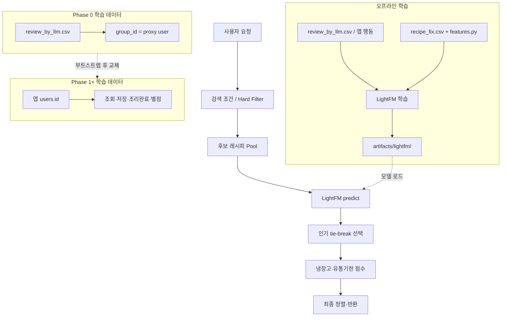
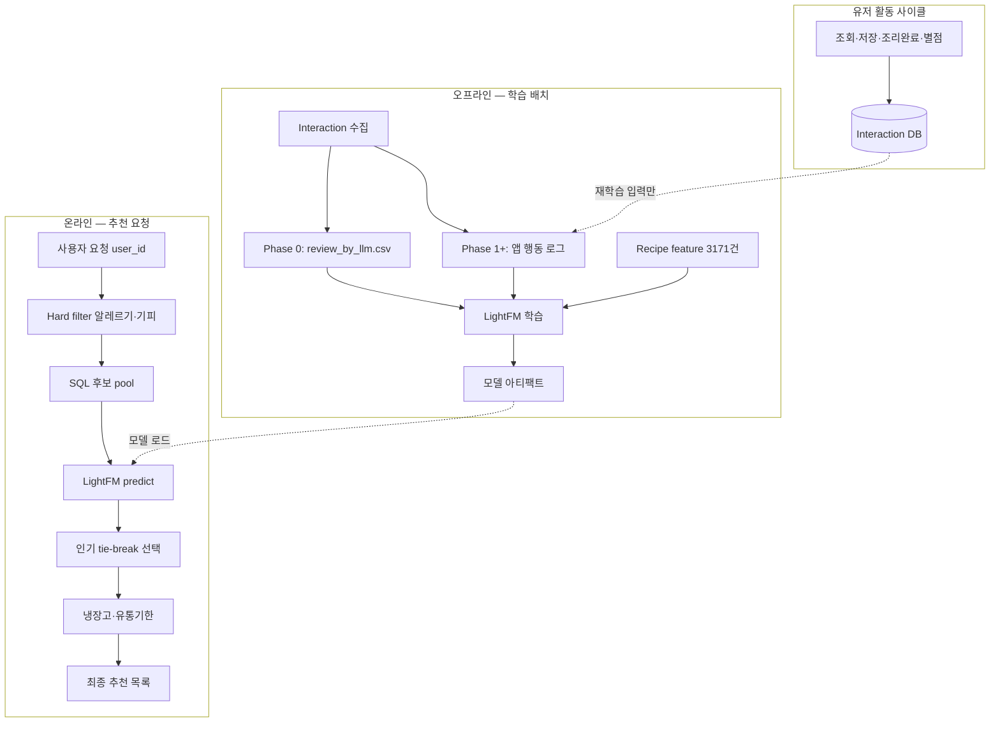

# LightFM 추천 시스템 설계

팀 공유용 문서. **ExtraTrees 아이템 점수 파이프라인은 폐기**하고, LightFM 하이브리드 추천을 **단일 ML 랭킹 엔진**으로 새로 구축한다.

**상태:** Phase 0 설계 확정 · 구현 착수 전  
**최종 갱신:** 2026-07-08

> **팀 공유:** 개인화 정의·런타임 예측·Phase별 전체 운영 흐름은 [§10. 개인화 추천 및 전체 운영 흐름](#10-개인화-추천-및-전체-운영-흐름) 참고.

---

## 1. 목표

1. **LightFM 하이브리드 추천**을 추천 시스템의 **유일한 ML 랭킹 엔진**으로 구축한다. (협업 필터링 + 아이템 feature)
2. 초기에는 **외부 사이트 리뷰 기반 가상 유저**로 부트스트랩하고, 서비스 운영 후 **실제 앱 사용자 행동 데이터**로 점진적으로 대체한다.
3. 기존 **런타임 추천 엔진**(`recommendation_service`)의 후보 검색·냉장고 매칭·유통기한 로직은 유지하고, **정렬 신호를 LightFM으로 교체**한다.
4. 기존 ExtraTrees 파이프라인(`ai/recommendation` 회귀 학습 → `recipe_recommendation_scored.csv` → Neo4j `reviewRankScore`)은 **사용하지 않는다.**

### 1.1. 폐기 대상 (명시)

| 구분 | 경로·산출물 | 처리 |
|------|-------------|------|
| ExtraTrees 학습 파이프라인 | `ai/recommendation/main.py`, `model.py`, `imputer.py`, `config.py` (회귀) | **폐기** (feature 모듈만 재사용) |
| 아이템 점수 산출물 | `recipe_recommendation_scored.csv`, `pipeline.joblib` | **미사용** |
| Neo4j 랭킹 점수 | `reviewRankScore` / `review_rank_score` | **서비스 정렬에서 제거** |
| 회귀 실험 기록 | `EXPERIMENT.md` ExtraTrees 섹션 | 참고용 보관, 신규 설계에 반영 안 함 |

---

## 2. 현재 시스템 (교체 전)

### 2.1. 프로덕션 추천 흐름 (AS-IS)

현재 API 추천은 **사용자별 개인화 없이** Neo4j `review_rank_score`로 정렬한다. 냉장고 매칭·유통기한은 사용자마다 다르다.

```text
사용자 요청
  → 검색 조건 (카테고리·난이도·조리시간 등)
  → SQL 후보 레시피 생성
  → Neo4j reviewRankScore 조회          ← 폐기 예정
  → 냉장고 매칭·유통기한 점수 계산
  → review_rank_score 우선 정렬         ← 폐기 예정
  → 최종 추천 목록
```

관련 코드:

| 역할 | 경로 |
|------|------|
| 추천 API·랭킹 | `app/backend/services/recommendation_service/recommendation_service.py` |
| 후보 검색 | `app/backend/services/recommendation_service/recipe_candidate_query.py` |
| Neo4j 점수 조회 (폐기) | `app/backend/services/recommendation_service/recipe_graph_service.py` |
| 추천 설정 | `app/backend/services/recommendation_service/recommend_config.py` |

### 2.2. 목표 추천 흐름 (TO-BE)

```text
사용자 요청
  → 검색 조건 (카테고리·난이도·조리시간 등)
  → SQL 후보 레시피 생성
  → LightFM predict(user_id, 후보_ids)    ← 신규 ML 랭킹
  → (선택) 인기·품질 메타 tie-break       ← raw 메타, ML 파이프라인 아님
  → 냉장고 매칭·유통기한 점수 계산
  → 최종 정렬
  → 추천 목록
```

**정렬 키 (목표, 우선순위):**

1. `lightfm_score` — (user, recipe) 개인화 선호 점수
2. `final_score` — 냉장고·유통기한 (기존 유지)
3. `display_match_rate` — 재료 매칭률 (기존 유지)
4. `recipe_id` — 동점 처리

---

## 3. 데이터 현황

### 3.1. 레시피

| 구분 | 건수 | 설명 |
|------|------|------|
| 전체 레시피 | 3,171 | `recipe_fix.csv` |
| 리뷰·별점·감성 집계 있음 | 563 | `REVIEW_RANK_SCORE` 등 메타 존재 (item feature 원천) |
| 리뷰 집계 없음 | 2,608 | item feature만으로 LightFM 예측 대상 |

> 리뷰 집계 컬럼은 **LightFM item feature 입력**으로 쓴다. 별도 회귀 모델로 impute하지 않는다.

### 3.2. Interaction 원천 — `review_by_llm.csv`

초기 LightFM 학습용 Interaction은 **앱 사용자 데이터가 아니다.**  
만개의레시피 등 **외부 사이트 크롤 리뷰**를 LLM 감성분석한 결과이며, `group_id`는 해당 사이트 작성자(`author_name`)를 매핑한 **가상 유저(proxy reviewer)** ID이다.

| 컬럼 | 설명 |
|------|------|
| `recipe_id` | 레시피 ID (`RCP_SNO`) |
| `group_id` | **가상 유저 ID** (proxy reviewer) |
| `star_count` | 원본 별점 (1~5) |
| `star_norm` | 정규화 별점 (-1 ~ 1) |
| `positive`, `negative` | LLM 감성 점수 |
| `content` | 리뷰 본문 |

**2026-07-08 기준 실측:**

| 지표 | 값 |
|------|-----|
| Interaction 수 | 1,007 |
| 가상 유저 (`group_id`) | 835 |
| 리뷰가 있는 레시피 | 577 |
| `recipe_fix` labeled와 겹치는 레시피 | 563 |
| User–Recipe 중복 | 0 (레시피당 유저 1리뷰) |
| Matrix density | 0.21% (835 × 577) |
| 리뷰 2건 이상인 가상 유저 | 67명 (8.0%) |
| 리뷰 5건 이상인 가상 유저 | 9명 |
| 리뷰 2건 이상 받은 레시피 | 209개 (36.2%) |

ETL·그래프 연동:

| 단계 | 경로 |
|------|------|
| 크롤 → review.csv | `etl/recipe/preprocessing/gatter_reviews.py` (`author_name` → `group_id`) |
| LLM 감성 | `etl/recipe/preprocessing_by_llm/analyze_sentiment_by_llm.py` |
| 레시피별 집계 → recipe_fix | `etl/recipe/preprocessing/recipe_review_aggregate_to_fix.py` |
| Neo4j Reviewer·REVIEWED | `etl/recipe/load_to_neo4j/loader.py` |

### 3.3. User 정의 (중요)

```text
Phase 0  proxy_user   = review_by_llm.csv 의 group_id   (외부 사이트 리뷰어, 부트스트랩용)
Phase 1  app_user     = PostgreSQL users.id            (실제 서비스 사용자)
```

- `group_id`는 **우리 앱 `users` 테이블과 ID·의미가 다르다.**
- Phase 0 데이터는 **처음 학습에만 사용**하며, 앱 사용자 데이터가 충분히 쌓이면 **교체하거나 제거**할 수 있다.
- 앱 신규 가입자는 Phase 0 모델의 user embedding이 없으므로, LightFM **item feature 기반 예측**으로 cold-start를 처리한다.

---

## 4. LightFM 적용 전략

### 4.1. 학습 데이터

초기 학습에는 **실제 Interaction만** 사용한다.

- 소스: `review_by_llm.csv`
- 단위: `(proxy_user_id=group_id, recipe_id, interaction_value)`
- 대상 레시피: 리뷰가 존재하는 약 **577개** (집계 labeled 563개와 대부분 일치)

Interaction 값은 실험으로 결정한다.

| 후보 | 정의 | 비고 |
|------|------|------|
| Binary | `1` (리뷰 존재) | `warp` / `bpr` loss에 적합 |
| 별점 | `star_norm` | 대부분 5점이라 변별 약함 |
| 감성 | `positive - negative` | 부정 리뷰 구분에 유리 |
| Hybrid | `star_norm + (positive - negative)` | 실험 1에서 비교 |
| 기타 | 가중 조합 | 실험 결과에 따름 |

### 4.2. Recipe Feature

Interaction은 ~600개 레시피에만 있지만, **아이템 feature는 전체 3,171개**에 대해 생성한다.

`ai/recommendation/features.py`의 feature 생성 로직을 **LightFM item feature**로 재사용한다.

- 카테고리 (요리 종류·방법·주재료)
- 재료 파생 (개수, others_ratio, commonness 등)
- 분량·조리시간
- 조회·스크랩 (인기)
- 평균 별점·감성 통계 (레시피 메타, 있는 경우만)

리뷰가 없는 레시피는 별점·감성 feature를 **0 또는 결측 플래그**로 처리한다. ExtraTrees impute는 하지 않는다.

### 4.3. 학습 → 예측 범위

```text
학습 Interaction     ~600개 레시피 × 1,007건
        ↓
     LightFM (하이브리드)
        ↓
예측 대상             3,171개 레시피 전체
```

리뷰가 없는 ~2,400개 레시피도 **아이템 feature**로 개인화 점수(또는 유저 cold-start 시 아이템 기반 점수)를 예측할 수 있다.

### 4.4. Prediction 활용 원칙

예측 점수는 **서비스 제공용으로만** 사용한다. **다시 Interaction Matrix에 넣어 재학습하지 않는다.**

```text
✅ 올바른 구조
실제 Interaction → LightFM 학습 → Prediction → 서비스 추천 점수

❌ 잘못된 구조
Prediction → Interaction Matrix 갱신 → 재학습
(자기 강화 오류 / self-reinforcement)
```

### 4.5. Cold-start 처리 (review_rank_score 대체)

ExtraTrees·`review_rank_score` 없이 cold-start를 처리하는 방법:

| 유저 상태 | LightFM 동작 | 보조 신호 |
|-----------|--------------|-----------|
| **Cold** (앱 신규, embedding 없음) | item feature만으로 `predict` | 인기(조회·스크랩) tie-break |
| **Warm** (행동 누적 + 재학습 완료) | user embedding + item feature + CF | 동일 |

confidence 블렌딩은 **선택 사항**이다. Phase 0에서는 대부분 cold-start이므로, item feature 기반 LightFM 점수가 사실상 주 랭킹 신호가 된다. Warm 유저가 늘면 confidence 가중을 도입할 수 있다.

```text
# Phase 0 (대부분 cold)
final_rank_key = lightfm_score

# Phase 1+ (warm 유저 존재 시, 선택)
final = lightfm_score × confidence + popularity_tiebreak × (1 - confidence)
```

`popularity_tiebreak`는 `recipe_fix`의 raw 조회·스크랩 수 등 **비ML 비즈니스 신호**이며, ExtraTrees 산출물이 아니다.

### 4.6. 장기 운영

```text
[Phase 0]  외부 리뷰 (group_id)  →  LightFM  →  Prediction  →  서비스
[Phase 1]  앱 Interaction 누적   →  proxy 제거·교체  →  재학습  →  서비스
[Phase 2]  앱 사용자 데이터만      →  지속 재학습
```

---

## 5. 목표 시스템 구조

### 5.1. 모듈 구성 (신규)

`ai/recommendation/`을 LightFM 전용으로 재구성한다.

| 모듈 | 역할 | 비고 |
|------|------|------|
| `features.py` | 레시피 item feature 생성 | **기존 유지·재사용** |
| `data_loader.py` | interaction + recipe 로드 | LightFM Dataset 입력용으로 개편 |
| `lightfm_dataset.py` | user/item id 매핑, sparse matrix | 신규 |
| `lightfm_train.py` | 학습·평가·아티팩트 저장 | 신규 |
| `lightfm_predict.py` | 서비스 연동용 predict API | 신규 |
| `config.py` | LightFM 하이퍼파라미터 | 회귀 설정 제거, LightFM 전용 |
| `artifacts/lightfm/` | 모델·매핑·메타데이터 | 신규 |

**폐기·미사용:** `main.py`, `model.py`, `imputer.py`, `evaluator.py`(회귀), `cross_validation.py`(회귀), `feature_ablation.py`(회귀), `seed_stability.py`(회귀)

### 5.2. 서비스 결합

```text
사용자 요청
  ↓
검색 조건 (카테고리·난이도·재료 등)
  ↓
후보 레시피 생성 (SQL, pool_size = limit × multiplier)
  ↓
LightFM predict(user_id, 후보 recipe_ids)
  ↓
(선택) 인기·품질 메타 tie-break
  ↓
냉장고 매칭·유통기한 (기존 로직)
  ↓
최종 추천
```



`recommendation_service.recommend_recipes()`에서 `fetch_review_rank_scores()` 호출을 **제거**하고, `_rank_candidates()`의 1순위 정렬 키를 `lightfm_score`로 교체한다.

### 5.3. 아티팩트 규격

```text
ai/recommendation/artifacts/lightfm/
  model.pkl              # LightFM 모델
  user_id_map.json       # app user_id ↔ internal id
  item_id_map.json       # recipe_id ↔ internal id
  metadata.json          # 학습 설정·Phase·interaction_source
```

`metadata.json` 필수 필드:

```json
{
  "interaction_source": "proxy_reviewer | app_user",
  "model_phase": "phase_0 | phase_1 | phase_2",
  "trained_at": "ISO8601",
  "loss": "warp",
  "interaction_count": 1007,
  "recipe_count": 3171
}
```

---

## 6. 설계 시 유의사항

### 6.1. CF 신호는 약함

가상 유저 92%가 리뷰 1건, density 0.21% 수준이라 **협업 필터링만으로는 기대를 낮춰야 한다.**  
Phase 0 LightFM의 실질 효과는 **아이템 feature 하이브리드 + cold-start 예측**에 가깝다.

### 6.2. 앱 사용자 ≠ proxy user

학습된 `group_id` embedding은 앱 신규 사용자에게 **직접 전이되지 않는다.**  
Phase 0 서비스에서는 **item feature 기반 predict**가 주 랭킹 신호다.

### 6.3. Neo4j reviewRankScore 의존 제거

- 서비스 정렬에서 `review_rank_score` / Neo4j `reviewRankScore` 조회를 **완전히 제거**한다.
- Neo4j의 Reviewer·REVIEWED 그래프는 **분석·시각화용**으로 유지할 수 있으나, 랭킹 입력으로 쓰지 않는다.
- `recipe_graph_service.fetch_review_rank_scores()`는 deprecate 후 삭제한다.

### 6.4. 평가 지표

회귀(Spearman on labeled 563건)는 **주 지표가 아니다.** LightFM 실험에서는:

- `precision@k`, `recall@k` (user 단위)
- Interaction sparsity 리포트
- Cold-start 시나리오 (신규 user / 신규 recipe / 둘 다)
- 다중 시드 또는 K-fold
- (보조) item feature only vs full hybrid 비교

### 6.5. 아티팩트 메타데이터

모델·점수 파일에 출처를 명시한다.

```text
interaction_source = proxy_reviewer | app_user
model_phase = phase_0 | phase_1
```

proxy 데이터 제거·교체 시 추적 가능하도록 한다.

---

## 7. 실험 순서

### 7.1. 사전 검증

| ID | 내용 | 확인 사항 |
|----|------|-----------|
| 0-1 | Cold-start | 신규 user / 신규 recipe / 둘 다 신규 시 predict 동작 |
| 0-2 | 서비스 결합 | 검색 → 후보 → LightFM → 최종. **후보 수가 과도하게 줄지 않는지** |
| 0-3 | Sparsity | user 수, recipe 수, interaction 수, density, tail 분포 |

### 7.2. 모델 실험

| ID | 내용 |
|----|------|
| 1 | Interaction target 비교 (Binary / 별점 / 감성 / Hybrid) + loss 정합성 |
| 2 | Recipe feature ablation (기존 12 feature + 추가·제거) |
| 3 | User feature (선호 카테고리·조리 이력 등) — **Phase 1 이후**, 앱 데이터 필요 |

### 7.3. 실험 산출물

| 산출물 | 위치 |
|--------|------|
| Sparsity 리포트 | `ai/recommendation/artifacts/lightfm/` |
| LightFM 모델 | `ai/recommendation/artifacts/lightfm/` |
| 실험 기록 | `ai/recommendation/LIGHTFM_EXPERIMENT.md` (신규) |
| 실험 노트북 | `ai/experiments/ML Based Collaborative Filtering with LightFM.ipynb` |

---

## 8. 핵심 설계 원칙 (요약)

1. **LightFM이 유일한 ML 랭킹 엔진**이다. ExtraTrees·`review_rank_score` 파이프라인은 사용하지 않는다.
2. **학습은 실제 Interaction만** 사용한다. (Phase 0: `review_by_llm.csv`, Phase 1+: 앱 행동)
3. **Prediction은 서비스 제공용**으로만 쓴다.
4. **Prediction을 학습 데이터로 재투입하지 않는다.**
5. **Phase 0 User는 가상 유저(`group_id`)** 이며, 앱 `users`와 구분한다.
6. **아이템 feature는 3,171건 전체**에 적용한다. 리뷰 없는 레시피는 impute 없이 feature 결측 처리.
7. **앱 사용자 데이터가 충분하면 proxy Interaction을 교체**하고 재학습한다.
8. **냉장고·유통기한 컨텍스트 점수**는 기존 로직을 유지한다.

---

## 9. 다음 작업 (팀 액션)

1. **실험 0-3** — `review_by_llm.csv` sparsity 리포트 작성·공유
2. **노트북 정리** — `ML Based Collaborative Filtering with LightFM.ipynb`에서 MovieLens 잔여 코드 제거, `review_by_llm` + `group_id` 기반 interaction matrix 구축
3. **실험 1** — interaction target·loss 조합 비교
4. **`ai/recommendation` LightFM 모듈 스캐폴딩** — `lightfm_dataset.py`, `lightfm_train.py`, `lightfm_predict.py`
5. **서비스 결합 POC** — `fetch_review_rank_scores` 제거, 후보 pool 내 LightFM 점수 정렬
6. **레거시 정리** — ExtraTrees 파이프라인 파일 deprecate 표시 또는 삭제
7. **문서** — `LIGHTFM_EXPERIMENT.md` 생성, `metadata.json` 규칙 확정

---

## 10. 개인화 추천 및 전체 운영 흐름

팀 공유용. LightFM 도입 후 **개인화가 무엇인지**, **런타임에 어떻게 반영되는지**, **오프라인 학습부터 서비스까지** 한 흐름으로 정리한다.

### 10.1. 개인화 추천이란

**개인화 추천**이란 동일한 검색 조건·후보 pool 안에서 **사용자마다 레시피 순위가 달라지는 것**이다.

| 계층 | 신호 | Phase | 역할 |
|------|------|-------|------|
| ML 랭킹 | LightFM predict | 전 Phase | **(user, recipe) 선호 점수** |
| 컨텍스트 | 냉장고 재료, 유통기한 | 현재~ | 하드 필터·가산 점수 (**이미 개인화됨**) |
| 취향 (명시) | 온보딩 선호·비선호·알레르기 | Phase 1+ | user feature / rule |
| 취향 (암시) | 조회·저장·조리완료·별점 | Phase 1+ | LightFM interaction |
| tie-break | 조회·스크랩 (raw 메타) | 전 Phase | 동점·cold-start 보조 (비ML) |

현재 `recommendation_service`는 `review_rank_score` 기준으로 **모든 사용자에게 동일한 순서**를 준다. LightFM 도입 후 `_rank_candidates()` 1순위를 **`lightfm_score`**로 교체한다.

**개인화가 아닌 것:**

- proxy `group_id`를 앱 유저에 그대로 매핑하는 것
- `predict` 점수를 interaction 테이블에 insert 후 재학습하는 것
- “이 유저가 이 레시피를 봤을 것이다”는 **가상 이벤트**를 학습 데이터로 쓰는 것
- ExtraTrees로 impute한 품질 점수를 랭킹에 쓰는 것

**개인화인 것:**

- 요청 시점에 `model.predict(user_id, recipe_ids)`로 **(유저, 레시피) 선호 점수**를 계산하고, 후보 pool **순위**를 바꾸는 것
- Warm 유저는 user embedding이 반영된 CF 신호로 순위가 달라지는 것

### 10.2. 점수 단위

| 구분 | 점수 단위 | 예시 |
|------|-----------|------|
| ~~`review_rank_score` (폐기)~~ | ~~레시피 1개당 1점~~ | ~~모든 유저 동일~~ |
| LightFM prediction | **(유저, 레시피) 쌍당 1점** | 유저 42 × 레시피 101 → 0.82, 유저 99 × 레시피 101 → 0.31 |

“3,171개 레시피 전체 예측”은 **레시피 전역 점수 1세트**가 아니라, **유저마다 최대 3,171개**의 (user, recipe) 점수를 낼 수 있다는 뜻이다.

### 10.3. 학습(오프라인) vs 서빙(런타임) 구분

```text
✅ 올바른 구조
실제 Interaction → LightFM 학습 → 모델 저장
                                    ↓
                              predict (서빙) → 추천 순위

❌ 잘못된 구조
predict → Interaction Matrix 갱신 → 재학습
(self-reinforcement / 자기 강화 오류)
```

| 용어 | 의미 | 저장 위치 |
|------|------|-----------|
| **Interaction** (학습용) | 실제 관측 행동: 리뷰, 조회, 저장, 조리완료 등 | 학습 배치 입력 |
| **Prediction** (서빙용) | 모델이 추정한 (user, recipe) 선호 점수 | 런타임 계산 또는 캐시 (재학습 입력 X) |

### 10.4. 예측 연산 — 배치 vs 런타임 (동일 API)

학습 직후 오프라인 평가와 서비스 런타임은 **같은 `model.predict(user_id, recipe_ids)`** 를 쓴다.

```python
# 전체 레시피 (실험·평가)
scores = model.predict(user_id, np.arange(3171))

# 후보 pool만 (서비스, 효율)
scores = model.predict(user_id, [101, 205, 388, ...])
```

| | 오프라인 (학습 직후) | 런타임 (서비스) |
|--|---------------------|-----------------|
| 연산 | `model.predict(user_id, recipe_ids)` | 동일 |
| 범위 | 전체 3,171개 가능 | 후보 pool (~`limit × pool_multiplier`) |
| 시점 | 평가·실험·(선택) 캐시 갱신 | API 요청 시 |

### 10.5. Cold-start vs Warm 유저

`predict` API는 동일하지만, **모델 내부에서 유저를 표현하는 방식**이 달라 점수가 달라진다.

| 유저 상태 | 조건 | 모델이 쓰는 신호 | 비고 |
|-----------|------|------------------|------|
| **Cold-start** | 앱 가입 직후, 행동 없음, 또는 재학습 전 | item feature | Phase 0 대부분 |
| **Warm** | 행동 누적 + **재학습 완료** | user embedding + item feature + CF | Phase 1+ |

Phase 0에서는 proxy `group_id`로 학습하므로 **앱 `users.id` embedding이 없다.** 앱 신규 유저는 사실상 cold-start이며, **아이템 feature 기반 LightFM 점수 + 냉장고 컨텍스트**가 주 추천 신호다.

**활동 발생 시 흐름:**

```text
[1] 유저 42가 레시피 101 저장        → interaction DB 기록 (학습용)
[2] (주기적) 배치 재학습             → 유저 42 embedding 생성·갱신
[3] 다음 추천 요청                   → predict(42, 후보_ids)  ← 같은 함수, 다른 점수
```

활동 자체가 런타임에 즉시 embedding을 바꾸지는 않는다. **재학습 배치** 이후 warm 상태가 된다.

### 10.6. 런타임 — 추천 요청 1건 타임라인

LightFM 결합 후 `recommend_recipes()` 기준 흐름이다.

```text
[1] API 요청 (user_id, 검색 조건)
      ↓
[2] Hard filter — 알레르기·기피 재료 레시피 제거
      ↓
[3] SQL 후보 생성 — 카테고리·난이도·조리시간 등 (pool_size = limit × multiplier)
      ↓
[4] LightFM predict(user_id, 후보 recipe_ids)
      → 각 (user, recipe) 선호 점수
      ↓
[5] (선택) 인기 tie-break — 조회·스크랩 raw 메타
      ↓
[6] 냉장고 매칭·유통기한 점수 (기존 final_score)
      ↓
[7] 최종 정렬·상위 limit개 반환
```

현재 구현에서는 [4] 단계가 없고, Neo4j `review_rank_score` 단독 정렬만 수행한다. 이를 **LightFM predict로 교체**한다.

**신호별 역할 (최종 정렬):**

| 신호 | 역할 |
|------|------|
| LightFM prediction | 후보 pool 내 **1순위 랭킹** (개인화) |
| 냉장고·유통기한 | **컨텍스트 점수** (기존 유지) |
| 인기 tie-break | **동점·cold-start 보조** (raw 메타, 선택) |

### 10.7. Phase별 전체 운영 흐름

#### Phase 0 — 부트스트랩 (현재 착수 단계)

```text
[오프라인 · 주기적]
  review_by_llm.csv (proxy user = group_id)
    → interaction matrix + recipe feature (3,171건)
    → LightFM 학습
    → 모델 아티팩트 저장 (ai/recommendation/artifacts/lightfm/)
    → (선택) 평가: predict(proxy_user, 3171)

[온라인 · 요청마다]
  앱 user_id (embedding 없음 = cold-start)
    → 후보 pool
    → predict(user_id, 후보) — item feature 위주
    → 냉장고·유통기한
    → 응답
```

#### Phase 1 — 앱 Interaction 누적

```text
[오프라인 · 주기적]
  앱 interaction (조회·저장·조리완료·별점) + proxy 교체/제거
    → 재학습
    → warm 유저 embedding 반영

[온라인 · 요청마다]
  warm 유저  → predict (CF + item feature)
  cold 유저  → predict (item feature 위주)
  (+ 온보딩 user feature 연동 검토)
```

#### Phase 2 — 앱 데이터만

```text
proxy interaction 완전 제거
  → 앱 사용자 행동만으로 지속 재학습
  → 개인화 품질이 CF 신호에 더 의존
```

### 10.8. 오프라인 ↔ 온라인 통합 다이어그램



### 10.9. 자주 하는 오해

| 오해 | 실제 |
|------|------|
| “학습 후 3,171개 점수 테이블을 한 번 만들면 끝” | **유저별** 점수 세트. 유저 활동·재학습 시 해당 유저 점수가 바뀜 |
| “활동하면 predict 방식이 바뀐다” | API는 동일. **재학습 후 user embedding**이 생겨 점수 값만 달라짐 |
| “개인화 = interaction을 추정해 DB에 넣는 것” | **런타임 predict로 순위만 변경**. 학습에는 실제 행동만 |
| “proxy 유저 embedding이 앱 유저에 전이된다” | **전이되지 않음**. Phase 0 앱 유저는 item feature 기반 predict |
| “ExtraTrees 점수를 fallback으로 쓴다” | **사용하지 않음**. cold-start는 LightFM item feature + raw 인기 tie-break |
| “리뷰 없는 레시피는 ML impute가 필요하다” | **impute 없음**. item feature 결측 처리로 LightFM이 직접 예측 |

### 10.10. 한 줄 요약 (팀 공유용)

> **개인화 추천**은 가상 interaction을 만들어 학습하는 것이 아니라, 실제 행동으로 학습한 LightFM 모델이 요청 시 `predict(user, recipe)`로 선호 점수를 내고 후보 순위를 바꾼다. ExtraTrees·`review_rank_score`는 쓰지 않으며, Phase 0은 proxy interaction으로 모델을 부트스트랩하고 item feature 기반 cold-start로 서비스한다. Phase 1+에서 앱 행동이 쌓이면 진짜 CF 기반 개인화가 강해진다.

---

## 11. 참고 링크

| 문서·코드 | 설명 |
|-----------|------|
| `ai/recommendation/features.py` | item feature 생성 (LightFM 입력으로 재사용) |
| `ai/experiments/ML Based Collaborative Filtering with LightFM.ipynb` | LightFM 실험 노트북 |
| [LightFM 문서](https://making.lyst.com/lightfm/docs/home.html) | 라이브러리 공식 문서 |
| `storage/processed/recipe/review_by_llm.csv` | Phase 0 interaction 원천 |
| `storage/processed/recipe/recipe_fix.csv` | 레시피 마스터·메타 feature 원천 |
