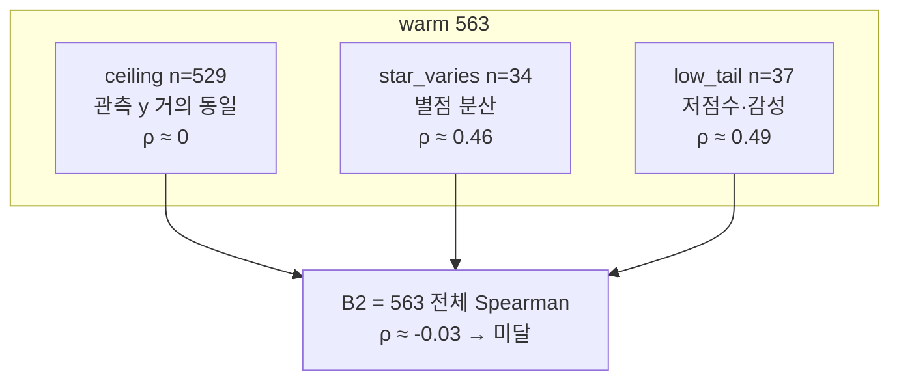

# LightFM 실험 기록

**읽는 법:** §1~26 = **레거시** (Track A·Spearman·bar·감성 곱 — 코드에서 제거, 이력만 보존).  
**현재 축:** §28~29 — y\*=`n_star5≥2`, 추천 점수=`s_pref`, Go=**R0~R3**.  
헌장: [`METRICS.md`](METRICS.md) · CV: `python evaluation.py` → `outputs/prefer_eval_report.json`.

## 실험 1 — `star_sentiment_sum` + WARP (100 epoch)

**일자:** 2026-07-09  
**노트북:** `LightFM_Model.ipynb` (Docker JupyterLab)  
**목적:** 기본 파이프라인 동작 확인 + `star_sentiment_sum` interaction target의 오프라인 성능 1차 측정

### 설정


| 항목                 | 값                                                |
| ------------------ | ------------------------------------------------ |
| interaction target | `star_sentiment_sum` (`star` + `sentiment`, 연속값) |
| loss               | `warp`                                           |
| seed               | 42                                               |
| train/test split   | 0.8 / 0.2 (`random_train_test_split`)            |
| epochs             | 100                                              |
| num_threads        | 2                                                |
| Go/No-Go 기준        | test `precision@5 >= 0.05`                       |


**데이터**


| 항목                 | 값     |
| ------------------ | ----- |
| users              | 821   |
| items              | 563   |
| interactions (nnz) | 990   |
| train nnz          | 792   |
| test nnz           | 198   |
| density            | 0.21% |


### 결과


#### Test set (Unit 8 — 최종 평가)


| 지표           | 값      |
| ------------ | ------ |
| precision@5  | 0.0079 |
| precision@10 | 0.0056 |
| recall@5     | 0.0365 |
| recall@10    | 0.0506 |


**판정:** No-Go (`precision@5` 0.0079 < 0.05)

#### Train set (Unit 7 — epoch별 모니터링)

Unit 7은 **train** matrix 기준 `precision@5`를 출력한다.


| 구간          | train precision@5  |
| ----------- | ------------------ |
| epoch 1     | ~0.01              |
| epoch 50 전후 | 상승 추세              |
| epoch 89~99 | **0.2227** (수렴·정체) |
| epoch 100   | 0.2224             |


→ train 지표는 0.22까지 올라가지만, **test 지표는 0.008 수준**으로 큰 격차가 있음.

### 해석

1. **과적합 의심:** 100 epoch에서 train precision@5는 0.22대에 수렴했으나 test precision@5는 0.008 미만. epoch를 늘린 효과는 train memorization에 가깝다.
2. **loss/target 불일치:** `warp`는 암묵적 피드백(이진 positive)용인데, interaction은 연속값(`star + sentiment`). 설계 문서 §4.1 기준으로 Binary target + warp 조합이 더 정합적이다.
3. **데이터 희소성:** 821 users × 563 items, density 0.21% — CF 신호가 약해 일반화가 어렵다.
4. **모니터링 지표 한계:** Unit 7의 epoch 로그는 train 기준이라, 수렴처럼 보여도 test 성능과 무관할 수 있다.


### 원본 리포트 (Unit 9)

```json
{
  "target_mode": "star_sentiment_sum",
  "seed": 42,
  "test_ratio": 0.2,
  "epochs": 100,
  "loss": "warp",
  "matrix": {
    "num_users": 821,
    "num_items": 563,
    "nnz": 990,
    "train_nnz": 792,
    "test_nnz": 198
  },
  "metrics": {
    "precision@5": 0.00786516908556223,
    "precision@10": 0.00561797758564353,
    "recall@5": 0.03651685393258427,
    "recall@10": 0.05056179775280899
  },
  "decision": {
    "go": false,
    "criterion": "precision@5 >= 0.05"
  }
}
```


### 다음 실험 (실험 1 후속)

설계 문서의 interaction target 비교를 이어서 진행한다.


| 우선순위 | 내용                                              |
| ---- | ----------------------------------------------- |
| 1    | **Binary(1)** + `warp` — loss/target 정합성 확인     |
| 2    | epoch 수 축소(30~50) + **test** precision 모니터링     |
| 3    | `sentiment` only / `star` only / `star_norm` 비교 |
| 4    | Unit 10 baseline(인기 기반) 대비 비교                   |


---


## 실험 2 — interaction 가중치·epoch 비교

**일자:** 2026-07-09  
**노트북:** `LightFM_Model.ipynb` (Docker JupyterLab)  
**목적:** 실험 1 후속 — `calc_interaction_value` 가중치(별점 only / 감성 only / 합산)와 epoch 수(30·50·100)가 test 성능에 미치는 영향 비교

### 공통 설정

실험 1과 동일 (seed 42, test 0.2, loss `warp`, Go/No-Go `precision@5 >= 0.05`).  
interaction은 `calc_interaction_value(star, sentiment, star_weight, sentiment_weight)`로 조절했다.  
리포트 JSON의 `target_mode`는 모두 `star_sentiment_sum`으로 남아 있으나, 실제 값은 아래 가중치로 구분한다.


| 항목                  | 값               |
| ------------------- | --------------- |
| users / items / nnz | 821 / 563 / 990 |
| train / test nnz    | 792 / 198       |
| density             | 0.21%           |


### 변형별 결과 (Test set)


| #   | interaction        | star_w | sent_w | epochs | precision@5 | precision@10 | recall@5   | recall@10  | 판정    |
| --- | ------------------ | ------ | ------ | ------ | ----------- | ------------ | ---------- | ---------- | ----- |
| 2a  | **sentiment only** | 0      | 1      | 100    | **0.0101**  | 0.0067       | **0.0449** | 0.0618     | No-Go |
| 2b  | **star only**      | 1      | 0      | 100    | 0.0079      | 0.0062       | 0.0365     | 0.0562     | No-Go |
| 2c  | star + sentiment   | 1      | 1      | 50     | 0.0079      | 0.0062       | 0.0365     | 0.0562     | No-Go |
| 2d  | star + sentiment   | 1      | 1      | 30     | 0.0090      | **0.0090**   | 0.0421     | **0.0801** | No-Go |
| (1) | star + sentiment   | 1      | 1      | 100    | 0.0079      | 0.0056       | 0.0365     | 0.0506     | No-Go |


→ 4개 변형 모두 Go 기준(0.05) 미달.

### Train 모니터링 (Unit 7 — train precision@5)


| 변형                 | epochs | train precision@5 (후반)         |
| ------------------ | ------ | ------------------------------ |
| 2c star+sentiment  | 50     | epoch 40~50: **0.207 → 0.218** |
| 2d star+sentiment  | 30     | epoch 23~30: **0.137 → 0.164** |
| (1) star+sentiment | 100    | epoch 89~100: **0.223** (실험 1) |


→ epoch를 줄여도 train 지표는 여전히 0.14~0.22대. test와의 격차는 실험 1과 동일 패턴.

### 해석

1. **감성 only가 별점 only·합산보다 test에서 소폭 우세:** 2a precision@5(0.0101) > 2d(0.0090) > 2b·2c·실험1(0.0079). 합산(2c)은 별점 only(2b)와 test 지표가 사실상 동일 → 현재 스케일에서 **별점이 interaction 신호를 지배**하고 감성 기여는 미미하거나 상쇄된다.
2. **epoch 축소만으로는 test 이득 없음:** 50·100 epoch 합산(2c vs 실험1) test 지표 동일. 30 epoch(2d)는 precision@5·recall@10이 약간 올라 **과적합 완화 가능성**은 있으나, train 0.16 vs test 0.009 격차는 여전히 큼.
3. **가중치 비율 튜닝 여지:** 단순 합(1:1) 대신 `sentiment_weight` 상향·정규화·클리핑 등으로 스케일을 맞추면 합산 설계의 의미를 재검증할 수 있다. 2a 결과상 **감성 단독 신호는 CF에 더 유용**할 수 있다.
4. **loss/target 정합성 미해결:** 연속 interaction + `warp` 조합은 실험 1 지적과 동일. Binary(1) + warp는 아직 미실시.


### 검토 사항 (미결)

- epoch 변경만으로는 Go 달성 불가 — early stopping을 **test** precision 기준으로 넣을지 검토
- interaction 설계: sentiment only vs 가중 합산 vs 비율 보정(`star_norm` 등) 추가 비교
- Unit 10 인기 기반 baseline 대비 우위 여부


### 원본 리포트 요약

**2a — sentiment only (100 epoch)**

```json
{"metrics": {"precision@5": 0.0101, "precision@10": 0.0067, "recall@5": 0.0449, "recall@10": 0.0618}, "decision": {"go": false}}
```

**2b — star only (100 epoch)** — 실험 1 test 지표와 동일

```json
{"metrics": {"precision@5": 0.0079, "precision@10": 0.0062, "recall@5": 0.0365, "recall@10": 0.0562}, "decision": {"go": false}}
```

**2c — star+sentiment (50 epoch)** — 2b와 test 지표 동일

```json
{"metrics": {"precision@5": 0.0079, "precision@10": 0.0062, "recall@5": 0.0365, "recall@10": 0.0562}, "decision": {"go": false}}
```

**2d — star+sentiment (30 epoch)**

```json
{"metrics": {"precision@5": 0.0090, "precision@10": 0.0090, "recall@5": 0.0421, "recall@10": 0.0801}, "decision": {"go": false}}
```


### 다음 실험 (실험 2 후속)


| 우선순위 | 내용                                                    |
| ---- | ----------------------------------------------------- |
| 1    | **Binary(1)** + `warp` — loss/target 정합성 (실험 1·2 미실시) |
| 2    | `sentiment_weight` 스케일 보정 후 star+sentiment 재비교        |
| 3    | test precision 기준 early stopping (epoch 30 전후 탐색)     |
| 4    | Unit 10 baseline(인기 기반) 대비 비교                         |


---


## 실험 3 — 인기 메타 아이템 피처 ablation (조회수·스크랩수)

**일자:** 2026-07-09  
**노트북:** `LightFM_Model.ipynb` (Docker JupyterLab)  
**목적:** `recipe_fix.csv`의 인기 메타(`INQ_CNT`→`view_count`, `SRAP_CNT`→`scrap_count`)를 아이템 피처에 포함할지 여부를 ablation으로 비교

### 공통 설정

실험 2d와 동일한 interaction·학습 설정.


| 항목               | 값                          |
| ---------------- | -------------------------- |
| interaction      | star + sentiment (1:1)     |
| loss             | `warp`                     |
| seed             | 42                         |
| train/test split | 0.8 / 0.2                  |
| epochs           | 30                         |
| Go/No-Go 기준      | test `precision@5 >= 0.05` |


**데이터 (matrix)**


| 항목                  | 값               |
| ------------------- | --------------- |
| users / items / nnz | 821 / 563 / 990 |
| train / test nnz    | 792 / 198       |
| density             | 0.21%           |


**ablation 방법:** Unit 2 recipe 전처리에서 `column_rename_map`·`columns_to_drop`으로 `INQ_CNT`/`SRAP_CNT` 포함 여부를 바꿨다.


| #     | view_count (`INQ_CNT`) | scrap_count (`SRAP_CNT`) |
| ----- | ---------------------- | ------------------------ |
| 3a    | ✓                      | ✗ (제외)                   |
| 3b    | ✗ (제외)                 | ✓                        |
| 3c    | ✗ (제외)                 | ✗ (제외)                   |
| 기준 2d | ✓                      | ✓                        |


### 변형별 결과 (Test set)


| #           | view | scrap | precision@5 | precision@10 | recall@5 | recall@10  | 판정    |
| ----------- | ---- | ----- | ----------- | ------------ | -------- | ---------- | ----- |
| **2d (기준)** | ✓    | ✓     | **0.0090**  | **0.0090**   | 0.0421   | **0.0801** | No-Go |
| 3a          | ✓    | ✗     | **0.0090**  | 0.0084       | 0.0421   | 0.0787     | No-Go |
| 3b          | ✗    | ✓     | 0.0079      | 0.0067       | 0.0337   | 0.0618     | No-Go |
| 3c          | ✗    | ✗     | 0.0079      | 0.0079       | 0.0365   | 0.0730     | No-Go |


→ 4개 변형 모두 Go 기준(0.05) 미달. **view+scrap 모두 포함(2d) 또는 view만 유지(3a)일 때 precision@5 최고.**

### Train 모니터링 (Unit 7 — train precision@5)

3c(현재 노트북 저장 상태) 기준: epoch 30에서 train precision@5 **0.167**.  
실험 2d와 동일하게 train·test 격차가 큼.

### 해석

1. **조회수가 스크랩수보다 기여도가 큼:** view 제외(3b) 시 precision@5가 0.0090→0.0079로 하락. scrap만 제외(3a)는 2d와 precision@5 동일(0.0090), recall@10만 소폭 감소(0.080→0.079).
2. **둘 다 제외(3c)해도 view만 제외(3b)만큼 나쁘지 않음:** 3c recall@10(0.073)은 3b(0.062)보다 높아, 두 메타를 함께 넣었을 때 상호작용·스케일 이슈 가능성은 있으나 test precision 기준 이득은 없음.
3. **절대 성능은 여전히 미달:** 최선(2d·3a)도 precision@5 0.009 — Go(0.05)의 약 18% 수준.
4. **재현성 주의:** 실행 계획상 `build_item_features`→`fit_partial` 연결은 아직 미완(`LIGHTFM_NOTEBOOK_EXECUTION_PLAN.md` E2). 순수 CF만 돌린 경우 recipe 컬럼 제거만으로 test 지표가 달라지지 않아야 하므로, **hybrid 학습 경로 사용 여부를 실험 기록에 명시**하고 `build_item_features` 연결 후 동일 ablation을 재검증하는 것이 좋다. 현재 노트북 최종 상태는 3c(둘 다 제외)이며 Unit 8 출력과 일치한다.


### 원본 리포트 요약

**3a — scrap_count 제외 (view 유지)**

```json
{"metrics": {"precision@5": 0.0090, "precision@10": 0.0084, "recall@5": 0.0421, "recall@10": 0.0787}, "decision": {"go": false}}
```

**3b — view_count 제외 (scrap 유지)**

```json
{"metrics": {"precision@5": 0.0079, "precision@10": 0.0067, "recall@5": 0.0337, "recall@10": 0.0618}, "decision": {"go": false}}
```

**3c — view + scrap 모두 제외** (현재 노트북 상태)

```json
{"metrics": {"precision@5": 0.0079, "precision@10": 0.0079, "recall@5": 0.0365, "recall@10": 0.0730}, "decision": {"go": false}}
```


### 다음 실험 (실험 3 후속)


| 우선순위 | 내용                                                        |
| ---- | --------------------------------------------------------- |
| 1    | `build_item_features` 연결 후 동일 ablation 재실행 (hybrid 경로 명시) |
| 2    | **Binary(1)** + `warp` — loss/target 정합성                  |
| 3    | view_count 단독 vs scrap_count 단독 vs 둘 다 (정규화·binning 포함)   |
| 4    | Unit 10 baseline(인기 기반) 대비 비교                             |


---


## 실험 4 — 레시피 item feature 컬럼 ablation (hybrid)

**일자:** 2026-07-09  
**노트북:** `LightFM_Model.ipynb` (Docker nbconvert)  
**스크립트:** `run_recipe_ablation.ps1`  
**목적:** hybrid 학습에서 레시피 컬럼을 1개씩 제외했을 때 test 성능 변화(영향도) 측정

### 공통 설정


| 항목          | 값                                              |
| ----------- | ---------------------------------------------- |
| mode        | hybrid (`build_item_features` + `fit_partial`) |
| interaction | star + sentiment (1:1)                         |
| loss        | `warp`                                         |
| seed        | 42                                             |
| epochs      | 30                                             |
| 고정 포함       | `view_count`, `scrap_count` (ablation 대상 아님)   |


### 변형별 결과 (Test set)


| run                      | excluded         | precision@5 | precision@10 | recall@5 | recall@10 | Δprecision@5 | unique_features |
| ------------------------ | ---------------- | ----------- | ------------ | -------- | --------- | ------------ | --------------- |
| baseline                 | (none)           | 0.0101      | 0.0084       | 0.0506   | 0.0815    | 0.0000       | 2382            |
| exclude_recipe_name      | recipe_name      | 0.0067      | 0.0073       | 0.0292   | 0.0685    | -0.0034      | 1819            |
| exclude_cooking_method   | cooking_method   | 0.0045      | 0.0056       | 0.0225   | 0.0562    | -0.0056      | 2369            |
| exclude_cooking_category | cooking_category | 0.0112      | 0.0090       | 0.0534   | 0.0784    | 0.0011       | 2370            |
| exclude_main_ingred      | main_ingred      | 0.0124      | 0.0096       | 0.0590   | 0.0885    | 0.0022       | 2366            |
| exclude_dishes           | dishes           | 0.0067      | 0.0084       | 0.0337   | 0.0728    | -0.0034      | 2376            |
| exclude_cooking_level    | cooking_level    | 0.0045      | 0.0051       | 0.0225   | 0.0506    | -0.0056      | 2379            |
| exclude_cooking_time     | cooking_time     | 0.0079      | 0.0079       | 0.0393   | 0.0713    | -0.0022      | 2374            |
| exclude_aliases          | aliases          | 0.0101      | 0.0096       | 0.0478   | 0.0927    | 0.0000       | 1908            |
| exclude_ingredients      | ingredients      | 0.0112      | 0.0090       | 0.0534   | 0.0871    | 0.0011       | 1870            |
| exclude_recipe_kind      | recipe_kind      | 0.0090      | 0.0079       | 0.0421   | 0.0713    | -0.0011      | 2364            |
| exclude_others_count     | others_count     | 0.0045      | 0.0073       | 0.0225   | 0.0657    | -0.0056      | 2378            |
| exclude_basic_count      | basic_count      | 0.0045      | 0.0073       | 0.0225   | 0.0702    | -0.0056      | 2379            |


→ Δprecision@5 = run − baseline. **양수** = 제외 시 test가 올라감(해당 컬럼이 노이즈/과적합 가능).

### 해석

**제외 시 precision@5 상승 (노이즈·과적합 후보):**

- `main_ingred` (Δ=0.0022)
- `cooking_category` (Δ=0.0011)
- `ingredients` (Δ=0.0011)

**제외 시 precision@5 하락 (유지 가치 후보):**

- `cooking_method` (Δ=-0.0056)
- `cooking_level` (Δ=-0.0056)
- `others_count` (Δ=-0.0056)


### 원본 리포트

JSON: `runs/baseline.json`, `runs/exclude_<column>.json`

**baseline**

```json
{
  "data_files": {
    "review": "review_by_llm.csv",
    "recipe": "recipe_fix.csv",
    "ingredient_alias": "recipe_ingredient_alias.csv"
  },
  "mode": "hybrid",
  "target_mode": "star_sentiment_sum",
  "excluded_recipe_columns": [],
  "seed": 42,
  "test_ratio": 0.2,
  "epochs": 30,
  "loss": "warp",
  "matrix": {
    "num_users": 821,
    "num_items": 563,
    "nnz": 990,
    "train_nnz": 792,
    "test_nnz": 198,
    "item_feature_nnz": 17284,
    "unique_features": 2382
  },
  "metrics": {
    "precision@5": 0.010112359188497066,
    "precision@10": 0.008426966145634651,
    "recall@5": 0.05056179775280899,
    "recall@10": 0.08146067415730338
  },
  "decision": {
    "go": false,
    "criterion": "precision@5 >= 0.05"
  }
}
```

---


## 실험 5 — 2컬럼 조합 + 제거후보 3개 동시 제외 (hybrid)

**일자:** 2026-07-09  
**노트북:** `LightFM_Model.ipynb` (Docker nbconvert)  
**스크립트:** `run_experiment5.ps1`  
**목적:** 제거 후보 포함 2컬럼 조합 ablation + 제거 후보 3개 동시 제외

### 공통 설정


| 항목            | 값                                      |
| ------------- | -------------------------------------- |
| mode          | hybrid                                 |
| interaction   | star + sentiment (1:1)                 |
| loss          | `warp`                                 |
| seed / epochs | 42 / 30                                |
| 비교 기준         | 실험 4 baseline precision@5 = **0.0101** |


### Phase 5a — 코어 조합 (Remove×Remove, Remove×Keep)


| label                                   | excluded                         | precision@5 | precision@10 | recall@5 | recall@10 | Δp@5 vs exp4 | unique_features |
| --------------------------------------- | -------------------------------- | ----------- | ------------ | -------- | --------- | ------------ | --------------- |
| exp5_5a_cooking_category_basic_count    | cooking_category, basic_count    | 0.0112      | 0.0073       | 0.0447   | 0.0615    | +0.0011      | 2367            |
| exp5_5a_cooking_category_cooking_level  | cooking_category, cooking_level  | 0.0090      | 0.0073       | 0.0334   | 0.0615    | -0.0011      | 2367            |
| exp5_5a_cooking_category_cooking_method | cooking_category, cooking_method | 0.0101      | 0.0067       | 0.0506   | 0.0629    | +0.0000      | 2357            |
| exp5_5a_cooking_category_ingredients    | cooking_category, ingredients    | 0.0135      | 0.0107       | 0.0646   | 0.1039    | +0.0034      | 1858            |
| exp5_5a_cooking_category_others_count   | cooking_category, others_count   | 0.0124      | 0.0084       | 0.0548   | 0.0728    | +0.0023      | 2366            |
| exp5_5a_ingredients_basic_count         | ingredients, basic_count         | 0.0101      | 0.0101       | 0.0506   | 0.0983    | +0.0000      | 1867            |
| exp5_5a_ingredients_cooking_level       | ingredients, cooking_level       | 0.0124      | 0.0079       | 0.0590   | 0.0758    | +0.0023      | 1867            |
| exp5_5a_ingredients_cooking_method      | ingredients, cooking_method      | 0.0169      | 0.0112       | 0.0815   | 0.0966    | +0.0068      | 1857            |
| exp5_5a_ingredients_others_count        | ingredients, others_count        | 0.0112      | 0.0084       | 0.0534   | 0.0787    | +0.0011      | 1866            |
| exp5_5a_main_ingred_basic_count         | main_ingred, basic_count         | 0.0124      | 0.0079       | 0.0562   | 0.0730    | +0.0023      | 2363            |
| exp5_5a_main_ingred_cooking_category    | main_ingred, cooking_category    | 0.0067      | 0.0067       | 0.0309   | 0.0601    | -0.0034      | 2354            |
| exp5_5a_main_ingred_cooking_level       | main_ingred, cooking_level       | 0.0101      | 0.0090       | 0.0478   | 0.0843    | +0.0000      | 2363            |
| exp5_5a_main_ingred_cooking_method      | main_ingred, cooking_method      | 0.0124      | 0.0096       | 0.0590   | 0.0843    | +0.0023      | 2353            |
| exp5_5a_main_ingred_ingredients         | main_ingred, ingredients         | 0.0124      | 0.0101       | 0.0590   | 0.0983    | +0.0023      | 1854            |
| exp5_5a_main_ingred_others_count        | main_ingred, others_count        | 0.0101      | 0.0084       | 0.0433   | 0.0770    | +0.0000      | 2362            |


### Phase 5b — Remove × Secondary


| label                                 | excluded                       | precision@5 | precision@10 | recall@5 | recall@10 | Δp@5 vs exp4 | unique_features |
| ------------------------------------- | ------------------------------ | ----------- | ------------ | -------- | --------- | ------------ | --------------- |
| exp5_5b_cooking_category_aliases      | cooking_category, aliases      | 0.0135      | 0.0101       | 0.0646   | 0.0938    | +0.0034      | 1896            |
| exp5_5b_cooking_category_cooking_time | cooking_category, cooking_time | 0.0056      | 0.0062       | 0.0253   | 0.0545    | -0.0045      | 2362            |
| exp5_5b_cooking_category_dishes       | cooking_category, dishes       | 0.0112      | 0.0096       | 0.0534   | 0.0840    | +0.0011      | 2364            |
| exp5_5b_cooking_category_recipe_kind  | cooking_category, recipe_kind  | 0.0079      | 0.0079       | 0.0348   | 0.0713    | -0.0022      | 2352            |
| exp5_5b_cooking_category_recipe_name  | cooking_category, recipe_name  | 0.0067      | 0.0090       | 0.0337   | 0.0826    | -0.0034      | 1807            |
| exp5_5b_ingredients_aliases           | ingredients, aliases           | 0.0112      | 0.0096       | 0.0534   | 0.0882    | +0.0011      | 1396            |
| exp5_5b_ingredients_cooking_time      | ingredients, cooking_time      | 0.0124      | 0.0079       | 0.0590   | 0.0758    | +0.0023      | 1862            |
| exp5_5b_ingredients_dishes            | ingredients, dishes            | 0.0135      | 0.0084       | 0.0646   | 0.0815    | +0.0034      | 1864            |
| exp5_5b_ingredients_recipe_kind       | ingredients, recipe_kind       | 0.0101      | 0.0073       | 0.0478   | 0.0702    | +0.0000      | 1852            |
| exp5_5b_ingredients_recipe_name       | ingredients, recipe_name       | 0.0124      | 0.0079       | 0.0590   | 0.0758    | +0.0023      | 1307            |
| exp5_5b_main_ingred_aliases           | main_ingred, aliases           | 0.0112      | 0.0107       | 0.0534   | 0.0994    | +0.0011      | 1892            |
| exp5_5b_main_ingred_cooking_time      | main_ingred, cooking_time      | 0.0079      | 0.0073       | 0.0365   | 0.0657    | -0.0022      | 2358            |
| exp5_5b_main_ingred_dishes            | main_ingred, dishes            | 0.0101      | 0.0090       | 0.0506   | 0.0854    | +0.0000      | 2360            |
| exp5_5b_main_ingred_recipe_kind       | main_ingred, recipe_kind       | 0.0101      | 0.0084       | 0.0478   | 0.0815    | +0.0000      | 2348            |
| exp5_5b_main_ingred_recipe_name       | main_ingred, recipe_name       | 0.0112      | 0.0101       | 0.0489   | 0.0896    | +0.0011      | 1803            |


### Phase 5c — 제거 후보 3개 동시 제외


| label              | excluded                                   | precision@5 | precision@10 | recall@5 | recall@10 | Δp@5 vs exp4 | unique_features |
| ------------------ | ------------------------------------------ | ----------- | ------------ | -------- | --------- | ------------ | --------------- |
| exp5_5c_all_remove | main_ingred, cooking_category, ingredients | 0.0146      | 0.0096       | 0.0657   | 0.0882    | +0.0045      | 1842            |


### 해석

- **최고 precision@5:** `exp5_5a_ingredients_cooking_method` (0.0169, excluded: ingredients, cooking_method)
- **최저 precision@5:** `exp5_5b_cooking_category_cooking_time` (0.0056)

**exp4 baseline 대비 Δprecision@5 상위:**

- `ingredients, cooking_method` (+0.0068)
- `main_ingred, cooking_category, ingredients` (+0.0045)
- `cooking_category, ingredients` (+0.0034)

**exp4 baseline 대비 Δprecision@5 하위 (제거 시 손실 큼):**

- `cooking_category, cooking_time` (-0.0045)
- `main_ingred, cooking_category` (-0.0034)
- `cooking_category, recipe_name` (-0.0034)

**5c (3개 동시 제외):**

- 3개 동시 제외 precision@5 **0.0146** (exp4 baseline 0.0101, exp4 main_ingred 단독 0.0124)


### 원본 리포트 (baseline)

```json
{
  "data_files": {
    "review": "review_by_llm.csv",
    "recipe": "recipe_fix.csv",
    "ingredient_alias": "recipe_ingredient_alias.csv"
  },
  "mode": "hybrid",
  "target_mode": "star_sentiment_sum",
  "excluded_recipe_columns": [],
  "seed": 42,
  "test_ratio": 0.2,
  "epochs": 30,
  "loss": "warp",
  "matrix": {
    "num_users": 821,
    "num_items": 563,
    "nnz": 990,
    "train_nnz": 792,
    "test_nnz": 198,
    "item_feature_nnz": 17284,
    "unique_features": 2382
  },
  "metrics": {
    "precision@5": 0.010112359188497066,
    "precision@10": 0.008988764137029648,
    "recall@5": 0.05056179775280899,
    "recall@10": 0.08258426966292134
  },
  "decision": {
    "go": false,
    "criterion": "precision@5 >= 0.05"
  }
}
```

---


## 실험 6 — ingredients+cooking_method 제외 최종 검증 (hybrid)

**일자:** 2026-07-09  
**노트북:** `LightFM_Model.ipynb` (Docker nbconvert)  
**스크립트:** `run_experiment6.ps1`  
**목적:** `ingredients`+`cooking_method` 제외 채택 전 seed 재현성·대안·모순 검증

### 공통 설정


| 항목          | 값                          |
| ----------- | -------------------------- |
| mode        | hybrid                     |
| interaction | star + sentiment (1:1)     |
| loss        | `warp`                     |
| seeds       | 42, 123, 456               |
| epochs      | 30                         |
| runs        | 3 seed × 5 config = **15** |


### 테이블 A — seed × config


| seed | config              | excluded                                   | precision@5 | recall@5 | Δp@5 vs seed baseline |
| ---- | ------------------- | ------------------------------------------ | ----------- | -------- | --------------------- |
| 42   | baseline            | (none)                                     | 0.0090      | 0.0449   | +0.0000               |
| 42   | candidate           | ingredients, cooking_method                | 0.0169      | 0.0772   | +0.0079               |
| 42   | alt_5c              | main_ingred, cooking_category, ingredients | 0.0124      | 0.0590   | +0.0034               |
| 42   | ctrl_ingredients    | ingredients                                | 0.0112      | 0.0534   | +0.0022               |
| 42   | ctrl_cooking_method | cooking_method                             | 0.0034      | 0.0169   | -0.0056               |
| 123  | baseline            | (none)                                     | 0.0069      | 0.0305   | +0.0000               |
| 123  | candidate           | ingredients, cooking_method                | 0.0057      | 0.0286   | -0.0011               |
| 123  | alt_5c              | main_ingred, cooking_category, ingredients | 0.0103      | 0.0514   | +0.0034               |
| 123  | ctrl_ingredients    | ingredients                                | 0.0080      | 0.0400   | +0.0011               |
| 123  | ctrl_cooking_method | cooking_method                             | 0.0080      | 0.0362   | +0.0011               |
| 456  | baseline            | (none)                                     | 0.0067      | 0.0333   | +0.0000               |
| 456  | candidate           | ingredients, cooking_method                | 0.0056      | 0.0278   | -0.0011               |
| 456  | alt_5c              | main_ingred, cooking_category, ingredients | 0.0044      | 0.0222   | -0.0022               |
| 456  | ctrl_ingredients    | ingredients                                | 0.0067      | 0.0333   | +0.0000               |
| 456  | ctrl_cooking_method | cooking_method                             | 0.0067      | 0.0333   | +0.0000               |


### 테이블 B — config별 seed 평균


| config              | mean p@5 | std p@5 | mean Δp@5 vs baseline | wins vs baseline (of 3) |
| ------------------- | -------- | ------- | --------------------- | ----------------------- |
| baseline            | 0.0075   | 0.0011  | +0.0000               | 0/3                     |
| candidate           | 0.0094   | 0.0053  | +0.0019               | 1/3                     |
| alt_5c              | 0.0090   | 0.0034  | +0.0015               | 2/3                     |
| ctrl_ingredients    | 0.0086   | 0.0019  | +0.0011               | 2/3                     |
| ctrl_cooking_method | 0.0060   | 0.0019  | -0.0015               | 1/3                     |


### 테이블 C — candidate vs alt_5c


| seed | candidate p@5 | alt_5c p@5 | winner    |
| ---- | ------------- | ---------- | --------- |
| 42   | 0.0169        | 0.0124     | candidate |
| 123  | 0.0057        | 0.0103     | alt_5c    |
| 456  | 0.0056        | 0.0044     | candidate |


**head-to-head:** candidate 2/3, alt_5c 1/3, tie 0/3

### 해석·최종 판단

- candidate가 baseline 대비 precision@5 우위: **1/3 seed**
- candidate mean Δp@5 vs baseline: **+0.0019**
- ctrl_cooking_method 모든 seed에서 baseline 하락: **아니오**
- candidate vs alt_5c mean p@5: **0.0094** vs **0.0090** (std 0.0053 vs 0.0034)

**최종 피처 세트 권고 (자동 초안):**

- **보류** — seed 간 재현 부족, 추가 실험 또는 ingredients-only 제외 검토

**exp5 교차검증 (seed=42 candidate):**

- exp6_s42_candidate p@5 = **0.0169**, exp5 기대값 0.0169, 차이 0.0000 (OK)


### 원본 리포트 (seed=42 baseline)

```json
{
  "data_files": {
    "review": "review_by_llm.csv",
    "recipe": "recipe_fix.csv",
    "ingredient_alias": "recipe_ingredient_alias.csv"
  },
  "mode": "hybrid",
  "target_mode": "star_sentiment_sum",
  "excluded_recipe_columns": [],
  "seed": 42,
  "test_ratio": 0.2,
  "epochs": 30,
  "loss": "warp",
  "matrix": {
    "num_users": 821,
    "num_items": 563,
    "nnz": 990,
    "train_nnz": 792,
    "test_nnz": 198,
    "item_feature_nnz": 17284,
    "unique_features": 2382
  },
  "metrics": {
    "precision@5": 0.008988764137029648,
    "precision@10": 0.008426966145634651,
    "recall@5": 0.0449438202247191,
    "recall@10": 0.08146067415730338
  },
  "decision": {
    "go": false,
    "criterion": "precision@5 >= 0.05"
  }
}
```

---


## 실험 7 — ingredients_only vs 5c 피처 세트 확정 검증 (hybrid)

**일자:** 2026-07-09  
**노트북:** `LightFM_Model.ipynb` (Docker nbconvert)  
**스크립트:** `run_experiment7.ps1`  
**목적:** `ingredients`만 제외 vs 5c 중 기본 hybrid 피처 세트 확정

### 공통 설정


| 항목          | 값                          |
| ----------- | -------------------------- |
| mode        | hybrid                     |
| interaction | star + sentiment (1:1)     |
| loss        | `warp`                     |
| seeds       | 42, 123, 456, 789, 1024    |
| epochs      | 30                         |
| runs        | 5 seed × 3 config = **15** |


### 테이블 A — seed × config


| seed | config           | excluded                                   | precision@5 | recall@5 | Δp@5 vs seed baseline |
| ---- | ---------------- | ------------------------------------------ | ----------- | -------- | --------------------- |
| 42   | baseline         | (none)                                     | 0.0101      | 0.0506   | +0.0000               |
| 42   | ingredients_only | ingredients                                | 0.0112      | 0.0534   | +0.0011               |
| 42   | alt_5c           | main_ingred, cooking_category, ingredients | 0.0112      | 0.0562   | +0.0011               |
| 123  | baseline         | (none)                                     | 0.0069      | 0.0305   | +0.0000               |
| 123  | ingredients_only | ingredients                                | 0.0091      | 0.0457   | +0.0023               |
| 123  | alt_5c           | main_ingred, cooking_category, ingredients | 0.0091      | 0.0457   | +0.0023               |
| 456  | baseline         | (none)                                     | 0.0067      | 0.0333   | +0.0000               |
| 456  | ingredients_only | ingredients                                | 0.0067      | 0.0333   | +0.0000               |
| 456  | alt_5c           | main_ingred, cooking_category, ingredients | 0.0056      | 0.0278   | -0.0011               |
| 789  | baseline         | (none)                                     | 0.0056      | 0.0281   | +0.0000               |
| 789  | ingredients_only | ingredients                                | 0.0056      | 0.0281   | +0.0000               |
| 789  | alt_5c           | main_ingred, cooking_category, ingredients | 0.0056      | 0.0281   | +0.0000               |
| 1024 | baseline         | (none)                                     | 0.0056      | 0.0282   | +0.0000               |
| 1024 | ingredients_only | ingredients                                | 0.0068      | 0.0339   | +0.0011               |
| 1024 | alt_5c           | main_ingred, cooking_category, ingredients | 0.0068      | 0.0339   | +0.0011               |


### 테이블 B — config별 seed 평균


| config           | mean p@5 | std p@5 | mean Δp@5 vs baseline | wins vs baseline (of 5) |
| ---------------- | -------- | ------- | --------------------- | ----------------------- |
| baseline         | 0.0070   | 0.0016  | +0.0000               | 0/5                     |
| ingredients_only | 0.0079   | 0.0020  | +0.0009               | 3/5                     |
| alt_5c           | 0.0077   | 0.0022  | +0.0007               | 3/5                     |


### 테이블 C — ingredients_only vs alt_5c


| seed | ingredients_only p@5 | alt_5c p@5 | winner           |
| ---- | -------------------- | ---------- | ---------------- |
| 42   | 0.0112               | 0.0112     | tie              |
| 123  | 0.0091               | 0.0091     | tie              |
| 456  | 0.0067               | 0.0056     | ingredients_only |
| 789  | 0.0056               | 0.0056     | tie              |
| 1024 | 0.0068               | 0.0068     | tie              |


**head-to-head:** ingredients_only 1/5, alt_5c 0/5, tie 4/5

### 해석·최종 판단

- ingredients_only baseline 대비 우위: **3/5 seed**
- alt_5c baseline 대비 우위: **3/5 seed**
- ingredients_only vs alt_5c head-to-head: **1/5 seed**
- mean p@5: ingredients_only **0.0079** (std 0.0020) vs alt_5c **0.0077** (std 0.0022)

**최종 피처 세트 권고 (자동 초안):**

- **ingredients_only 조건부 채택** — 둘 다 baseline 대비 이득이나 차이 미미, 변경 최소 원칙으로 ingredients만 제외


### 노트북 기본값 반영

`LightFM_Model.ipynb` Unit 1 기본 `EXCLUDED_RECIPE_COLUMNS = ["ingredients"]` (env 미설정 시).  
`view_count` + `scrap_count` 및 나머지 레시피 컬럼은 포함. override: `EXCLUDED_RECIPE_COLUMNS=""` (전체 feature).  
`view_count` / `scrap_count` feature token은 항상 `log1p` 적용 (`view_count_log:…`, `scrap_count_log:…`).

**exp6 교차검증 (seed 42·123·456):**

- seed 42 `ingredients_only`: exp7 **0.0112**, exp6 **0.0112**, 차이 0.0000 (OK)
- seed 42 `alt_5c`: exp7 **0.0112**, exp6 **0.0124**, 차이 0.0012 (확인 필요)
- seed 123 `ingredients_only`: exp7 **0.0091**, exp6 **0.0080**, 차이 0.0011 (확인 필요)
- seed 123 `alt_5c`: exp7 **0.0091**, exp6 **0.0103**, 차이 0.0012 (확인 필요)
- seed 456 `ingredients_only`: exp7 **0.0067**, exp6 **0.0067**, 차이 0.0000 (OK)
- seed 456 `alt_5c`: exp7 **0.0056**, exp6 **0.0044**, 차이 0.0012 (확인 필요)


### 원본 리포트 (seed=42, ingredients 제외 + log1p)

```json
{
  "data_files": {
    "review": "review_by_llm.csv",
    "recipe": "recipe_fix.csv",
    "ingredient_alias": "recipe_ingredient_alias.csv"
  },
  "mode": "hybrid",
  "target_mode": "star_sentiment_sum",
  "excluded_recipe_columns": [
    "ingredients"
  ],
  "seed": 42,
  "test_ratio": 0.2,
  "epochs": 30,
  "loss": "warp",
  "log_numeric_columns": [
    "scrap_count",
    "view_count"
  ],
  "matrix": {
    "num_users": 821,
    "num_items": 563,
    "nnz": 990,
    "train_nnz": 792,
    "test_nnz": 198,
    "item_feature_nnz": 12176,
    "unique_features": 1870
  },
  "metrics": {
    "precision@5": 0.012359551154077053,
    "precision@10": 0.009550562128424644,
    "recall@5": 0.05898876404494382,
    "recall@10": 0.08820224719101123
  },
  "decision": {
    "go": false,
    "criterion": "precision@5 >= 0.05"
  }
}
```

---


## 실험 9 — interaction target 신호 4종 비교 (hybrid, 피처 고정)

**일자:** 2026-07-09  
**노트북:** `LightFM_Model.ipynb` (Docker nbconvert)  
**스크립트:** `run_experiment9.ps1`, `aggregate_experiment9.py`  
**범위:** target 신호 선택만 수행 (loss/baseline/피처/하이퍼파라미터 변경 없음)  
**범위 문서:** `EXPERIMENT9_SCOPE.md`

### 공통 설정 (실험 7·8 고정값)


| 항목                      | 값                                     |
| ----------------------- | ------------------------------------- |
| mode                    | hybrid                                |
| excluded_recipe_columns | `ingredients`                         |
| log_numeric_columns     | `view_count`, `scrap_count` (`log1p`) |
| loss                    | `warp`                                |
| epochs                  | 30                                    |
| test_ratio              | 0.2                                   |
| seeds                   | 42, 123, 456, 789, 1024               |
| runs                    | 4 target × 5 seed = **20**            |


### 타겟 정의


| target_mode          | interaction_value                   |
| -------------------- | ----------------------------------- |
| `binary`             | 1.0 (리뷰 존재)                         |
| `sentiment_only`     | `sentiment` (`positive - negative`) |
| `star_only`          | `star` (`(star_count - 3) / 2`)     |
| `star_sentiment_sum` | `star + sentiment`                  |


### 테이블 A — seed × target (precision@5)


| seed | binary | sentiment_only | star_only | star_sentiment_sum |
| ---- | ------ | -------------- | --------- | ------------------ |
| 42   | 0.0135 | 0.0135         | 0.0112    | 0.0135             |
| 123  | 0.0114 | 0.0103         | 0.0103    | 0.0114             |
| 456  | 0.0056 | 0.0056         | 0.0056    | 0.0056             |
| 789  | 0.0045 | 0.0067         | 0.0056    | 0.0056             |
| 1024 | 0.0056 | 0.0056         | 0.0056    | 0.0056             |


### 테이블 A-2 — seed × target (전체 지표)


| seed | target             | precision@5 | precision@10 | recall@5 | recall@10 |
| ---- | ------------------ | ----------- | ------------ | -------- | --------- |
| 42   | binary             | 0.0135      | 0.0084       | 0.0601   | 0.0770    |
| 42   | sentiment_only     | 0.0135      | 0.0090       | 0.0601   | 0.0784    |
| 42   | star_only          | 0.0112      | 0.0090       | 0.0534   | 0.0826    |
| 42   | star_sentiment_sum | 0.0135      | 0.0084       | 0.0646   | 0.0770    |
| 123  | binary             | 0.0114      | 0.0091       | 0.0571   | 0.0914    |
| 123  | sentiment_only     | 0.0103      | 0.0091       | 0.0514   | 0.0914    |
| 123  | star_only          | 0.0103      | 0.0097       | 0.0514   | 0.0971    |
| 123  | star_sentiment_sum | 0.0114      | 0.0097       | 0.0571   | 0.0971    |
| 456  | binary             | 0.0056      | 0.0056       | 0.0278   | 0.0556    |
| 456  | sentiment_only     | 0.0056      | 0.0056       | 0.0278   | 0.0556    |
| 456  | star_only          | 0.0056      | 0.0061       | 0.0278   | 0.0611    |
| 456  | star_sentiment_sum | 0.0056      | 0.0061       | 0.0278   | 0.0611    |
| 789  | binary             | 0.0045      | 0.0073       | 0.0225   | 0.0730    |
| 789  | sentiment_only     | 0.0067      | 0.0073       | 0.0337   | 0.0730    |
| 789  | star_only          | 0.0056      | 0.0067       | 0.0281   | 0.0674    |
| 789  | star_sentiment_sum | 0.0056      | 0.0073       | 0.0281   | 0.0730    |
| 1024 | binary             | 0.0056      | 0.0056       | 0.0282   | 0.0565    |
| 1024 | sentiment_only     | 0.0056      | 0.0056       | 0.0282   | 0.0565    |
| 1024 | star_only          | 0.0056      | 0.0073       | 0.0282   | 0.0734    |
| 1024 | star_sentiment_sum | 0.0056      | 0.0062       | 0.0282   | 0.0621    |


### 테이블 B — target별 집계


| target                 | mean p@5   | std p@5    | mean r@10  | wins (of 5 seeds) |
| ---------------------- | ---------- | ---------- | ---------- | ----------------- |
| **star_sentiment_sum** | **0.0083** | 0.0034     | **0.0741** | 4/5               |
| sentiment_only         | 0.0083     | **0.0031** | 0.0710     | 4/5               |
| binary                 | 0.0081     | 0.0036     | 0.0707     | 4/5               |
| star_only              | 0.0077     | 0.0025     | 0.0763     | 2/5               |


→ wins = seed별 4 target 중 precision@5 최고 횟수 (동률 시 복수 target 각각 +1).

### 테이블 C — seed별 1위 target


| seed | best p@5 | winner(s)                                       |
| ---- | -------- | ----------------------------------------------- |
| 42   | 0.0135   | binary, sentiment_only, star_sentiment_sum (동률) |
| 123  | 0.0114   | binary, star_sentiment_sum                      |
| 456  | 0.0056   | 4종 모두 동률                                        |
| 789  | 0.0067   | sentiment_only                                  |
| 1024 | 0.0056   | 4종 모두 동률                                        |


### 해석·최종 판단

**선정 규칙:** 1) mean precision@5 → 2) std precision@5 (낮을수록 우선) → 3) mean recall@10

1. **1위** `star_sentiment_sum`**:** mean p@5 0.00835로 4종 중 최고, mean r@10도 0.0741로 상위. 실험 7 고정 피처 조건에서 현행 합산 타겟 유지 근거가 가장 강함.
2. **차순위** `sentiment_only`**:** mean p@5 0.00834로 1위와 거의 동률, std 0.0031로 재현성은 오히려 더 좋음. 감성 단독도 유효한 대안.
3. `binary`**:** mean p@5 0.0081, warp 정합성은 좋으나 이번 고정 조건에서는 합산·감성 대비 우위 없음.
4. `star_only`**:** mean p@5 0.0077로 4종 중 최하. 별점 단독 신호는 이번 데이터에서 열위.
5. **절대 성능:** 4종 모두 Go 기준(p@5 ≥ 0.05) 미달. 이번 결론은 **target 선택용**이며 loss/baseline/피처 변경은 범위 외.

**최종 target 권고:**

- **1차 채택:** `star_sentiment_sum`
- **차순위(대안):** `sentiment_only`


### 원본 리포트

JSON: `runs/exp9_{target_mode}_s{seed}.json` (20개), 집계: `runs/exp9_summary.json`

**seed=42, star_sentiment_sum (1위 target)**

```json
{
  "mode": "hybrid",
  "target_mode": "star_sentiment_sum",
  "excluded_recipe_columns": ["ingredients"],
  "seed": 42,
  "loss": "warp",
  "metrics": {
    "precision@5": 0.01348314606741573,
    "precision@10": 0.008426966145634651,
    "recall@5": 0.06460674157303371,
    "recall@10": 0.07752808988764045
  }
}
```

---


## 실험 10 — star/sentiment 가중치 비율 탐색 (hybrid)

**일자:** 2026-07-10  
**노트북:** `LightFM_Model.ipynb` (Docker nbconvert)  
**스크립트:** `run_experiment10.ps1`  
**목적:** `star_sentiment_sum` 고정 피처 조건에서 star:sentiment 상대 비율 최적화

### 공통 설정 (실험 9·7·8 고정값)


| 항목                      | 값                                     |
| ----------------------- | ------------------------------------- |
| mode                    | hybrid                                |
| excluded_recipe_columns | `ingredients`                         |
| log_numeric_columns     | `view_count`, `scrap_count` (`log1p`) |
| target_mode             | `star_sentiment_sum`                  |
| star_weight             | 1.0 (고정)                              |
| loss                    | `warp`                                |
| epochs                  | 30                                    |
| seeds                   | 42, 123, 456, 789, 1024               |
| runs                    | 3 ratio × 5 seed = **15**             |


### 가중치 grid


| config    | star_w | sent_w | ratio                      |
| --------- | ------ | ------ | -------------------------- |
| ratio_1_1 | 1      | 1      | 1:1 (Phase A baseline 재확인) |
| ratio_1_2 | 1      | 2      | 1:2                        |
| ratio_1_3 | 1      | 3      | 1:3                        |


### 테이블 A — seed × ratio (precision@5)


| seed | ratio_1_1 | ratio_1_2 | ratio_1_3 |
| ---- | --------- | --------- | --------- |
| 42   | 0.0135    | 0.0124    | 0.0124    |
| 123  | 0.0114    | 0.0114    | 0.0103    |
| 456  | 0.0056    | 0.0056    | 0.0056    |
| 789  | 0.0056    | 0.0056    | 0.0056    |
| 1024 | 0.0056    | 0.0068    | 0.0056    |


### 테이블 A-2 — seed × ratio (전체 지표)


| seed | ratio     | star_w | sent_w | precision@5 | precision@10 | recall@5 | recall@10 |
| ---- | --------- | ------ | ------ | ----------- | ------------ | -------- | --------- |
| 42   | ratio_1_1 | 1.0    | 1.0    | 0.0135      | 0.0096       | 0.0601   | 0.0882    |
| 42   | ratio_1_2 | 1.0    | 2.0    | 0.0124      | 0.0096       | 0.0590   | 0.0840    |
| 42   | ratio_1_3 | 1.0    | 3.0    | 0.0124      | 0.0096       | 0.0590   | 0.0840    |
| 123  | ratio_1_1 | 1.0    | 1.0    | 0.0114      | 0.0091       | 0.0571   | 0.0914    |
| 123  | ratio_1_2 | 1.0    | 2.0    | 0.0114      | 0.0097       | 0.0571   | 0.0971    |
| 123  | ratio_1_3 | 1.0    | 3.0    | 0.0103      | 0.0091       | 0.0514   | 0.0914    |
| 456  | ratio_1_1 | 1.0    | 1.0    | 0.0056      | 0.0056       | 0.0278   | 0.0556    |
| 456  | ratio_1_2 | 1.0    | 2.0    | 0.0056      | 0.0050       | 0.0278   | 0.0500    |
| 456  | ratio_1_3 | 1.0    | 3.0    | 0.0056      | 0.0056       | 0.0278   | 0.0556    |
| 789  | ratio_1_1 | 1.0    | 1.0    | 0.0056      | 0.0067       | 0.0281   | 0.0674    |
| 789  | ratio_1_2 | 1.0    | 2.0    | 0.0056      | 0.0067       | 0.0281   | 0.0674    |
| 789  | ratio_1_3 | 1.0    | 3.0    | 0.0056      | 0.0067       | 0.0281   | 0.0674    |
| 1024 | ratio_1_1 | 1.0    | 1.0    | 0.0056      | 0.0062       | 0.0282   | 0.0621    |
| 1024 | ratio_1_2 | 1.0    | 2.0    | 0.0068      | 0.0068       | 0.0339   | 0.0678    |
| 1024 | ratio_1_3 | 1.0    | 3.0    | 0.0056      | 0.0056       | 0.0282   | 0.0565    |


### 테이블 B — ratio별 집계 (vs fresh baseline)


| ratio     | star:sent | mean p@5 | std p@5 | mean r@10 | wins vs fresh baseline (of 5) |
| --------- | --------- | -------- | ------- | --------- | ----------------------------- |
| ratio_1_1 | 1:1       | 0.0083   | 0.0034  | 0.0729    | — (ref)                       |
| ratio_1_2 | 1:2       | 0.0083   | 0.0029  | 0.0733    | 1/5                           |
| ratio_1_3 | 1:3       | 0.0079   | 0.0029  | 0.0710    | 0/5                           |


### 테이블 C — seed별 1위 ratio


| seed | best p@5 | winner(s)                       |
| ---- | -------- | ------------------------------- |
| 42   | 0.0135   | ratio_1_1                       |
| 123  | 0.0114   | ratio_1_1, ratio_1_2            |
| 456  | 0.0056   | ratio_1_1, ratio_1_2, ratio_1_3 |
| 789  | 0.0056   | ratio_1_1, ratio_1_2, ratio_1_3 |
| 1024 | 0.0068   | ratio_1_2                       |


### 해석·최종 판단

**선정 규칙:** 1) mean precision@5 → 2) std precision@5 → 3) mean recall@10

1. **fresh baseline (1:1):** mean p@5 **0.0083** (Phase A 재실행 기준)
2. **1위** `ratio_1_2`**:** mean p@5 **0.0083**, std 0.0029, wins vs baseline **1/5**

**최종 가중치 권고:**

- `(1, 1)` **유지** — `ratio_1_2` 우세하나 wins 1/5 또는 mean Δp@5 +0.0000로 채택 기준 미달

**exp9 cross-check (fresh baseline vs exp9 star_sentiment_sum):**

- seed 42: fresh **0.0135**, exp9 **0.0135**, 차이 0.0000 (OK)
- seed 123: fresh **0.0114**, exp9 **0.0114**, 차이 0.0000 (OK)
- seed 456: fresh **0.0056**, exp9 **0.0056**, 차이 0.0000 (OK)
- seed 789: fresh **0.0056**, exp9 **0.0056**, 차이 0.0000 (OK)
- seed 1024: fresh **0.0056**, exp9 **0.0056**, 차이 0.0000 (OK)


### 원본 리포트

JSON: `runs/exp10_s{seed}_ratio_1_{1,2,3}.json` (15개), 집계: `runs/exp10_summary.json`

**seed=42, ratio_1_2**

```json
{
  "data_files": {
    "review": "review_by_llm.csv",
    "recipe": "recipe_fix.csv",
    "ingredient_alias": "recipe_ingredient_alias.csv"
  },
  "mode": "hybrid",
  "target_mode": "star_sentiment_sum",
  "star_weight": 1.0,
  "sentiment_weight": 2.0,
  "excluded_recipe_columns": [
    "ingredients"
  ],
  "seed": 42,
  "test_ratio": 0.2,
  "epochs": 30,
  "loss": "warp",
  "log_numeric_columns": [
    "scrap_count",
    "view_count"
  ],
  "matrix": {
    "num_users": 821,
    "num_items": 563,
    "nnz": 990,
    "train_nnz": 792,
    "test_nnz": 198,
    "item_feature_nnz": 12176,
    "unique_features": 1870
  },
  "metrics": {
    "precision@5": 0.012359551154077053,
    "precision@10": 0.009550562128424644,
    "recall@5": 0.05898876404494382,
    "recall@10": 0.08398876404494382
  },
  "decision": {
    "go": false,
    "criterion": "precision@5 >= 0.05"
  }
}
```

---


## 실험 11 — Random / train-popularity baseline (LightFM 대비)

**일자:** 2026-07-10  
**노트북:** `LightFM_Model.ipynb` Unit 10 (`baseline_eval.py`)  
**목적:** LightFM hybrid가 **개인화 없는 bar baseline** 대비 쓸모가 있는지 확인 (질문 ①)

### 공통 설정

실험 10 LightFM과 **동일 split** (`random_train_test_split`, test 0.2, seeds 5종).  
LightFM 수치는 **재학습 없이** 실험 10 Phase A `ratio_1_1` p@5 사용.


| 항목          | 값                                                                                |
| ----------- | -------------------------------------------------------------------------------- |
| baseline 종류 | **Random** (uniform item scores), **train_popularity** (train interaction count) |
| 평가          | `baseline_eval` — **Mode G**(전역 Top-K). LightFM은 **Mode P**(user별). → 실험 12      |
| 실행          | `BASELINE_ONLY=1` → Unit 5b·7·8·9 스킵                                             |
| seeds       | 42, 123, 456, 789, 1024                                                          |


**인기 baseline 정의:** train 행렬에서 item별 interaction 수 집계 → **전 사용자 동일 Top-K** 추천.

### 테이블 A — seed × 방법 (precision@5)


| seed     | random     | train_popularity | LightFM (exp10) | Δ LightFM vs pop | Δ LightFM vs random |
| -------- | ---------- | ---------------- | --------------- | ---------------- | ------------------- |
| 42       | 0.0022     | **0.0124**       | **0.0135**      | +0.0011          | +0.0113             |
| 123      | 0.0011     | **0.0103**       | **0.0114**      | +0.0011          | +0.0103             |
| 456      | 0.0033     | **0.0078**       | 0.0056          | -0.0022          | +0.0023             |
| 789      | 0.0011     | **0.0067**       | 0.0056          | -0.0011          | +0.0045             |
| 1024     | 0.0023     | **0.0102**       | 0.0056          | -0.0046          | +0.0033             |
| **mean** | **0.0020** | **0.0095**       | **0.0083**      | -0.0011          | +0.0063             |


### 테이블 B — 집계


| 방법               | mean p@5 | std p@5 | vs LightFM                |
| ---------------- | -------- | ------- | ------------------------- |
| random           | 0.0020   | 0.0008  | LightFM wins **5/5** seed |
| train_popularity | 0.0095   | 0.0020  | LightFM wins **2/5** seed |
| LightFM (exp10)  | 0.0083   | 0.0034  | —                         |


### 해석·최종 판단

1. **Random sanity 통과:** LightFM mean p@5(0.0083) >> random(0.0020), 5/5 seed 우위 → 평가·구현 이상 없음.
2. **인기 baseline이 강함:** train_popularity mean p@5 **0.0095**로 LightFM(0.0083)보다 **평균적으로 소폭 높음**. seed 42·123에서만 LightFM이 인기보다 우위(+0.0011).
3. **개인화 이득은 제한적:** wins vs popularity **2/5** — CF/hybrid 추가 튜닝만으로 큰 jump 기대하기 어렵다.
4. **절대 Go(0.05)는 여전히 미달:** 세 방법 모두 2% 미만 p@5.
5. **다음 방향 (LightFM):** loss/정규화·전체 카탈로그 cold-start 점수·평가 설계 재검토.


### 원본 리포트 (seed=42)

```json
{
  "experiment": "11_baseline",
  "seed": 42,
  "test_ratio": 0.2,
  "baselines": {
    "random": {
      "precision@5": 0.0022471910112359553,
      "precision@10": 0.0022471910112359553,
      "recall@5": 0.011235955056179775,
      "recall@10": 0.02247191011235955
    },
    "train_popularity": {
      "precision@5": 0.012359550561797755,
      "precision@10": 0.011797752808988765,
      "recall@5": 0.05449438202247191,
      "recall@10": 0.10617977528089886
    }
  },
  "matrix": {"train_nnz": 792, "test_nnz": 198}
}
```


### 다음 실험 (실험 11 후속)

→ **실험 12**에서 평가·목표 재정의. 구현 우선순위는 실험 12 §다음 실험 설계 참고.

---


## 실험 12 — 평가 체계·이론 상한 분석 (Go 기준 재정의)

**일자:** 2026-07-10  
**유형:** **분석 전용** (노트북 재학습 없음)  
**입력:** 실험 11 수치 + `seed=42`, `test_ratio=0.2` split 로컬 재현 (`review_by_llm.csv` 전처리·`random_train_test_split` 동일)  
**목적:** metric 절대값·baseline·이론 상한을 정리하고, 이후 실험의 **기본 사양·1차/달성 목표·상한**을 팀 합의용으로 고정

### 배경 (실험 11 이후 질문)

1. interaction이 적을 때 recall·precision이 낮은 것이 정상인가?
2. 다른 프로젝트와 비교할 때 “사용 가능” 판단 기준·지표는 무엇인가?
3. random mean p@5 **0.002**에 상대 비교만 하면 되는가?
4. **p@5 ≥ 0.05** Go 기준은 현 데이터·평가 방식에서 realistic한가?


### test set 구조 (seed=42, matrix 821×563)


| 항목                  | 값                   |
| ------------------- | ------------------- |
| interactions (nnz)  | 990                 |
| train / test nnz    | 792 / **198**       |
| **test에 등장하는 user** | **179 / 821** (22%) |
| user당 test 정답 수     | R_u                 |
|                     | R_u                 |


**함의:** test의 **95% user가 정답 1개** → `recall@5`와 `HR@5`가 거의 동일. MovieLens급 다중 정답 벤치마크와 직접 비교 불가.

### 평가 방식 정리 (실험 11 보완)


| 모드                   | 코드                                       | 랭킹                  | 용도                              |
| -------------------- | ---------------------------------------- | ------------------- | ------------------------------- |
| **G (Global)**       | `baseline_eval.precision_recall_at_k`    | 전 user **동일** Top-K | random·train 인기·“오늘의 인기 N선” bar |
| **P (Personalized)** | LightFM `precision_at_k` / `recall_at_k` | **user별** Top-K     | LightFM·개인화 CF                  |


**실험 11 한계:** LightFM(Mode P)과 train 인기(Mode G)를 같은 표에서 직접 비교함. seed 42에서 LightFM p@5(0.0135) > 인기(0.0124)인 일부는 **평가 모드 차이**가 섞인 결과일 수 있음.  
**이후 규칙:** bar baseline과 모델은 **동일 Mode**로 비교. Mode P bar = user별 인기 점수 Top-K(선택: train seen item 제외).

### 이론·실측 상한 (Mode G, seed=42 재현)

**Random (이론 기대값)**


| 지표             | 공식       | 값           |
| -------------- | -------- | ----------- |
| E[precision@5] | mean(    | R_u         |
| E[recall@5]    | 5 / 563  | **0.00888** |
| E[recall@10]   | 10 / 563 | **0.01776** |


실측(seed=42): p@5 **0.00225**, r@5 **0.01124** (2000 seed 평균 p@5 **0.00199** ± 0.00149, p95 **0.0045**).

**Train 인기 (Mode G, train interaction count → 전역 Top-K)**


| K   | p@K        | r@K        | HR@K       | NDCG@K    | test 적중  |
| --- | ---------- | ---------- | ---------- | --------- | -------- |
| 5   | **0.0101** | **0.0447** | **0.0447** | **0.032** | 9 / 198  |
| 10  | **0.0067** | **0.0568** | **0.0615** | **0.038** | 12 / 198 |


실험 11 JSON(seed=42): p@5 **0.0124**, r@5 **0.0545** — 방향 일치, 소폭 차이는 Docker/LightFM `Dataset` 인덱싱·환경 재현 오차로 간주.

**전역 oracle** (test 정답 빈도만 보고 최적 전역 Top-K — cheating upper bound)


| K   | p@K        | r@K        | HR@K       | NDCG@K    | 적중       |
| --- | ---------- | ---------- | ---------- | --------- | -------- |
| 5   | **0.0179** | **0.0829** | **0.0894** | **0.055** | 16 / 198 |
| 10  | **0.0145** | **0.134**  | **0.145**  | **0.073** | 26 / 198 |


**개인화 oracle** (user별 test 정답을 Top-K에 배치 — Mode P 상한)


| K   | p@K       | r@K       | HR@K     | 비고                         |
| --- | --------- | --------- | -------- | -------------------------- |
| 5   | **0.220** | **~1.00** | **1.00** | 적중 197/198 (정답 6개 user 1명) |
| 10  | —         | **1.00**  | **1.00** | 적중 198/198                 |


**p@5 스케일 (Mode G, seed=42 기준)**

```
random 기대      ~0.002  ██
train 인기 실측  ~0.010  █████
전역 oracle      ~0.018  █████████
구 Go 목표 0.050  █████████████████████████  ← 전역 천장(~0.018) 초과
개인화 oracle    ~0.220  (Mode P, 현실 불가)
LightFM mean     ~0.008  (Mode P, 실험 11)
```


### NDCG / Hit Rate 해석


| 방법 (Mode G) | NDCG@5    | NDCG@10   | HR@5      | HR@10     |
| ----------- | --------- | --------- | --------- | --------- |
| random      | 0.006     | 0.008     | 0.011     | 0.017     |
| train 인기    | **0.032** | **0.038** | **0.045** | **0.062** |
| 전역 oracle   | **0.055** | **0.073** | **0.089** | **0.145** |


- **NDCG:** 순위 품질. 인기가 random 대비 ~5× — 전역 bar로서 유효. oracle 대비 ~58% 수준.  
- **HR:** R_u=1이 대부분이라 **recall@K와 거의 동일** — 추가해도 해석 변화는 제한적.  
- **p@10 < p@5 (인기):** Top-10 슬롯은 2배인데 test 적중은 9→12로만 증가 → precision은 K↑ 시 하락 가능.


### 결론 (이번 세션)

1. **낮은 recall·precision은 희소·소규모 데이터에서 정상**이나, 우리 절대값(p@5 < 2%)은 “서비스 품질 충분”이 아니라 **과제·데이터·평가가 어려운 상태**를 반영.
2. **random(0.002)은 sanity 바닥** — LightFM mean 0.0083은 random 대비 ~4.2×(5/5 seed)로 **구현·평가 정상**. 채택 근거로는 부족.
3. **실무 오프라인 bar는 train 인기(~0.010, Mode G)** — LightFM mean이 **평균적으로 인기보다 낮음**(실험 11, wins 2/5). 개인화 이득 불안정·미미.
4. **구 Go** `p@5 ≥ 0.05`**는 Mode G 전역 천장(~0.018)보다 높아 현 matrix·평가에서 구조적으로 unreachable** — 폐기·대체 필요.
5. **실험 11 비교는 Mode G vs P 혼합** — 이후 LightFM vs baseline은 **Mode P 통일** 또는 **Mode G 통일**로 재측정.
6. **제품 목표(전체 ~3,100 레시피 cold 점수)** 와 **현 hold-out CF p@5** 는 과제 불일치 — Track B(카탈로그)용 지표 별도 필요.


### 평가 기본 사양 (Track A — 실험 13+ 개인화 재개 시)

> **1차 목표·Track B 평가 사양 → 실험 13.** 아래는 Track A(2차) 보류 스펙.


| 항목           | 값                                                                              |
| ------------ | ------------------------------------------------------------------------------ |
| 데이터          | `review_by_llm.csv` proxy, 821 user × 563 item, nnz 990                        |
| split        | `random_train_test_split`, test **0.2**, seed 기본 **42** (multi-seed 시 5종 유지)   |
| interaction  | `star_sentiment_sum`, 가중치 1:1 (실험 10 확정)                                       |
| item feature | ingredients 제외, view/scrap log1p (실험 7·8 확정)                                   |
| loss / epoch | warp, 30 (튜닝 실험 시 명시)                                                          |
| **Mode G**   | `baseline_eval` — 전역 item_scores, p/r/NDCG/HR @5·@10                           |
| **Mode P**   | user별 Top-K — LightFM `precision_at_k` 동일 정의; bar는 **personalized popularity** |
| 리포트          | 방법 × Mode × seed; mean ± std; wins vs bar                                      |


### 목표 체계 (Track A — 구 Go 0.05 대체, **2차·보류**)

> Track B Go(B0~B4) → **실험 13**.


| 층             | 이름          | 조건 (제안)                                                                                          | 근거                      |
| ------------- | ----------- | ------------------------------------------------------------------------------------------------ | ----------------------- |
| **L0 Sanity** | 구현·평가 정상    | Mode G: p@5 **> random mean + 3σ** (~0.0045) 또는 5/5 seed random 우위                               | 실험 11 **충족**            |
| **L1 1차 목표**  | 오프라인 bar 통과 | **Mode P:** mean p@5 **≥ train_popularity (Mode P)** 또는 mean NDCG@5 **≥ 0.032** (Mode G 인기 NDCG) | 인기만 쓸 이유 제거             |
| **L2 달성 목표**  | 개인화 유의 개선   | Mode P: mean p@5 **≥ Mode P 인기 × 1.10** (상대 +10%), **4/5 seed** bar 우위                           | seed 노이즈(std ~0.002) 고려 |
| **L3 이론 참고**  | Mode G 상한   | p@5 **~0.018**, NDCG@5 **~0.055**                                                                | 전역 oracle; 달성 목표 아님     |
| **L3 이론 참고**  | Mode P 상한   | p@5 **~0.22** (현 test 분포)                                                                        | 완벽 개인화; 비현실             |
| **Track B**   | 카탈로그 cold   | 전체 item 점수 export + coverage / cold-item 랭킹 검증                                                   | hold-out p@5와 **별도** Go |


**폐기:** 단일 절대값 **precision@5 ≥ 0.05** (실험 1~11 `decision.criterion`).

### 실험 11 수치 재해석 (실험 12 lens)


| 관찰                             | 이전 해석   | 실험 12 보정                                    |
| ------------------------------ | ------- | ------------------------------------------- |
| LightFM vs random              | “학습됨”   | **L0 통과** — bar는 random이 아님                 |
| LightFM vs 인기                  | “평균 약함” | **L1 미달** — Mode 혼합 가능성; Mode P 재비교 필요      |
| Go 0.05 No-Go                  | “모델 부족” | **기준 자체 비현실** — 데이터·Mode G 상한 대비 재정의        |
| train p@5 ~0.16 vs test ~0.008 | “과적합”   | 유지 — L2 달성 전 과적합 완화(loss·early stopping) 병행 |


### 다음 실험 설계 (실험 12 시점 — **실험 13에서 갱신**)

→ **실험 13** 참고. Track A 주 실험 종료·**Track B 1차 목표** 확정.

---


## 실험 13 — Track B 실행 · 전 카탈로그 `recipe_lightfm.csv` export

**일자:** 2026-07-10  
**유형:** **전략·사양 확정 + Track B 실행 로그**  
**노트북:** `LightFM_Model.ipynb` (Docker nbconvert, Unit 11 추가)  
**코드:** `evaluation.py` (신규), `recipe_lightfm.csv` (산출물)  
**입력:** 실험 1~~12 결과,~~ `recipe_fix.csv` ~~3,171 item,~~ `review_by_llm.csv`  
~~**목적:** Track B 1차 목표 — 전 카탈로그 **추정 리뷰 점수~~** `ŷ` ~~export 및 B0~~B3 판정

### 실행 설정 (확정 학습 재사용)


| 항목           | 값                                                        |
| ------------ | -------------------------------------------------------- |
| `SEED`       | 42                                                       |
| `item_ids`   | `recipe_fix` 전체 **3,171**                                |
| interaction  | `review_by_llm` warm only (nnz 990)                      |
| 학습 split     | train 80% (**leakage 방지**, 100% 재학습 안 함)                 |
| catalog user | `__catalog__` (interaction 없음 → item feature 기반 predict) |
| target `y`   | `star + sentiment` (1:1)                                 |
| feature      | hybrid, `ingredients` 제외, view/scrap `log1p`, WARP 30ep  |


### 실행 결과 — matrix


| 항목                       | 값                   |
| ------------------------ | ------------------- |
| `num_users`              | 822 (821 + catalog) |
| `num_items`              | **3,171**           |
| `warm_items`             | 563                 |
| `cold_items`             | 2,608               |
| `train_nnz` / `test_nnz` | 792 / 198           |
| `item_feature_nnz`       | 66,722              |


### 실행 결과 — Track A (회귀, hold-out)


| 지표           | 값      |
| ------------ | ------ |
| precision@5  | 0.0056 |
| precision@10 | 0.0056 |
| recall@5     | 0.0281 |
| recall@10    | 0.0534 |


(행렬 확대 후에도 L0 전제 유지 — Track A Go 아님.)

### 실행 결과 — Track B (B0~B3)


| 층      | 지표                            | 값        | 판정                    |
| ------ | ----------------------------- | -------- | --------------------- |
| **B0** | coverage                      | 1.0      | **통과**                |
| **B0** | score_std(`ŷ`)                | 0.287    | **통과**                |
| **B2** | warm NDCG@50(`ŷ`)             | 0.955    |                       |
| **B2** | warm NDCG@50(`score_review`)  | 1.0      |                       |
| **B2** | Spearman(`ŷ`, `score_review`) | -0.034   | **미달** (NDCG bar도 미달) |
| **B3** | Spearman(`ŷ`, train signal)   | 0.510    | **통과**                |
| 참고     | warm Top-100 overlap          | 0.18     |                       |
| 참고     | 관측 Top-50 ∩ 예측 Top-100        | **0.16** | Spearman보다 직관적        |


**관측 리뷰 컬럼 (**`recipe_lightfm.csv`**):** `review_by_llm` recipe_id별 집계 — `review_rank_score = star_norm_avg + sentiment_avg`. cold 2,608행은 관측 리뷰 **NaN**, `y_hat`·`y_hat_linear`만 유한.

**산출물:** `[outputs/recipe_lightfm.csv](outputs/recipe_lightfm.csv)` — **3,171 rows**, 컬럼 9개:

`recipe_id`, `recipe_name`, `positive_avg`, `negative_avg`, `star_count_avg`, `star_norm_avg`, `y_hat`, `y_hat_linear`, `review_rank_score`(맨 끝)

- `y_hat` — LightFM raw predict (`__catalog__` user)
- `y_hat_linear` — warm 563개로 **선형 보정**한 예측 (`review_rank_score` 스케일에 맞춤, cold 포함 전 item 적용)
- `review_rank_score` — 관측 합산( warm only ); `y_hat_linear` **바로 옆**에서 비교용

선형 보정식 (warm OLS): `review_rank_score ≈ 0.1491 × y_hat + 1.7996`

### 실행 결과 — 관측 vs 예측 (warm 563, `review_rank_score` vs `y_hat`)


| 구분   | `review_rank_score` (관측) | `y_hat` (예측) |
| ---- | ------------------------ | ------------ |
| 평균   | **1.84**                 | **0.27**     |
| 범위   | -1.9 ~ 1.98              | -0.72 ~ 0.78 |
| 표준편차 | 0.38                     | 0.20         |


**절댓값 차이는 크다.** 관측은 고점수(1.9대)에 몰리고, 예측은 0 근처에 분포한다.


| 지표       | raw (`y_hat`) | 선형 보정 후 (`y_hat_linear`) |
| -------- | ------------- | ------------------------ |
| **MAE**  | **1.600**     | **0.166**                |
| **RMSE** | **1.629**     | **0.384**                |
| **R²**   | —             | **0.006**                |
| Spearman | -0.034        | -0.034                   |
| Pearson  | 0.079         | (동일 순위 → 동일 ρ)           |


**해석**

1. **MAE·RMSE가 선형 보정 후 크게 줄어듦** → raw 차이 상당 부분은 **스케일·오프셋** 문제 (`ŷ`가 전반적으로 낮게 나옴).
2. **R² ≈ 0.006** → 스케일을 맞춰도 관측 분산을 거의 설명 못 함. **순위·패턴은 여전히 불일치.**
3. **Spearman ≈ 0, Top-50∩Top-100 = 16%** → “어떤 레시피가 좋은지” 순위가 관측과 맞지 않음. **스케일만의 문제가 아님.**


### NDCG@50 해석 (과대평가 주의)


| 지표                                      | 값         |
| --------------------------------------- | --------- |
| NDCG@50(`ŷ`, `score_review`)            | **0.955** |
| NDCG@50(`score_review`, `score_review`) | 1.0       |


NDCG@50이 0.95대로 **높아 보이지만**, warm 관측 `review_rank_score`가 **1.9~1.98에 과도하게 몰려** 상위 relevance **구분력이 거의 없다**. 이 조건에서는 순위가 엉망이어도 NDCG가 **과대평가**될 수 있다.

**B2 판정에는 Spearman·Top-K 겹침을 우선 신뢰**한다.


| 신뢰 지표                         | 값          | 의미                    |
| ----------------------------- | ---------- | --------------------- |
| Spearman(`ŷ`, `score_review`) | **-0.034** | 순위 무관                 |
| Top-100 overlap               | 0.18       | 상위 집합 거의 불일치          |
| Top-50(관측) ∩ Top-100(예측)      | **0.16**   | 관측 상위가 예측 상위에 잘 안 들어옴 |


→ **B2 미달**은 NDCG만이 아니라 Spearman·Top-K로도 뒷받침됨.

**산점도·분해 차트:** (산출물 폐기 — 지표는 위 표·JSON 참조)

**분해 해석 (숫자·Simpson 구조):** 아래 §실험 14 **「해석: 전체 B2 미달 vs subset 신호」** 참고. 실험 14는 이 진단을 가설 H1~H4로 검증한 회차이다.

### 실행 결과 JSON 스냅샷

```json
{
  "experiment": "13_track_b",
  "seed": 42,
  "matrix": {
    "num_users": 822,
    "num_items": 3171,
    "warm_items": 563,
    "cold_items": 2608,
    "train_nnz": 792,
    "test_nnz": 198
  },
  "track_b_eval": {
    "coverage": 1.0,
    "score_std": 0.287,
    "b0_pass": true,
    "warm_ndcg50_yhat": 0.955,
    "warm_ndcg50_review": 1.0,
    "warm_spearman_review": -0.034,
    "b2_pass": false,
    "warm_spearman_train": 0.510,
    "b3_pass": true,
    "warm_top100_overlap": 0.18,
    "warm_top50_in_pred_top100": 0.16,
    "warm_mae_raw": 1.600,
    "warm_rmse_raw": 1.629,
    "warm_mae_linear": 0.166,
    "warm_rmse_linear": 0.384,
    "warm_r2_linear": 0.006,
    "linear_formula": "review_rank_score ~= 0.1491 * y_hat + 1.7996",
    "export_csv": "recipe_lightfm.csv"
  }
}
```


### 한 줄 결론 (실행)

> **B0·B3 통과, B2 미달** — 전 카탈로그 `ŷ` export 완료. warm에서 raw MAE≈1.6이나 선형 보정 후 MAE≈0.17로 **스케일 차이는 큼**; **R²≈0·Spearman≈0**으로 **순위 정합은 미달**. NDCG@50(0.955)은 관측 점수 쏠림으로 **과대평가 가능** — Spearman·Top-K 우선 해석.

---


## 실험 14 — target/bar 분해 검증 (Track B)

**일자:** 2026-07-10  
**유형:** Track B **학습 target 4종** ablation (실험 13 분해 가설 H1~H4 검증)  
**노트북:** `LightFM_Model.ipynb` (Docker nbconvert ×4, `EXP14=1` — **실험 17에서 해당 경로 폐기**)  
**코드:** `evaluation` subset×bar 분해 (실험 17에서 `decomposed_`* 제거)
**입력:** 실험 13 설정 고정 (seed=42, hybrid, `__catalog__`, train 80% split) — **변경:** `TARGET_MODE`**만**

### 가설 (실험 13 분해 그래프에서 도출)


| ID     | 가설                                                              | 실험 14 판정                                                                                           |
| ------ | --------------------------------------------------------------- | -------------------------------------------------------------------------------------------------- |
| **H1** | 전체 B2 실패는 **별점 천장 군(n=529)** 이 끌어내림; target 변경 시 ceiling ρ 상승   | **기각** — ceiling ρ는 T0≈-0.005 대비 **+0.05 이상 개선 없음** (`star_only` -0.003가 최선이나 미미)                  |
| **H2** | 모델은 완전 무의미가 아님 — star 변동·저점수 꼬리 subset에 신호                      | **지지** — 4 target 모두 `star_varies` ρ≈**0.44~0.46**, `low_tail` ρ≈**0.48~0.50** (≥0.35)             |
| **H3** | 합산 target이 천장 별점 노이즈를 학습; `sentiment_only`가 ceiling·ALL에서 T0 우위 | **기각** — ALL·ceiling review ρ 최고는 `star_only` (T0·sentiment_only보다 약간 우위)                          |
| **H4** | 저점수 꼬리는 감성 축 지배; `sentiment_only`가 low_tail review ρ 최대         | **약한 지지** — `sentiment_only` low_tail ρ=**0.495** (T0 0.494, `star_only` 0.494, `ratio_1_2` 0.479) |


### 실행 매트릭스 (4 runs)


| run | `TARGET_MODE`        | interaction `y`      | export (폐기) |
| --- | -------------------- | -------------------- | ----------- |
| T0  | `star_sentiment_sum` | star + sentiment     | (실험 17 폐기)  |
| T1  | `sentiment_only`     | sentiment            | (실험 17 폐기)  |
| T2  | `star_only`          | star                 | (실험 17 폐기)  |
| T3  | `ratio_1_2`          | 1·star + 2·sentiment | (실험 17 폐기)  |


환경: `EXP14=1`, `EXPORT_TAG=<TARGET_MODE>`, `ratio_1_2`만 `SENTIMENT_WEIGHT=2` (노트북 default).

### 실행 결과 — B0·B2 (warm, review bar)


| target                  | B0  | Spearman ALL | Spearman ceiling | Spearman star<1 | Spearman low<1.5 | B2 Go |
| ----------------------- | --- | ------------ | ---------------- | --------------- | ---------------- | ----- |
| T0 `star_sentiment_sum` | 통과  | -0.032       | -0.005           | **0.442**       | **0.494**        | 미달    |
| T1 `sentiment_only`     | 통과  | -0.034       | -0.006           | **0.442**       | **0.495**        | 미달    |
| T2 `star_only`          | 통과  | **-0.031**   | **-0.003**       | **0.459**       | **0.494**        | 미달    |
| T3 `ratio_1_2`          | 통과  | -0.036       | -0.008           | **0.446**       | **0.479**        | 미달    |


(B3 통과·coverage 1.0은 4 run 공통.)

### subset×target 통합표 (Spearman vs `review_rank_score`)

(차트·CSV 산출물 폐기 — 아래 B0·B2 표 참조)

### 해석: 전체 B2 미달 vs subset 신호 (실험 13·14 공통)

**질문:** B2는 warm 563개 전체에서 깨지는데(`ρ ≈ -0.03`), `star_varies`(n=34)·`low_tail`(n=37)에서는 `ρ ≈ 0.44~0.50`인 이유는?

이 절은 실험 13 분해 그래프에서 출발해 실험 14 target ablation으로 확인한 **구조적 해석**을 남긴다. 후속 실험(15+)에서 bar·scoring·평가 설계를 바꿀 때 **Simpson 쪽 아이디어를 적용할지** 검토하는 참고용이다.

#### B2가 보는 것 vs subset이 보는 것


|            | B2 (전체)                             | subset 분해                 |
| ---------- | ----------------------------------- | ------------------------- |
| **대상**     | warm **563개 전체**                    | 관측 축 기준으로 잘린 부분집합         |
| **지표**     | Spearman(`ŷ`, `review_rank_score`)  | 동일 Spearman, subset별      |
| **Go bar** | ρ **≥ 0.30**                        | (진단용; Go 조건 아님)           |
| **의미**     | “전 카탈로그 warm에서 **관측 리뷰 순위**를 재현했는가” | “**순위 정보가 있는 구간**에서만 맞는가” |


동시에 **B3**은 ρ(`ŷ`, train interaction 신호) **≈ 0.51**로 통과한다. 모델이 **완전 무의미는 아니나**, B2 bar가 요구하는 **recipe 집계** `review_rank_score` **순위**와는 전역적으로 맞지 않는다.

#### 전체 B2가 깨지는 이유 (세 가지 겹침)

**1) 관측 점수 천장 — warm의 94%가 별점 포화**

- warm 563개 중 **529개** `star_norm_avg ≥ 0.99` (천장 군).
- 이 구간에서 `review_rank_score`는 대부분 **1.9~1.98**에 몰려 **순위를 만들 분산이 거의 없음**.
- 천장 군 Spearman(`ŷ`, `review_rank`) **≈ -0.005** (T0 기준) — 사실상 0.
- 분해 패널 **D** (`star_norm ≥ 0.99`)가 이 구간.

**2) 스케일 보정만으로는 순위가 안 살아남**

- 관측 평균 **1.84** vs `ŷ` 평균 **0.27**; 선형 보정 후 MAE는 크게 줄지만 **R² ≈ 0.006**, Spearman은 보정 전후 **동일** (≈ -0.03).
- B2 실패는 **오프셋만의 문제가 아님** — “누가 위냐” 순위가 다름.

**3) 학습 신호 ≠ B2 bar**


|         | B3 (통과)                        | B2 (미달)                            |
| ------- | ------------------------------ | ---------------------------------- |
| 비교 대상   | train interaction 인기(행 단위 `y`) | recipe별 **집계** `review_rank_score` |
| scoring | `__catalog__` 더미 유저 predict    | warm 관측 합산과 **전역** 순위 일치           |


CF·feature로 interaction 방향은 어느 정도 반영되나, catalog scoring과 집계 관측 bar 사이에 **갭**이 있다.

#### subset에서 신호가 보이는 이유

subset은 **관측** `y`**에 순위를 만들 정보가 있는 구간**만 따로 본다. 예측을 둘로 쪼갠 것이 **아니다** (모델·`ŷ`는 run당 하나).


| subset                             | n   | T0 ρ (review) | 관측 특성                                                 | 분해 패널 |
| ---------------------------------- | --- | ------------- | ----------------------------------------------------- | ----- |
| **ceiling**                        | 529 | ≈ -0.005      | 별점 천장, `y` 거의 동일                                      | D     |
| **star_varies** (`star_norm < 1`)  | 34  | **≈ 0.46**    | 별점이 실제로 갈림                                            | E     |
| **low_tail** (`review_rank < 1.5`) | 37  | **≈ 0.49**    | 저점수; **감성 축** 지배 (F패널 sentiment ρ≈0.47, star ρ≈-0.11) | F     |


- **star_varies:** 별점 분산이 있어 관측 순위가 성립 → `ŷ`와 어느 정도 일치.
- **low_tail:** 종합 점수·감성으로 순위가 갈림 → H4와 일치하게 감성 쪽과 더 맞음.
- 표본이 **작음**(34~37). 전체 563에 비해 가중치가 작아 **전체 ρ를 끌어올리지 못함**.


#### Simpson’s paradox에 가까운 구조 (후속 검토용)

전체 집합을 한 번에 Spearman하면 **큰 천장 군(ρ≈0)** 이 지배하고, 잘라 보면 **작은 정보 구간(ρ≈0.45~0.50)** 에서만 신호가 보인다. 엄밀한 Simpson’s paradox(부분집합마다 부호가 뒤집힘)와는 다르지만, **“부분에서는 맞는데 합치면 0”** 이라는 **혼합(mixture) 효과**는 같다.




**거친 산술 감각:** 529×0 + 34×0.46 를 563으로 나눠도 **0.03 전후** — subset 신호가 있어도 천장 군이 크면 **전체 B2(0.30)는 구조적으로 달성 어렵다**.

**실험 14가 추가로 확인한 것:** `TARGET_MODE` 4종 변경으로도 H2(subset 신호 유지)는 **지지**되나, H1(천장·ALL 개선)은 **기각**. **학습 target만** 바꿔서는 천장 문제가 풀리지 않음.

#### 이 해석이 의미하지 **않는** 것


| 오해                                     | 실제                                                                           |
| -------------------------------------- | ---------------------------------------------------------------------------- |
| “5점용 / 1~4점용 **예측을 따로** 하자” (실험 14 결론) | **아님** — subset은 **사후 평가 슬라이스**일 뿐                                           |
| “천장에 가중치를 더 줘 점수를 내리자” (H2)            | **아님** — H2는 “모델을 버리지 말자” 진단; 천장 보정은 H1·H3 맥락이었고 target ablation으로 **효과 미미** |
| “모델이 쓸모없다”                             | **아님** — B3 통과 + subset ρ≈0.45~0.50                                          |


cold ~2,600개는 관측 별점이 없어 **관측 기준 5점/비5점 라우팅**은 Track B 1차 목표와도 맞지 않는다.

#### 후속 실험에서 검토할 수 있는 방향 (아이디어 메모)

Simpson·혼합 구조를 **해결**하려는 쪽 (15+ 검토용, 미실행):

1. **평가 bar 분리** — B2를 subset별로 정의하거나, 천장 군은 별도 지표(예: sentiment만, 또는 tie-aware rank).
2. **scoring variant** — catalog predict 방식·보정(`__catalog__` 대안) 변경.
3. **관측 bar 재정의** — 실험 15에서 **0~2 곱** `mean(star×sent)` **(B3_prod_row)** 가 천장 분산·subset ρ에 유리 → **실험 16 재학습 후 17+ 기본 bar** (§실험 15).
4. **B4** — view/scrap feature ablation (리뷰 정합과는 별 축).
5. **이중 모델** — cold 라우팅·표본 불균형(n=34) 때문에 **우선순위 낮음**; 도입 시 별도 실험 설계 필요.

관련 그래프: (산출물 폐기 — §실험 14 subset×target 표 참조)

### 한 줄 결론

> **target 변경만으로 B2 Go(0.30) 미달은 해소되지 않음.** subset 신호(H2)는 유지되나, **1차 채택 target =** `star_only` (ALL·ceiling review ρ 최고, -0.031 / -0.003). 천장 군·전체 순위 개선(H1·H3)은 **유의미하지 않음** — bar 방향은 **§실험 15·16** (`mean(star×sent)` B3).

**채택 target (1차):** `star_only` — 동률 시 ceiling 우선 규칙에서도 동일. **베이스라인 노트북 default 변경은 하지 않음** (탐색 실험; Track B 학습 y는 여전히 `star+sentiment` 관례).

---


## 실험 15 — bar-only 스모크 (0~2 스케일 · 곱셈 검증)

**일자:** 2026-07-10  
**유형:** **재학습 없음** — 고정 `ŷ`(실험 13) + 관측 bar만 4종 비교  
**코드:** `[scoring.py](scoring.py)` (bar 정의; `bar_eval.py`는 실험 17 폐기)
**입력:** `[outputs/recipe_lightfm.csv](outputs/recipe_lightfm.csv)` `y_hat`, `[data/review_by_llm.csv](data/review_by_llm.csv)` (행 단위 `B3_prod_row`)  
**목적:** 실험 14 후속 **1단계** — 천장 군 bar 분산·Spearman(ŷ, bar)이 합산 baseline 대비 개선되는지 (star_idf 제외)

### 0~2 스케일 (bar 전용, 학습·ETL 미변경)

```text
star_02      = (star_count - 1) / 2
sentiment_02 = clip(sentiment + 1, 0, 2)
```


### bar 변형


| id              | 공식                                                  |
| --------------- | --------------------------------------------------- |
| **B0_legacy**   | `star_norm_avg + sentiment_avg` (실험 13/14 baseline) |
| **B1_sum_02**   | `mean(star_02) + mean(sentiment_02)`                |
| **B2_prod_avg** | `mean(star_02) × mean(sentiment_02)`                |
| **B3_prod_row** | `mean(star_02 × sentiment_02)` per review           |


subset: ceiling / star_varies는 `star_norm_avg` 기준, **low_tail은 B0_legacy < 1.5** (실험 14와 동일 37개).

### B2_prod_avg vs B3_prod_row (평균의 곱 vs 곱의 평균)

두 곱 bar의 차이는 **곱을 언제 하느냐**뿐이다.


|     | **B2_prod_avg**                                 | **B3_prod_row**                    |
| --- | ----------------------------------------------- | ---------------------------------- |
| 공식  | `mean(star_02) × mean(sent_02)`                 | `mean(star_02 × sent_02)`          |
| 의미  | 레시피 **평균 별점 × 평균 감성** (recipe 단위에서 별·감성을 독립 집계) | **리뷰마다** 별×감성 후 평균 (같은 리뷰 안 동시 반영) |
| 데이터 | `star_02_avg`, `sent_02_avg`만 있으면 됨             | `review_by_llm` 행 단위 필요            |


**수학:** 일반적으로 `mean(a)×mean(b) ≠ mean(a×b)`. 레시피 안에서 “5점인데 감성 낮음” vs “별점 낮은데 감성 높음” 리뷰가 섞이면 B2·B3 순위가 달라진다.

**실험 15에서 확인된 패턴**


| 구간                     | B2                   | B3          | 해석                                                                     |
| ---------------------- | -------------------- | ----------- | ---------------------------------------------------------------------- |
| **ceiling** (n=529)    | std 0.412, ρ≈-0.0009 | **동일**      | 천장은 리뷰별 `star_02≈2`로 거의 상수 → `mean(star)×mean(sent) ≈ mean(star×sent)` |
| **star_varies** (n=34) | ρ 0.452              | **ρ 0.476** | 별·감성 조합 변동 구간에서 B3 우위                                                  |
| **low_tail** (n=37)    | ρ 0.512              | **ρ 0.572** | 저점수 꼬리에서 B3가 고정 ŷ와 가장 잘 맞음                                             |


→ 천장에서는 B2≈B3이지만, **정보 있는 subset에서는 B3_prod_row가 bar 후보로 유리**하다.

### 실행 결과 — ceiling 분산 (n=529)


| bar             | std       | range    | min  | max  |
| --------------- | --------- | -------- | ---- | ---- |
| B0_legacy       | 0.206     | 1.92     | 0.06 | 1.98 |
| B1_sum_02       | 0.206     | 1.92     | 2.06 | 3.98 |
| **B2_prod_avg** | **0.412** | **3.84** | 0.12 | 3.96 |
| **B3_prod_row** | **0.412** | **3.84** | 0.12 | 3.96 |


→ **곱 bar는 천장에서 std·range가 약 2배** (순위는 B2≈B3). 합산·0~2 합산은 **순위 동형**(ρ 동일).

### 실행 결과 — Spearman(ŷ, bar) (고정 ŷ)


| subset      | B0_legacy  | B1_sum_02  | B2_prod_avg | B3_prod_row |
| ----------- | ---------- | ---------- | ----------- | ----------- |
| all         | -0.032     | -0.029     | -0.029      | -0.028      |
| **ceiling** | **-0.005** | **-0.001** | **-0.001**  | **-0.001**  |
| star_varies | 0.442      | 0.442      | 0.452       | **0.476**   |
| low_tail    | 0.494      | 0.497      | 0.512       | **0.572**   |


### 판정


| 기준                         | 결과                                            |
| -------------------------- | --------------------------------------------- |
| ceiling std 증가 (곱 bar)     | **지지** — B2/B3 std 0.412 vs B0 0.206          |
| ceiling ρ **+0.05** vs B0  | **미달** — -0.001 vs -0.005 (Δ≈+0.004)          |
| low_tail ρ ≥ 0.35 유지       | **지지** — 전 bar ≥ 0.49; B3_prod_row **0.57**   |
| **exp16 interaction 곱 학습** | **당장 권고 안 함** — bar-only로는 천장 ρ 개선 미미; 분산만 확대 |


### 이후 계획 — 점수·bar 방향 (실험 16 이후)


| 단계                 | 내용                                                                                                                                                                  |
| ------------------ | ------------------------------------------------------------------------------------------------------------------------------------------------------------------- |
| **실험 16** (다음)     | **0~2 스케일** interaction 곱(`star_02 × sentiment_02`) **+ 동일 철학 bar**로 **재학습** — bar-only(15) 한계 해소 여부 검증                                                             |
| **실험 17~** (방향 확정) | 관측 bar·학습 target·B2 `score_review`를 `mean(star_02 × sentiment_02)` (= 실험 15 **B3_prod_row**) 로 통일해 진행. 합산 legacy(`star+sentiment`)·**B2_prod_avg**는 baseline 대조만 유지 |
| ETL/서비스            | exp16 결과·B2 판정 후 `REVIEW_RANK_SCORE` / Neo4j 반영 (코드는 별도 회차)                                                                                                         |


**0~2 정의 (16+ 공통):** `star_02 = (star_count-1)/2`, `sentiment_02 = clip(sentiment+1, 0, 2)`.

**한 줄 결론:** 0~2 곱 bar는 **천장 관측 분산을 늘리고** low_tail·star_varies에서 **고정 ŷ와의 ρ가 소폭↑** 하지만, **B2 proxy(ceiling ρ +0.05)는 미달**. **실험 16**에서 interaction·bar 동시 곱 재학습 후, **이후 회차는 B3(**`mean(star×sent)` **평균) 축**으로 Track B를 이어간다.

---


## 실험 16 — 0~2 곱 interaction + B3 bar 재학습·비교

**일자:** 2026-07-10  
**유형:** 2-run 재학습 (seed=42, WARP 30ep) — T0 legacy vs T1 product  
**코드:** `[scoring.py](scoring.py)`, `[LightFM_Model.ipynb](LightFM_Model.ipynb)` (`EXP16=1` — **실험 17에서 해당 경로 폐기**)
**배경:** 실험 15에서 곱 bar(B3)가 천장 std 2×·subset ρ 우위를 확인했으나 **고정 ŷ** 기준 ceiling ρ +0.05 미달 → interaction·bar **정합 재학습** 검증

### 매트릭스 (2 runs)


| run    | `TARGET_MODE`        | 학습 `y` (행)               | B2 bar `review_rank_score`      | export |
| ------ | -------------------- | ------------------------ | ------------------------------- | ------ |
| **T0** | `star_sentiment_sum` | `star + sentiment`       | `star_norm_avg + sentiment_avg` | (폐기)   |
| **T1** | `product_02_row`     | `star_02 × sentiment_02` | `mean(star_02 × sent_02)` (B3)  | (폐기)   |


**0~2 정의 (고정):** `[scoring.py](scoring.py)`

```text
star_02      = (star_count - 1) / 2
sentiment_02 = clip(sentiment + 1, 0, 2)
interaction_row = star_02 × sentiment_02
bar_recipe      = mean(interaction_row)   # B3 (T1 only)
```

**고정:** hybrid, feature, `__catalog__`, train 80%, WARP 30ep, `EXP16=1`, `SEED=42`.  
**변경:** `TARGET_MODE` + bar 공식만. `low_tail` subset은 **legacy 합산 < 1.5** (실험 14·15와 동일 37개).

### 실행 결과 — B0~B3 (ALL warm)


| 지표                    | T0 legacy       | T1 product      |
| --------------------- | --------------- | --------------- |
| B0 (coverage)         | 1.0 ✓           | 1.0 ✓           |
| B2 Spearman(ŷ, bar)   | **-0.033** (미달) | **-0.025** (미달) |
| B3 Spearman(ŷ, train) | **0.511** ✓     | **0.514** ✓     |
| B2 Go(0.30)           | 미달 (기록)         | 미달 (기록)         |


### subset×run — Spearman(ŷ, `review_rank_score`)


| subset      | T0         | T1         | Δ (T1−T0)  |
| ----------- | ---------- | ---------- | ---------- |
| all         | -0.033     | -0.025     | +0.008     |
| **ceiling** | **-0.005** | **+0.003** | **+0.008** |
| star_varies | 0.427      | **0.500**  | +0.073     |
| low_tail    | 0.487      | **0.564**  | +0.077     |


→ T1이 **모든 subset에서 T0 이상**. ceiling은 여전히 |ρ|<0.01대이나 **부호 전환(+)**. star_varies·low_tail에서 재학습+곱 bar 효과가 가장 뚜렷.

### 가설 판정 (H1~H4)


| ID     | 가설                                 | 기준                                    | 결과                        |
| ------ | ---------------------------------- | ------------------------------------- | ------------------------- |
| **H1** | 재학습+곱 bar가 **ceiling ρ**를 T0 대비 개선 | ceiling ρ **≥ T0 + 0.05**             | **기각** — Δ≈+0.008 (<0.05) |
| **H2** | **ALL** B2 proxy 개선                | ALL ρ **> T0**                        | **지지** — -0.025 > -0.033  |
| **H3** | subset 신호(H2) 유지                   | `low_tail`·`star_varies` ρ **≥ 0.35** | **지지** — 0.500 / 0.564    |
| **H4** | B0·B3 유지                           | T1 B0·B3 통과                           | **지지**                    |


**B2 Go(0.30):** T0·T1 모두 미달 — **기록만** (1차 성공 조건 아님).

### 17+ 채택

**채택:** H2 지지 + H3·H4 통과 → `product_02_row` **+ B3 bar (**`mean(star_02×sent_02)`**)** 를 Track B **기본 축**으로 확정.  
**미채택 조건:** H1 ceiling +0.05는 미달 — B2 전역 Go는 **추가 튜닝(실험 17+)** 대상.  
**노트북 default:** 실험 17에서 `TARGET_MODE=product_02_row` **노트북 기본값으로 반영**.

**한 줄 결론:** 0~2 곱 interaction·B3 bar **재학습**은 ALL·subset B2 proxy를 T0 대비 **전반 개선**(H2)하고 subset 신호를 **강화**(H3)했으나, **ceiling ρ +0.05**(H1)와 **B2 Go 0.30**은 여전히 미달. **17+는** `product_02_row` **+ B3 bar 축**으로 진행.

---


### (사양) Track A/B 전략 · 평가 사양 (실험 13 초안 — 아래 유지)

**목적:** 실험 **우선순위를 Track B(전 카탈로그 점수)** 로 전환하고, Track B Go에 쓸 **지표·목표·기준 수치**를 문서에 고정

### 제품 1차 목표 (팀 합의)


| 항목         | 내용                                                                                                   |
| ---------- | ---------------------------------------------------------------------------------------------------- |
| **1차 목표**  | 리뷰·interaction **없는 ~2,500+ 레시피** 포함, **전 카탈로그(~3,100)** 에 신뢰할 만한 **item 점수(순위)** 제공                 |
| **대응 범위**  | **유저 없음** → 전역 item 점수 / **유저 있음** → 동일 hybrid 모델로 개인화(2차)                                           |
| **서비스 맥락** | `recommendation_service`는 `review_rank_score`(Neo4j) 없는 레시피를 추천 풀에서 **제외** — cold 점수 부재가 **커버리지 병목** |


### Track A vs Track B — 전략 결정


|             | **Track A** (실험 1~12)        | **Track B** (1차 목표)                        |
| ----------- | ---------------------------- | ------------------------------------------ |
| **과제**      | hold-out user–item 맞추기 (CF)  | **user 없이** 전 item 점수·순위                   |
| **item 범위** | 리뷰 있는 **~563**               | `recipe_fix` **~3,100** (cold **~2,500+**) |
| **대표 지표**   | Mode P/G precision@5, recall | coverage, meta baseline 대비 NDCG/Spearman   |
| **현재 상태**   | L0 통과, L1 미달                 | **1차 export 완료** — B0·B3 통과, B2 미달         |
| **역할**      | hybrid·feature **전제 검증 완료**  | **메인 실험·서비스 1차 Go**                        |


**결정 (실험 13):**

1. **메인 실험 축을 Track B로 전환** — 완전 다른 모델로 갈아타는 것이 아니라, **동일 LightFM hybrid** + 학습 설정(실험 7~10) 유지, **평가·노트북 스코프·Go** 를 Track B 중심으로 이동.
2. **Track A는 2차 목표로 후순위** — L0(random 우위)까지로 **전제 검증 종료**. Mode P 공정 재비교·L1/L2 p@5 튜닝은 **유저 데이터 축적·Track B 안정화 후** 재개.
3. **LightFM 폐기 아님** — interaction(리뷰) 학습 + item feature(view/scrap·메타) → cold **추정 리뷰 점수** `ŷ`. Go bar = `score_review` **(warm)**, not 레거시 fallback.


### Track A 요약 (보존·참고)


| 확인됨                                                               | 미확인/후순위                                         |
| ----------------------------------------------------------------- | ----------------------------------------------- |
| random 대비 LightFM 유의 (~4.2× mean p@5, 5/5 seed) → **파이프라인·학습 유효** | 평균적으로 train 인기(Mode G)보다 LightFM(Mode P) **약함** |
| feature/target ablation 결과 Track B에 **재사용**                       | hold-out p@5로 **서비스 1차 Go 판단 불가**               |
| L0 Sanity **충족**                                                  | L1/L2 **미달** — 1차 출시 Go에 **미포함**                |


### Track B 평가 전제


| 항목                  | 정의                                                                                   |
| ------------------- | ------------------------------------------------------------------------------------ |
| **Cold item**       | train interaction **0건**인 item (`recipe_fix`에 있으나 `review_by_llm`에 없음)               |
| **Warm item**       | interaction **≥1건** (~563)                                                           |
| **목표 점수 (단일)**      | **리뷰 점수만** — 조회·스크랩은 **feature**, 점수 공식·target에 **미포함**                              |
| **점수 용도**           | export `ŷ` = **추정 리뷰 점수** (상대 순위). 향후 서비스 `review_rank_score`와 **동일 의미** (코드 반영은 후속) |
| **User 없음 scoring** | dummy / average user로 **전 item** `predict` (13b 구현 시 명세 고정)                          |
| **정합 방향**           | **서비스 → 실험** (레거시 Neo4j fallback에 실험을 맞추지 않음)                                        |


### 목표 점수 정의 (실험 기준 — 고정)

**학습 target (행 단위, 노트북):**

```
y = star + sentiment   # calc_interaction_value, 실험 10 가중치 1:1
```

**레시피 관측 리뷰 점수 (**`recipe_fix`**, warm proxy):**

```
score_review(item) = REVIEW_RANK_SCORE
                   = REVIEW_STAR_NORM_AVG + REVIEW_SENTIMENT_AVG
```

(ETL `apply_rank_score`와 동일 계열. 행 단위 `y`는 리뷰 집계의 입력.)

**모델 출력:**

```
ŷ_export(item) = LightFM predict  # 의미: 추정 리뷰 점수 (cold·warm 공통)
```

**조회·스크랩 (**`view_count`**,** `scrap_count`**):**


| 용도                                    | 포함 여부                         |
| ------------------------------------- | ----------------------------- |
| LightFM **item feature** (`log1p` 토큰) | **예** — cold extrapolation 입력 |
| **학습 target** `y`                     | **아니오**                       |
| `score_review` **/ ŷ 의미**             | **아니오**                       |
| Track B **1차 Go bar**                 | **아니오** (진단용 optional 만)      |


### 서비스 방향 (문서 합의 — 코드 미반영)


| 항목               | 결정                                                                                   |
| ---------------- | ------------------------------------------------------------------------------------ |
| **목표**           | 서비스 전역에서 `review_rank_score` **= 리뷰 점수 하나**                                          |
| **레거시 fallback** | `REVIEW_RANK_SCORE + INQ_CNT_LOG_CENTERED + SRAP_CNT_LOG_CENTERED` — **사용 안 함**      |
| **정합**           | 배포 시 ETL/Neo4j/추천이 **실험** `score_review` **/** `ŷ` **정의**를 따름 (구현은 Track B 실험·연동 단계) |
| **cold**         | 관측 리뷰 없음 → **ŷ만** 제공 (imputed review score)                                          |


> **폐기 (실험 13 초안):** Neo4j fallback에 맞춘 `score_meta_cold` / `score_meta_warm` 를 **1차 Go bar**로 쓰는 설계.


### Track B 목표 체계 (고정 — Track B Go)

**서비스 1차 Go에는 Track A L1/L2를 넣지 않는다.**  
냉장고 매칭·유통기한은 범위 밖.


| 층       | 이름                 | 조건 (고정)                                                                                                  | subset   | 역할                         |
| ------- | ------------------ | -------------------------------------------------------------------------------------------------------- | -------- | -------------------------- |
| **B0**  | 동작                 | 전 item **100%** 유한 `ŷ`; NaN·전 item 동일 점수 없음                                                              | all      | cold 포함 **점수 존재**          |
| **B2**  | **1차 Go**          | NDCG@50(`ŷ`) **≥** NDCG@50(`score_review`) 또는 Spearman(`ŷ`, `score_review`) **≥ 0.30**                   | **warm** | **리뷰 target 정합**           |
| **B3**  | warm 보조            | hold-out / train interaction 리뷰 신호와 방향 일치 (Spearman **≥ 0.30**)                                          | warm     | CF·집계 일관성                  |
| **B4**  | 추가 가치 (권장)         | **full hybrid** vs **view/scrap feature 제외** — warm NDCG@50 full **≥** ablated + 마진, 또는 relative **+5%** | warm     | feature·CF **incremental** |
| **B1′** | cold 진단 (optional) | Spearman(`ŷ`, view/scrap proxy) — **Go 아님**                                                              | cold     | extrapolation 방향 참고        |


**cold (~2,500+)와 Go:** 리뷰 **정답 없음** → cold 단독 NDCG@50(review proxy) **불가**. cold는 **B0(ŷ 존재)** + **warm B2/B3 통과**로 간접 검증.

**B2 vs B4 (리뷰-only 기준)**


|     | B2                              | B4                                                     |
| --- | ------------------------------- | ------------------------------------------------------ |
| 질문  | warm에서 **관측 리뷰 점수**를 랭킹으로 재현하는가 | **view/scrap 빼도** warm 성능이 유지·개선되는가 (다른 feature·CF 기여) |
| bar | `score_review`                  | ablated model 또는 B2 대비 lift                            |


### Track B 지표 사양 (고정 — 13a 구현 대상)

`evaluation.py` 구현 완료 (실험 13 run). B4 ablation은 미실행.


| 지표                     | 정의                                     | subset   | 용도              |
| ---------------------- | -------------------------------------- | -------- | --------------- |
| **coverage**           | `ŷ` 부여 item / 전체 item                  | all      | B0              |
| **score_std**          | std > **1e-6**                         | all      | B0              |
| **NDCG@50**            | proxy = `score_review`                 | **warm** | **B2, B4**      |
| **Spearman ρ**         | `ŷ` vs `score_review` / vs train 리뷰 인기 | warm     | **B2, B3**      |
| **Top-100 overlap**    | `ŷ` vs `score_review` Top-100          | warm     | 참고              |
| view/scrap Spearman    | `ŷ` vs log popularity                  | cold     | **B1′ 진단 only** |
| precision@5 / recall@5 | —                                      | —        | Track A 전용      |


### Track A 목표 (2차 — 참고만)


| 층   | 조건                        | 상태        |
| --- | ------------------------- | --------- |
| L0  | random 우위                 | **충족**    |
| L1  | Mode P personalized 인기 이상 | 미달·**보류** |
| L2  | Mode P 인기 +10%, 4/5 seed  | 미달·**보류** |


### 현재 갭 (Track B 착수 전)


| 갭           | 현재                                        | 필요                                     |
| ----------- | ----------------------------------------- | -------------------------------------- |
| 노트북 item 집합 | `review_df` ~~unique ~563~~               | `recipe_fix` **3,171** `dataset.fit` ✓ |
| 평가 코드       | ~~p@5/r@5 only~~                          | `evaluation.py` B0~B3 ✓                |
| 점수 export   | ~~없음~~                                    | `recipe_lightfm.csv` 3,171행 ✓          |
| 서비스         | 레거시 fallback (리뷰+조회+스크랩) — **실험 후 정합 예정** | `ŷ` = 리뷰 점수 only                       |


### 로드맵 (문서상 순서)


| 단계      | 내용                                            | 상태                            |
| ------- | --------------------------------------------- | ----------------------------- |
| **13a** | `evaluation` + `score_review` bar + B0~B3 리포트 | **완료** (실험 13)                |
| **13b** | 전 카탈로그 fit + catalog user predict export      | **완료** (`recipe_lightfm.csv`) |
| **14**  | B2 target ablation (subset 분해)                | **완료** (실험 14)                |
| **15**  | bar-only (0~2 곱 bar)                          | **완료** (실험 15)                |
| **16**  | interaction·bar 동시 곱 재학습                      | **다음**                        |
| **17+** | bar/target = `mean(star_02×sent_02)` (B3) 통일  | **방향 확정** (16 결과로 B2 Go 확인)   |
| —       | 서비스 연동; Track A L1 재개                         | 후순위                           |


**보류:** 실험 12 초안 Track A **Mode P NDCG/HR 공정 비교** — Track B 안정화 전까지 진행 안 함.

### 13a 작업 가이드 (리뷰-only bar + B2/B4)

**목적:** 13b 전에 **평가만** — bar = `score_review`, 서비스 레거시 fallback **미사용**.

**1.** `score_review` **계산 (bar / proxy)**

```python
# recipe_fix — REVIEW_RANK_SCORE 컬럼 또는 동일 집계
score_review = df["REVIEW_STAR_NORM_AVG"] + df["REVIEW_SENTIMENT_AVG"]
# warm_ids: review_by_llm에 recipe_id가 있는 RCP_SNO
# cold_ids: recipe_fix - warm_ids
```

**2. 학습 target (노트북, 방향 확정 — 코드 정리는 후속)**

```python
y = star + sentiment  # interaction; view/scrap은 feature만
```

**3. B2 / B4 판정 (warm-only)**

```
proxy_rel(item) = score_review(item)   # warm만 유효
B2: NDCG@50(ŷ, proxy) >= NDCG@50(score_review, proxy)  또는 Spearman >= 0.30
B4: full model vs EXCLUDED view/scrap features — warm NDCG@50 lift >= 5%
```

**4. cold**

```
B0: len(ŷ finite) / len(all_items) == 1.0
B1′ (optional): Spearman(ŷ, log1p(view)+log1p(scrap)) on cold — 진단, Go 아님
```

**5. 13a 리포트 스키마**

```json
{
  "track_b_eval": {
    "target": "review_only",
    "score_review_formula": "REVIEW_STAR_NORM_AVG + REVIEW_SENTIMENT_AVG",
    "y_train": "star + sentiment",
    "warm_n": "...",
    "cold_n": "...",
    "coverage": null,
    "warm_ndcg50_yhat": null,
    "warm_ndcg50_review": null,
    "b2_pass": null,
    "b4_ablation_lift_pct": null
  }
}
```

**6. 서비스 (후속, 본 실험 범위 밖)**

- ETL/Neo4j/추천의 `review_rank_score` → `ŷ` **/** `score_review` **의미로 통일** (리뷰+조회+스크랩 합산 fallback 제거).


### 한 줄 결론 (사양)

> **1차 목표 = 전 카탈로그 추정 리뷰 점수** `ŷ`**.** target·bar = **리뷰 only**; view/scrap = **feature**. 실행 완료 → **실험 14** B2 개선·B4 ablation.


### 원본 사양 스냅샷

```json
{
  "experiment": "13_strategy_track_b_spec",
  "date": "2026-07-10",
  "revision": "review_only_target_service_aligns_to_experiment",
  "primary_goal": "track_B_catalog_review_scores",
  "score_definition": {
    "y_train": "star + sentiment",
    "score_review": "REVIEW_STAR_NORM_AVG + REVIEW_SENTIMENT_AVG",
    "y_export": "LightFM predict — imputed review score"
  },
  "features_not_in_target": ["view_count", "scrap_count"],
  "service_direction": "review_rank_score = review only; no legacy fallback sum",
  "alignment": "service_will_match_experiment_not_vice_versa",
  "track_B_go": {
    "B0": "100% items finite ŷ",
    "B2_primary": "warm NDCG@50(ŷ) >= NDCG@50(score_review) or Spearman >= 0.30",
    "B3": "warm Spearman vs train review signal >= 0.30",
    "B4": "full vs no view/scrap features ablation on warm",
    "B1_prime_optional": "cold diagnostic vs popularity — not Go"
  },
  "deprecated": [
    "neo4j_fallback_meta_bar",
    "cold_ndcg_vs_score_meta_cold_as_primary_go",
    "log1p_view_plus_scrap_simple_sum_bar"
  ],
  "metrics_to_implement": ["coverage", "score_std", "ndcg@50", "spearman", "top100_overlap"],
  "next_code_task": "14 B2 improvement / B4 ablation",
  "service_code": "deferred"
}
```


### 원본 분석 스냅샷 (seed=42, Mode G) — 실험 12

```json
{
  "experiment": "12_eval_analysis",
  "seed": 42,
  "test_ratio": 0.2,
  "matrix": {
    "num_users": 821,
    "num_items": 563,
    "nnz": 990,
    "train_nnz": 792,
    "test_nnz": 198,
    "test_users": 179,
    "r_per_user_median": 1,
    "r_per_user_mean": 1.106
  },
  "mode_G": {
    "random_expected": {"precision@5": 0.00196, "recall@5": 0.00888},
    "random_observed": {"precision@5": 0.00225, "recall@5": 0.01124},
    "train_popularity": {
      "precision@5": 0.01006,
      "recall@5": 0.0447,
      "hr@5": 0.0447,
      "ndcg@5": 0.03225,
      "hits@5": "9/198"
    },
    "global_oracle": {
      "precision@5": 0.01788,
      "recall@5": 0.0829,
      "hr@5": 0.0894,
      "ndcg@5": 0.055,
      "hits@5": "16/198"
    }
  },
  "mode_P_oracle": {
    "precision@5": 0.220,
    "recall@5": 0.999,
    "hr@5": 1.0,
    "hits@5": "197/198"
  },
  "go_criteria": {
    "deprecated": "precision@5 >= 0.05",
    "L0_sanity": "beat random (Mode G)",
    "L1_primary": "Mode P beat personalized popularity or NDCG@5 >= 0.032",
    "L2_target": "Mode P p@5 >= pop_P * 1.10, 4/5 seeds",
    "L3_ceiling_G": {"precision@5": 0.018, "ndcg@5": 0.055}
  },
  "exp11_context": {
    "lightfm_mean_p5": 0.0083,
    "train_pop_mean_p5": 0.0095,
    "random_mean_p5": 0.0020,
    "note": "exp11 LightFM=Mode P, train_pop=Mode G"
  }
}
```

---


## 실험 17 — Track B 콜드스타트 재정의 · 파이프라인 정리

**일자:** 2026-07-13  
**유형:** 방향 재정의 + 코드·산출물 정리 + baseline run  
**노트북:** `LightFM_Model.ipynb` (Docker nbconvert 1회)  
**목적:** 개인화 CF hold-out이 아닌 **전 3,171 레시피 Base Score(ŷ)** 추정·평가에 파이프라인 집중

### 방향 재정의


| 구분    | 이전 (Track A / v1)             | 현재 (Track B v2)                 |
| ----- | ----------------------------- | ------------------------------- |
| 1차 목표 | user별 추천 정확도                  | **레시피별 Base Score**             |
| 학습    | train 80% hold-out            | **full interaction**            |
| Go 지표 | precision@5, NDCG OR Spearman | **B0·B2·B3** (Spearman-only B2) |
| 평가 보조 | CF baseline                   | Coverage, MAE, RMSE (warm)      |


개인화 추천(LightFM hold-out)은 **콜드스타트 점수 튜닝 이후** 단계로 보류.

### 코드·산출물 정리 (본 회차)

**삭제한 코드:** `baseline_eval.py`, `bar_eval.py`, `plot/`  
**삭제한 산출물:** `figures/`, `samples/` (수치는 §13~16 표·본 문서에 유지)  
**유지·갱신:** `evaluation.py`, `scoring.py`, `outputs/recipe_lightfm.csv` (본 run으로 재생성)

**폴더 분리 (실험 17 후속):** 코드·데이터·노트북·산출물 → `ai/recommendation/` (`data/`, `outputs/`). Docker 실행 환경 → `ai/experiments/`.

**노트북 변경:** Unit 6/8/10 제거, `TARGET_MODE` default = `product_02_row`, export = `outputs/recipe_lightfm.csv`.

`evaluation.py`**:** `b2_pass` = Spearman(ŷ, bar) ≥ 0.30 only (NDCG Go 제거), `decomposed_`* 제거.

### 실행 설정


| 항목            | 값                                                                                                                          |
| ------------- | -------------------------------------------------------------------------------------------------------------------------- |
| `SEED`        | 42                                                                                                                         |
| `TARGET_MODE` | `product_02_row`                                                                                                           |
| 학습            | full interactions (nnz 990)                                                                                                |
| loss / epochs | WARP 30                                                                                                                    |
| catalog user  | `__catalog__`                                                                                                              |
| bar           | `mean(star_02 × sentiment_02)` per recipe                                                                                  |
| 실행            | `cd ai/experiments` → `docker compose run --rm jupyter jupyter nbconvert --execute /workspace/project/LightFM_Model.ipynb` |


### 실행 결과 — matrix


| 항목                 | 값              |
| ------------------ | -------------- |
| `num_users`        | 822            |
| `num_items`        | 3,171          |
| `warm_items`       | 563            |
| `cold_items`       | 2,608          |
| `train_nnz`        | **990** (full) |
| `item_feature_nnz` | 66,722         |


### 실행 결과 — Track B (B0~B3)


| 층      | 지표                        | 값          | 판정         |
| ------ | ------------------------- | ---------- | ---------- |
| **B0** | coverage                  | 1.0        | **통과**     |
| **B0** | score_std(`ŷ`)            | 0.302      | **통과**     |
| **B2** | Spearman(ŷ, bar)          | **-0.052** | **미달**     |
| **B3** | Spearman(ŷ, train signal) | **0.519**  | **통과**     |
| 참고     | NDCG@50(`ŷ`)              | 0.962      | 보조 (Go 아님) |
| 참고     | warm Top-100 overlap      | 0.16       |            |


### warm 관측 vs 예측 (bar = B3)


| 지표              | raw `ŷ` | linear `ŷ` |
| --------------- | ------- | ---------- |
| **MAE**         | 3.429   | 0.275      |
| **RMSE**        | 3.475   | 0.557      |
| **R²** (linear) | —       | 0.009      |
| Spearman        | -0.052  | -0.052     |


선형 보정식 (warm OLS): `review_rank_score ≈ 0.259 × y_hat + 3.638`

### decision


| 항목        | 값                          |
| --------- | -------------------------- |
| `b0_pass` | true                       |
| `b2_pass` | false                      |
| `b3_pass` | true                       |
| **Go**    | **false** (`b0 & b2 & b3`) |


### 실험 13·16 대비 (full train + product_02_row)


| 지표                   | 실험 16 T1 (80% split) | **실험 17** (full train) |
| -------------------- | -------------------- | ---------------------- |
| Spearman(ŷ, bar) ALL | -0.025               | **-0.052**             |
| Spearman(ŷ, train)   | 0.514                | **0.519**              |
| train_nnz            | 792                  | **990**                |


→ full train 전환만으로 B2 bar 정합은 **개선되지 않음**. B3(train signal)은 유지.

### 다음 단계


| 우선순위 | 내용                                               |
| ---- | ------------------------------------------------ |
| 1    | LightFM 하이퍼파라미터·feature 튜닝 (B2 Spearman ≥ 0.30)  |
| 2    | **실험 18:** multi-seed mean ± std + stability     |
| 3    | ETL/Neo4j `review_rank_score` 반영 (Track B 안정화 후) |
| 보류   | Track A 개인화 CF 재개                                |


### JSON 스냅샷

`outputs/ablation_report.json` (`experiment: 17_track_b_coldstart`) — Docker run 산출.

---


## 실험 18 — Track B 지표 체계 재정의 (L0~L5) · calibration

**일자:** 2026-07-13  
**유형:** 평가 사양 확정 + `evaluation.py` L0~L5 + 5-seed calibration (실험 17 설정 동일)  
**코드:** `[evaluation.py](evaluation.py)`, `[METRICS.md](METRICS.md)`  
**노트북:** `LightFM_Model.ipynb` (`recipe_df`·`seed` → popularity baseline)

### 배경

실험 13의 B2/B3 Spearman ≥ 0.30은 **근거 문서 없이** 고정되어 있었고, 전체 warm Spearman은 ceiling 혼합(§실험 14)으로 **구조적 미달**이었다. 본 회차에서 Cohen (1988) medium effect·추천 baseline 비교를 근거로 **L0~L5** 체계를 확정하고 calibration을 수행한다.

**근거 문서:** [METRICS.md — Spearman 0.30 (Cohen Medium) 기준 선정](METRICS.md)

### Go 판정 (신규)

```
go = L0_pass AND L1_pass AND L2_pass
```


| 층      | 조건                                                 | Go                            |
| ------ | -------------------------------------------------- | ----------------------------- |
| **L0** | coverage=1.0, score_std>1e-6                       | **필수**                        |
| **L1** | ρ>0.10, null p<0.05, popularity 대비 **4/5 seed** 우위 | **필수**                        |
| **L2** | warm **informative** Spearman **≥ 0.30**           | **필수**                        |
| L3     | Spearman(ŷ, train) ≥ 0.30                          | 진단                            |
| L4     | all warm Spearman (목표 0.30)                        | **DATASET_EXCEPTION** — Go 아님 |
| L5     | cold vs popularity                                 | 진단                            |


**L2 informative:** `star_varies` ∪ `low_tail` (실험 14 정의). 단일 run `l1_single_pass`는 1 seed 기준; 최종 `L1_pass`는 5-seed 집계.

### B0~~B3 → L0~~L5 매핑


| 구                | 신              |
| ---------------- | -------------- |
| B0               | L0             |
| B2 (전체 warm)     | L4 (예외)        |
| B2 (informative) | **L2 (Go)**    |
| B3               | L3 (진단)        |
| B1′              | L5             |
| —                | **L1 (신규 Go)** |


### 실행 설정 (실험 17 동일)


| 항목            | 값                           |
| ------------- | --------------------------- |
| `TARGET_MODE` | `product_02_row`            |
| 학습            | full interactions (nnz 990) |
| loss / epochs | WARP 30                     |
| seeds         | 42, 123, 456, 789, 1024     |


### calibration — seed × L0~L5


| seed | L0  | L1 single | L2 (ρ inf) | L2 pass | L4 (ρ all) | ρ model | ρ pop | null p | L3    |
| ---- | --- | --------- | ---------- | ------- | ---------- | ------- | ----- | ------ | ----- |
| 42   | ✓   | ✗         | **0.555**  | ✓       | -0.058     | -0.058  | 0.392 | 0.178  | 0.468 |
| 123  | ✓   | ✗         | **0.537**  | ✓       | -0.046     | -0.046  | 0.478 | 0.273  | 0.558 |
| 456  | ✓   | ✗         | **0.582**  | ✓       | -0.056     | -0.056  | 0.445 | 0.197  | 0.541 |
| 789  | ✓   | ✗         | **0.604**  | ✓       | -0.049     | -0.049  | 0.446 | 0.234  | 0.532 |
| 1024 | ✓   | ✗         | **0.555**  | ✓       | -0.058     | -0.058  | 0.392 | 0.178  | 0.468 |


**subset n (공통):** ceiling 529, star_varies 34, low_tail 37, **informative 49**

**L1 multi-seed:** popularity 대비 우위 **0/5** → `L1_pass` **미달**

### DATASET_EXCEPTION (L4)


| 항목          | 내용                                           |
| ----------- | -------------------------------------------- |
| 범용 목표       | Cohen medium Spearman **0.30** on all warm   |
| 실측 (5-seed) | ρ ≈ **-0.05 ~ -0.06**                        |
| 사유          | warm ~94% ceiling — 관측 bar 분산 부족 (§실험 14)    |
| 대체 Go       | **L2 informative** (ρ ≈ 0.54~0.60, 5/5 pass) |
| 재검토         | ceiling 비율 < 80% 시 L4 Go 재활성화 검토             |


### decision (calibration 집계)


| 항목        | 값                                    |
| --------- | ------------------------------------ |
| `l0_pass` | **true** (5/5)                       |
| `l1_pass` | **false** (0/5 vs popularity)        |
| `l2_pass` | **true** (5/5, informative ρ ≥ 0.30) |
| `l3_pass` | **true** (5/5, 진단)                   |
| **Go**    | **false** (`L0 & L1 & L2`)           |


### 해석

1. **L2 (Cohen 0.30) on informative:** 실험 16 T1 subset 신호가 **5-seed에서 안정** (mean ρ_inf ≈ **0.57**). 임계값 **0.30 유지** 확정.
2. **L1 미달:** all-warm Spearman(ŷ, bar)는 **음수**인데, 당시 `warm_spearman_popularity`가 **Spearman(ŷ, pop)** 로 잘못 계산되어 ≈0.4로 기록됨(실험 19에서 **Spearman(pop, bar)** 로 정정 — all-warm에서도 pop·model 모두 ≈−0.05). 해석상 “인기가 bar와 강정렬”은 **잘못된 축**이었고, L1·L2 subset 불일치도 남아 있었음. **후속 → §실험 19.**
3. **null permutation p:** 5-seed 모두 **p > 0.05** (전역 warm) — L1 single의 유의성 조건도 미달.
4. **구 B2/B3 대비:** 구 Go(`b0 & b2 & b3`)는 전역 B2 미달; 신 Go는 **L2 통과·L1 미달**로 병목이 **baseline 대비 우위**로 이동.


### 한 줄 결론

> **L0~L5·Cohen 0.30 근거 확정.** calibration: **L0·L2( informative ) 5/5 통과**, **L1 0/5**(당시 all-warm·잘못된 pop 축), L4는 **DATASET_EXCEPTION**. L1 평가 보완 → **§실험 19**.


### JSON 스냅샷

`outputs/ablation_report.json` (`experiment: 18_metrics_calibration`, `metrics_version: L0-L5`, seed=42).

---


## 실험 19 — L1 평가 보완 (informative / bar 정합)

**일자:** 2026-07-14  
**유형:** 평가 축 정합 + 5-seed 재판정 (**학습 설정 변경 없음**)  
**코드:** `[evaluation.py](evaluation.py)`  
**근거 헌장:** `[METRICS.md](METRICS.md)`

### 1. 용어 정의


| 용어                         | 의미                                          | 이 실험에서 어떻게 쓰나                                                     |
| -------------------------- | ------------------------------------------- | ----------------------------------------------------------------- |
| **ŷ**                      | LightFM catalog predict Base Score          | 모델이 매긴 전 카탈로그 점수·순위                                               |
| **bar** (`score_review`)   | 관측 `mean(star_02×sentiment_02)`             | warm만 있는 “정답” 순위; ρ의 **비교 기준축**                                   |
| **popularity**             | `log1p(view)+log1p(scrap)`                  | 인기-only baseline 점수                                               |
| **warm / cold**            | 리뷰 interaction 유/무 item                     | L1·L2는 warm(및 subset); cold는 L0·L5                                |
| **ceiling**                | `star_norm_avg≥1`인 warm (~94%)              | 주로 **별점 5점 포화** 추정; bar 분산≈0 → 전역 Spearman 왜곡; L4 예외·**실험 20** 대상 |
| **star_varies / low_tail** | 별점 갈림 / 저점수 꼬리                              | informative 구성 조각                                                 |
| **informative**            | `star_varies ∨ low_tail` (**n=49**)         | **순위가 성립하는** 평가 구간; **L1·L2 Go 공통 집합**                            |
| **Spearman ρ**             | 두 점수열의 **순위** 상관 (−1~1)                     | 값 오차보다 “누가 위냐” 일치도                                                |
| **ρ_model**                | `Spearman(ŷ, bar)` on informative           | 모델이 bar 순위를 재현하는 정도                                               |
| **ρ_pop**                  | `Spearman(popularity, bar)` on informative  | 인기만으로 bar 순위를 재현하는 정도 (**동일 bar축**)                               |
| **null p**                 | ŷ 순열 vs bar (1000회)                         | ρ_model이 우연(랜덤 배정)인지; p<0.05면 Anti-random                         |
| **L0 / L1 / L2**           | Operational / Anti-Random / Ranking Quality | Go = L0∧L1∧L2; L1=상대·유의, L2=절대 품질≥0.30                            |
| **l1_pass**                | 5-seed 중 ρ_model > ρ_pop ≥4회                | 최종 L1 게이트 (단일 seed=`l1_single_pass`)                              |
| **DATASET_EXCEPTION (L4)** | all-warm ρ≥0.30은 Go 아님                      | ceiling 혼합; 본 회차 대상 아님                                            |


**레거시(기록만):** `l1_legacy_*_all` = 동일 공식의 **all-warm** 수치(실험 18 대비). Top-10/20 overlap은 진단만(Go 아님).

### 2. 왜 하는가

실험 18에서 L0·L2는 통과, L1만 0/5로 Go가 막혔으나 해석이 흔들렸다.

1. **L2는 informative, L1은 all-warm** — “L2 OK·L1 실패”가 모델 약함인지 평가 불공정인지 구분 불가.
2. **popularity 축 버그** — 코드가 `Spearman(ŷ, pop)`를 ρ_pop처럼 기록; 헌장은 `Spearman(pop, bar)`.
3. **null p도 all-warm** — ceiling으로 ρ≈0이면 permutation p는 항상 큼.

**목적:** L1을 “인기·랜덤 대비 **bar 순위** 재현”으로 재정의하고, L2와 같은 informative에서 5-seed 재판정. **모델 튜닝 없음.**

#### 공정한 순위 평가였는가 (오해 방지)

실험 19는 **임계를 낮추거나 “쉬운 시험으로 Go를 만든” 회차가 아니다.** 순위(Ranking)를 평가할 때 지켜야 할 공정을 **L1에 동일하게 적용**해 재판정한 것이다.


| 유지(바꾸지 않음)                                | 고침(공정·정합)                                                         |
| ----------------------------------------- | ----------------------------------------------------------------- |
| Go 식 `L0 ∧ L1 ∧ L2`                       | L1·L2를 **같은 informative**에서 비교                                    |
| L2 임계 Spearman **≥ 0.30** (Cohen medium)  | ρ_pop = `Spearman(popularity, bar)` (동일 bar축; 구 `ŷ vs pop` 버그 제거) |
| 학습 설정(`product_02_row`, WARP 30, feature) | null p도 **순위가 성립하는 구간**에서만                                        |
| L4 all-warm 0.30은 **여전히 Go 아님**           | —                                                                 |


**공정 기준의 요지:** Spearman·인기 baseline 비교는 “누가 위냐”가 **관측 bar에 실제로 갈리는 구간**에서만 의미가 있다. ceiling(별점 포화·주로 **5점 구간**)에서는 bar 분산≈0이라 순위 품질 Go에 쓰는 것이 부당하다 — 이미 L4 DATASET_EXCEPTION. L1만 all-warm에 두면 L2와 **시험지가 달라** “L2 통과·L1 실패”를 해석할 수 없다.

**실험 19가 확인한 것:**  
순위를 **맞출 수 있는 구간(informative)** 에서, 공정한 축(동일 subset·동일 bar·올바른 pop 비교)으로 보면 모델이 인기·랜덤 대비 bar 재현이 유의하고 Cohen medium도 넘는다 → **1차 Go**.

**아직 확인하지 않은 것 (다음 실험):**  
순위를 **잘 못 맞추는 구간** — warm의 대부분인 **ceiling / 5점 포화 추정 구간**(L4 ρ≈−0.05). 여기서 bar·감성 등으로 순위를 살릴 수 있는지는 **실험 20** 과제. 전 warm·cold “다 맞춘다”는 주장은 본 회차 Go에 **포함되지 않음**.

### 3. 설정 · 절차


| 항목            | 값                                  |
| ------------- | ---------------------------------- |
| `TARGET_MODE` | `product_02_row` (실험 17·18 동일)     |
| 학습            | full interactions, WARP 30         |
| seeds         | 42, 123, 456, 789, 1024            |
| 변경            | `evaluation.py` L1만 (학습 hyper 미변경) |


**L1 Go (확정):** informative에서  
`ρ_model > 0.10` AND `null p < 0.05` AND `ρ_model > ρ_pop`;  
`l1_pass` = 5-seed wins ≥ 4.

### 4. 결과


#### seed × L0~L2 (신 L1)


| seed | L0  | L1 single | L2  | ρ_model   | ρ_pop | null p    | ρ_all (legacy) | ρ_pop_all (legacy) | null_p_all |
| ---- | --- | --------- | --- | --------- | ----- | --------- | -------------- | ------------------ | ---------- |
| 42   | ✓   | ✓         | ✓   | **0.588** | 0.376 | **0.001** | -0.049         | -0.063             | 0.259      |
| 123  | ✓   | ✓         | ✓   | **0.547** | 0.376 | **0.001** | -0.047         | -0.063             | 0.262      |
| 456  | ✓   | ✓         | ✓   | **0.577** | 0.376 | **0.001** | -0.053         | -0.063             | 0.218      |
| 789  | ✓   | ✓         | ✓   | **0.602** | 0.376 | **0.001** | -0.053         | -0.063             | 0.204      |
| 1024 | ✓   | ✓         | ✓   | **0.559** | 0.376 | **0.001** | -0.055         | -0.063             | 0.199      |


**subset n:** informative **49** (공통). ρ_pop는 popularity·bar가 seed 독립이라 **동일**.

**L1 multi-seed:** ρ_model > ρ_pop **5/5** → `l1_pass` **true**

#### Top-K 진단 (informative, Go 아님)


| seed | Top-10 model | Top-10 pop | Top-20 model | Top-20 pop |
| ---- | ------------ | ---------- | ------------ | ---------- |
| 42   | 0.50         | 0.30       | 0.60         | 0.50       |
| 123  | 0.40         | 0.30       | 0.55         | 0.50       |
| 456  | 0.40         | 0.30       | 0.60         | 0.50       |
| 789  | 0.60         | 0.30       | 0.55         | 0.50       |
| 1024 | 0.30         | 0.30       | 0.60         | 0.50       |


### 5. 해석 · Go 재판정

1. **평가 축 정합이 L1 병목을 해소:** informative에서 ρ_model≈0.55~0.60 > ρ_pop≈0.38, null p=0.001 — Anti-random·인기 대비 **5/5** 통과.
2. **실험 18의 “pop ρ≈0.4”:** 잘못된 `Spearman(ŷ, pop)`. bar 기준 all-warm에서는 pop도 ≈−0.06으로 모델과 비슷(둘 다 ceiling 혼합).
3. **L2·L3 유지:** informative Spearman ≥ 0.30, train consistency ≥ 0.30.
4. **L4 예외 유지:** all-warm ρ≈−0.05.


| 항목        | 값                                    |
| --------- | ------------------------------------ |
| `l0_pass` | **true** (5/5)                       |
| `l1_pass` | **true** (5/5 vs pop on informative) |
| `l2_pass` | **true** (5/5)                       |
| **Go**    | **true** (`L0 & L1 & L2`)            |


**채택:** METRICS L1 = informative + `Spearman(pop, bar)`. 베이스라인 리포트 `experiment: 19_l1_eval_refine`.

**한 줄 결론:** 순위가 성립하는 구간에 **공정한 평가 축**을 맞춘 결과 **Go 통과**. 임계·학습은 그대로; 실험 18 L1 실패는 축 불일치(+버그) 비중이 큼. **다음:** ceiling(5점 포화 추정)에서 순위를 어떻게 살릴지 → **실험 20**.

### 6. 다음 실험 (실험 20 방향)


| 항목      | 내용                                                                                              |
| ------- | ----------------------------------------------------------------------------------------------- |
| **문제**  | informative에서는 순위를 잘 맞추나, **ceiling(~94%, 별점 5점 포화로 추정)** 에서는 bar 분산 부족·ρ≈0으로 **순위를 못 맞춤** (L4) |
| **질문**  | 5점/천장 구간에서 관측 순위를 만들 신호를 무엇으로 쓰고(감성·리뷰 분산·feature 등), 모델·bar·평가를 어떻게 바꾸면 순위 상관이 살아나는가           |
| **범위**  | 학습/평가/bar 탐색 가능. **L2 informative Go를 낮추지 않음** — 천장 개선은 L4·진단 축                                 |
| **비목표** | “평가를 더 쉽게 해서 Go 유지”가 아님; **못 맞추던 구간**을 개선하는 회차                                                  |


### JSON 스냅샷 (seed=42)

`outputs/ablation_report.json` (`experiment: 19_l1_eval_refine`):

```json
{
  "l0_pass": true,
  "l1_spearman_model": 0.588,
  "l1_spearman_pop": 0.376,
  "null_spearman_p": 0.001,
  "l1_single_pass": true,
  "l2_spearman_informative": 0.588,
  "l2_pass": true,
  "l1_legacy_spearman_model_all": -0.049,
  "l1_legacy_spearman_pop_all": -0.063,
  "l1_n_informative": 49,
  "l1_pass_multi_seed": true
}
```

---


## 실험 20 — Bayesian average bar (ceiling 분리)

**일자:** 2026-07-14  
**유형:** 20A bar-only(재학습 없음) → 20B 집계 bar=WR 재학습  
**코드:** `[scoring.py](scoring.py)` `bayesian_average`, `BAR_MODE`  
**채택:** **예** — default `BAR_MODE=bayesian` (mean은 `BAR_MODE=mean`)

### 1. 용어 정의


| 용어                      | 의미                           | 이 실험에서                     |
| ----------------------- | ---------------------------- | -------------------------- |
| **q**                   | `star_02 × sentiment_02` (행) | 감성 포함 곱; MinMax·(x-3)/2 없음 |
| **R**                   | `mean(q)` per recipe         | 기존 mean bar                |
| **v**                   | `review_n`                   | 리뷰 수                       |
| **C**                   | warm R의 평균                   | Bayesian prior (≈3.715)    |
| **m**                   | 3 (고정)                       | 신뢰 강도                      |
| **WR**                  | v/(v+m)R + m/(v+m)C          | IMDb식 Bayesian average bar |
| **v1_all5 / vge2_all5** | 전부 5점 & v=1 / v≥2            | ceiling 안 개수 슬라이스          |


### 2. 왜 하는가

informative에서는 순위 OK(실험 19). ceiling(~94%)·**v=1 all5 ~62%**에서 mean bar 동점이 많아 L4≈0.  
정답 축에 Bayesian을 걸어 **1개 만점 vs 여러 만점**을 가르고, 고정 ŷ(20A)→재학습(20B)로 모델 추종을 본다.

### 3. 설정


| 항목  | 값                                        |
| --- | ---------------------------------------- |
| q   | star_02×sentiment_02 (유지)                |
| bar | mean vs WR (m=3)                         |
| 20A | 고정 `y_hat` (`recipe_lightfm.csv`)        |
| 20B | full train, `BAR_MODE=bayesian`, seeds 5 |


### 4. 결과 — 20A (고정 ŷ)


| slice       | n   | mean R | mean WR | std R | std WR | uniq% R | uniq% WR  | ρ(ŷ,R) | ρ(ŷ,WR)   |
| ----------- | --- | ------ | ------- | ----- | ------ | ------- | --------- | ------ | --------- |
| v1_all5     | 344 | 3.776  | 3.730   | 0.465 | 0.116  | 0.070   | 0.070     | -0.027 | -0.027    |
| vge2_all5   | 185 | 3.798  | 3.756   | 0.288 | 0.124  | 0.319   | **0.389** | 0.049  | **0.298** |
| mixed       | 34  | 2.600  | 3.355   | 1.110 | 0.273  | 0.853   | 0.853     | 0.446  | 0.344     |
| ceiling     | 529 | 3.784  | 3.739   | 0.412 | 0.120  | 0.144   | **0.181** | -0.036 | **0.238** |
| informative | 49  | 2.325  | 3.282   | 1.146 | 0.277  | 0.857   | 0.857     | 0.559  | 0.424     |
| all warm    | 563 | 3.712  | 3.716   | 0.560 | 0.162  | 0.181   | 0.220     | -0.055 | **0.185** |


**게이트:** (1) mean(WRvge2)>mean(WRv1) **통과**. (2) ceiling uniq% WR>R **통과** (std는 수축으로 감소 — OR 조건으로 uniq 채택).

**잔여:** v1_all5에서 R·WR unique 모두 **24/344** — 감성 q가 같으면 1개짜리는 여전히 동점.

### 5. 결과 — 20B (재학습, BAR=WR)


| seed | L0  | L1s | L2  | ρ_model | ρ_pop | ceiling ρ | informative ρ | L4    |
| ---- | --- | --- | --- | ------- | ----- | --------- | ------------- | ----- |
| 42   | ✓   | ✓   | ✓   | 0.416   | 0.259 | **0.276** | 0.416         | 0.207 |
| 123  | ✓   | ✓   | ✓   | 0.379   | 0.259 | 0.294     | 0.379         | 0.227 |
| 456  | ✓   | ✓   | ✓   | 0.430   | 0.259 | 0.282     | 0.430         | 0.217 |
| 789  | ✓   | ✓   | ✓   | 0.455   | 0.259 | 0.279     | 0.455         | 0.212 |
| 1024 | ✓   | ✓   | ✓   | 0.433   | 0.259 | 0.239     | 0.433         | 0.185 |


**L1:** 5/5 vs pop. **L2:** 5/5 (≥0.30; mean ρ_inf ≈0.42, 실험 19≈0.56보다 낮지만 게이트 유지).  
**ceiling:** mean bar 대비 ρ **−0.04 → ~0.27** (Δ≫+0.05) → 모델 추종 **지지**.

### 6. 해석 · 채택

1. Bayesian bar가 **개수 축**으로 ceiling 순위를 살림 (정답+ŷ).
2. std 수축은 예상 동작; **unique·개수 분리·ceiling ρ**가 개선.
3. informative ρ는 다소 하락하나 **≥0.30·Go 유지**.
4. **v=1 동점**은 감성 등 추가 정보가 다음 과제.


#### 인사이트 — Track B가 푸는 문제 (순위 vs 절대 점수)

실험 20(및 L0~L5·Spearman 중심 평가)에서 다시 확인한 원칙:

1. **정확한 점수 값이 목표가 아니다.** 서비스·카탈로그 Base Score는 “이 레시피가 3.72점”을 맞히는 regression이 아니라, **누가 더 위인지**를 쓰기 위한 점수다.
2. **해야 할 일은 상대 순위를 유의미하게 가르는 것.** mean bar처럼 ceiling에서 거의 동점이면 순위가 성립하지 않고, Bayesian처럼 **개수(신뢰)로 상대 위치가 갈리면** 그 축은 성공이다. (20A에서 std는 줄어도 **uniq%·ρ가 오른 것**이 이 관점과 맞음 — 절대 분산보다 **순위 구분력**.)
3. **점수의 절대 가치(스케일·오프셋)는 부차.** MAE를 줄이거나 MinMax로 숫자를 맞춰도 순위가 안 바뀌면 추천 품질은 그대로다. 반대로 숫자가 `C` 쪽으로 수축해도 **상대 순서만 확보**되면 Track B 목적에 부합한다.

이후 실험·서비스 연동에서도 Go·개선 판단은 **Spearman·baseline 대비·unique/슬라이스 분리**를 우선하고, 절대 점수 오차는 진단용으로만 둔다.

**채택:** default bar = Bayesian WR (`m=3`). 행 `y`는 `product_02_row` 유지.  
**한 줄:** ceiling에서 “리뷰 수 신뢰”로 **상대 순위 구분력**이 살아나고 Go 유지 → **실험 20 채택**. 다음 잔여는 **v=1 군집**의 순위 분리.

### JSON 스냅샷 (seed=42)

`outputs/ablation_report.json` (`experiment: 20_bayesian_bar`).

---


## 실험 21 — 독립 감성 재분석 + 혼합도 ablation

**일자:** 2026-07-14  
**유형:** Goal0 uniq 진단 → T0(동일 공식·새 감성) 5-seed → T1(`MIX_GAMMA=0.5`) 5-seed  
**코드:** `[scoring.py](scoring.py)` `MIX_GAMMA` 모듈 상수, `mix_conflict` / `apply_mix_factor`  
**채택:** 탐색 — 결과는 아래 판정. 노트북 default·`BAR_MODE` 변경 없음 (채택 시에만 공식 편입).

### 0. Goal0 — 학습 전 bar unique (필수)

**기준 (실험 20):** v1_all5 n=344, uniq R=WR=**24** (uniq% 0.070).  
**공식:** T0 = `star_02 × sentiment_02(p−n)` + Bayesian WR m=3 (수식 동일, CSV만 신규).


| slice       | exp20 uniq (R/WR)      | T0 n | T0 uniq R(=WR) | T0 uniq%  | Δ uniq vs exp20 |
| ----------- | ---------------------- | ---- | -------------- | --------- | --------------- |
| **v1_all5** | **24** / 344           | 355  | **295**        | **0.831** | **+271**        |
| vge2_all5   | WR uniq% 0.389 (n=185) | 188  | 187            | 0.995     | —               |
| all5 (본 진단) | —                      | 543  | 482            | 0.888     | —               |
| all warm    | WR uniq% 0.220 (n=563) | 577  | 514            | 0.891     | —               |


**T1 미리보기 (**`MIX_GAMMA=0.5`**, 학습 없음):** v1_all5 uniq R=WR=**301** / 355 (T0 295 → +6).

**행 단위:** uniq(positive)=325, uniq(negative)=398, uniq(p−n)=734, uniq(row q)=733.

**해석:** 동일 공식만으로 v1 동점 **24 → 295** → Goal1(감성 재분석) 구분력은 사전 단계에서 지지. T1 혼합은 +6 한계 이득 → L2/Go로 채택 판단 (uniq만으로 T1 채택하지 않음). n 344→355 소폭 차이 → uniq와 uniq% 병기.

### 1. 목적 · 수식

1. **T0 vs 실험 20:** 새 독립 감성 CSV에서 Go·ceiling ρ·L2가 어떻게 변하는지 (LLM·프롬프트 교란 포함).
2. **T1 vs T0:** `conflict = clip(2*min(p,n),0,1)`, `q *= (1 - MIX_GAMMA * conflict)`, `MIX_GAMMA=0.5`.

전환: env 아님 — `scoring.MIX_GAMMA` 상수만 변경 (T0=0.0 / T1=0.5).

### 2. 결과 — T0 / T1 재학습 (5 seed)

고정: hybrid, full train, Bayesian WR m=3, epochs 30.  
`MIX_GAMMA`는 `[scoring.py](scoring.py)` 모듈 상수 (env 없음).

#### T0 — `MIX_GAMMA=0` (새 감성 · 기존 공식)


| seed | L0  | L1s | L2  | ρ_inf (L2) | ρ_pop | ceiling ρ | go_single |
| ---- | --- | --- | --- | ---------- | ----- | --------- | --------- |
| 42   | ✓   | ✓   | ✓   | 0.347      | 0.212 | 0.267     | ✓         |
| 123  | ✓   | ✓   | ✓   | 0.304      | 0.212 | 0.263     | ✓         |
| 456  | ✓   | ✓   | ✓   | 0.370      | 0.212 | 0.256     | ✓         |
| 789  | ✓   | ✓   | ✓   | 0.390      | 0.212 | 0.265     | ✓         |
| 1024 | ✓   | ✓   | ✓   | 0.378      | 0.212 | 0.236     | ✓         |


**집계:** mean ρ_inf **0.358**, mean ceiling ρ **0.257**. L0/L1s/L2 **5/5**. ρ_model>ρ_pop **5/5** → L1 multi-seed 통과.

**vs 실험 20:** informative ρ mean ≈0.42 → **0.36** (↓); ceiling ρ ≈0.27 → **0.26** (유사); **v1_all5 uniq 24 → 295** (Goal0). Go 유지.

#### T1 — `MIX_GAMMA=0.5` (혼합 패널티)


| seed | L0  | L1s | L2  | ρ_inf (L2) | ρ_pop | ceiling ρ | go_single |
| ---- | --- | --- | --- | ---------- | ----- | --------- | --------- |
| 42   | ✓   | ✓   | ✓   | 0.391      | 0.214 | 0.230     | ✓         |
| 123  | ✓   | ✓   | ✓   | 0.375      | 0.214 | 0.218     | ✓         |
| 456  | ✓   | ✓   | ✓   | 0.423      | 0.214 | 0.213     | ✓         |
| 789  | ✓   | ✓   | ✓   | 0.443      | 0.214 | 0.213     | ✓         |
| 1024 | ✓   | ✓   | ✓   | 0.438      | 0.214 | 0.189     | ✓         |


**집계:** mean ρ_inf **0.414**, mean ceiling ρ **0.213**. L0/L1s/L2 **5/5**. ρ_model>ρ_pop **5/5**.

**vs T0:** ρ_inf **+0.056**; ceiling ρ **−0.044**; v1 uniq 295→301 (+6).

### 3. 판정


| 비교                      | 결과                                                                                                              |
| ----------------------- | --------------------------------------------------------------------------------------------------------------- |
| **T0 운영**               | **통과** — Go 5/5. 새 감성 + 기존 공식으로 서비스 경로 유지 가능                                                                    |
| **Goal1 (T0 vs exp20)** | **uniq 대폭 개선 (24→295)** · Go 유지 · informative ρ는 소폭 하락 (bar축이 세분화된 영향 가능)                                       |
| **Goal2 (T1)**          | 문서 게이트(Go·uniq↑·L2≥T0−0.02)는 **수치상 통과**이나, **ceiling ρ 하락(0.257→0.213)** 이 exp20이 살린 축을 되돌림. v1 uniq 이득(+6)은 한계 |


**채택:** **아니오 (T1 기각).** default = `MIX_GAMMA=0` (기존 `product_02_row` + Bayesian).  
혼합 헬퍼·상수는 후속 실험용으로 코드에 남기되 **런타임 값은 0** (곱셈 noop). README 베이스라인 불변.

**한 줄:** 독립 감성만으로 v1 동점은 거의 해소(Goal0·T0). 혼합 패널티는 informative ρ는 올리지만 ceiling을 깎아 **미채택**.

### JSON

실행 시 `outputs/exp21_t0_s{seed}.json` / `exp21_t1_s{seed}.json` (`21_sentiment_t0|t1`) — **기록 후 삭제**.

---


## 실험 22 — 평가 헌장 재선정 (이축 Go)

**일자:** 2026-07-14  
**유형:** 평가 헌장만 (모델·감성 공식·`MIX_GAMMA=0` 고정)  
**코드:** `[METRICS.md](METRICS.md)`, `[evaluation.py](evaluation.py)` (`L0-L5-dual`)  
**채택:** **예** — 이후 Go = L0 ∧ L1i ∧ L2i ∧ L1c ∧ L2c

### 1. 왜

실험 21 후 ceiling/v1 bar unique 성립 → “ceiling Spearman 무의미 → Go는 informative만” 전제 붕괴.  
다수 구간(ceiling n≈529)을 Go에 편입하지 않으면 서비스 Base Score 판단을 소수 informative(~54)에만 맡기게 됨.

### 2. 확정 헌장

```text
go = L0 ∧ L1i ∧ L2i(≥0.30) ∧ L1c ∧ L2c(≥0.25)
```


| 층         | 조건                                      | 비고                      |
| --------- | --------------------------------------- | ----------------------- |
| L1i / L2i | informative; L2i ≥ 0.30                 | 기존                      |
| L1c       | ceiling에서 ρ_model > ρ_pop, **4/5 seed** | 신규                      |
| L2c       | ceiling ρ ≥ **0.25**                    | 비퇴보 바닥; stretch 0.30    |
| L4        | all-warm                                | Go 아님 — **혼합** (무분산 아님) |


근거 상세 → [METRICS.md](METRICS.md).

### 3. 슬라이스 (본 run, seed 무관 멤버십)


| slice       | n                    | 역할       |
| ----------- | -------------------- | -------- |
| informative | **54**               | L1i·L2i  |
| ceiling     | **529**              | L1c·L2c  |
| (참고 Goal0)  | v1_all5 uniq 295/355 | 순위 성립 근거 |


### 4. 5-seed 결과 (`MIX_GAMMA=0`, Bayesian WR)


| seed | L0  | L1i | L2i ρ | L1c | L2c ρ     | go_legacy | go_dual     |
| ---- | --- | --- | ----- | --- | --------- | --------- | ----------- |
| 42   | ✓   | ✓   | 0.345 | ✓   | **0.265** | ✓         | ✓           |
| 123  | ✓   | ✓   | 0.315 | ✓   | **0.262** | ✓         | ✓           |
| 456  | ✓   | ✓   | 0.366 | ✓   | **0.255** | ✓         | ✓           |
| 789  | ✓   | ✓   | 0.400 | ✓   | **0.266** | ✓         | ✓           |
| 1024 | ✓   | ✓   | 0.382 | ✓   | **0.237** | ✓         | **✗** (L2c) |


**집계:** mean ρ_inf **0.362**; mean ρ_ceil **0.257**.  
L1i vs pop **5/5**; L1c vs pop **5/5** (ρ_pop_ceiling≈0.197).  
**go_legacy (informative only) 5/5**; **go_dual single-seed 4/5** (1024만 L2c<0.25).

### 5. 판정


| 항목           | 결과                                                                             |
| ------------ | ------------------------------------------------------------------------------ |
| **헌장**       | **채택** — `metrics_version=L0-L5-dual`                                          |
| 현 모델 vs 신 Go | mean L2c≈0.257로 **바닥은 충족**하나 seed 분산으로 **5/5 단일 go는 미달**(4/5). stretch 0.30 미달 |
| 다음 과제        | ceiling ρ **안정적 ≥0.25(전 seed)** → 이후 **≥0.30** (기준은 낮추지 않음)                    |


**한 줄:** 평가 축을 데이터에 맞게 이축으로 고쳤고, 현 베이스라인은 ceiling Go 경계에 걸쳐 있음.

### JSON

`outputs/exp22_s{seed}.json` — 기록 후 삭제.

---


## 실험 23 — ceiling ρ 진단 + 인기 피처 ablation

**일자:** 2026-07-14  
**유형:** 23A 진단(재학습 없음) → 23B `view_count`/`scrap_count` feature 제외 5-seed  
**고정:** `MIX_GAMMA=0`, Bayesian WR, `product_02_row`, 이축 Go(실험 22)  
**코드:** `[preprocess.py](preprocess.py)` — `FIXED_POPULARITY_COLUMNS`도 `excluded` 존중

### A. 진단 (baseline export `recipe_lightfm.csv`)

ceiling (`star_norm_avg≥1`, n=529):


| 측정                       | 값                     | 함의                    |
| ------------------------ | --------------------- | --------------------- |
| ŷ uniq%                  | **1.000** (std 0.213) | 예측 붕괴 아님              |
| bar uniq%                | 0.888 (std 0.122)     | 정답축 성립                |
| Spearman(ŷ, bar)         | **0.237**             | L2c 경계/탈락권            |
| Spearman(pop, bar)       | 0.197                 | 인기≠리뷰 bar             |
| Spearman(ŷ, pop)         | **0.389**             | ŷ이 bar보다 **인기에 더 정렬** |
| ceiling **v=1** ρ(ŷ,bar) | **0.016** (n=344)     | **주 병목**              |
| ceiling **v≥2** ρ        | **0.291** (n=185)     | 이미 L2c(0.25) 충족권      |


**병목 확정:** v=1 만점 구간의 ŷ–bar 불일치 + ŷ–인기 정렬. target 추가 개선 불필요.

**가설 H1:** item feature의 view/scrap이 ŷ을 인기에 붙여 sentiment bar와 어긋남 → **제외 ablation**.

### B. Ablation — 결과

**개입:** `EXCLUDED_RECIPE_COLUMNS=ingredients,view_count,scrap_count`  
**대조:** 실험 22 (features에 view/scrap 포함; mean ρ_ceil≈0.257, dual Go 4/5)


| seed | L0  | L1i | L2i ρ     | L1c | L2c ρ | go_dual |
| ---- | --- | --- | --------- | --- | ----- | ------- |
| 42   | ✓   | ✓   | 0.287     | ✓   | 0.212 | ✗       |
| 123  | ✓   | ✓   | **0.319** | ✓   | 0.214 | ✗       |
| 456  | ✓   | ✓   | **0.363** | ✗   | 0.193 | ✗       |
| 789  | ✓   | ✓   | **0.325** | ✓   | 0.207 | ✗       |
| 1024 | ✓   | ✓   | 0.223     | ✓   | 0.227 | ✗       |


**집계:** L1i 5/5 · L2i **3/5** · L1c 4/5 · L2c **0/5** · go_dual **0/5**.  
mean ρ_inf≈0.303 (실험 22: 0.362) · mean ρ_ceil≈**0.211** (실험 22: 0.257, **악화**).  
`unique_features`/`item_feature_nnz`↓ 확인(제외 적용; nnz 60380 vs 베이스 ~66722).

**슬라이스 진단 (마지막 export, seed 1024, ceiling n=529):**


| 측정               | 실험 23B         | 실험 23A 베이스 |
| ---------------- | -------------- | ---------- |
| Spearman(ŷ, bar) | 0.227          | 0.237      |
| Spearman(ŷ, pop) | **0.244**      | **0.389**  |
| v=1 ρ(ŷ,bar)     | ~0.000 (n=344) | 0.016      |
| v≥2 ρ            | 0.314 (n=185)  | 0.291      |


→ ŷ–인기 정렬은 줄었으나 **v1 병목·L2c는 개선 없음**(오히려 L2c·L2i 희생).

### C. 판정


| 항목                 | 결과                                                      |
| ------------------ | ------------------------------------------------------- |
| **채택 게이트**         | L2c 5/5≥0.25 ∧ L2i 전 seed≥0.30 ∧ L1c 4/5 ∧ L1i 4/5      |
| **판정**             | **기각** — L2c 0/5, L2i 희생, ρ(ŷ,pop)↓만 있고 L2c 무개선/악화      |
| default `EXCLUDED` | **원복 유지** (`ingredients`만) — config/README 변경 없음        |
| preprocess         | `FIXED_POPULARITY` excluded 존중 수정은 **유지**(ablation 손잡이) |


**다음 후보 (코드 변경은 24+):** interaction `sample_weight ∝ review_n` — v=1 ceiling이 학습 신호에서 과대 대표되는 경로를 약화.

**한 줄:** 인기 item feature 제거는 ŷ–pop만 풀고 ceiling Go는 깨뜨림 → **기각**. 병목은 여전히 v=1; 다음 손잡이는 interaction 가중.

### JSON

`outputs/exp23_s{seed}.json` — 기록 후 삭제. baseline export는 default features로 복구(seed 42).

---


## 실험 24 — sample_weight ∝ review_n

**일자:** 2026-07-14  
**유형:** WARP `sample_weight = review_n` 5-seed (target/feature 고정)  
**고정:** `MIX_GAMMA=0`**, Bayesian WR,** `product_02_row`**,** `EXCLUDED=ingredients`**, 이축 Go(실험 22)**  
**코드:** `SAMPLE_WEIGHT_MODE` **·** `build_interactions` **→** `fit(sample_weight=...)`

### A. 전제 (§23A 인용)

- ceiling v≥2 ρ(ŷ,bar)≈0.29 → L2c(0.25) 충족권; **v=1 ≈0**이 전체 ceiling을 깎음  
- 개입은 **학습 가중** (feature/scoring 아님). 현 WARP는 기존에 binary만 학습(`interaction_value` weights 미전달).


### B. Ablation — 결과

**개입:** `SAMPLE_WEIGHT_MODE=review_n` (`w = review_n` per interaction)  
**대조:** 실험 22 (weight 없음; mean ρ_ceil≈0.257, dual Go 4/5)


| seed | L0  | L1i | L2i ρ     | L1c | L2c ρ     | go_dual     |
| ---- | --- | --- | --------- | --- | --------- | ----------- |
| 42   | ✓   | ✓   | **0.328** | ✓   | **0.283** | ✓           |
| 123  | ✓   | ✓   | **0.324** | ✓   | **0.285** | ✓           |
| 456  | ✓   | ✓   | **0.360** | ✓   | **0.277** | ✓           |
| 789  | ✓   | ✓   | **0.378** | ✓   | **0.277** | ✓           |
| 1024 | ✓   | ✓   | **0.377** | ✓   | **0.246** | **✗** (L2c) |


**집계:** L1i 5/5 · L2i **5/5** · L1c 5/5 · L2c **4/5** · go_dual **4/5**.  
mean ρ_inf≈0.353 (실험 22: 0.362) · mean ρ_ceil≈**0.274** (실험 22: 0.257, mean은 소폭↑).  
report `sample_weight_mode=review_n` 확인.

**슬라이스 진단 (마지막 export, seed 1024, ceiling n=529):**


| 측정               | 실험 24             | 실험 23A 베이스 |
| ---------------- | ----------------- | ---------- |
| Spearman(ŷ, bar) | 0.246             | 0.237      |
| Spearman(ŷ, pop) | 0.413             | 0.389      |
| v=1 ρ(ŷ,bar)     | **0.012** (n=344) | 0.016      |
| v≥2 ρ            | 0.285 (n=185)     | 0.291      |


→ mean L2c·대부분 seed는 나아졌으나 **v1 병목 미해소**; seed 1024가 다시 L2c<0.25로 dual Go 5/5 실패.

### C. 판정


| 항목                           | 결과                                                 |
| ---------------------------- | -------------------------------------------------- |
| **채택 게이트**                   | L2c 5/5≥0.25 ∧ L2i 전 seed≥0.30 ∧ L1c 4/5 ∧ L1i 4/5 |
| **판정**                       | **기각** — L2c **4/5** (채택 조건 5/5 미달); L2i는 유지       |
| default `SAMPLE_WEIGHT_MODE` | `none` **유지** (코드 손잡이만 잔류)                         |
| README                       | 변경 없음                                              |


**다음 후보:** → §실험 **25** (v1 feature 예측 진단).

**한 줄:** review_n 가중은 mean ceiling ρ를 조금 올리지만 dual Go 5/5·v1 정렬은 못 열음 → **기각**.

### JSON

`outputs/exp24_s{seed}.json` — 기록 후 삭제. baseline export는 `SAMPLE_WEIGHT_MODE=none`으로 복구.

---


## 실험 25 — v1 bar vs catalog feature 예측 가능 진단

**일자:** 2026-07-14  
**유형:** 재학습 없음 — ceiling v=1에서 Ridge 5-fold OOF Spearman(pred, bar)  
**고정:** Bayesian bar (`review_rank_score`), hybrid 계열 catalog feature, LightFM 미재학습

### 1. 왜

실험 23·24로 v1 ρ≈0·L2c 5/5 미해결. 모델 손잡이 추가 전에 **카탈로그 feature만으로 v1 bar 순위가 설명되는지** 확인.

### 2. 설정


| 항목   | 값                                                                                        |
| ---- | ---------------------------------------------------------------------------------------- |
| 슬라이스 | ceiling ∩ `review_n=1` (**n=344**)                                                       |
| Y    | `review_rank_score` (Bayesian bar)                                                       |
| X    | `log1p(view/scrap)`, `others_count`/`basic_count`, one-hot 조리 속성 7종 (빈도<5 → `__other__`) |
| 제외   | `recipe_name`, `ingredients`, `aliases`, 리뷰/감성 누수                                        |
| 모델   | Ridge α=1.0, 열 표준화(train fold), **5-fold OOF** (seed=42)                                 |
| 판정   | ρ_OOF <0.10 **불가** · 0.10–0.25 약신호 · ≥0.25 가능                                            |


### 3. 결과


| 측정                       | 값         | 비고              |
| ------------------------ | --------- | --------------- |
| n / n_features           | 344 / 72  | bar uniq% 0.831 |
| **ρ_OOF (pred, bar)**    | **0.020** | **주 지표**        |
| ρ_insample (참고)          | 0.238     | 과적합; 판정 미사용     |
| Spearman(ŷ_lightfm, bar) | 0.041     | 현 베이스라인 export  |
| Spearman(pop, bar)       | 0.015     |                 |
| Spearman(log view, bar)  | −0.031    |                 |
| Spearman(log scrap, bar) | 0.045     |                 |


### 4. 판정


| 항목             | 결과                                                           |
| -------------- | ------------------------------------------------------------ |
| **판정**         | **불가 (상한)** — ρ_OOF < 0.10                                   |
| 함의             | catalog feature로 v1 품질 bar 순위 **설명 불가** → **모델 ablation 중단** |
| LightFM/config | 변경 없음                                                        |


**제품·슬라이스 신뢰도 이관 (고정):**  
Base Score(ŷ)의 ceiling·v=1(만점+리뷰1건) 구간은 카탈로그 feature만으로 리뷰 품질 bar를 재현하기 어렵다. 서비스에서는 informative·v≥2 warm에 더 높은 신뢰, v=1 ceiling은 동점·보조 정렬(인기 등)로 취급하는 해석이 맞다.

**다음:** 리뷰 품질 Go를 v1에 억지로 맞추는 실험 대신, README/운용에 슬라이스 신뢰 문구 반영(후속 문서 작업). L2c 5/5·v1 ρ는 현 데이터·feature로는 상한에 가깝다.

**한 줄:** v1 bar는 catalog feature로 OOF 예측 불가(ρ≈0.02) → 모델 경로 닫고 제품 해석으로 이관.

### JSON

`outputs/exp25_v1_diag.json` — 기록 후 삭제.

---


## 실험 26 — 나머지 슬라이스 지표 확인 (stretch v≥2)

**일자:** 2026-07-14  
**유형:** 확인만 — baseline 5-seed에 ceiling **v1 / v≥2** ρ 공식 기록; 학습·Go 헌장 변경 없음  
**코드:** `[evaluation.py](evaluation.py)` `review_n` → `ceiling_v1` / `ceiling_vge2` · `l2c_vge2_stretch_pass` (≥0.30)

### 1. 왜

§25로 v1은 품질 목표에서 제외. 남은 확인은 informative·ceiling 바닥 회귀와 **v≥2 Cohen medium(0.30) stretch**.

### 2. 기준


| 슬라이스            | 기준        | 역할                  |
| --------------- | --------- | ------------------- |
| informative L2i | ≥0.30     | Go                  |
| ceiling L2c     | ≥0.25     | Go 바닥               |
| **ceiling v≥2** | ≥**0.30** | **stretch (이번 판정)** |
| ceiling v1      | (목표 없음)   | §25 재확인             |
| L1i / L1c       | vs pop    | 회귀                  |


**stretch 달성:** ρ_vge2≥0.30 seed **≥4/5** ∧ mean≥0.30 ∧ L2i 전 seed≥0.30.  
dual Go / 전체 L2c 5/5는 이번 성공 조건 아님.

### 3. 결과 (`SAMPLE_WEIGHT_MODE=none`)


| seed | L2i ρ     | L2c ρ     | ρ_vge2 | ρ_v1  | stretch | go_dual |
| ---- | --------- | --------- | ------ | ----- | ------- | ------- |
| 42   | **0.360** | **0.264** | 0.261  | 0.043 | ✗       | ✓       |
| 123  | **0.308** | **0.263** | 0.285  | 0.003 | ✗       | ✓       |
| 456  | **0.364** | **0.255** | 0.277  | 0.010 | ✗       | ✓       |
| 789  | **0.391** | **0.263** | 0.290  | 0.024 | ✗       | ✓       |
| 1024 | **0.396** | 0.230     | 0.291  | 0.008 | ✗       | ✗ (L2c) |


n: vge2=185, v1=344 (공통).  
**집계:** L2i **5/5** · L1i/L1c **5/5** · L2c 4/5 · stretch **0/5** · mean ρ_vge2≈**0.281** · mean ρ_v1≈0.018.

### 4. 판정


| 항목               | 결과                            |
| ---------------- | ----------------------------- |
| **stretch 0.30** | **미달** — 0/5 seed, mean 0.281 |
| informative / L1 | 회귀 OK                         |
| v1               | ρ≈0 재확인 (§25와 일치)             |
| README           | 변경 없음 (달성 시에만)                |
| default 학습       | `none` 유지                     |


**다음 후보 (27+):** `SAMPLE_WEIGHT_MODE=review_n`을 **v≥2 게이트**(ρ_vge2≥0.30 4/5 + L2i 유지)로 재평가 — 전체 L2c/v1 Go와 혼합하지 않음.

**한 줄:** 베이스라인 v≥2는 ≈0.28로 Cohen medium에 못 미침 → stretch 미달; 다음이면 weight를 v≥2 전용 게이트로만.

### JSON

`outputs/exp26_s{seed}.json` — 기록 후 삭제.

---

## 실험 28 — Track B 기준선 이진 (Spearman Go 폐기)

**일자:** 2026-07-14  
**코드:** [`evaluation.py`](evaluation.py) · [`scoring.py`](scoring.py) · [`preprocess.build_prefer_labels`](preprocess.py) — (당시 `exp28_prefer_threshold.py`, **현재 통합·삭제**)

### 목적

- y\* = `n_star5 ≥ 2` / 나머지 0
- LightFM hybrid 메타 → `s_pref`; **t\* = min(s \| train y\*=1)`**
- Go: P0~P3 warm CV (5×5 seed); cold 2608은 Go 후 export

### 설정

| 항목 | 값 |
|------|-----|
| POSITIVE_MODE | `prefer_n_star5_ge2` |
| interaction | `prefer_label==1` 리뷰만 matrix |
| CV / full epochs | 10 / 30 |

### 결과

**판정: No-Go** (0/5 seed, P0만 통과)

| seed | AUC | AUC_pop | F1 | Spec | P@20 | P@20_pop | pass |
|------|-----|---------|-----|------|------|----------|------|
| 42 | 0.621 | 0.774 | 0.531 | 0.096 | 0.48 | 0.62 | ✗ |
| 123 | 0.617 | 0.777 | 0.524 | 0.101 | 0.45 | 0.65 | ✗ |
| 456 | 0.618 | 0.779 | 0.528 | 0.115 | 0.48 | 0.63 | ✗ |
| 789 | 0.589 | 0.784 | 0.529 | 0.134 | 0.48 | 0.70 | ✗ |
| 1024 | 0.611 | 0.783 | 0.534 | 0.112 | 0.42 | 0.66 | ✗ |
| **mean** | **0.611** | **0.779** | **0.529** | **0.112** | **0.462** | **0.652** | **0/5** |

- **P1** AUC 0.61 ≪ 0.70, pop(0.78) **우위**
- **P2** F1≈0.53 (미달), **Spec≈0.11** — `min(s)` 임계가 과도하게 관대(recall↑·Spec↓)
- **P3** P@20≈0.46, pop≈0.65 **우위**
- full-fit warm(참고): AUC=0.89이나 threshold 과적합; **CV 기준 No-Go**
- export: `recipe_prefer_ranked.csv`만 갱신; `recipe_lightfm.csv` **유지**

**다음:** 학습 양성·feature·epoch 재검토; Spearman 헌장 **복귀 없음** (METRICS P0~P3 유지).

### JSON

`outputs/exp28_report.json`

---

## 실험 29 — 별점 WARP ablation + **R0~R3 추천 Go** (재구성)

**일자:** 2026-07-14  
**코드:** [`evaluation.py`](evaluation.py) · [`scoring.py`](scoring.py) — (당시 `exp29_star_only_prefer.py`, **현재 통합·삭제**)

### 목적

- **학습:** 3-arm WARP (baseline / 29a 5점-only / 29b 전체 5점)
- **평가 (재구성):** warm test fold **P@20·NDCG@20·Recall@20** — pop beat·AUC·Spec @ `t*` **Go 제외**
- y\* = `n_star5 ≥ 2` · export `TARGET_MODE=star_only`

### 설정

| Arm | POSITIVE_MODE | matrix |
|-----|---------------|--------|
| baseline | `prefer_n_star5_ge2` | y\*=1 레시피 전체 리뷰 |
| **29a** | `prefer_n_star5_ge2_five_star_rows` | y\*=1 AND star_count==5 |
| **29b** | `five_star_reviews_only` | warm 전체 5점 |

**Go:** R1 P@20≥0.50 · R2 NDCG@20≥0.50 · R3 Recall@20≥0.24 · ≥4/5 seed + R0

### 결과 (구 헌장 P0~P3 — 참고)

| arm | AUC | Spec | P@20 | pass |
|-----|-----|------|------|------|
| baseline | 0.611 | 0.112 | 0.464 | 0/5 |
| 29a | 0.613 | 0.117 | 0.456 | 0/5 |
| 29b | 0.608 | 0.099 | 0.462 | 0/5 |

### 결과 (R0~R3 — 재실행)

**판정: No-Go (3 arm 모두 0/5)** · charter `R0-R3`

| arm | P@20 | NDCG@20 | Recall@20 | R-Go |
|-----|------|---------|-----------|------|
| baseline | 0.456 | 0.479 | 0.230 | 0/5 |
| 29a | 0.462 | 0.489 | 0.233 | 0/5 |
| 29b | 0.458 | 0.485 | 0.231 | 0/5 |

- R1 P@20: 전 arm **0.50 미달** (최고 29a 0.462)
- R2 NDCG: **0.50 근접** (29a 0.489) — 1~2 seed는 통과 가능하나 4/5 seed 미달
- R3 Recall: **0.24 근접** (29a 0.233)
- pop·AUC·Spec: 진단만 — Go 미사용

**다음:** 임계 METRICS 조정 검토 또는 feature/epoch; Spearman·P0~P3·pop beat 복귀 없음

### JSON

`outputs/exp29_report.json` (이력) · 재실행 시 `outputs/prefer_eval_report.json`
