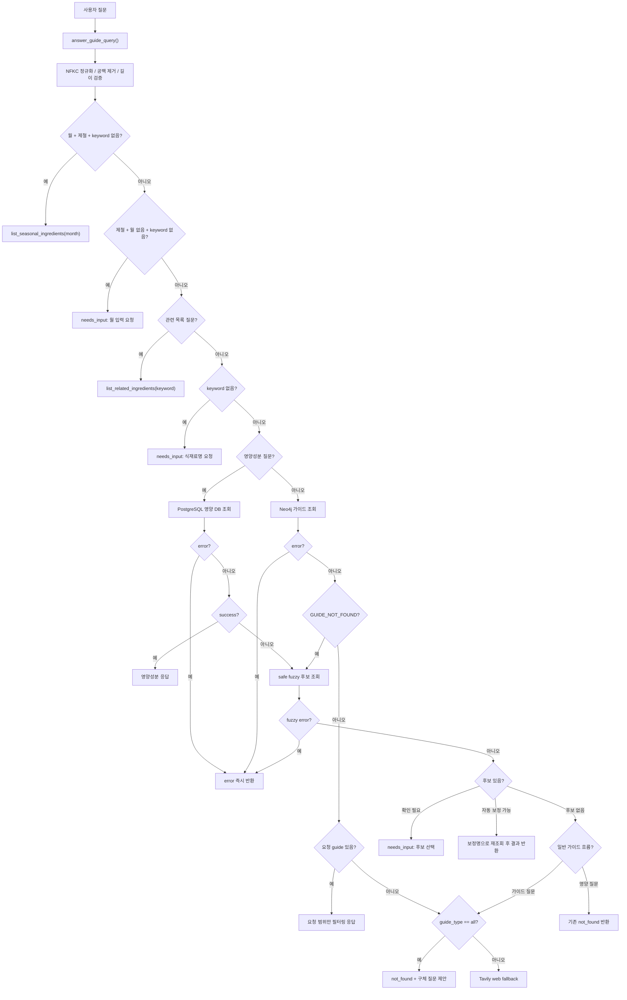

# 식재료 가이드 에이전트 처리 흐름

대상 모듈: `ai/agents/guide_agent/guide_agent.py`

이 문서는 현재 코드 기준의 Guide Agent 단독 처리 흐름을 정리한다. 외부 라우터나 Supervisor 연결 방식은 범위에 포함하지 않는다.

---

## 1. 최종 응답 공통 형식

Guide Agent는 외부 반환값을 항상 공통 JSON 구조로 감싼다.

```json
{
  "ok": true,
  "status": "success",
  "agent": "guide",
  "action": "lookup_ingredient",
  "intent": "ingredient.guide",
  "message": "식재료 가이드를 조회했어요.",
  "data": {},
  "error": null,
  "requires_confirmation": false,
  "ui": {
    "actions": [],
    "cards": [],
    "sources": []
  },
  "meta": {}
}
```

| status | 의미 | ok | error |
|---|---|---:|---|
| `success` | 정상 조회 성공 | `true` | `null` |
| `not_found` | 요청 처리는 정상이나 데이터 없음 | `true` | `null` |
| `needs_input` | 사용자 추가 입력 또는 후보 선택 필요 | `true` | `null` |
| `error` | DB/API/서버 처리 오류 | `false` | 오류 코드 |

데이터 없음은 장애가 아니므로 `error`로 처리하지 않는다. 상세 사유는 주로 `meta.result_code`에 담는다.

---

## 2. 상단 설정 영역

현재 코드는 파일을 분리하지 않고 `guide_agent.py` 상단에 설정값을 모아 둔다.

### 2.1 자연어/정책 설정

- `GUIDE_INTENT`
- `NUTRITION_WORDS`
- `GUIDE_STOPWORDS`
- `QUERY_REQUEST_PATTERNS`
- `RELATED_QUERY_PATTERNS`
- `RELATED_LIST_WORDS`
- `TRUSTED_WEB_DOMAINS`
- `LOW_PRIORITY_BLOCKED_DOMAINS`
- `SAFETY_SENSITIVE_GUIDE_TYPES`
- `GUIDE_TYPE_LABELS`

### 2.2 임계값/조회 설정

- `QUERY_MAX_LENGTH`
- `GUIDE_SEARCH_PAGE_SIZE`
- `GUIDE_LIST_PAGE_SIZE`
- `SEASONAL_PAGE_SIZE`
- `GUIDE_MATCH_MIN_SCORE`
- `FUZZY_CANDIDATE_MIN_SCORE`
- `FUZZY_AUTO_MATCH_SCORE`
- `FUZZY_SCORE_GAP`
- `FUZZY_CANDIDATE_LIMIT`
- `CONFIRM_CANDIDATE_DISPLAY_LIMIT`
- `NUTRITION_PARTIAL_MATCH_LIMIT`
- `RELATED_INGREDIENT_LIMIT`
- `RELATED_CARD_LIMIT`
- `WEB_SEARCH_MAX_RESULTS`
- `WEB_SOURCE_LIMIT`
- `WEB_CONTENT_LIMIT`
- `WEB_FALLBACK_CONTENT_LIMIT`
- `WEB_SUMMARY_MAX_SENTENCES`
- `WEB_SUMMARY_TEMPERATURE`

---

## 3. 전체 처리 흐름



식재료 자체를 찾지 못한 `GUIDE_NOT_FOUND`일 때만 fuzzy 후보 조회로 이동한다. 식재료는 찾았지만 요청한 보관법·세척법·신선도·제철 정보가 없으면 fuzzy가 아니라 Web fallback 흐름으로 이동한다.

---

## 4. 입력 검증과 전처리

`answer_guide_query()` 시작 시 다음을 수행한다.

- Unicode NFKC 정규화
- 앞뒤 공백 제거
- 빈 질문 차단
- `QUERY_MAX_LENGTH` 초과 질문 차단

입력이 부족하면 `status="needs_input"`으로 반환한다.

| 입력 | 처리 |
|---|---|
| 빈 문자열 | `EMPTY_GUIDE_QUERY` |
| `보관법 알려줘` | `INGREDIENT_REQUIRED` |
| `영양성분 알려줘` | `INGREDIENT_REQUIRED` |

### 4.1 식재료명 추출

`_clean_query_keyword()`는 질문에서 월 표현, 요청 표현, guide stopword, 조사, 문장부호를 제거한다.

예시:

| 질문 | 추출 keyword |
|---|---|
| `고추에 대해 알려줘` | `고추` |
| `감자 보관법 알려줘` | `감자` |
| `딸기 5월에 제철이야?` | `딸기` |
| `고추 어떻게 보관해?` | `고추` |
| `고추 씻는 법 알려줘` | `고추` |
| `고추 냉동해도 괜찮아?` | `고추` |
| `고추가 물러졌는데 괜찮아?` | `고추` |
| `고추 단백질 얼마나 들어 있어?` | `고추` |

### 4.2 관련 목록 키워드 정리

`_clean_related_keyword()`는 관련 목록 질문에서 목록 요청 표현을 추가로 제거한다.

| 질문 | 정리된 키워드 | 처리 |
|---|---|---|
| `채소에 뭐가 있어?` | `채소` | 관련 목록 조회 |
| `과일 종류 알려줘` | `과일` | 관련 목록 조회 |
| `어떤 식재료가 있어?` | 빈 값 | `INVALID_RELATED_KEYWORD` |
| `무슨 재료가 있어?` | 빈 값 | `INVALID_RELATED_KEYWORD` |

---

## 5. 의도 분류

`_guide_type_from_query()`는 아래 순서로 guide type을 판단한다.

| 우선순위 | 질문 키워드 | guide_type | action |
|---:|---|---|---|
| 1 | `제철` | `seasonality` | `lookup_seasonality` |
| 2 | `신선`, `상한`, `상했`, `먹어도`, `물러졌` | `freshness` | `lookup_freshness` |
| 3 | `손질` | `prep` | `lookup_prep` |
| 4 | `세척`, `씻`, `닦` | `washing` | `lookup_washing` |
| 5 | `보관`, `오래두`, `냉동` | `storage` | `lookup_storage` |
| 6 | 명시 유형 없음 | `all` | `lookup_ingredient` |

안전성 관련 표현인 `먹어도`, `상했`, `물러졌`은 보관보다 먼저 판단한다. 따라서 `냉동한 고추 먹어도 돼?`는 `storage`가 아니라 `freshness`로 분류된다.

다만 이 문장은 guide type 분류 기준이다. `냉동한 고추 먹어도 돼?`처럼 복합 표현이 들어간 질문은 현재 전처리에서 `냉동한`이 식재료 keyword에 남을 수 있으므로 추가 보완이 필요하다.

`괜찮아`는 의미가 넓어서 freshness 키워드로 사용하지 않는다.

---

## 6. 주요 조회 흐름

### 6.1 월별 제철 목록

조건:

```python
month and "제철" in query and not keyword
```

즉, 월 표현과 `제철`이 포함되고 전처리 후 식재료 키워드가 남지 않을 때 월별 목록으로 처리한다.

| 질문 | 처리 |
|---|---|
| `7월 제철 식재료 알려줘` | `list_seasonal_ingredients(7)` |
| `제철 식재료 알려줘` | `request_season_month` |
| `13월 제철 식재료 알려줘` | `needs_input`, `INVALID_SEASON_MONTH` |
| `딸기 5월에 제철이야?` | 딸기 제철 정보 조회 |

잘못된 월은 시스템 오류가 아니라 입력 오류이므로 `status="needs_input"`으로 반환한다.

### 6.2 관련 식재료 목록

`_is_related_list_query()`가 목록 질문으로 판단하면 `list_related_ingredients()`를 호출한다. 키워드가 비어 있어도 호출하며, 이 경우 `INVALID_RELATED_KEYWORD`를 반환한다.

Neo4j 검색 대상:

- 식재료명
- 원재료명
- 대표명
- 별칭
- 대분류
- 중분류
- 소분류

결과 없음은 `status="not_found"`, `meta.result_code="RELATED_INGREDIENT_NOT_FOUND"`로 반환한다.

### 6.3 Neo4j 가이드 조회

일반 가이드 질문은 Neo4j를 1순위로 조회한다.

1. `guide_service.search_guides()`로 후보를 최대 `GUIDE_SEARCH_PAGE_SIZE`개 조회
2. `_select_guide_item()`이 이름, 대표명, 원재료명, 별칭 완전 일치를 우선 선택
3. 완전 일치가 없으면 유사도 기준 `GUIDE_MATCH_MIN_SCORE` 이상인 후보만 선택
4. 선택 실패 시 `GUIDE_NOT_FOUND`
5. 이후 `answer_guide_query()`에서 전체 Neo4j 대상으로 fuzzy 후보를 다시 찾음

조회 데이터:

- 식재료 코드/이름/대표명/원재료명
- 별칭
- 대분류/중분류/소분류
- 제철 정보
- 보관법/손질법/세척법/신선도 확인법
- 영양 일부
- 출처

### 6.4 요청 정보 필터링

Neo4j 상세 조회 결과에는 전체 데이터가 들어 있지만, 특정 유형 질문은 요청 범위만 반환한다.

| 질문 | 반환 범위 |
|---|---|
| `감자 알려줘` | 전체 가이드 |
| `감자 보관법 알려줘` | `guides.storage` |
| `감자 손질법 알려줘` | `guides.prep` |
| `감자 세척법 알려줘` | `guides.washing` |
| `감자 신선도 알려줘` | `guides.freshness` |
| `감자 제철이 언제야` | `seasonality` |

제철 정보는 `guides` 안이 아니라 `data.seasonality`로 반환한다. 제철 월이 있으면 메시지에 `12월, 2월`처럼 월을 직접 포함한다.

### 6.5 PostgreSQL 영양성분 조회

영양성분 질문은 PostgreSQL의 `food_nutrition_facts`를 조회한다.

조회 순서:

1. `_lookup_guide_detail()`로 Neo4j 식재료 기본 정보를 먼저 확인
2. 식재료명, 대표명, 원재료명, 별칭, 입력 keyword로 영양 DB 정확 일치 검색
3. 정확 일치가 없으면 부분 일치 후보를 최대 `NUTRITION_PARTIAL_MATCH_LIMIT`개 조회
4. 안전한 후보가 정확히 1개일 때만 반환
5. 모호하거나 후보가 없으면 `NUTRITION_NOT_FOUND`

부분 일치 안전 조건:

- 검색어 길이 2자 이상
- `representative_name` 또는 `food_name`이 검색어로 시작해야 함
- 안전 후보가 정확히 1개여야 함

정확 일치가 있으면 짧은 단어도 반환될 수 있다. 예를 들어 `닭`과 정확히 일치하는 대표 영양정보가 있으면 성공할 수 있고, 정확 일치 없이 닭가슴살/닭갈비 등 부분 일치 후보가 여러 개면 `not_found`가 된다.

---

## 7. Fuzzy Matching

정확 조회 또는 1차 검색 결과 선택에 실패하면 `_safe_guide_fuzzy_candidates()`를 통해 fuzzy 후보를 조회한다.

후보 기준:

- 후보 포함 기준: `FUZZY_CANDIDATE_MIN_SCORE`
- 자동 보정 기준: `FUZZY_AUTO_MATCH_SCORE`
- 1등/2등 점수 차이 기준: `FUZZY_SCORE_GAP`
- 후보 반환 개수: `FUZZY_CANDIDATE_LIMIT`

흐름:

```text
GUIDE_NOT_FOUND 또는 NUTRITION_NOT_FOUND
→ safe fuzzy 후보 조회
→ fuzzy 조회 자체가 실패하면 GUIDE_FUZZY_ERROR
→ 후보가 애매하면 confirm_ingredient
→ 후보가 명확하면 자동 보정 후 재조회
→ 자동 보정 후 재조회가 error면 즉시 error 반환
```

후보 확인 응답에는 다음이 포함된다.

- `message` 안의 후보 이름
- `data.candidates`
- `ui.actions`
- `ui.cards`

예시:

```text
감쟈 보관법
→ 감자와 유사도가 충분하면 자동 보정
→ 후보가 애매하면 사용자 선택 요청
```

---

## 8. Web fallback

내부 가이드가 없고 구체적인 가이드 유형 질문인 경우 Tavily 검색으로 fallback한다.

중요 조건:

- `guide_type="all"`은 웹 fallback을 만들지 않는다.
- `guides["all"]` 구조를 만들지 않는다.
- 전체 가이드가 없으면 보관법/손질법/제철 질문을 제안한다.
- 가이드 응답에 식재료 기본 정보가 전혀 없는 경우에만 PostgreSQL 영양 DB 보조 조회를 시도한다. 일반적인 `GUIDE_NOT_FOUND` 응답에는 입력 식재료명이 포함되므로 보조 조회가 실행되지 않을 수 있다.

검색 순서:

1. 신뢰 도메인 우선 검색
2. 결과가 있으면 출처 포함 응답
3. 결과가 없고 안전 민감 유형이 아니면 일반 웹 검색
4. 그래도 없으면 `WEB_GUIDE_NOT_FOUND`

신뢰 도메인:

- `foodsafetykorea.go.kr`
- `mfds.go.kr`
- `rda.go.kr`
- `nongsaro.go.kr`
- `nics.go.kr`
- `mafra.go.kr`
- `data.go.kr`

차단 도메인:

- `kin.naver.com`
- `shopping.naver.com`
- `coupang.com`
- `youtube.com`
- `instagram.com`
- `facebook.com`

도메인 판별은 단순 문자열 포함이 아니라 정확한 host 또는 subdomain 기준으로 한다.

### 8.1 안전 민감 fallback

현재 안전 민감 유형은 `freshness`뿐이다.

`freshness` 질문은 일반 웹 fallback을 사용하지 않는다. 신뢰 자료가 없으면 보수적 안내를 반환한다.

예시:

```text
닭고기가 상한 것 같아 먹어도 돼?
→ freshness
→ 신뢰 자료만 사용
→ 없으면 섭취하지 않는 것이 안전하다는 안내
```

`먹어도 돼`, `상했는지` 등 등록된 표현은 freshness로 분류한다. 다만 복합 문장에서는 `닭고기가 상한 것 같아`처럼 식재료 외 표현이 keyword에 남을 수 있으므로 전처리 결과를 별도로 검증해야 한다.

### 8.2 웹 검색/요약 오류 처리

- Tavily 모듈 또는 API 키가 없으면 외부 검색 결과 없이 `not_found` 흐름으로 진행한다.
- OpenAI 모듈 또는 API 키가 없으면 Tavily 검색 원문의 앞부분을 요약 대체 내용으로 사용한다.
- OpenAI 요약 호출이 실패해도 검색 원문 앞부분을 사용한다.
- `_fallback_guide_response()`에서 예외가 발생하면 `[Guide Web Fallback 오류]` 로그를 출력하고 `not_found` 흐름으로 처리한다.

---

## 9. 오류 처리 원칙

| 상황 | 처리 |
|---|---|
| Neo4j 1차 가이드 조회 `error` | 즉시 반환 |
| PostgreSQL 영양 조회 `error` | 즉시 반환 |
| fuzzy 후보 조회 오류 | `GUIDE_FUZZY_ERROR` |
| fuzzy 자동 보정 후 재조회 `error` | 즉시 반환 |
| 데이터 없음 | `not_found` |
| 식재료명/월/목록 키워드 부족 | `needs_input` |

DB 연결 실패나 쿼리 오류는 오타 보정이나 웹 fallback으로 넘기지 않는다.

---

## 10. 대표 질문별 기대 흐름

| 질문 | 기대 처리 |
|---|---|
| `고추에 대해 알려줘` | keyword=`고추`, 전체 가이드 조회 |
| `고추 어떻게 보관해?` | keyword=`고추`, 보관법 조회 |
| `고추 오래 두는 법` | keyword=`고추`, 보관법 조회 |
| `고추 냉동해도 괜찮아?` | keyword=`고추`, 보관법 조회 |
| `냉동한 고추 먹어도 돼?` | freshness로 분류. 단, keyword에 `냉동한`이 남을 수 있어 전처리 보완 필요 |
| `고추 씻는 법 알려줘` | keyword=`고추`, 세척법 조회 |
| `고추를 깨끗하게 닦으려면?` | keyword=`고추`, 세척법 조회 |
| `고추가 물러졌는데 괜찮아?` | keyword=`고추`, 신선도 확인법 조회 |
| `7월 제철 식재료 알려줘` | 월별 제철 목록 조회 |
| `제철 식재료 알려줘` | 월 입력 요청 |
| `13월 제철 식재료 알려줘` | `INVALID_SEASON_MONTH` |
| `딸기 5월에 제철이야?` | 딸기 제철 정보 조회 |
| `채소에 뭐가 있어?` | 관련 식재료 목록 조회 |
| `어떤 식재료가 있어?` | `INVALID_RELATED_KEYWORD` |
| `고추 영양성분` | PostgreSQL 영양성분 조회 |
| `포켓몬 영양성분` | 안전 매칭 실패 시 `not_found` |
| `감쟈 보관법` | fuzzy 자동 보정 또는 후보 확인 |

---

## 11. Guide Agent 호출 여부 확인

웹 화면에서 기본 안내 문구만 나오고 Guide Agent 응답이 나오지 않는 경우, `answer_guide_query()`가 실제 호출되는지 먼저 확인한다.

현재 디버그 로그:

```python
print("[Guide Agent 호출]", query)
```

터미널에 이 로그가 찍히면 Guide Agent까지 요청이 도달한 것이다. 로그가 없으면 Guide Agent 내부가 아니라 외부 라우팅 문제다.

---

## 12. 단독 검증 방법

backend 컨테이너에서 다음 명령을 실행한다.

```bash
docker exec bobbeori_backend python ai/agents/guide_agent/guide_agent.py
```

현재 `__main__`이 검증하는 항목:

- 공통 응답 키 순서
- `success` 응답 계약
- `not_found` 응답 계약
- `needs_input` 응답 계약
- `딸기 5월에 제철이야?` 전처리
- `고추 냉동해도 괜찮아?` 전처리
- `어떤 식재료가 있어?` 관련 목록 키워드
- 구어체 보관/세척/신선도 guide type 분류

이 명령은 DB 조회, Tavily 검색, Supervisor 라우팅까지 검증하는 통합 테스트는 아니다.

---

## 13. 현재 반영된 핵심 개선사항

- 공통 JSON 응답 형식 적용
- `success / not_found / needs_input / error` 상태 구분
- 자연어 패턴과 임계값을 상단 설정 영역에 통합
- 구어체 질문 전처리
- 관련 목록 빈 키워드 전용 입력 요청
- 제철 정보는 `seasonality` 구조로 분리
- 요청한 정보만 최종 응답에 필터링
- 정확 일치 우선 선택
- fuzzy 후보 조회 예외 처리
- fuzzy 자동 보정 후 DB 오류 즉시 반환
- 영양성분 부분 일치 오조회 방지
- `guide_type="all"` 웹 fallback 차단
- freshness 일반 웹 fallback 제한
- 웹 fallback 오류 로그 출력
- 잘못된 월을 `needs_input`으로 처리
