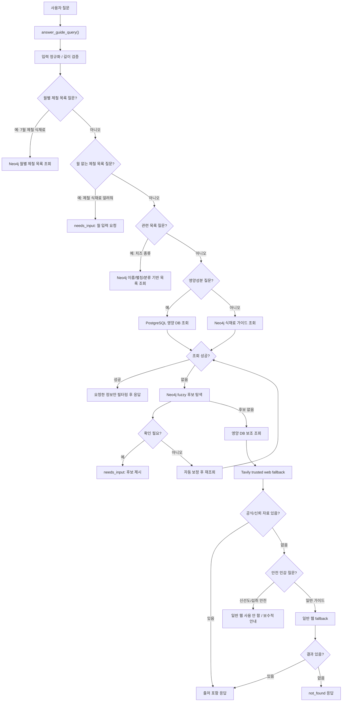

# 식재료 가이드 에이전트 처리 흐름

대상 모듈: `ai/agents/guide_agent/guide_agent.py`

이 문서는 식재료 가이드 에이전트 단독 처리 흐름을 정리한다. 외부 라우터나 Supervisor 연결 방식은 이 문서의 범위가 아니다.

---

## 1. 최종 응답 공통 형식

Guide Agent의 외부 반환값은 항상 아래 공통 JSON 구조로 감싼다.

```json
{
  "ok": true,
  "status": "success",
  "agent": "guide",
  "action": "lookup_ingredient",
  "intent": "ingredient.guide",
  "message": "식재료 가이드를 조회했어요.",
  "data": {},
  "error": null,
  "requires_confirmation": false,
  "ui": {
    "actions": [],
    "cards": [],
    "sources": []
  },
  "meta": {}
}
```

### status 의미

| status | 의미 | ok | error |
|---|---|---:|---|
| `success` | 정상 조회 성공 | `true` | `null` |
| `not_found` | 요청 처리는 정상이나 데이터 없음 | `true` | `null` |
| `needs_input` | 사용자 추가 입력 또는 후보 선택 필요 | `true` | `null` |
| `error` | DB/API/서버 처리 오류 | `false` | 오류 코드 |

데이터가 없는 상황은 시스템 장애가 아니므로 `error`로 처리하지 않는다. `not_found`, `needs_input`의 세부 사유는 `meta.result_code`에 담는다.

---

## 2. 전체 처리 순서



---

## 3. 입력 전처리와 의도 분류

### 3.1 입력 검증

`answer_guide_query()` 시작 시 다음을 처리한다.

- Unicode NFKC 정규화
- 앞뒤 공백 제거
- 빈 질문 차단
- 100자 초과 질문 차단

빈 질문이나 식재료명이 빠진 질문은 `status="needs_input"`으로 반환한다.

예시:

| 입력 | 응답 |
|---|---|
| 빈 문자열 | `EMPTY_GUIDE_QUERY` |
| `보관법 알려줘` | `INGREDIENT_REQUIRED` |
| `영양성분 알려줘` | `INGREDIENT_REQUIRED` |

### 3.2 식재료명 추출

`_clean_query_keyword()`는 질문에서 조회 의도 표현을 제거해 식재료명만 남긴다.

제거 대상 예:

- `보관법`, `보관`
- `손질법`, `손질`
- `세척법`, `세척`
- `신선도`, `확인법`
- `제철`, `제철이야`, `제철인가요`, `맞아`, `맞나요`
- `영양`, `영양성분`, `칼로리`, `단백질`, `지방`, `당류`, `나트륨`
- `알려줘`, `조회해줘`, `설명해줘`, `정보`, `에 대해`
- 조사와 문장부호

예시:

| 질문 | 추출 keyword |
|---|---|
| `고추에 대해 알려줘` | `고추` |
| `감자 보관법 알려줘` | `감자` |
| `딸기 5월에 제철이야?` | `딸기` |

### 3.3 가이드 유형 분류

`_guide_type_from_query()`는 질문 문구로 요청 유형을 판단한다.

| 질문 키워드 | guide_type | 반환 action |
|---|---|---|
| `보관` | `storage` | `lookup_storage` |
| `손질` | `prep` | `lookup_prep` |
| `세척`, `씻` | `washing` | `lookup_washing` |
| `신선`, `상한`, `상했`, `먹어도` | `freshness` | `lookup_freshness` |
| `제철` | `seasonality` | `lookup_seasonality` |
| 명시 유형 없음 | `all` | `lookup_ingredient` |

기본값은 `storage`가 아니라 `all`이다. 따라서 `감자 알려줘`는 보관법만이 아니라 전체 가이드를 반환한다.

---

## 4. 주요 조회 흐름

### 4.1 월별 제철 식재료 목록

식재료명이 없고 `월 + 제철`이 있는 경우 월별 목록으로 처리한다.

| 질문 | 처리 |
|---|---|
| `7월 제철 식재료 알려줘` | `list_seasonal_ingredients(7)` |
| `제철 식재료 알려줘` | `needs_input`, 월 입력 요청 |
| `딸기 5월에 제철이야?` | 월별 목록이 아니라 딸기 제철 정보 조회 |

월 값은 1~12 사이여야 한다.

### 4.2 관련 식재료 목록

다음 표현이 있으면 관련 목록 질문으로 본다.

- `종류`
- `목록`
- `리스트`
- `분류`
- `어떤재료`
- `무슨재료`
- `어떤식재료`
- `무슨식재료`
- `뭐가있`

Neo4j에서 아래 필드를 기준으로 검색한다.

- 원재료명
- 표준명 / 대표명
- 별칭
- 대분류
- 중분류
- 소분류

결과가 없으면 `status="not_found"`, `meta.result_code="RELATED_INGREDIENT_NOT_FOUND"`로 반환한다.

### 4.3 Neo4j 식재료 가이드 조회

일반 식재료 가이드 질문은 Neo4j를 1순위로 조회한다.

조회 대상 정보:

- 원재료명
- 표준명 / 대표명
- 별칭
- 대분류 / 중분류 / 소분류
- 보관법
- 손질법
- 세척법
- 신선도 확인법
- 제철 정보
- 출처

검색 결과는 1개만 바로 고르지 않고 최대 10개 후보를 가져온 뒤 `_select_guide_item()`이 최종 항목을 선택한다.

선택 기준:

1. 이름, 대표명, 원재료명, 별칭 완전 일치
2. 완전 일치가 없으면 유사도 점수 계산
3. 최고 점수가 `0.88` 이상일 때만 자동 선택
4. 기준 미달이면 임의 선택하지 않고 후보 확인 또는 `not_found`

이 처리로 `고추` 검색 시 `고추장`, `풋고추` 같은 항목이 잘못 선택될 가능성을 줄인다.

### 4.4 요청 정보만 필터링

Neo4j 상세 조회 결과에는 전체 정보가 들어 있지만, 최종 응답은 사용자가 요청한 범위만 반환한다.

| 질문 | 반환 범위 |
|---|---|
| `감자 알려줘` | 전체 가이드 |
| `감자 보관법 알려줘` | `guides.storage`만 |
| `감자 손질법 알려줘` | `guides.prep`만 |
| `감자 세척법 알려줘` | `guides.washing`만 |
| `감자 신선도 알려줘` | `guides.freshness`만 |
| `감자 제철이 언제야` | `seasonality`만 |

제철 정보는 `guides` 안이 아니라 `data.seasonality`에 따로 둔다.

### 4.5 PostgreSQL 영양성분 조회

영양성분 질문은 PostgreSQL의 `food_nutrition_facts`를 조회한다.

조회 순서:

1. Neo4j에서 식재료명, 대표명, 원재료명, 별칭을 확보
2. 확보한 이름 목록으로 영양 DB 정확 일치 검색
3. 정확 일치가 없으면 부분 일치 후보를 최대 10개 조회
4. 안전한 후보가 정확히 1개일 때만 반환
5. 모호하거나 후보가 여러 개면 `not_found`

부분 일치 안전 조건:

- 검색어 길이 2자 이상
- `representative_name` 또는 `food_name`이 검색어로 시작해야 함
- 안전 후보가 1개일 때만 반환

이 처리로 아래 오조회가 방지된다.

| 입력 | 기존 위험 | 현재 처리 |
|---|---|---|
| `포켓몬 영양성분` | `포켓몬 빵`류 반환 가능 | `not_found` |
| `고객 영양성분` | `단골고객 피자`류 반환 가능 | `not_found` |
| `닭 영양성분` | 닭가슴살/닭갈비/닭강정 중 임의 선택 가능 | 모호하면 `not_found` |

---

## 5. Fuzzy Matching과 후보 확인

정확 조회에 실패하면 Neo4j의 식재료명, 대표명, 원재료명, 별칭을 대상으로 유사 후보를 찾는다.

후보 기준:

- 유사도 `0.72` 이상 후보만 수집
- 최고 후보가 `0.88` 미만이면 사용자 확인 필요
- 1등과 2등 차이가 `0.04` 미만이면 사용자 확인 필요

확인이 필요하면 `status="needs_input"`으로 반환한다.

후보는 세 군데에 함께 담는다.

- `message`: 텍스트 후보 목록
- `data.candidates`: 구조화된 후보 데이터
- `ui.actions`, `ui.cards`: 프론트에서 버튼/카드로 표시할 수 있는 후보

예시:

```text
치즈에 대해 알려줘
→ 치즈와 비슷한 식재료 후보 제시
→ 사용자가 후보 선택
→ 선택된 식재료로 재조회
```

---

## 6. Web fallback 흐름

Neo4j에 가이드가 없으면 영양 DB에서 식재료명/분류/영양성분을 보조로 확인하고, 가이드 정보는 Tavily 검색으로 fallback한다.

검색 우선순위:

1. 공신력 도메인 우선 검색
2. 결과가 있으면 출처 포함 응답
3. 결과가 없고 안전 민감 질문이 아니면 일반 웹 검색
4. 일반 웹 결과가 있으면 후순위 출처임을 표시하고 응답
5. 그래도 없으면 `not_found`

신뢰 도메인 예:

- `foodsafetykorea.go.kr`
- `mfds.go.kr`
- `rda.go.kr`
- `nongsaro.go.kr`
- `nics.go.kr`
- `mafra.go.kr`
- `data.go.kr`

도메인은 단순 문자열 포함이 아니라 정확한 host 기준으로 검사한다.

허용:

- `foodsafetykorea.go.kr`
- `www.foodsafetykorea.go.kr`
- `api.foodsafetykorea.go.kr`

차단:

- `foodsafetykorea.go.kr.fake-site.com`

### 안전 민감 질문 제한

`freshness` 유형, 즉 신선도·상함·섭취 안전 질문은 일반 웹 자료를 사용하지 않는다.

예시:

| 질문 | 처리 |
|---|---|
| `감자 보관법` | 공식 자료 없으면 일반 웹 fallback 가능 |
| `닭고기가 상한 것 같아 먹어도 돼?` | 공식 자료만 사용, 없으면 보수적 안전 안내 |

OpenAI 요약이 실패해도 Tavily 검색 결과를 버리지 않고 검색 원문 앞부분을 fallback 내용으로 사용한다.

---

## 7. 대표 질문별 기대 흐름

| 질문 | 기대 처리 |
|---|---|
| `고추에 대해 알려줘` | keyword=`고추`, Neo4j 전체 가이드 조회 |
| `감자 보관법 알려줘` | Neo4j 조회 후 보관법만 반환 |
| `감자 알려줘` | Neo4j 전체 가이드 반환 |
| `7월 제철 식재료 알려줘` | 월별 제철 목록 반환 |
| `제철 식재료 알려줘` | `needs_input`, 월 입력 요청 |
| `딸기 5월에 제철이야?` | 딸기 제철 정보 조회 |
| `치즈 종류가 뭐가 있어?` | 별칭/분류 기반 관련 식재료 목록 조회 |
| `포켓몬 영양성분` | 안전 매칭 실패 시 `not_found` |
| `그라다파노 치즈 보관법` | fuzzy 후보 확인 또는 자동 보정 후 조회 |
| `상한 닭고기 먹어도 돼?` | 신선도/섭취 안전 질문으로 분류, 일반 웹 fallback 제한 |

---

## 8. Guide Agent 호출 여부 확인

웹 화면에서 기본 안내 문구만 나오고 Guide Agent 응답이 나오지 않는 경우, 우선 `answer_guide_query()`가 실제 호출되는지 확인한다.

현재 디버그 로그:

```python
print("[Guide Agent 호출]", query)
```

테스트 시 터미널에 이 로그가 찍히면 Guide Agent까지 요청이 도달한 것이다.

로그가 찍히지 않으면 Guide Agent 내부 문제가 아니라 외부 라우팅에서 Guide Agent가 호출되지 않은 것이다.

---

## 9. 단독 검증 방법

Guide Agent 모듈의 응답 키와 기본 상태 검증은 backend 컨테이너에서 실행한다.

```bash
docker exec bobbeori_backend python ai/agents/guide_agent/guide_agent.py
```

검증 포인트:

- 응답 키에 `status` 포함
- `success`는 `ok=true`, `error=null`
- `not_found`는 `ok=true`, `error=null`
- `needs_input`은 `ok=true`, `error=null`
- 실제 장애만 `ok=false`, `status=error`

---

## 10. 현재 반영된 핵심 개선사항

- 최종 응답 공통 JSON 형식 적용
- `status` 기반으로 성공/없음/입력필요/오류 구분
- 기본 가이드 타입을 `storage`가 아닌 `all`로 변경
- 제철 정보는 `guides`가 아닌 `seasonality` 구조로 분리
- 요청한 정보만 최종 응답에 남기도록 필터링
- 검색 결과 첫 번째 항목을 무조건 선택하지 않고 정확도 기준 선택
- 영양성분 부분 일치 오조회 방지
- fuzzy 후보를 메시지, actions, cards에 함께 제공
- Tavily 검색 후 OpenAI 요약 실패 시에도 검색 결과 유지
- 신선도/섭취 안전 질문은 일반 웹 fallback 제한
- 신뢰 도메인 판별을 정확한 host 기준으로 처리
- 식재료명 또는 월이 빠진 질문은 `needs_input`으로 추가 입력 요청
