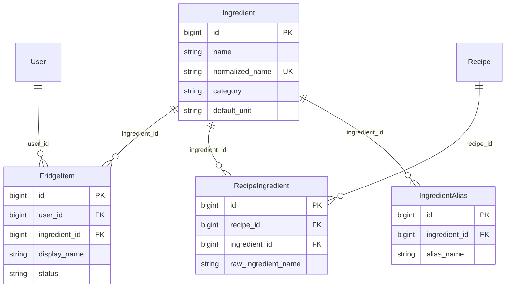
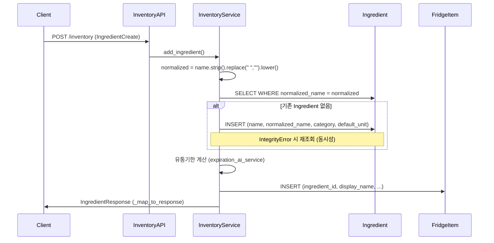

# 냉장고 재료 → Ingredient.id 매핑 문서

이 문서는 냉장고에 재료를 저장할 때 **사용자 입력 재료명이 `Ingredient.id`로 어떻게 연결되는지**를 현재 코드 기준으로 정리한다. 추천 기능에서 `FridgeItem.ingredient_id`와 `RecipeIngredient.ingredient_id`를 비교하기 전에, 저장 시점 매핑의 신뢰도를 파악하는 것이 목적이다.

> **범위**: 냉장고 CRUD 중 저장·수정 흐름, 관련 DB 모델, 레시피 측 ID와의 비교 맥락  
> **범위 외**: 추천 엔진 구현, alias/embedding 구현

---

## 1. 관련 파일

| 역할 | 경로 |
|------|------|
| API 라우터 | `app/backend/api/inventory/inventory_api.py` |
| 비즈니스 로직 | `app/backend/services/inventory_service/inventory_service.py` |
| 요청/응답 스키마 | `app/backend/schemas/inventory.py` |
| ORM 모델 | `app/backend/db/models.py` (`Ingredient`, `IngredientAlias`, `FridgeItem`, `RecipeIngredient`) |
| DDL 참고 | `app/backend/schemas/schema.sql` |
| 레시피 ETL 매핑 | `etl/recipe/load_to_postgres/loader.py` |
| 보유 비교 (레시피 상세) | `app/backend/services/recommendation_service/recipe_detail_service.py` |
| 수동 등록 테스트 | `test/debug_add.py` |

---

## 2. 데이터 모델 관계

### 2.1 ER 개요



### 2.2 이름 필드 구분

| 필드 | 테이블 | 역할 |
|------|--------|------|
| `name` | `ingredients` | 식재료 마스터 표시명 (최초 등록 시 사용자 입력 또는 ETL 원문) |
| `normalized_name` | `ingredients` | 매칭 키. `UNIQUE` 제약. 정규화된 문자열로 조회 |
| `display_name` | `fridge_items` | 사용자가 입력한 표시명. 냉장고 항목마다 개별 저장 |
| `raw_ingredient_name` | `recipe_ingredients` | 레시피 원문 재료명 (ETL 적재) |

### 2.3 ID 용어 주의 (혼동 방지)

API와 DB에서 `ingredient`라는 이름이 서로 다른 ID를 가리킨다.

| 개념 | DB 컬럼/모델 | API 노출 |
|------|-------------|----------|
| **냉장고 항목 ID** | `FridgeItem.id` | `IngredientResponse.id`, `PUT/DELETE /inventory/{ingredient_id}`의 path param |
| **식재료 마스터 ID** | `FridgeItem.ingredient_id` → `Ingredient.id` | **응답에 노출되지 않음** |

즉, API path의 `{ingredient_id}`는 `FridgeItem.id`이며 `Ingredient.id`가 아니다. 추천·보유 판단은 내부적으로 `FridgeItem.ingredient_id`(마스터 ID)를 사용하지만, 클라이언트는 마스터 ID를 알 수 없다.

---

## 3. API 계약

### 3.1 엔드포인트

| Method | Path | 설명 |
|--------|------|------|
| `POST` | `/inventory` | 냉장고에 재료 등록 |
| `GET` | `/inventory` | 보유 재료 목록 (`status == "normal"`만) |
| `PUT` | `/inventory/{ingredient_id}` | 재료 정보 수정 (`ingredient_id` = `FridgeItem.id`) |
| `DELETE` | `/inventory/{ingredient_id}` | 재료 삭제 |
| `GET` | `/inventory/summary` | 냉장고 요약 통계 |

### 3.2 요청 스키마 `IngredientCreate`

사용자는 `ingredient_id`를 직접 보내지 않는다.

| 필드 | 타입 | 필수 | 설명 |
|------|------|------|------|
| `name` | `str` | O | 식재료 이름 (예: 시금치) |
| `category` | `str` | - | 카테고리 (예: 채소) |
| `quantity` | `float` | - | 수량 (기본 1.0) |
| `unit` | `str` | - | 단위 (기본 "개") |
| `storage_method` | `str` | - | 보관 방법 (기본 "냉장") |
| `purchase_date` | `date` | - | 구매일 (없으면 오늘) |
| `expiration_date` | `date` | - | 유통기한 (없으면 AI 추정) |

### 3.3 응답 스키마 `IngredientResponse`

| 필드 | 실제 출처 | 비고 |
|------|-----------|------|
| `id` | `FridgeItem.id` | 냉장고 항목 ID |
| `name` | `FridgeItem.display_name` 또는 `Ingredient.name` | |
| `category` | `Ingredient.category` | |
| `quantity`, `unit` | `FridgeItem` | |
| `storage_method` | `FridgeItem.storage_location` | |
| `purchase_date`, `expiration_date` | `FridgeItem` | |
| `d_day`, `is_expiring_soon` | 서비스 계산 | |
| `fridge_id` | 고정값 `1` | 프론트 호환용 더미 |
| **`ingredient_id` (마스터)** | - | **미포함** |

---

## 4. 저장 흐름 (`add_ingredient`)

### 4.1 시퀀스



### 4.2 단계별 처리

1. **이름 정규화** (`inventory_service.py` L86)
   ```python
   normalized = data.name.strip().replace(" ", "").lower()
   ```

2. **Ingredient 조회** (L87)
   - `Ingredient.normalized_name == normalized` exact match

3. **Ingredient 생성** (L89–103, 없을 때만)
   - `name=data.name`, `normalized_name=normalized`, `category=data.category`, `default_unit=data.unit`
   - 동시 요청으로 `normalized_name` UNIQUE 충돌 시 `IntegrityError` catch 후 재조회

4. **유통기한 계산** (L105–114)
   - `expiration_date`가 없으면 `expiration_ai_service`로 권장 보관일 추정

5. **FridgeItem 저장** (L116–127)
   - `ingredient_id=ingredient.id` ← **마스터 ID 연결**
   - `display_name=data.name` ← 사용자 입력명 보존
   - `status="normal"`

6. **응답 매핑** (`_map_to_response`, L56–82)
   - `name`은 `display_name` 우선
   - 마스터 `ingredient_id`는 응답에 포함하지 않음

---

## 5. 조회·수정·삭제 흐름

### 5.1 조회 (`get_ingredients`)

- `FridgeItem` JOIN `Ingredient` ON `ingredient_id`
- 필터: `user_id`, `status == "normal"`
- 각 행을 `_map_to_response`로 변환

### 5.2 수정 (`update_ingredient`)

- path `ingredient_id`로 `FridgeItem` 조회 (`FridgeItem.id` 기준)
- 갱신 필드: `display_name`, `quantity`, `unit`, `storage_location`, `purchased_date`, `expiry_date`
- **`ingredient_id`는 변경하지 않음** (L169–174)
- 기존 `Ingredient`는 `fridge_item.ingredient_id`로 조회만 함 (L176)
- 이름을 "파" → "대파"로 바꿔도 최초 등록 시 연결된 `Ingredient.id`가 유지됨

### 5.3 삭제 (`delete_ingredient`)

- `FridgeItem` 행만 삭제
- `ingredients` 마스터 행은 유지 (다른 `FridgeItem`·레시피에서 참조 가능)

---

## 6. 현재 매칭 기준

### 6.1 정규화 규칙

| 단계 | 처리 |
|------|------|
| 1 | `strip()` — 앞뒤 공백 제거 |
| 2 | `replace(" ", "")` — 공백 문자 제거 |
| 3 | `lower()` — 소문자 변환 |

예시:

| 사용자 입력 | `normalized_name` |
|-------------|-----------------|
| `대 파` | `대파` |
| `시금치` | `시금치` |
| `Tomato` | `tomato` |

### 6.2 매칭 방식

- `Ingredient.normalized_name` **exact match only**
- `IngredientAlias` 테이블 **미사용** (모델·DDL만 존재, 런타임 조회/삽입 코드 없음)
- 유사어·동의어·오타·가공 형태(다진마늘 vs 마늘) **미처리**
- 매칭 실패 시 **신규 `Ingredient` 행 생성**

### 6.3 레시피 ETL과의 관계

레시피 재료는 ETL `loader.py`에서 동일한 정규화 후 `ingredients.normalized_name`으로 `RecipeIngredient.ingredient_id`를 부여한다.

```python
# etl/recipe/load_to_postgres/loader.py
def normalize_ingredient_name(name: str) -> str:
    return re.sub(r"\s+", "", name.strip().lower())
```

| 구분 | 정규화 구현 | 위치 |
|------|------------|------|
| 냉장고 저장 | `data.name.strip().replace(" ", "").lower()` | `inventory_service.py` 인라인 |
| 레시피 ETL | `re.sub(r"\s+", "", name.strip().lower())` | `loader.py` |

현재 동작은 동일하나 **함수가 분리**되어 있어, 한쪽만 변경되면 냉장고·레시피 간 ID 불일치가 생길 수 있다.

---

## 7. 추천 기능과의 연결 (현 상태)

### 7.1 목표 비교 축

```
FridgeItem.ingredient_id  ↔  RecipeIngredient.ingredient_id
```

### 7.2 이미 구현된 보유 판단

`recipe_detail_service.py`의 `_split_owned_missing()` (L56–82):

1. 사용자의 모든 `FridgeItem.ingredient_id` 집합 조회
2. 레시피 재료별 `RecipeIngredient.ingredient_id`와 **exact ID 비교**
3. `owned_ingredients` / `missing_ingredients` 분리

레시피 상세 API (`GET /recipes/{id}`) 응답의 `RecipeIngredientItem.ingredient_id`는 마스터 ID를 노출한다 (냉장고 API와 대조).

### 7.3 보유 판단 기준 불일치

| API | `FridgeItem.status` 필터 |
|-----|--------------------------|
| `GET /inventory` | `status == "normal"`만 |
| 레시피 상세 보유 판단 | **필터 없음** (`used`/`expired`도 보유로 간주 가능) |

---

## 8. 현재 한계 (개선 필요 사항)

### 8.1 매칭 품질

| 문제 | 설명 | 예시 |
|------|------|------|
| Alias 미사용 | `ingredient_aliases` 테이블 존재하나 코드·ETL 모두 미연동 | - |
| 동의어 미처리 | 정규화 후에도 문자열이 다르면 별도 `Ingredient` | 대파 / 파 / 흰대파 |
| 가공 형태 미처리 | 형태가 다르면 별도 ID | 다진마늘 / 깐마늘 / 마늘 |
| 상위·하위 재료 미처리 | 부위·통칭 관계 없음 | 삼겹살 / 돼지앞다리살 / 돼지고기 |
| 오타 미처리 | fuzzy match 없음 | `시금치` vs `시금치ㅣ` |

### 8.2 데이터·API 구조

| 문제 | 설명 |
|------|------|
| 마스터 파편화 | 냉장고 등록 시 ETL 마스터에 없으면 사용자 입력 기준으로 신규 `Ingredient` 생성. ETL "대파"와 사용자 "흰대파"가 서로 다른 ID |
| 수정 시 재매핑 없음 | `display_name`만 바뀌고 `ingredient_id` 고정 → 표시명과 마스터 불일치 가능 |
| 마스터 ID 미노출 | 냉장고 API 응답에 `Ingredient.id` 없음 → 매핑 검증·디버깅 어려움 |
| 정규화 로직 중복 | inventory 인라인 vs ETL `normalize_ingredient_name` 분리 |
| status 필터 불일치 | 냉장고 목록과 레시피 상세 보유 판단 기준 상이 |

### 8.3 추천 정확도에 미치는 영향

위 한계로 인해 `ingredient_id` exact 비교만으로는:

- 보유한 재료가 `missing_ingredients`에 들어가거나
- 동의어로 등록된 재료가 서로 다른 ID로 분산되어 매칭 실패

가 발생할 수 있다. **비교 로직 자체보다 저장 시점 매핑 품질이 병목**이다.

---

## 9. 다음 작업 방향 (제안, 미구현)

아래는 문서화 시점의 개선 제안이며, 현재 코드에 반영되어 있지 않다.

### 9.1 매핑 전용 서비스 분리

- `ingredient_resolver_service.py` 등으로 재료명 → `Ingredient.id` 해석 로직 중앙화
- 냉장고 저장·수정, 영수증 OCR, (향후) 추천이 동일 resolver 사용

### 9.2 매칭 단계 확장 (우선순위 예시)

1. **Exact match** — `normalized_name` (현재와 동일)
2. **Alias match** — `ingredient_aliases.alias_name` 조회
3. **Partial / normalized match** — 접두·접미 제거, 형태어 규칙
4. **Embedding fallback** — 유사도 기반 후보 (비용·지연 고려)

### 9.3 기타

- 정규화 함수 단일 모듈로 통합 (inventory + ETL + receipt)
- `IngredientAlias` 데이터 적재 파이프라인 및 조회 연동
- 수정 시 `name` 변경에 따른 `ingredient_id` 재매핑 정책 정의
- (선택) 내부 디버그용 응답 필드 `master_ingredient_id` 또는 admin API

### 9.4 추천 로직 선행 조건

최종적으로 추천·보유 판단은 `FridgeItem.ingredient_id`와 `RecipeIngredient.ingredient_id` 비교를 유지하되, **그 전에 냉장고 저장 시 `ingredient_id` 부여 로직을 안정화**해야 한다.

---

## 10. 검증·재현 참고

### 10.1 수동 등록 스크립트

```bash
python test/debug_add.py
```

`IngredientCreate(name="디버깅 대파", ...)`로 `add_ingredient()` 호출 후 결과 출력.

### 10.2 DB 확인 SQL 예시

등록 후 매핑 결과 확인 (읽기 전용):

```sql
-- 최근 냉장고 항목과 연결된 마스터
SELECT
    fi.id AS fridge_item_id,
    fi.display_name,
    fi.ingredient_id AS master_ingredient_id,
    i.name AS master_name,
    i.normalized_name
FROM fridge_items fi
JOIN ingredients i ON i.id = fi.ingredient_id
ORDER BY fi.created_at DESC
LIMIT 10;

-- 동일 normalized_name 중복 여부
SELECT normalized_name, COUNT(*) AS cnt
FROM ingredients
GROUP BY normalized_name
HAVING COUNT(*) > 1;

-- alias 테이블 사용 여부 (현재 비어 있을 가능성 높음)
SELECT COUNT(*) FROM ingredient_aliases;
```

### 10.3 동의어 분산 확인 예시

```sql
SELECT id, name, normalized_name
FROM ingredients
WHERE normalized_name IN ('대파', '파', '흰대파', '다진마늘', '마늘');
```

서로 다른 `id`가 반환되면 exact match만으로는 동의어가 통합되지 않음을 확인할 수 있다.

---

## 11. 결론

현재 코드상 `FridgeItem.ingredient_id`는 냉장고 저장 시 내부적으로 생성·연결되므로, `RecipeIngredient.ingredient_id`와의 **ID 기반 비교 인프라는 이미 존재**한다. 다만 매핑은 `data.name`의 단순 정규화(`strip` → 공백 제거 → `lower`)와 `Ingredient.normalized_name` exact match에만 의존하며, `IngredientAlias`는 사용되지 않는다. 수정 시에도 `ingredient_id`가 재매핑되지 않는다.

따라서 **추천 API 구현보다 먼저** 재료명 → `Ingredient.id` 매핑 구조를 문서화하고(본 문서), 이후 resolver·alias·정규화 통합 등으로 매핑 품질을 안정화하는 것이 선행 과제이다. 매핑이 안정화되기 전에는 `ingredient_id` 비교만으로 추천·보유 판단 정확도를 기대하기 어렵다.
